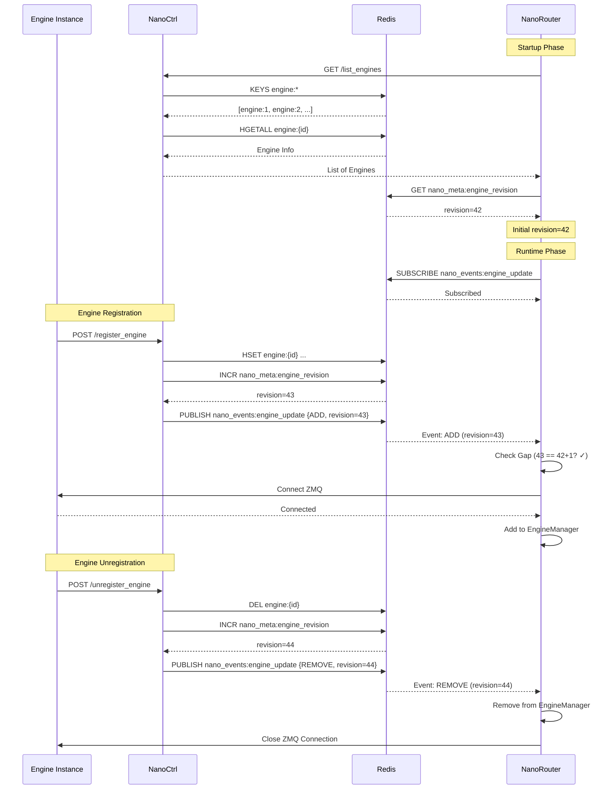

# NanoInfra Engine 动态服务发现技术设计文档 (TDD)

## 1. 概述

本文档描述如何利用 Redis Pub/Sub 机制，实现 NanoRouter 对 Engine 变动的实时感知（动态服务发现），从而替代当前基于 `config.toml` 的静态配置方式。

### 1.1 目标

- **实时感知**: NanoRouter 能够实时感知 Engine 的上线、下线、更新事件
- **高可用性**: 支持 Redis 连接断开重连，保证服务发现机制的健壮性
- **一致性保证**: 解决启动时全量拉取与订阅之间的 "Gap" 问题，确保不丢失事件

### 1.2 架构概览

#### ASCII 架构图

```
┌─────────────┐                    ┌──────────────┐                    ┌─────────────┐
│  NanoCtrl   │                    │    Redis     │                    │ NanoRouter  │
│             │                    │              │                    │             │
│ ┌─────────┐ │                    │              │                    │ ┌─────────┐ │
│ │Register │ │─── HSET ──────────>│  Hash:       │                    │ │Snapshot │ │
│ │Engine   │ │    engine:{id}     │  engine:{id} │                    │ │+ Delta  │ │
│ └─────────┘ │                    │              │                    │ └─────────┘ │
│     │       │                    │              │                    │     │       │
│     │       │                    │ ┌──────────┐ │                    │     │       │
│     └───────┼─── PUBLISH ───────>│ │ Channel: │ │                    │     │       │
│             │    nano_events:    │ │engine_   │ │                    │     │       │
│             │    engine_update   │ │update    │ │                    │     │       │
│             │                    │ └──────────┘ │                    │     │       │
│             │                    │      │       │                    │     │       │
│             │                    │      └───────┼─── SUBSCRIBE ──────┘     │       │
│             │                    │              │                    │     │       │
│             │                    │              │                    │ ┌─────────┐ │
│             │                    │              │                    │ │Watcher  │ │
│             │                    │              │                    │ │Task     │ │
│             │                    │              │                    │ └─────────┘ │
└─────────────┘                    └──────────────┘                    └─────────────┘
```

#### Mermaid 架构图

```mermaid
graph TB
    subgraph NanoCtrl["NanoCtrl (Publisher)"]
        Register[register_engine]
        Unregister[unregister_engine]
    end

    subgraph Redis["Redis"]
        Hash[Hash: engine:{id}]
        Channel[Channel: nano_events:engine_update]
        Revision[String: nano_meta:engine_revision]
    end

    subgraph NanoRouter["NanoRouter (Subscriber)"]
        Snapshot[Snapshot Loader]
        Watcher[Background Watcher Task]
        Manager[EngineManager]
        Adapters[Engine Adapters]
    end

    Register -->|HSET| Hash
    Unregister -->|DEL| Hash
    Register -->|INCR| Revision
    Unregister -->|INCR| Revision
    Register -->|PUBLISH| Channel
    Unregister -->|PUBLISH| Channel

    Snapshot -->|KEYS/HGET| Hash
    Snapshot -->|GET| Revision
    Watcher -->|SUBSCRIBE| Channel
    Watcher -->|GET| Revision
    Watcher -->|Events| Manager
    Manager -->|Connect| Adapters

    style NanoCtrl fill:#e1f5ff
    style Redis fill:#fff4e1
    style NanoRouter fill:#e8f5e9
```

#### 数据流图



## 2. 协议设计 (Protocol Design)

### 2.1 Redis Channel 定义

**Channel 名称**: `nano_events:engine_update`

- 采用命名空间前缀 `nano_events:` 便于后续扩展其他事件类型
- 所有 Engine 相关事件统一通过此 Channel 发布

### 2.2 Event JSON 数据结构

```json
{
  "event_type": "ADD|REMOVE|UPDATE",
  "engine_id": "string",
  "timestamp": 1234567890,
  "revision": 42,
  "payload": {
    "id": "string",
    "role": "prefill|decode|hybrid",
    "host": "string",
    "port": 12345,
    "zmq_address": "tcp://host:port",
    "world_size": 8,
    "num_blocks": 128,
    "peer_addrs": ["string"]
  }
}
```

**字段说明**:

- `event_type`: 事件类型
  - `ADD`: Engine 注册/上线
  - `REMOVE`: Engine 注销/下线
  - `UPDATE`: Engine 信息更新（如端口变更、配置更新等）
- `engine_id`: Engine 的唯一标识符
- `timestamp`: Unix 时间戳（秒），用于事件排序和调试
- `revision`: 版本号/修订号，用于解决 Gap 问题（见 3.3 节）
- `payload`: Engine 的完整信息，包含 Router 建立连接所需的最小集
  - `zmq_address`: ZMQ 连接地址，格式为 `tcp://host:port`
  - 其他字段与 `RegisterEngineBody` 保持一致

### 2.3 版本号 (Revision) 机制

为了处理启动时的 Gap 问题，引入全局版本号机制：

- Redis Key: `nano_meta:engine_revision` (类型: String, 值为整数)
- 每次 Engine 变更（ADD/REMOVE/UPDATE）时，原子性递增此版本号
- Event 中携带当前 revision，Router 启动时记录初始 revision
- 如果订阅后收到的第一个事件的 revision 与初始 revision 存在 Gap，触发全量同步

## 3. NanoCtrl 侧改造 (Publisher)

### 3.1 修改 `register_engine` 函数

在 `NanoCtrl/src/main.rs` 的 `register_engine` 函数中，在成功写入 Redis 后，发布 ADD 事件：

```rust
// 需要添加的依赖（在 Cargo.toml 中）:
// chrono = { version = "0.4", features = ["serde"] }

use chrono::Utc;
use serde_json::json;

async fn register_engine(
    State(state): State<AppState>,
    Json(body): Json<RegisterEngineBody>,
) -> impl IntoResponse {
    // ... 现有的 Redis HSET 逻辑 ...

    // 原子性操作：更新数据 + 递增版本号 + 发布事件
    let mut conn = state.redis_client.get_multiplexed_async_connection().await?;

    // 1. 写入 Engine 信息
    let key = format!("engine:{}", body.engine_id);
    redis::cmd("HSET")
        .arg(&key)
        .arg("id").arg(&body.engine_id)
        .arg("role").arg(&body.role)
        .arg("host").arg(&body.host)
        .arg("port").arg(body.port.to_string())
        // ... 其他字段 ...
        .query_async::<()>(&mut conn)
        .await?;

    // 2. 原子性递增版本号（使用 Redis 事务或 Lua 脚本保证原子性）
    let revision: i64 = redis::cmd("INCR")
        .arg("nano_meta:engine_revision")
        .query_async(&mut conn)
        .await?;

    // 3. 构建并发布事件
    let zmq_address = format!("tcp://{}:{}", body.host, body.port);
    let event = json!({
        "event_type": "ADD",
        "engine_id": body.engine_id,
        "timestamp": Utc::now().timestamp(),
        "revision": revision,
        "payload": {
            "id": body.engine_id,
            "role": body.role,
            "host": body.host,
            "port": body.port,
            "zmq_address": zmq_address,
            "world_size": body.world_size,
            "num_blocks": body.num_blocks,
            "peer_addrs": body.peer_addrs,
        }
    });

    let _: () = redis::cmd("PUBLISH")
        .arg("nano_events:engine_update")
        .arg(event.to_string())
        .query_async(&mut conn)
        .await?;

    tracing::info!(
        "Published ADD event for engine {} (revision: {})",
        body.engine_id,
        revision
    );

    // ... 返回响应 ...
}
```

**关键点**:

- 使用 Redis 的 `INCR` 命令原子性递增版本号
- 在同一个连接中顺序执行 HSET → INCR → PUBLISH，保证顺序性
- 如果 PUBLISH 失败，记录错误日志但不影响注册流程（最终一致性）

### 3.2 修改 `unregister_engine` 函数

类似地，在删除 Engine 后发布 REMOVE 事件：

```rust
async fn unregister_engine(
    State(state): State<AppState>,
    Json(body): Json<UnregisterEngineBody>,
) -> impl IntoResponse {
    let mut conn = state.redis_client.get_multiplexed_async_connection().await?;
    let key = format!("engine:{}", body.engine_id);

    // 1. 先读取 Engine 信息（用于构建事件 payload，可选）
    let engine_info_str: Option<String> = redis::cmd("HGET")
        .arg(&key)
        .arg("info")
        .query_async(&mut conn)
        .await?;

    // 2. 删除 Engine
    let deleted: i32 = redis::cmd("DEL")
        .arg(&key)
        .query_async(&mut conn)
        .await?;

    if deleted > 0 {
        // 3. 递增版本号
        let revision: i64 = redis::cmd("INCR")
            .arg("nano_meta:engine_revision")
            .query_async(&mut conn)
            .await?;

        // 4. 发布 REMOVE 事件
        let event = json!({
            "event_type": "REMOVE",
            "engine_id": body.engine_id,
            "timestamp": Utc::now().timestamp(),
            "revision": revision,
            "payload": null  // REMOVE 事件不需要完整 payload
        });

        let _: () = redis::cmd("PUBLISH")
            .arg("nano_events:engine_update")
            .arg(event.to_string())
            .query_async(&mut conn)
            .await?;

        tracing::info!(
            "Published REMOVE event for engine {} (revision: {})",
            body.engine_id,
            revision
        );
    }

    // ... 返回响应 ...
}
```

### 3.3 原子性保证

**方案 A: 使用 Redis 事务 (MULTI/EXEC)**

```rust
// 伪代码
let mut pipe = redis::pipe();
pipe.atomic()
    .hset(&key, "id", &body.engine_id)
    .incr("nano_meta:engine_revision")
    .ignore();  // PUBLISH 不能在事务中执行

// 先执行事务
pipe.query_async(&mut conn).await?;
let revision: i64 = redis::cmd("GET")
    .arg("nano_meta:engine_revision")
    .query_async(&mut conn)
    .await?;

// 再发布事件
redis::cmd("PUBLISH")
    .arg("nano_events:engine_update")
    .arg(event.to_string())
    .query_async(&mut conn)
    .await?;
```

**方案 B: 使用 Lua 脚本（推荐）**

```lua
-- register_engine.lua
local key = KEYS[1]
local revision_key = KEYS[2]
local channel = KEYS[3]
local event_json = ARGV[1]

-- HSET engine info (简化示例)
redis.call('HSET', key, unpack(ARGV, 2, #ARGV))

-- INCR revision
local revision = redis.call('INCR', revision_key)

-- 注意：PUBLISH 不能在 Lua 脚本中执行（Redis 限制）
-- 需要在脚本外执行 PUBLISH

return revision
```

**实际实现建议**: 由于 Redis 的 PUBLISH 命令不能在事务或 Lua 脚本中执行，采用**顺序执行 + 错误处理**的方式：

1. 先执行 HSET/DEL（写操作）
2. 再执行 INCR（原子性递增）
3. 最后执行 PUBLISH（如果失败，记录日志，但不回滚前面的操作）

这种方案在大多数场景下能保证顺序性，且实现简单。

## 4. NanoRouter 侧改造 (Subscriber)

### 4.1 "Snapshot + Delta" 同步机制

#### Step 1: 启动时全量拉取

在 `EngineManager::connect_all` 或新增的初始化方法中：

```rust
impl EngineManager {
    /// 初始化动态服务发现
    pub async fn initialize_dynamic_discovery(
        &mut self,
        redis_url: &str,
        nanoctrl_address: Option<&str>,
    ) -> anyhow::Result<()> {
        // Step 1: 拉取全量 Engine 列表
        let initial_revision = if let Some(addr) = nanoctrl_address {
            // 方式 A: 通过 NanoCtrl API 拉取（推荐，包含最新 revision）
            self.load_snapshot_from_nanoctrl(addr).await?
        } else {
            // 方式 B: 直接从 Redis 扫描（fallback）
            self.load_snapshot_from_redis(redis_url).await?
        };

        // Step 2: 记录初始 revision
        let initial_revision = self.get_current_revision(redis_url).await?;
        tracing::info!("Initial revision: {}", initial_revision);

        // Step 3: 启动后台 Watcher Task
        self.start_background_watcher(redis_url, initial_revision).await?;

        Ok(())
    }

    /// 从 NanoCtrl 拉取全量快照（包含 revision）
    async fn load_snapshot_from_nanoctrl(
        &mut self,
        nanoctrl_address: &str,
    ) -> anyhow::Result<i64> {
        let engines = self.list_engines_from_nanoctrl(nanoctrl_address).await?;

        // 获取当前 revision（需要新增 API 或从 Redis 读取）
        let client = reqwest::Client::new();
        let revision: i64 = // ... 从 Redis 或新增 API 获取 ...

        for engine_info in engines {
            self.add_engine_from_info(engine_info).await?;
        }

        Ok(revision)
    }

    /// 从 Redis 直接扫描全量快照
    async fn load_snapshot_from_redis(
        &mut self,
        redis_url: &str,
    ) -> anyhow::Result<i64> {
        let client = redis::Client::open(redis_url)?;
        let mut conn = client.get_multiplexed_async_connection().await?;

        // 扫描所有 engine:* keys
        let keys: Vec<String> = redis::cmd("KEYS")
            .arg("engine:*")
            .query_async(&mut conn)
            .await?;

        for key in keys {
            let engine_info_str: Option<String> = redis::cmd("HGET")
                .arg(&key)
                .arg("info")
                .query_async(&mut conn)
                .await?;

            if let Some(info_str) = engine_info_str {
                if let Ok(engine_info) = serde_json::from_str::<serde_json::Value>(&info_str) {
                    self.add_engine_from_info(engine_info).await?;
                }
            }
        }

        // 获取当前 revision
        let revision: i64 = redis::cmd("GET")
            .arg("nano_meta:engine_revision")
            .query_async(&mut conn)
            .await?
            .unwrap_or(0);

        Ok(revision)
    }

    /// 获取当前 revision
    async fn get_current_revision(&self, redis_url: &str) -> anyhow::Result<i64> {
        let client = redis::Client::open(redis_url)?;
        let mut conn = client.get_multiplexed_async_connection().await?;
        let revision: i64 = redis::cmd("GET")
            .arg("nano_meta:engine_revision")
            .query_async(&mut conn)
            .await?
            .unwrap_or(0);
        Ok(revision)
    }
}
```

#### Step 2: 订阅 Redis Channel 监听增量变化

### 4.2 后台 Watcher Task 实现

```rust
// 需要添加的依赖（在 Cargo.toml 中）:
// redis = { version = "0.27", features = ["tokio-comp", "aio", "streams"] }
// futures = "0.3"

use redis::aio::ConnectionManager;
use redis::AsyncCommands;
use tokio::sync::mpsc;
use futures::StreamExt;
use std::time::Duration;

pub struct EngineWatcher {
    redis_url: String,
    initial_revision: i64,
    event_tx: mpsc::UnboundedSender<EngineEvent>,
}

#[derive(Debug, Clone)]
pub enum EngineEvent {
    Add {
        engine_id: String,
        payload: EnginePayload,
        revision: i64,
    },
    Remove {
        engine_id: String,
        revision: i64,
    },
    Update {
        engine_id: String,
        payload: EnginePayload,
        revision: i64,
    },
    GapDetected {
        expected_revision: i64,
        actual_revision: i64,
    },
}

#[derive(Debug, Clone, Deserialize)]
pub struct EnginePayload {
    pub id: String,
    pub role: String,
    pub host: String,
    pub port: u32,
    pub zmq_address: String,
    pub world_size: u32,
    pub num_blocks: u32,
    pub peer_addrs: Vec<String>,
}

impl EngineWatcher {
    pub fn new(redis_url: String, initial_revision: i64) -> (Self, mpsc::UnboundedReceiver<EngineEvent>) {
        let (tx, rx) = mpsc::unbounded_channel();
        (
            Self {
                redis_url,
                initial_revision,
                event_tx: tx,
            },
            rx,
        )
    }

    /// 启动后台 Watcher Task
    pub async fn start(mut self) -> anyhow::Result<()> {
        let mut retry_count = 0;
        const MAX_RETRIES: u32 = 10;
        const RETRY_DELAY: Duration = Duration::from_secs(5);

        loop {
            match self.run_subscription_loop().await {
                Ok(_) => {
                    // 正常退出（通常不会发生）
                    tracing::warn!("Subscription loop exited unexpectedly");
                    break;
                }
                Err(e) => {
                    retry_count += 1;
                    if retry_count > MAX_RETRIES {
                        tracing::error!("Max retries reached, giving up");
                        return Err(e);
                    }
                    tracing::warn!(
                        "Subscription loop error (retry {}/{}): {}, reconnecting in {:?}",
                        retry_count,
                        MAX_RETRIES,
                        e,
                        RETRY_DELAY
                    );
                    tokio::time::sleep(RETRY_DELAY).await;
                }
            }
        }

        Ok(())
    }

    async fn run_subscription_loop(&mut self) -> anyhow::Result<()> {
        let client = redis::Client::open(&self.redis_url)?;
        let mut pubsub = client.get_async_connection().await?.into_pubsub();

        // 订阅 Channel
        pubsub.subscribe("nano_events:engine_update").await?;
        tracing::info!("Subscribed to nano_events:engine_update");

        // 记录订阅成功时的 revision（用于检测 Gap）
        let subscription_revision = self.get_current_revision().await?;
        let mut last_seen_revision = self.initial_revision;
        let mut first_message = true;

        // 消息循环
        // 注意：redis crate 的 pubsub 需要使用不同的 API
        // 这里使用简化版本，实际实现需要根据 redis crate 版本调整
        let mut stream = pubsub.into_on_message();
        loop {
            tokio::select! {
                msg_opt = stream.next() => {
                    let msg = match msg_opt {
                        Some(msg) => msg,
                        None => break,
                    };
                    let payload: String = msg.get_payload()?;
                    if let Err(e) = self.handle_message(payload, &mut last_seen_revision, &mut first_message, subscription_revision).await {
                        tracing::error!("Error handling message: {}", e);
                        // 继续处理下一条消息，不退出循环
                    }
                }
            }
        }

        Ok(())
    }

    async fn handle_message(
        &self,
        payload: String,
        last_seen_revision: &mut i64,
        first_message: &mut bool,
        subscription_revision: i64,
    ) -> anyhow::Result<()> {
        let event: serde_json::Value = serde_json::from_str(&payload)?;

        let event_type = event["event_type"].as_str()
            .ok_or_else(|| anyhow::anyhow!("Missing event_type"))?;
        let engine_id = event["engine_id"].as_str()
            .ok_or_else(|| anyhow::anyhow!("Missing engine_id"))?
            .to_string();
        let revision = event["revision"].as_i64()
            .ok_or_else(|| anyhow::anyhow!("Missing revision"))?;

        // Gap 检测：如果是第一条消息，检查 revision 是否连续
        if *first_message {
            *first_message = false;
            if revision > *last_seen_revision + 1 {
                let gap = revision - *last_seen_revision - 1;
                tracing::warn!(
                    "Gap detected! Expected revision {}, got {}. Missing {} events. Triggering full sync.",
                    *last_seen_revision + 1,
                    revision,
                    gap
                );

                // 发送 Gap 事件，触发全量同步
                let _ = self.event_tx.send(EngineEvent::GapDetected {
                    expected_revision: *last_seen_revision + 1,
                    actual_revision: revision,
                });

                // 执行全量同步（在 EngineManager 中处理）
                // 这里只发送事件，实际同步逻辑在 EngineManager
            }
        } else {
            // 检查 revision 是否连续（用于检测消息丢失）
            if revision != *last_seen_revision + 1 {
                tracing::warn!(
                    "Revision gap detected: expected {}, got {}",
                    *last_seen_revision + 1,
                    revision
                );
                // 可以选择触发全量同步或继续处理
            }
        }

        *last_seen_revision = revision;

        // 根据事件类型处理
        match event_type {
            "ADD" => {
                let payload_json = event["payload"].clone();
                let engine_payload: EnginePayload = serde_json::from_value(payload_json)?;
                let _ = self.event_tx.send(EngineEvent::Add {
                    engine_id,
                    payload: engine_payload,
                    revision,
                });
            }
            "REMOVE" => {
                let _ = self.event_tx.send(EngineEvent::Remove {
                    engine_id,
                    revision,
                });
            }
            "UPDATE" => {
                let payload_json = event["payload"].clone();
                let engine_payload: EnginePayload = serde_json::from_value(payload_json)?;
                let _ = self.event_tx.send(EngineEvent::Update {
                    engine_id,
                    payload: engine_payload,
                    revision,
                });
            }
            _ => {
                tracing::warn!("Unknown event_type: {}", event_type);
            }
        }

        Ok(())
    }

    async fn get_current_revision(&self) -> anyhow::Result<i64> {
        let client = redis::Client::open(&self.redis_url)?;
        let mut conn = client.get_multiplexed_async_connection().await?;
        let revision: i64 = redis::cmd("GET")
            .arg("nano_meta:engine_revision")
            .query_async(&mut conn)
            .await?
            .unwrap_or(0);
        Ok(revision)
    }
}
```

### 4.3 EngineManager 集成 Watcher

```rust
impl EngineManager {
    pub async fn start_dynamic_discovery(
        &mut self,
        redis_url: String,
        nanoctrl_address: Option<String>,
    ) -> anyhow::Result<()> {
        // Step 1: 全量拉取
        let initial_revision = if let Some(addr) = &nanoctrl_address {
            self.load_snapshot_from_nanoctrl(addr).await?
        } else {
            self.load_snapshot_from_redis(&redis_url).await?
        };

        // Step 2: 启动 Watcher
        let (watcher, mut event_rx) = EngineWatcher::new(redis_url, initial_revision);
        let watcher_handle = tokio::spawn(async move {
            if let Err(e) = watcher.start().await {
                tracing::error!("Watcher task error: {}", e);
            }
        });

        // Step 3: 处理事件
        let manager_clone = Arc::new(Mutex::new(self));
        tokio::spawn(async move {
            while let Some(event) = event_rx.recv().await {
                let mut manager = manager_clone.lock().await;
                match event {
                    EngineEvent::Add { engine_id, payload, .. } => {
                        if let Err(e) = manager.handle_add_engine(payload).await {
                            tracing::error!("Failed to add engine {}: {}", engine_id, e);
                        }
                    }
                    EngineEvent::Remove { engine_id, .. } => {
                        if let Err(e) = manager.handle_remove_engine(&engine_id).await {
                            tracing::error!("Failed to remove engine {}: {}", engine_id, e);
                        }
                    }
                    EngineEvent::Update { engine_id, payload, .. } => {
                        if let Err(e) = manager.handle_update_engine(&engine_id, payload).await {
                            tracing::error!("Failed to update engine {}: {}", engine_id, e);
                        }
                    }
                    EngineEvent::GapDetected { .. } => {
                        // 触发全量同步
                        if let Err(e) = manager.handle_gap_detected(nanoctrl_address.as_deref()).await {
                            tracing::error!("Failed to handle gap: {}", e);
                        }
                    }
                }
            }
        });

        Ok(())
    }

    async fn handle_add_engine(&mut self, payload: EnginePayload) -> anyhow::Result<()> {
        let addr = payload.zmq_address.strip_prefix("tcp://")
            .unwrap_or(&payload.zmq_address);
        let mut adapter = EngineAdapter::new(payload.id.clone());

        match adapter.connect(addr).await {
            Ok(_) => {
                adapter.uuid = Some(payload.id.clone());
                adapter.world_size = payload.world_size as i32;
                adapter.num_blocks = payload.num_blocks as i32;

                let adapter = Arc::new(Mutex::new(adapter));

                match payload.role.as_str() {
                    "prefill" => {
                        self.prefill_engines.push(adapter);
                        tracing::info!("Added prefill engine: {}", payload.id);
                    }
                    "decode" => {
                        self.decode_engines.push(adapter);
                        tracing::info!("Added decode engine: {}", payload.id);
                    }
                    _ => {
                        // hybrid or unified
                        self.prefill_engines.push(adapter.clone());
                        self.decode_engines.push(adapter);
                        tracing::info!("Added {} engine: {}", payload.role, payload.id);
                    }
                }
            }
            Err(e) => {
                tracing::error!(
                    "Failed to connect to engine {} at {}: {}",
                    payload.id,
                    addr,
                    e
                );
                // 可以选择重试或标记为不可用
                return Err(anyhow::anyhow!("Connection failed: {}", e));
            }
        }

        Ok(())
    }

    async fn handle_remove_engine(&mut self, engine_id: &str) -> anyhow::Result<()> {
        // 从 prefill_engines 中移除
        self.prefill_engines.retain(|adapter| {
            let adapter_guard = tokio::task::block_in_place(|| {
                tokio::runtime::Handle::current().block_on(adapter.lock())
            });
            adapter_guard.uuid.as_deref() != Some(engine_id)
        });

        // 从 decode_engines 中移除
        self.decode_engines.retain(|adapter| {
            let adapter_guard = tokio::task::block_in_place(|| {
                tokio::runtime::Handle::current().block_on(adapter.lock())
            });
            adapter_guard.uuid.as_deref() != Some(engine_id)
        });

        tracing::info!("Removed engine: {}", engine_id);
        Ok(())
    }

    async fn handle_update_engine(
        &mut self,
        engine_id: &str,
        payload: EnginePayload,
    ) -> anyhow::Result<()> {
        // 先移除旧连接
        self.handle_remove_engine(engine_id).await?;
        // 再添加新连接
        self.handle_add_engine(payload).await?;
        tracing::info!("Updated engine: {}", engine_id);
        Ok(())
    }

    async fn handle_gap_detected(
        &mut self,
        nanoctrl_address: Option<&str>,
    ) -> anyhow::Result<()> {
        tracing::warn!("Gap detected, performing full sync");
        // 清空现有连接
        self.prefill_engines.clear();
        self.decode_engines.clear();

        // 重新拉取全量
        if let Some(addr) = nanoctrl_address {
            self.load_snapshot_from_nanoctrl(addr).await?;
        } else {
            // 需要 redis_url，这里简化处理
            anyhow::bail!("Cannot perform full sync without nanoctrl_address or redis_url");
        }

        Ok(())
    }
}
```

### 4.4 Gap 问题处理策略

**问题描述**: 在 Step 1（全量拉取）和 Step 2（订阅成功）之间存在时间窗口，可能丢失事件。

**解决方案**:

1. **版本号检测**:

   - 启动时记录 `initial_revision`
   - 订阅成功后，记录 `subscription_revision`
   - 收到第一条消息时，检查其 `revision` 是否等于 `initial_revision + 1`
   - 如果存在 Gap，触发全量同步

2. **全量同步触发条件**:

   - 第一条消息的 `revision > initial_revision + 1`
   - 任何消息的 `revision` 不连续（检测到消息丢失）

3. **优化**: 可以在 NanoCtrl 新增 `/get_engine_revision` API，返回当前 revision，减少对 Redis 的直接访问。

## 5. 异常处理与容错 (Resiliency)

### 5.1 Redis 连接断开重连

**策略**:

- Watcher Task 检测到连接断开后，自动重连
- 重连成功后，重新拉取全量列表（因为可能丢失事件）
- 使用指数退避重试策略

```rust
impl EngineWatcher {
    async fn run_subscription_loop(&mut self) -> anyhow::Result<()> {
        loop {
            match self.try_subscribe().await {
                Ok(_) => {
                    // 正常退出
                    break;
                }
                Err(e) => {
                    tracing::error!("Subscription error: {}, reconnecting...", e);
                    tokio::time::sleep(Duration::from_secs(5)).await;
                    // 重连后需要重新拉取全量
                    // 通过发送特殊事件通知 EngineManager
                }
            }
        }
        Ok(())
    }
}
```

### 5.2 Engine 不可达处理

**场景**: 收到 ADD 事件，但 Engine 实际不可达（网络问题、Engine 崩溃等）。

**策略**:

1. **立即失败**: 记录错误日志，不添加到列表
2. **重试机制**: 使用指数退避，定期重试连接
3. **健康检查**: 定期检查已连接 Engine 的健康状态，自动移除不可达的 Engine

```rust
async fn handle_add_engine(&mut self, payload: EnginePayload) -> anyhow::Result<()> {
    const MAX_RETRIES: u32 = 3;
    const RETRY_DELAY: Duration = Duration::from_secs(2);

    for attempt in 1..=MAX_RETRIES {
        match self.try_connect_engine(&payload).await {
            Ok(adapter) => {
                // 连接成功，添加到列表
                return Ok(());
            }
            Err(e) => {
                if attempt == MAX_RETRIES {
                    tracing::error!(
                        "Failed to connect to engine {} after {} attempts: {}",
                        payload.id,
                        MAX_RETRIES,
                        e
                    );
                    return Err(e);
                }
                tracing::warn!(
                    "Failed to connect to engine {} (attempt {}/{}): {}, retrying...",
                    payload.id,
                    attempt,
                    MAX_RETRIES,
                    e
                );
                tokio::time::sleep(RETRY_DELAY * attempt).await;
            }
        }
    }

    unreachable!()
}
```

### 5.3 消息重复处理

**场景**: 由于网络重传或 Redis Pub/Sub 的 at-least-once 语义，可能收到重复消息。

**策略**:

- 使用 `(engine_id, revision)` 作为去重键
- 维护已处理 revision 的集合（使用滑动窗口，避免内存泄漏）

```rust
struct EventDeduplicator {
    processed_revisions: std::collections::HashSet<i64>,
    max_window_size: usize,
}

impl EventDeduplicator {
    fn is_duplicate(&mut self, revision: i64) -> bool {
        if self.processed_revisions.contains(&revision) {
            return true;
        }
        self.processed_revisions.insert(revision);

        // 限制窗口大小
        if self.processed_revisions.len() > self.max_window_size {
            let min_revision = *self.processed_revisions.iter().min().unwrap();
            self.processed_revisions.remove(&min_revision);
        }

        false
    }
}
```

## 6. 代码接口定义

### 6.1 修改 `NanoRoute/src/engine_manager.rs`

新增以下结构体和 trait：

```rust
use std::sync::Arc;
use tokio::sync::Mutex;

/// Engine 注册表接口（可选，用于抽象）
pub trait EngineRegistry: Send + Sync {
    fn add_engine(&mut self, engine: Arc<Mutex<EngineAdapter>>, role: &str);
    fn remove_engine(&mut self, engine_id: &str);
    fn list_engines(&self, role: &str) -> Vec<Arc<Mutex<EngineAdapter>>>;
}

impl EngineRegistry for EngineManager {
    fn add_engine(&mut self, engine: Arc<Mutex<EngineAdapter>>, role: &str) {
        match role {
            "prefill" => self.prefill_engines.push(engine),
            "decode" => self.decode_engines.push(engine),
            _ => {
                self.prefill_engines.push(engine.clone());
                self.decode_engines.push(engine);
            }
        }
    }

    fn remove_engine(&mut self, engine_id: &str) {
        // ... 实现移除逻辑 ...
    }

    fn list_engines(&self, role: &str) -> Vec<Arc<Mutex<EngineAdapter>>> {
        match role {
            "prefill" => self.prefill_engines.clone(),
            "decode" => self.decode_engines.clone(),
            _ => {
                let mut all = self.prefill_engines.clone();
                all.extend(self.decode_engines.clone());
                all
            }
        }
    }
}

impl EngineManager {
    /// 初始化动态服务发现
    pub async fn initialize_dynamic_discovery(
        &mut self,
        redis_url: String,
        nanoctrl_address: Option<String>,
    ) -> anyhow::Result<()> {
        // ... 实现见 4.1 节 ...
    }

    /// 启动动态服务发现（后台任务）
    pub async fn start_dynamic_discovery(
        &mut self,
        redis_url: String,
        nanoctrl_address: Option<String>,
    ) -> anyhow::Result<()> {
        // ... 实现见 4.3 节 ...
    }
}
```

### 6.2 新增 `NanoRoute/src/engine_watcher.rs`

创建新文件，包含 `EngineWatcher` 和相关类型的定义（见 4.2 节）。

### 6.3 配置扩展

在 `NanoRoute/config.toml` 中新增配置项：

```toml
[engine]
mode = "Disaggregated"
nanoctrl_address = "http://127.0.0.1:3000"

# 新增：动态服务发现配置
[engine.discovery]
enabled = true
redis_url = "redis://127.0.0.1:6379"
# 可选：如果未设置，使用 nanoctrl_address 推断 Redis 地址
```

## 7. 实施步骤

1. **Phase 1: NanoCtrl 改造**

   - 在 `register_engine` 和 `unregister_engine` 中添加 Pub/Sub 发布逻辑
   - 实现版本号机制（`nano_meta:engine_revision`）
   - 测试事件发布功能

2. **Phase 2: NanoRouter 基础功能**

   - 实现 `EngineWatcher` 结构体和订阅逻辑
   - 实现事件处理（ADD/REMOVE/UPDATE）
   - 实现 Gap 检测和全量同步

3. **Phase 3: 容错和优化**

   - 实现重连机制
   - 实现 Engine 连接重试
   - 实现消息去重
   - 性能测试和优化

4. **Phase 4: 集成和测试**

   - 集成到 `EngineManager`
   - 端到端测试
   - 文档更新

## 8. 测试建议

1. **单元测试**:

   - Event 序列化/反序列化
   - Gap 检测逻辑
   - 消息去重逻辑

2. **集成测试**:

   - 启动时全量拉取
   - ADD/REMOVE/UPDATE 事件处理
   - Redis 断开重连场景
   - Engine 不可达场景

3. **压力测试**:

   - 大量 Engine 频繁上下线
   - 高并发事件处理

## 9. 总结

本设计文档描述了基于 Redis Pub/Sub 的 Engine 动态服务发现机制，实现了：

- ✅ 实时事件通知（ADD/REMOVE/UPDATE）
- ✅ 启动时全量同步 + 运行时增量订阅
- ✅ Gap 问题处理（版本号机制）
- ✅ 容错机制（重连、重试、去重）
- ✅ 清晰的代码接口定义

该方案充分利用了现有 Redis 基础设施，实现简单，易于维护和扩展。

## 10. 依赖项说明

### 10.1 NanoCtrl 需要添加的依赖

在 `NanoCtrl/Cargo.toml` 中添加：

```toml
[dependencies]
# ... 现有依赖 ...
chrono = { version = "0.4", features = ["serde"] }
```

### 10.2 NanoRouter 需要添加的依赖

在 `NanoRoute/Cargo.toml` 中添加（如果尚未包含）：

```toml
[dependencies]
# ... 现有依赖 ...
redis = { version = "0.27", features = ["tokio-comp", "aio", "streams"] }
futures = "0.3"  # 如果尚未包含
```

**注意**:

- `redis` crate 的 Pub/Sub API 在不同版本间可能有差异，请根据实际使用的版本调整代码
- 如果使用 `redis` 0.27+，Pub/Sub 需要使用 `get_async_connection()` 获取连接，然后转换为 `PubSub` 类型
- 建议参考 `redis` crate 的官方文档获取最新的 Pub/Sub 使用方式

### 10.3 Redis 版本要求

- Redis 2.0+ 支持 Pub/Sub
- 建议使用 Redis 5.0+ 以获得更好的性能和稳定性
