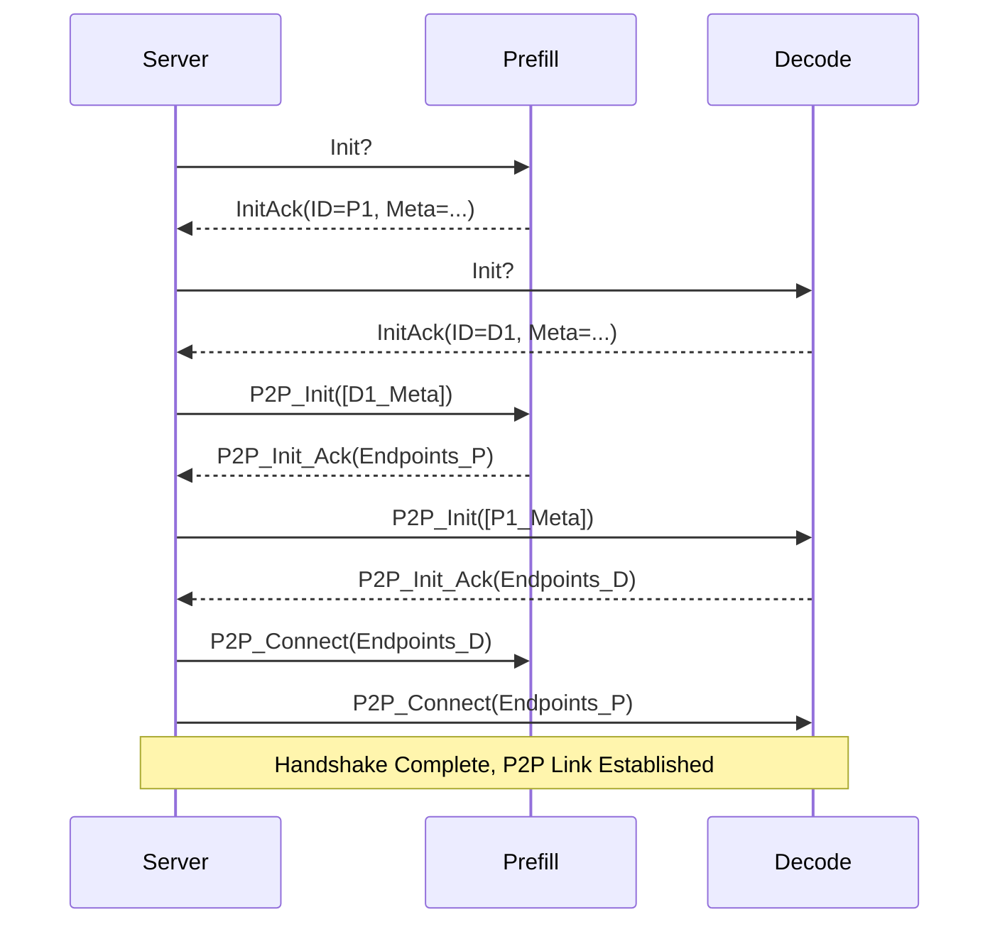
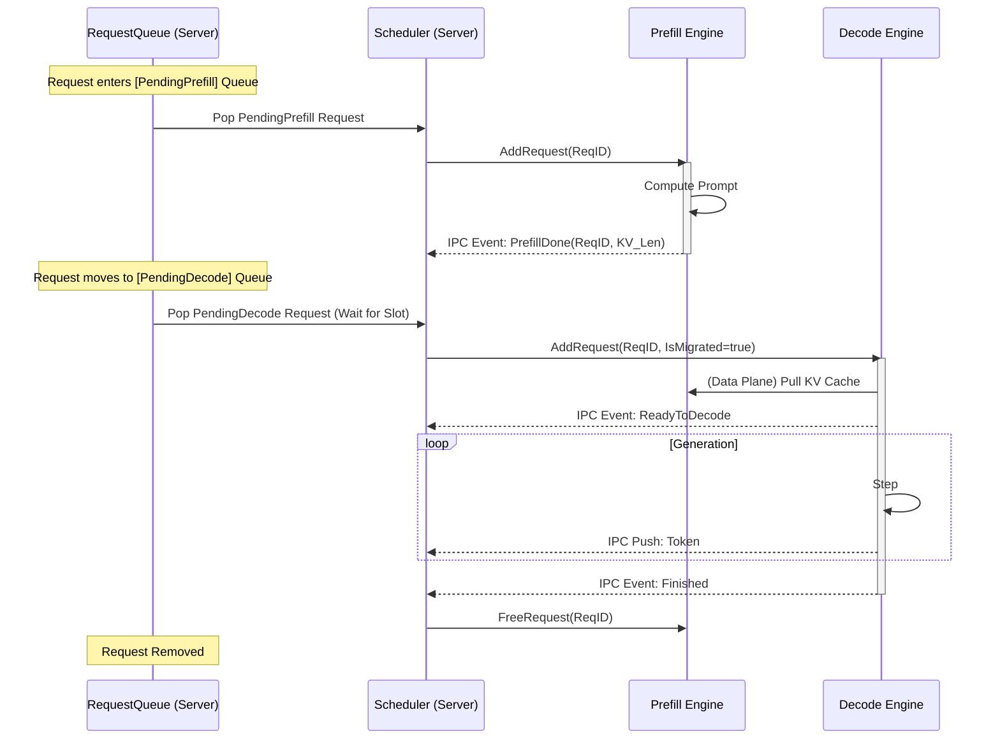

# Rust Server System Design

## 1. Core Components

### 1.1 `EngineManager` (Cluster Coordinator)

This component evolves from managing a single process to managing a distributed cluster.

- **Cross-Node Support**: Engines may reside on different physical hosts. The Manager connects via TCP (IP:Port).
- **Data Structure**:
  ```rust
  pub struct EngineManager {
      prefill_engines: Vec<Arc<EngineHandle>>,
      decode_engines: Vec<Arc<EngineHandle>>,
      // Map EngineID -> Handle
      all_engines: HashMap<String, Arc<EngineHandle>>,
  }
  ```
- **Startup Logic**:
  1. Parse Config.
  2. Connect to `N` Prefill Engines + `M` Decode Engines (via configured IP/Ports).
  3. Wait for TCP Connections (Spoke).
  4. Send `Handshake` to each.
  5. Collect `InitInfo` (ID, Capabilities).
  6. Broadcast `P2PInit` / `P2PConnect`.
     - **RDMA Bootstrap**: The Server orchestrates the connection. Engines utilize available RDMA/High-Speed interconnects automatically (or via internal discovery) once peered.

### 1.2 `Scheduler` (State Machine)

The core logic resides here.

- **Request State**:
  ```rust
  enum RequestStage {
      PendingPrefill,
      Prefilling(EngineID),
      PendingMigration(EngineID), // Prefill Done, waiting for Decode Slot
      Migrating(SourceID, TargetID),
      Decoding(EngineID),
      Finished
  }
  ```
- **Loop**:
  1. Check `PendingPrefill` queue -> Assign to least-loaded `PrefillEngine`.
  2. Check for `PrefillFinished` events -> Move to `PendingMigration`.
  3. Check `PendingMigration` queue -> Find `DecodeEngine` with capacity (KV Blocks check).
  4. Trigger `Migrate` RPC.
  5. Check for `MigrateDone` events -> Move to `Decoding`.
  6. Check `Decoding` status -> Stream tokens -> Complete.

### 1.3 `EngineClient` (IPC)

- **Protocol**: Spoke over TCP.
- **Framing**: Length-Prefixed FlatBuffers.
- **Concurrency**:
  - Write: `Mutex<WriteHalf>` guarding the socket.
  - Read: Independent loop pushing events to a central `mpsc::Sender` consumed by the Scheduler.

## 2. Sequence Diagrams

### 2.1 P2P Handshake



### 2.2 Request Lifecycle



*Note: The actual migration trigger (Push vs Pull) depends on the exact Python implementation. The wrapper will abstract this.*

## 3. Interfaces

- **HTTP**: `/v1/chat/completions` (Standard).
- **Internal**: `Scheduler::push(req)`, `Scheduler::poll_events()`.
