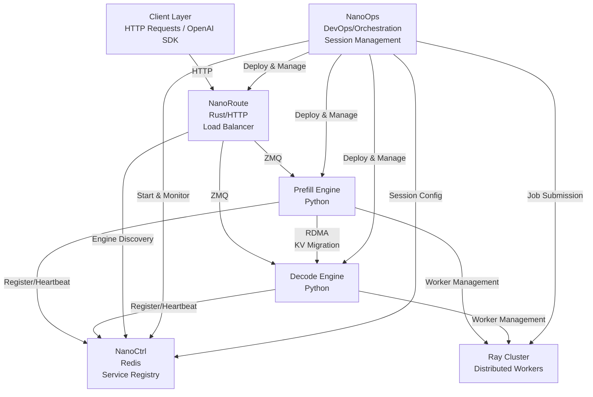

# NanoInfra

A high-performance infrastructure for distributed LLM inference with disaggregated prefill/decode architecture, featuring RDMA-based KV cache migration and efficient resource management.

## 📦 Components

| Component                      | Language | Description                    | Key Features                                                                                    |
| ------------------------------ | -------- | ------------------------------ | ----------------------------------------------------------------------------------------------- |
| [DLSlime](./DLSlime)           | C++      | RDMA communication             | Zero-copy KV cache migration, P2P mesh networking, GPUDirect RDMA                               |
| [NanoBench](./NanoBench)       | Python   | Benchmarking tools             | Performance testing and profiling                                                               |
| [NanoCCL](./NanoCCL)           | C++      | Collective communication       | AllReduce, AllGather, ReduceScatter, tensor parallelism support                                 |
| [NanoCommon](./NanoCommon)     | C++      | Shared utilities               | Logging, common data structures, error handling                                                 |
| [NanoCtrl](./NanoCtrl)         | Rust     | Control plane                  | Redis-backed service registry, health monitoring, engine discovery                              |
| [NanoDeploy](./NanoDeploy)     | Python   | LLM inference engine           | Prefill/decode engines, KV cache management, continuous batching, Ray-based distributed workers |
| [NanoOps](./NanoOps)           | -        | Operations tools               | Deployment and management utilities                                                             |
| [NanoRoute](./NanoRoute)       | Rust     | HTTP load balancer             | OpenAI-compatible API, multiple routing strategies, engine discovery                            |
| [NanoSequence](./NanoSequence) | C++      | Sequence & KV cache management | Sequence state management, FlatBuffers serialization, block allocation                          |

## 🏗️ Architecture

## 📖 Documentation

- [Deployment Guide](./docs/deployment.md) — Step-by-step instructions for deploying with NanoCtrl, NanoRoute, and NanoDeploy

## 📄 License

See individual component [license](./LICENSE).

## 📞 Support

- **Issues**: [GitHub Issues](https://github.com/JimyMa/NanoInfra/issues)
- **Documentation**: Check component READMEs
