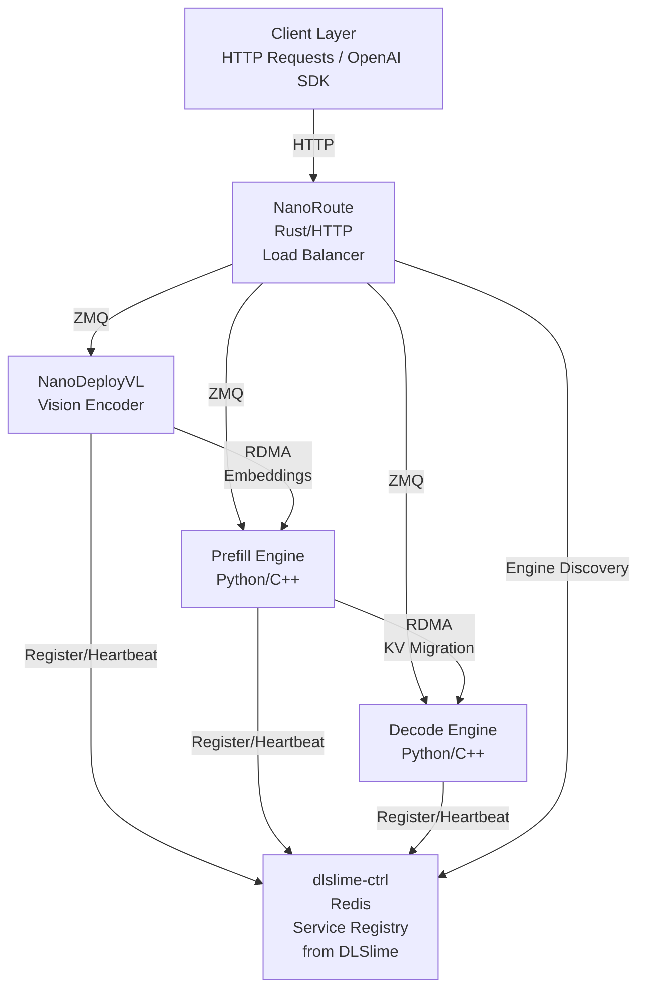

# NanoDeploy: LLM Inference with Prefill-Decode Disaggregation and Wide Expert Parallelism

## 📦 Components

| Component                      | Language   | Description             | Key Features                                                                                    |
| ------------------------------ | ---------- | ----------------------- | ----------------------------------------------------------------------------------------------- |
| [NanoDeploy](./NanoDeploy)     | Python/C++ | LLM inference engine    | Prefill/decode engines, KV cache management, continuous batching, Ray-based distributed workers |
| [NanoDeployVL](./NanoDeployVL) | Python     | Vision-Language encoder | EP-separated ViT encoder, RDMA embedding transfer, Qwen3-VL support                             |
| [NanoRoute](./NanoRoute)       | Rust       | HTTP load balancer      | OpenAI-compatible API, tool calls, routing strategies, engine discovery                         |

## 🧠 Supported Models

| Model         | Component    | Architecture          |
| ------------- | ------------ | --------------------- |
| DeepSeek-V3   | NanoDeploy   | MLA + MoE             |
| DeepSeek-V3.2 | NanoDeploy   | MLA + MoE + NSA       |
| DeepSeek-V4   | NanoDeploy   | MLA + MoE + DSA + SWA |
| GLM-5         | NanoDeploy   | MLA + MoE + NSA       |
| Kimi-K2       | NanoDeploy   | MLA + MoE             |
| Qwen3         | NanoDeploy   | GQA (Dense)           |
| Qwen3-MoE     | NanoDeploy   | GQA + MoE             |
| Qwen3.5-MoE   | NanoDeploy   | GQA + GDN + MoE       |
| Qwen3-VL      | NanoDeployVL | GQA + MoE + ViT       |

## ✨ Key Features

| Feature                                            | Description                                                                                 |
| -------------------------------------------------- | ------------------------------------------------------------------------------------------- |
| ✅ **Chunked Prefill**                             | Split long prompts into chunks to overlap with decode batches.                              |
| ✅ **Continuous Batching**                         | Dynamic request scheduling with paged KV cache.                                             |
| ✅ **CUDA Graph**                                  | Captured decode kernels for low-latency token generation.                                   |
| ✅ **Encoder-Prefill-Decode (EPD) Disaggregation** | Separate encoder, prefill and decode across GPU nodes with GPUDirect RDMA KV migration.     |
| ✅ **FP8 KV Cache**                                | Float8 (E4M3) paged KV cache, ~50% memory reduction.                                        |
| ✅ **Gated Delta Net (GDN)**                       | Linear attention for Qwen3.5-MoE hybrid full/linear layers.                                 |
| ✅ **Multi-head Latent Attention (MLA)**           | Compressed KV cache with low-rank projection for DeepSeek-V3 family.                        |
| ✅ **Multi-Token Prediction (MTP)**                | Speculative decoding with model-native MTP heads.                                           |
| ✅ **Native Sparse Attention (NSA)**               | FP8 sparse decode with block-level indexing for DeepSeek-V3.2.                              |
| ✅ **Node Discovery**                              | Automatic engine registration and heartbeat via the DLSlime control plane (`dlslime-ctrl`). |
| ✅ **Prefix Caching**                              | Reuse KV cache of shared prompt prefixes across requests.                                   |
| ✅ **Tensor Parallelism (TP)**                     | Split weight matrices across GPUs for large model inference.                                |
| ✅ **Wide Expert Parallelism**                     | MoE EP across all GPUs with attention data-parallel (`attention_dp × ffn_ep`).              |

## 🏗️ Architecture



## 🚀 Installation

### Key Third-Party Dependencies

The Docker development image pins every external build dependency. Prefer tags when upstream provides a usable tag; otherwise pin the exact commit that has been smoke-tested.

| Library                                                    | Pinned version / ref                    | Notes                                                               |
| ---------------------------------------------------------- | --------------------------------------- | ------------------------------------------------------------------- |
| PyTorch                                                    | `2.10.0+cu128`                          | CUDA 12.8 wheel.                                                    |
| [DeepEP](https://github.com/deepseek-ai/DeepEP)            | `567632dd` (`v1.2.1-25-g567632d`)       | Nearest tag: `v1.2.1`; pinned commit is the tested post-tag build.  |
| [DeepGEMM](https://github.com/deepseek-ai/DeepGEMM)        | `891d57b4` (`v2.1.1.post3-16-g891d57b`) | Nearest tag: `v2.1.1.post3`; pinned commit reports package `2.5.0`. |
| [FlashMLA](https://github.com/deepseek-ai/FlashMLA)        | `1408756a`                              | Upstream currently has no tags; pinned by commit.                   |
| [FlashInfer](https://github.com/flashinfer-ai/flashinfer)  | `v0.6.9`                                | Built from source.                                                  |
| [flash-attn](https://github.com/Dao-AILab/flash-attention) | `v2.8.1` wheel for `cu12` / `torch2.10` | Uses the release wheel.                                             |
| [DLSlime](https://github.com/Deeplink-org/DLSlime)         | `v0.1.16`                               | Builds `dlslime`; `dlslime-ctrl` is not built in this image.        |
| Rust                                                       | `1.95.0` via rustup                     | Minimal rustup toolchain; not installed from apt.                   |

The DeepSeek kernels require SM90+ (NVIDIA Hopper) GPUs. Install the key dependencies manually as follows:

```bash
cd DeepEP && pip install .
cd DeepGEMM && pip install .
cd FlashMLA && pip install .
pip install flashinfer-python==0.6.9
pip install dlslime==0.1.16
```

### Docker Development Image

The development container is built from `docker/Dockerfile`. It uses NVIDIA CUDA 12.8 devel, PyTorch 2.10 CUDA 12.8, source-built DeepEP/DeepGEMM/FlashMLA/FlashInfer, release-wheel flash-attn, rustup-managed Rust, and the build toolchains needed for NanoDeploy. The image intentionally does not include the NanoDeploy source tree; mount or clone NanoDeploy inside the container and install it there. This keeps the expensive dependency layers reusable across source changes.

Build:

```bash
docker build --network host \
  -f docker/Dockerfile \
  -t nanodeploy:0.2.0-cu128-devel \
  .
```

Private mirrors or proxies can be passed with Docker build args in local environments; the image does not require them.

Run for local development:

```bash
docker run --gpus all --rm -it --network host --ipc=host \
  --cap-add IPC_LOCK --ulimit memlock=-1:-1 \
  --device=/dev/infiniband \
  -v /sys/class/infiniband:/sys/class/infiniband:ro \
  -v $PWD:/workspace/NanoDeploy \
  -w /workspace/NanoDeploy/NanoDeploy \
  nanodeploy:0.2.0-cu128-devel
```

Inside the container, install NanoDeploy from the mounted checkout:

```bash
python3 -m pip install --break-system-packages --no-build-isolation -v -e .
```

### One-liner: install everything

```bash
pip install ".[all]"
```

### Install individual components

```bash
pip install ".[nanodeploy]"   # NanoDeploy inference engine only
pip install ".[nanodeployvl]" # NanoDeployVL vision-language encoder only
```

> The control-plane server (`dlslime-ctrl`) and its Python client (`dlslime.ctrl.NanoCtrlClient`)
> now live in the [DLSlime](https://github.com/DeepLink-org/DLSlime) repo. Install them via:
>
> ```bash
> pip install dlslime           # PeerAgent + NanoCtrlClient (data-plane wheel)
> pip install dlslime-ctrl      # Rust control-plane server binary
> # or, from a DLSlime checkout: pip install -e ./dlslime ./dlslime-ctrl
> ```

### For developers

```bash
# Build NanoDeploy C++ extensions in-place
cd NanoDeploy && pip install -e . && cd ..

# Build NanoRoute (Rust)
cd NanoRoute && cargo build --release && cd ..

# Build dlslime-ctrl (Rust) from the DLSlime checkout
cd /path/to/DLSlime/dlslime-ctrl && cargo build --release && cd -
```

## Quick Start: LLM Inference

Prefill-Decode disaggregation splits prompt processing (prefill) and token generation (decode) across separate GPU nodes connected via RDMA.

### Prerequisites

- 2 nodes with NVIDIA GPUs (SM90+ for FP8), RDMA-capable NICs
- Redis, Ray cluster, Rust toolchain

#### 1. Start Ray

```bash
# Node 0 (head)
ray start --head --port=7078 --dashboard-host=0.0.0.0

# Node 1 (multi-node only)
ray start --address <node0-ip>:7078
```

### Offline mode

Batch generation without HTTP serving.

#### Single node (no dlslime-ctrl needed)

```bash
python NanoDeploy/examples/non_disagg.py \
    --model /models/Qwen3-235B-A22B \
    --ray_address <node0-ip>:7078 \
    --master_address <node0-ip>:6006 \
    --attention_dp 8 --ffn_ep 8 \
    --kvcache_block_size 256 \
    --prompt "1+1=?" --max_tokens 128
```

#### PD disaggregated (2 nodes)

##### 2. Start Redis + dlslime-ctrl

```bash
redis-server --bind 0.0.0.0 --port 6379
dlslime-ctrl server --redis-url redis://127.0.0.1:6379
```

##### 3. Launch engines

```bash
python NanoDeploy/examples/disagg.py \
    --model /models/Qwen3-235B-A22B \
    --ray_address <node0-ip>:7078 \
    --ctrl_address <node0-ip>:4479 \
    --attention_dp 8 --ffn_ep 8 \
    --prefill.master_address <node0-ip>:6006 \
    --decode.master_address <node1-ip>:6006
```

### Single-node serving (`nanodeploy serve`)

For single-node hybrid deployment (prefill + decode in one process), use the
`nanodeploy serve` command. It runs the engine in-process and exposes an
OpenAI-compatible HTTP API directly, in the spirit of `vllm serve` — no
NanoRoute and no ZMQ engine servers required:

```bash
# Same Config flags as engine_server.py (--host/--port bind HTTP for serve)
nanodeploy serve /path/to/model \
  --host 0.0.0.0 --port 8100 \
  --served-model-name Qwen3-4B \
  --ray_address 127.0.0.1:7078
```

Endpoints: `GET /health`, `GET /v1/models`, `POST /v1/completions`,
`POST /v1/chat/completions` (streaming and non-streaming).

```bash
curl http://127.0.0.1:8100/v1/chat/completions \
  -H "Content-Type: application/json" \
  -d '{"model": "Qwen3-4B", "messages": [{"role": "user", "content": "Hello"}]}'
```

To make the node discoverable by a router (e.g. DLRouter) via dlslime-ctrl,
point it at a running control plane; the server then registers its HTTP
endpoint (entity kind `nanodeploy`) and keeps a heartbeat:

```bash
# Control plane (Redis + dlslime-ctrl)
redis-server --bind 0.0.0.0 --port 6379 &
dlslime-ctrl server --redis-url redis://127.0.0.1:6379 &

nanodeploy serve /path/to/model \
  --host 0.0.0.0 --port 8100 \
  --served-model-name Qwen3-4B \
  --ctrl-address 127.0.0.1:4479
```

### Online mode

ZMQ engine servers with OpenAI-compatible HTTP API via NanoRoute.

##### 2. Start Redis + dlslime-ctrl

```bash
redis-server --bind 0.0.0.0 --port 6379
dlslime-ctrl server --redis-url redis://127.0.0.1:6379
```

##### 3. Start NanoRoute

```bash
cd NanoRoute && cargo run --release    # edit config.toml to set ctrl_address
```

##### 4. Launch engines

```bash
# Terminal 1 — Decode engine
python NanoDeploy/nanodeploy/server/engine_server.py \
    --model /models/Qwen3-235B-A22B \
    --mode decode \
    --ray_address <node0-ip>:7078 \
    --ctrl_address <node0-ip>:4479 \
    --ctrl_scope nanoctrl-0 \
    --master_address <node1-ip>:6006 \
    --host <node0-ip> --port 6001 \
    --attention_dp 8 --ffn_ep 8 \
    --kvcache_block_size 64 \
    --max_num_batched_tokens 16384 --max_model_len 16384

# Terminal 2 — Prefill engine
python NanoDeploy/nanodeploy/server/engine_server.py \
    --model /models/Qwen3-235B-A22B \
    --mode prefill \
    --ray_address <node0-ip>:7078 \
    --ctrl_address <node0-ip>:4479 \
    --ctrl_scope nanoctrl-0 \
    --master_address <node0-ip>:6006 \
    --host <node0-ip> --port 6002 \
    --attention_dp 8 --ffn_ep 8 \
    --kvcache_block_size 64 \
    --max_num_batched_tokens 16384 --max_model_len 16384
```

##### 5. Send requests

```bash
curl http://<node0-ip>:8080/v1/chat/completions \
  -H "Content-Type: application/json" \
  -d '{"model": "/models/Qwen3-235B-A22B", "messages": [{"role": "user", "content": "Hello"}]}'
```

______________________________________________________________________

## 📄 License

See individual component [license](./LICENSE).

## 📞 Support

- **Issues**: [GitHub Issues](https://github.com/JimyMa/NanoDeploy/issues)
- **Documentation**: Check component READMEs
