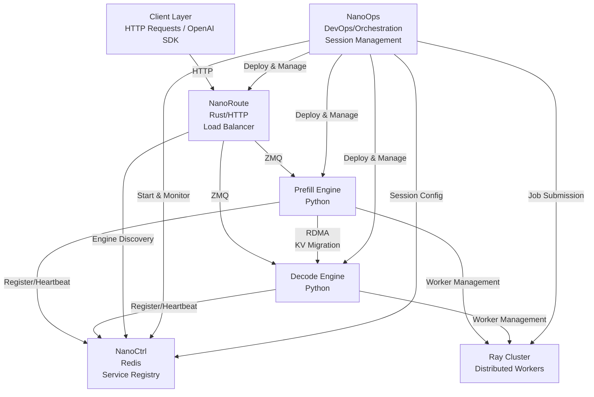

# NanoInfra

A high-performance infrastructure for distributed LLM inference with disaggregated prefill/decode architecture, featuring RDMA-based KV cache migration and efficient resource management.

## 📦 Components

| Component                      | Language | Description                    | Key Features                                                                                    |
| ------------------------------ | -------- | ------------------------------ | ----------------------------------------------------------------------------------------------- |
| [DLSlime](./DLSlime)           | C++      | RDMA communication             | Zero-copy KV cache migration, P2P mesh networking, GPUDirect RDMA                               |
| [NanoBench](./NanoBench)       | Python   | Benchmarking tools             | Performance testing and profiling                                                               |
| [NanoCCL](./NanoCCL)           | C++      | Collective communication       | AllReduce, AllGather, ReduceScatter, tensor parallelism support                                 |
| [NanoCommon](./NanoCommon)     | C++      | Shared utilities               | Logging, common data structures, error handling                                                 |
| [NanoCtrl](./NanoCtrl)         | Rust     | Control plane                  | Redis-backed service registry, health monitoring, engine discovery                              |
| [NanoDeploy](./NanoDeploy)     | Python   | LLM inference engine           | Prefill/decode engines, KV cache management, continuous batching, Ray-based distributed workers |
| [NanoOps](./NanoOps)           | -        | Operations tools               | Deployment and management utilities                                                             |
| [NanoRoute](./NanoRoute)       | Rust     | HTTP load balancer             | OpenAI-compatible API, multiple routing strategies, engine discovery                            |
| [NanoSequence](./NanoSequence) | C++      | Sequence & KV cache management | Sequence state management, FlatBuffers serialization, block allocation                          |

## 🏗️ Architecture



## 🚀 Installation

The root `pyproject.toml` acts as a meta-package that lets you install any combination of Python components in a single command.

### One-liner: install everything

```bash
pip install ".[all]"
```

### Install individual components

```bash
pip install ".[dlslime]"    # DLSlime transfer engine only
pip install ".[nanoctrl]"   # NanoCtrl lifecycle client only
pip install ".[nanodeploy]" # NanoDeploy inference engine only
```

### Development (editable) installs

Use editable mode during development so that source changes take effect immediately without reinstalling.

```bash
# Install all components in editable mode
make install-dev

# Or install only what you need
make install-dlslime-dev
make install-nanoctrl-dev
make install-nanodeploy-dev
```

> **Note:** `DLSlime` and `NanoDeploy` both contain C++ extensions. The first build will invoke `cmake` + `ninja` and may take a few minutes. `NanoCtrl` is pure Python and installs instantly.

### Summary of `make` targets

| Target                        | Description                                                          |
| ----------------------------- | -------------------------------------------------------------------- |
| `make install`                | Build and install all three packages                                 |
| `make install-dev`            | Editable install of all three packages (recommended for development) |
| `make install-dlslime`        | Build and install DLSlime only                                       |
| `make install-nanoctrl`       | Install NanoCtrl only                                                |
| `make install-nanodeploy`     | Build and install NanoDeploy only                                    |
| `make install-dlslime-dev`    | Editable install of DLSlime                                          |
| `make install-nanoctrl-dev`   | Editable install of NanoCtrl                                         |
| `make install-nanodeploy-dev` | Editable install of NanoDeploy                                       |

______________________________________________________________________

## 📖 Documentation

- [Deployment Guide](./docs/deployment.md) — Step-by-step instructions for deploying with NanoCtrl, NanoRoute, and NanoDeploy

## 📄 License

See individual component [license](./LICENSE).

## 📞 Support

- **Issues**: [GitHub Issues](https://github.com/JimyMa/NanoInfra/issues)
- **Documentation**: Check component READMEs
