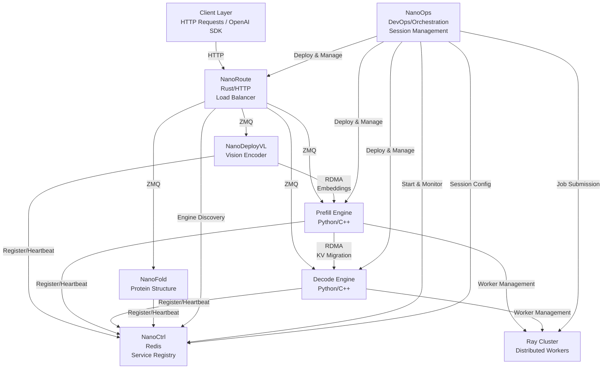

# NanoDeploy: A highly available agentic inference serving framework, tailored for disaggregated architectures and high-performance expert parallelism.

## 📦 Components

| Component                      | Language    | Description                  | Key Features                                                                                    |
| ------------------------------ | ----------- | ---------------------------- | ----------------------------------------------------------------------------------------------- |
| [DLSlime](./DLSlime)           | C++         | RDMA communication           | Zero-copy KV cache migration, P2P mesh networking, GPUDirect RDMA                               |
| [NanoBench](./NanoBench)       | Python      | Benchmarking tools           | Performance testing and profiling                                                               |
| [NanoCCL](./NanoCCL)           | C++ / CUDA  | Low-latency collectives      | Intra-/Inter- node AllToAll, SM90+ GPU kernels                                                  |
| [NanoCommon](./NanoCommon)     | C++         | Shared utilities             | Logging, common data structures, error handling                                                 |
| [NanoCtrl](./NanoCtrl)         | Rust        | Control plane                | Redis-backed service registry, health monitoring, engine discovery, Python client               |
| [NanoDeploy](./NanoDeploy)     | Python/C++  | LLM inference engine         | Prefill/decode engines, KV cache management, continuous batching, Ray-based distributed workers |
| [NanoDeployVL](./NanoDeployVL) | Python      | Vision-Language encoder      | EP-separated ViT encoder, RDMA embedding transfer, Qwen3-VL support                             |
| [NanoFold](./NanoFold)         | Python      | Protein structure prediction | Protenix/AlphaFold3 serving, trunk/diffusion split, NanoCtrl discovery                          |
| [NanoOps](./NanoOps)           | -           | Operations tools             | Deployment and management utilities                                                             |
| [NanoRoute](./NanoRoute)       | Rust        | HTTP load balancer           | OpenAI-compatible API, tool calls, routing strategies, engine discovery                         |
| [NanoSequence](./NanoSequence) | FlatBuffers | Protocol definitions         | Wire-format schemas for sequence, packet, and batch interfaces                                  |

## 🏗️ Architecture



## 🚀 Installation

The root `pyproject.toml` acts as a meta-package that lets you install any combination of Python components in a single command.

### One-liner: install everything

```bash
pip install ".[all]"
```

### Install individual components

```bash
pip install ".[dlslime]"      # DLSlime transfer engine only
pip install ".[nanoccl]"      # NanoCCL only (requires CUDA SM90+)
pip install ".[nanoctrl]"     # NanoCtrl lifecycle client only
pip install ".[nanodeploy]"   # NanoDeploy inference engine only
pip install ".[nanodeployvl]" # NanoDeployVL vision-language encoder only
```

______________________________________________________________________

## 📖 Documentation

- [Deployment Guide](./docs/deployment.md) — Step-by-step instructions for deploying with NanoCtrl, NanoRoute, and NanoDeploy

## 📄 License

See individual component [license](./LICENSE).

## 📞 Support

- **Issues**: [GitHub Issues](https://github.com/JimyMa/NanoInfra/issues)
- **Documentation**: Check component READMEs
