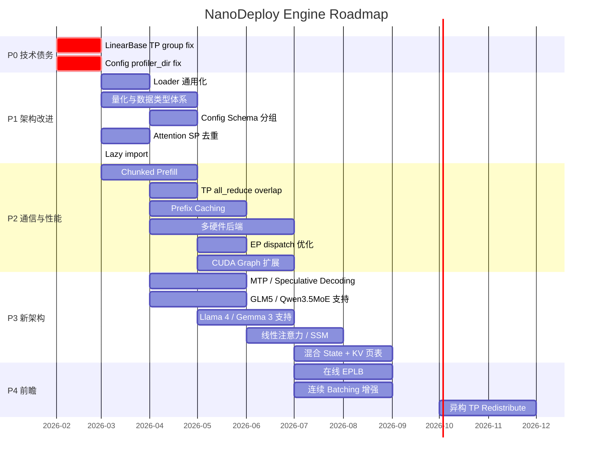

# NanoDeploy Engine Roadmap

> 基于 2026-02-18 架构讨论整理，覆盖当前技术债务、短期改进和前瞻性特性。

## 当前状态概要

NanoDeploy 已支持 DeepSeek-V3 (MLA + MoE + FP8) 和 Qwen3-MoE 的推理，具备 prefill-decode 分离、RDMA KV cache 迁移、EP (Expert Parallelism)、SP (Sequence Parallelism) 等能力。但架构上以 DeepSeek V3 为中心、单体化程度较高，不利于多模型扩展。

______________________________________________________________________

## P0 — 技术债务（必须修复）

### 1. `LinearBase` TP Group 硬编码 Bug

> \[!CAUTION\]
> 当 `ffn_tp > 1` 时会直接产生数值错误或死锁。当前因 `ffn_tp=1` 未暴露。

- `linear.py` 中 `LinearBase.__init__` 硬编码 `attn_tp_rank` / `attn_tp_world_size`
- `RowParallelLinear.forward` 的 `all_reduce` 使用 `attn_tp_group`，FFN 中也用这个 group
- `embed_head.py` 中 `VocabParallelEmbedding` / `ParallelLMHead` 同样硬编码 `attn_tp_*`
- **修复**：`LinearBase` 接受 `parallel_context: Literal["attn", "ffn"]` 参数，按需读取对应 mesh 的 rank/size/group
- **影响范围**：所有 model 文件中构造 Linear 的地方需传入 `parallel_context`

### 2. `profiler_dir` 硬编码路径

- `config.py` L63: `profiler_dir` 默认值是开发者个人路径
- **修复**：改为 `None` 或 `./profiler_output`

______________________________________________________________________

## P1 — 架构改进（短期 1-2 月）

### 3. Loader 通用化

> \[!IMPORTANT\]
> 已支持 DeepSeek V3 和 Qwen3 MoE 两个模型，loader 的模型特化逻辑急需拆分。

将 `loader.py` 的模型特定逻辑拆分为 handler 注册模式：

```
load_model()  — 通用遍历 safetensors + progress bar
  ├── model.weight_handlers  — 模型注册的 handler 列表
  │   ├── DeepSeek: _handle_expert_weight, _handle_kv_b_proj, _is_mtp_weight
  │   └── Qwen3MoE: _handle_qwen_expert_weight
  └── default handler: packed_modules_mapping + direct load
```

### 4. 量化与数据类型体系

当前仅支持 FP8 (float8_e4m3fn) block-wise 量化，`QuantizationConfig` 极其简单：

- 支持更多量化类型：INT8 weight-only、GPTQ、AWQ、W4A16
- 统一的 dequant 路径：将 `_dequant_fp8_block` 泛化为 `Dequantizer` 接口
- 混合精度支持：不同层使用不同精度（如 attention FP16、FFN FP8）
- 与 Loader 通用化联动：量化格式检测和 weight handler 注册一体化

### 5. Config Schema 分组

将 `config.py` 扁平的 `Config` 拆分为嵌套子配置：

```
Config
├── SchedulerConfig    (max_num_seqs, max_model_len, routing_strategy, ...)
├── ParallelConfig     (attention_tp/sp/dp, ffn_ep/tp/dp)
├── RunnerConfig       (enforce_eager, kvcache_block_size, ...)
├── DeployConfig       (engine_id, mode, host, port, ...)
└── LoggingConfig      (log_level, enable_profiler, profiler_dir, ...)
```

- 模型特定验证逻辑（如 `DeepseekV3` 的 `block_size==64`、`attention_tp==1`）移入模型自己的 validator
- `hf_config: Any` 可保留但添加 typed accessor properties

### 6. Attention SP 代码去重

`attention.py` 中 `FlashAttentionImpl` 和 `FlashMLAImpl` 的 SP 通信代码几乎完全相同（~100 行重复）：

- 提取 `SPCommunicator` 负责 q scatter + o/lse gather + combine
- 两个 impl 各自只保留核心 attention 计算

### 7. Attention 后端 Lazy Import

- `flash_mla` 和 `flash_attn_interface` 的顶层 import 导致未安装时模块加载失败
- 改为 lazy import 或 try/except，未安装时给出清晰错误信息

______________________________________________________________________

## P2 — 通信与性能优化（中期 2-4 月）

### 8. Chunked Prefill

当前 prefill 是整个序列一次性计算，长序列会阻塞 decode 请求导致 TTFT 波动：

- 将 prefill 拆成固定大小的 chunk（如 512 或 1024 tokens），与 decode batch 交替执行
- Scheduler 需支持 "partial prefill" 状态：序列 prefill 到一半时可暂停，下一个 step 继续
- 每个 chunk 产生的 KV cache 立即写入 paged cache，后续 chunk 可复用
- 与 CUDA Graph 配合：chunk 大小对齐到 graph 捕获的桶
- **预期收益**：降低长序列 prefill 对 decode latency 的影响，实现更平滑的 P99 延迟

### 9. TP All-Reduce Overlap

`RowParallelLinear` 的 `all_reduce` 是同步阻塞的。可以将其与后续独立计算重叠：

```
[Attn RowParallel GEMM] → [all_reduce(async)] ───────┐
                          [MoE gate on residual]      │ ← 重叠
                                                      ├──▶ [wait + MoE dispatch]
```

- `RowParallelLinear.forward` 返回 `(result, Optional[Work])`
- `DecoderLayer.forward` 编排 wait 时机
- **预期收益**：Decode 阶段 ~5-10% latency 降低

### 10. Prefix Caching

- 当前已有 `block_tables` 的基础设施
- 实现 radix tree based prefix sharing，多请求共享 prompt prefix 的 KV cache
- 与 disaggregated serving 配合：prefill 端的 prefix cache 跨请求复用
- **关键依赖**：block allocator 需支持引用计数，eviction 策略需感知 prefix 共享

### 11. 多硬件后端系统

如需支持 AMD / 国产 GPU：

- `AttentionBackend` 抽象 + 注册表
- `GEMMBackend` 抽象（FP8 GEMM 在不同硬件上实现不同）
- KV cache layout 可能因硬件不同（page size、memory alignment）

### 12. EP Dispatch 优化

- 已集成 DeepEP，但可进一步优化 low-latency mode 下的 batch size 适配
- 评估 DeepEP v2 的 interleave dispatch-compute pipeline
- Shared expert 计算与 routed expert dispatch 的 overlap

### 13. CUDA Graph 覆盖范围扩展

- 当前只覆盖 decode 路径
- 评估 prefill 路径（固定 token 长度桶）的 CUDA Graph 可行性
- 评估 EP all-to-all 的 CUDA Graph 兼容性

______________________________________________________________________

## P3 — 新模型架构支持（中长期 3-6 月）

### 14. 线性注意力 / State Space Model 支持

下一代模型可能混合使用 softmax attention 和线性注意力（如 Mamba-2、RWKV-6、RetNet）：

**挑战**：

- 线性注意力用 recurrent state 替代 KV cache，`(hidden_dim, state_dim)` 固定大小 ≠ 变长 KV cache
- Scheduler 的 block 分配逻辑不适用于固定大小 state
- Prefill 时线性注意力可用 chunk-wise parallel scan，decode 时需要 recurrent update

**需求**：

- 新增 `StateCache` 管理器（per-layer 固定大小 tensor，不做 paging）
- `model_runner.py` 支持 mixed cache（部分层用 KV cache，部分层用 state cache）
- 新的 attention impl：`LinearAttentionImpl`（chunk-wise prefill + recurrent decode）

### 15. 混合注意力 + State 的统一页表

未来模型可能交替使用 softmax attention 层和 state 层（如 Jamba 架构）：

```
Layer 0: Softmax Attention → KV cache (paged, variable length)
Layer 1: Mamba SSM → State cache (fixed size per sequence)
Layer 2: Softmax Attention → KV cache
Layer 3: Mamba SSM → State cache
...
```

**统一管理方案**：

- 扩展 `BlockAllocator` 支持两种 block 类型：KV block（变长）+ State block（定长）
- 每个 Sequence 维护 `kv_block_table` + `state_slot_table`
- Eviction 策略：KV cache 可按 token 粒度 evict，state 只能整个序列 evict
- Prefill-decode 分离时，state transfer 比 KV transfer 简单得多（固定大小 memcpy）

### 16. Multi-Token Prediction (MTP) / Speculative Decoding

DeepSeek-V3 本身有 MTP 头（当前 loader 跳过了这些权重）：

- 加载 MTP 权重，支持 speculative decoding（main model + MTP draft heads）
- Self-speculative: 用 MTP heads 做 draft，main model 做 verify
- 预期 decode 吞吐提升 1.5-2x

### 17. 更多模型支持

| 模型                     | 难度  | 关键特性                                                       |
| ------------------------ | ----- | -------------------------------------------------------------- |
| GLM5                     | 中    | 可能采用新的注意力变体、需要适配 tokenizer 和 chat template    |
| Qwen3.5 MoE              | 低-中 | 在已有 Qwen3 MoE 基础上适配，关注 expert 数量/routing 策略变化 |
| Llama 4 (Maverick/Scout) | 中    | MoE + 长上下文、GQA 而非 MLA                                   |
| Qwen3 Dense              | 低    | 已有 MoE 版，dense 版更简单                                    |
| Gemma 3                  | 中    | Sliding window attention                                       |
| 混合架构 (Jamba 等)      | 高    | 需要 State cache 支持 (P3.14)                                  |

______________________________________________________________________

## P4 — 前瞻性能力（远期 6-12 月）

### 18. 在线 Expert Load Balancing (EPLB)

- 根据实时 token 路由统计动态调整 expert 到 GPU 的映射
- 当前的 `perfect_eplb` 是离线 mock — 需要实现在线版本
- 与 NanoCtrl 配合，跨 engine 协调 expert 分布

### 19. 连续 Batching 增强

- Preemption 策略优化：按优先级 evict 序列的 KV cache
- 多优先级队列：SLA-aware 调度

### 20. 异构 TP Redistribute

支持 Attention TP ≠ FFN TP 的场景（当前 `DistContext` 已有框架，但未实现 redistribute）：

- 实现 dedup → EP all-to-all → all-gather 三步 redistribute
- Gate 一致性：TP group rank 0 计算 gate 后广播 routing 决策
- **优先级最低**：当前 MLA 消除了 Attn TP 需求，MoE 用 EP 替代了 FFN TP，无实际场景驱动

______________________________________________________________________

## 里程碑时间线



______________________________________________________________________

## 优先级决策原则

1. **P0 先行**：技术债务影响正确性，必须立即修复
2. **P1 Loader 优先于 Config**：已有两个模型的特化逻辑混在 loader 里，Config 虽不够优雅但尚未造成实际阻塞
3. **P1 量化体系并行推进**：新模型常带新量化格式，量化体系要先于新模型支持就绪
4. **P2 按 ROI 排序**：Chunked Prefill 对延迟影响最直接，Prefix Caching 和多硬件后端前移以尽早打开市场
5. **P3 跟随模型趋势**：GLM5 和 Qwen3.5MoE 按发布节奏跟进，MTP 有现成权重优先做
6. **P4 按需投入**：异构 TP redistribute 无实际场景驱动，放在最后
