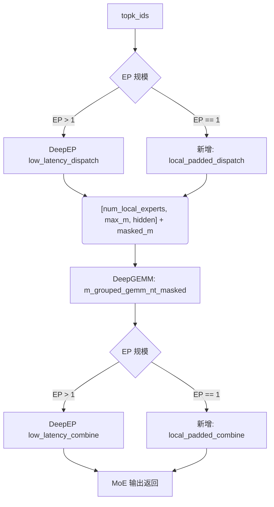

# 在 NanoDeploy 中实现单卡 MoE 兼容 CUDA Graph 的方案

## 1. 背景与问题分析

在当前 `nano-deploy-refactor` 代码库中，多卡（EP > 1）环境的 MoE Decode 已经可以通过 DeepEP 的 `low_latency_dispatch` 生成 GPU 端的 `masked_m`，从而与 DeepGEMM 的 `m_grouped_gemm_nt_masked` 配合，实现全程无 CPU 同步的计算，完美兼容 CUDA Graph。

然而，在单卡模型或纯 TP 模式下（EP = 1），系统强制绕过了 DeepEP 的分发逻辑，转而使用 `MoeExpertOps::compute_contiguous` 算子。该算子在将 Token 按照 Expert ID 分组时，调用了：

```cpp
auto topk_idx_cpu = topk_idx.to(torch::kCPU);
```

这会触发隐式的 Device-to-Host 数据拷贝与同步（Stream Synchronization）。CUDA Graph 在捕获阶段严禁发生任何 CPU 同步或动态内存分配，遇到此类操作会直接报错 `cudaErrorStreamCaptureUnsupported`。

## 2. 目标方案：统一的 Padded Routing 架构

为了让单卡（及纯 TP）也能支持 CUDA Graph，同时降低代码维护成本，最优雅的方案是**摒弃 `compute_contiguous`，将单卡和多卡的 Expert 计算部分统一到同一条 Masked Grouped GEMM 的执行路径上**。

### 架构对比



整个过程：TP 和 EP 在这个架构下完全正交。TP 切分的是 GEMM 内部的矩阵维度（并附带 all-reduce），而 Routing Buffer 分配仅与 EP size 以及 Batch Size 有关。单卡和多卡的计算阶段代码完全一致，彻底消除性能差异与维护债务。

## 3. 具体实现步骤

### 3.1 增加 Buffer 预分配逻辑

CUDA Graph 要求捕获期间所有的内存分配尺寸与地址是静态确定的。因此必须在 warmup 或 init 阶段预先分配 Padded Buffer。

- **尺寸估算 (`max_m`)**：
  在单卡场景下，如果直接按最坏情况分配 `max_m = max_batch_size * top_k` 会导致极度膨胀的显存占用，特别是针对单卡运行的大词表或 Expert 数量多的模型。实践中可以采用均摊和安全系数结合的方法：

  ```cpp
  int max_m = align_up(max_batch_size * top_k / num_experts * capacity_factor, 128);
  ```

  （例：对于 Decode 阶段 `max_batch_size=256`, `top_k=8`, `E=128` 的情况，即便设 `capacity_factor=4`，每个 Expert 最多容纳 64 个 Token 对齐后为 128。单卡的 buffer 占用约 `128 x 128 x 2048 x 2B ≈ 64MB`，完全可以接受）

- **代码变动**：在组件初始化阶段，对于 `ep_size == 1`：

  ```cpp
  // 分配用于单卡 Graph 友好的预缓冲空间
  padded_buffer_ = torch::empty({num_experts, max_m, hidden_size}, bf16_opts);
  masked_m_ = torch::empty({num_experts}, int32_opts);
  src_info_ = torch::empty({num_experts, max_m, 2}, int32_opts); // 记录 token_id 和 selected_k_id 等回传信息
  ```

### 3.2 实现 `local_padded_dispatch` Kernel

新实现一个约 50-100 行的纯 GPU 端 CUDA Kernel，用于替代原先必须走 CPU 的分组操作。

- **操作逻辑**：利用 `atomicAdd` 对每个 token 的 expert 计数器（对应 `masked_m_`数组中的偏移量）进行原子递增，随后将其原始数据移动到对应的 `padded_buffer_` 槽位中。若遇到槽位超额（即超出估算的 `max_m`），可直接选择 Truncate 截断策略（在 Decode 阶段长尾 Expert 丢失少许 token 的劣化远小于 Graph 提升的幅度）或触发一个 fallback warning。
- **输出**：生成对齐好的 `padded_buffer_` 内存布局，并输出精确的各类别专家有效的计数列表 `masked_m_`。这就与多卡 DeepEP 返回的数据流向保持了一模一样的接口格式。

### 3.3 替换推理链路

在单卡或 TP 环境下，接驳这套 GPU-Native 分发逻辑，使原有的 `compute_contiguous` 断生：

```cpp
if (ep_size > 1) {
    // 跨节点: 调用 DeepEP 的底层分发 (保留现有框架)
    // auto res = get_deep_ep_context().get_buffer()->low_latency_dispatch(...);
} else {
    // 本地: 调用 CUDA Graph 安全的纯本地 GPU 分发
    local_padded_dispatch(input, topk_idx, padded_buffer_, masked_m_, src_info_, ...);
}

// ======================================
// 统一的专家网络计算层
// ======================================
// 无论是通过 DeepEP 拉回来的，还是单卡的本地缓冲内存，均提供了一份 [num_local_experts, max_m, hidden] 的矩阵
compute_masked_out(padded_buffer_, masked_m_, expected_m, gateup, down);

if (ep_size > 1) {
    // 跨节点合并: 调用 DeepEP combine
} else {
    // 本地汇集与合并
    local_padded_combine(act_out, topk_weights, src_info_, final_out);
}
```

### 3.4 实现 `local_padded_combine` Kernel

单卡的 GPU-Native 结果规约层。

- **逻辑**：根据在 Dispatch 时保存的映射表数组 `src_info_`，利用反向 `atomicAdd` 读取专家层计算输出结果 `act_out`，并按 `topk_weights` 进行软权重加权。最后聚合回行维度的原 Token 分布中。这就避免了所有的显式排序所导致的依赖与延时。

## 4. 收益及结论

这套重构路径开发成本低，但对平台架构有着极大的优化意义：

1. **解决兼容性：彻底解除在单卡（或没有用到 DeepEP 通信库情况）下因 CPU 介入造成的组装卡顿而无法触发 CUDA Graph Record 优化的问题。**
2. **零 CPU 阻塞：由于废弃了所有 `torch::kCPU` 以及 `std::vector` 的内存分配流转，极大幅度压低了单卡的 CPU Launch Overhead。**
3. **彻底完成模型实现抽象：无论是单卡、TP 还是 EP 模型切片范型，通通复用相同的底层核心 GEMM 逻辑 `m_grouped_gemm_nt_masked`，将系统的并行正交程度提升最高，杜绝由于 API 入口不同可能带来的正确性偏差测试负担。**
