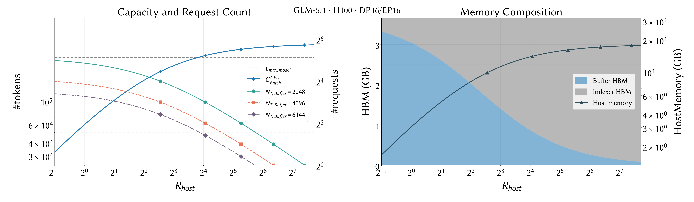
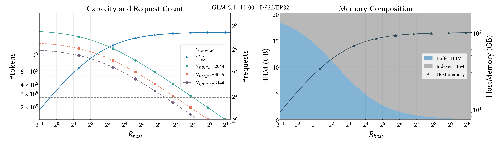
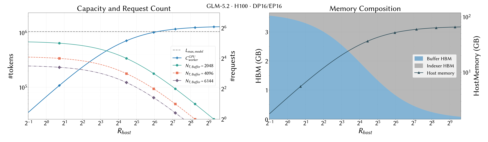
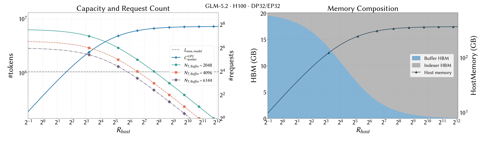

## DLEngine - HiSparse 容量模型

HiSparse 将 KV / Indexer cache 分为 logical 命名空间、GPU device hot Buffer 与 CPU host cold tier。本文建立统一的容量模型，用来判断固定 HBM 预算下的 worker 容量、可达并发、Buffer / Indexer 显存构成以及 host 内存需求。

实现细节见 [HiSparse 设计文档](../hisparse-design.zh.md)。

### 1. 背景与理论假设

本文采用两个基础假设：

1. **Indexer cache 全量常驻 GPU。** HiSparse 只在 host 与 device 之间分层 MLA KV；Indexer 覆盖完整 logical token 空间。层共享系数为 $R_{Share}=N_{layer}/N_{layer,indexer}$。
2. **暂不考虑 Prefix Cache。** 每个 logical token 独立占用 MLA KV / Indexer 空间。带缓存模型留到第 8 节继续扩展。

### 2. Capacity 定义与符号

定义 Decode worker 的聚合 logical 容量为：

$$
C=C_{worker}=R_{Host}B^T_{Buffer}
$$

静态均分时：

$$
B^T_{Buffer}=N_{bs,max}N_{T,Buffer}
$$

$$
C_{worker}=N_{bs,max}R_{Host}N_{T,Buffer}
=N_{bs,max}C_{host,seq}
$$

其中 $C_{host,seq}=R_{Host}N_{T,Buffer}$ 只是静态均分下的一份 per-sequence 容量。本文图片采用的默认模型上下文目标是 worker 级下界：

$$
C_{worker}\ge L_{max,model}
$$

该下界**不乘** $N_{bs,max}$。增大并发只会重新切分固定的 worker-wide Buffer pool，并通过每条请求至少需要 $N_{Topk}$ 个 hot slot 限制可达的 $R_{Host}$。只有当 workload 明确要求 $N_{bs,max}$ 条请求同时跑满上下文时，才额外使用：

$$
C_{worker}\ge N_{bs,max}L_{max,model}
$$

| 符号 | 含义 | 典型值 |
| --- | --- | ---: |
| $N_{T,Buffer}$ | 静态均分时每条请求的 device hot slots | $6144$ |
| $B^T_{Buffer}$ | worker / batch 的总 device hot slots | $N_{bs,max}N_{T,Buffer}$ |
| $N_{Topk}$ | sparse kernel 的 per-request Buffer 下界 | $2048$ |
| $R_{Host}$ | host logical pool / device hot pool | 配置项 |
| $R_{Share}$ | Indexer 层共享系数 | GLM5.1: $1$；GLM5.2: $3.714$ |
| $B_{T,Indexer}$ | 每 logical token 每 Indexer 层字节数 | $132\ \mathrm{B}$ |
| $B_{T,MLA}$ | 每 hot token 每层 MLA KV 字节数 | $656\ \mathrm{B}$ |
| $N_{layer}$ | 模型层数 | $78$ |
| $L_{max,model}$ | 单请求模型上下文上限 | 256K / 1M |

### 3. 三类约束

#### 3.1 Sparse 硬下界

$$
N_{T,Buffer}\ge N_{Topk}
$$

#### 3.2 GPU HBM 上界

令 $M_{cache}=M_{Available}F-M_{weights}$，则静态均分下每条请求的 Buffer 上界为：

$$
N_{T,Buffer}
\le
\frac{M_{cache}}
{N_{layer}N_{bs,max}
\left(B_{T,MLA}+\dfrac{R_{Host}B_{T,Indexer}}{R_{Share}}\right)}
$$

worker-wide 总 Buffer 上界为：

$$
B^{T,GPU}_{Buffer}=\frac{M_{cache}}
{N_{layer}
\left(B_{T,MLA}+\dfrac{R_{Host}B_{T,Indexer}}{R_{Share}}\right)}
$$

它与 $N_{bs,max}$ 无关。

#### 3.3 Host logical 命名空间

本文图片使用：

$$
C_{worker}\ge L_{max,model}
$$

最多 $N_{bs,max}$ 条请求能访问的 aggregate logical token 不超过：

$$
C_{worker}\le N_{bs,max}L_{max,model}
$$

这是避免浪费的上界，不是 GPU 可行性的硬约束。host 物理内存还必须满足：

$$
C_{worker}N_{layer}B_{T,MLA}\le M_{Host,Available}
$$

因此：

$$
C_{worker}
\le C^{Host}_{worker,max}
=\frac{M_{Host,Available}}{N_{layer}B_{T,MLA}}
$$

### 4. HBM 到底花在哪里

#### 4.1 Buffer 与 Indexer 构成

$$
M_{Buffer}=N_{layer}B^T_{Buffer}B_{T,MLA}
$$

$$
M_{Indexer}=N_{layer}\frac{C_{worker}B_{T,Indexer}}{R_{Share}}
$$

因此：

$$
M_{HiSparse}
=N_{layer}B^T_{Buffer}
\left(B_{T,MLA}+\frac{R_{Host}B_{T,Indexer}}{R_{Share}}\right)
\le M_{cache}
$$

在“Indexer 全量常驻 GPU”的假设下，host cold tier 只保存 MLA KV，不重复保存 Indexer。

#### 4.2 Indexer 占比

$$
\frac{M_{Indexer}}{M_{Buffer}}=
\frac{R_{Host}B_{T,Indexer}}{R_{Share}B_{T,MLA}}
$$

Indexer HBM 占比为：

$$
f_{Indexer}
=\frac{R_{Host}B_{T,Indexer}}
{R_{Share}B_{T,MLA}+R_{Host}B_{T,Indexer}}
$$

Buffer 与 Indexer 各占 50% 时：

$$
R^{\mathrm{50pct}}_{Host}=\frac{R_{Share}B_{T,MLA}}{B_{T,Indexer}}
$$

GLM5.1 的分界点约为 $4.97$，GLM5.2 约为 $18.46$。

#### 4.3 并发与总 Buffer

在固定 HBM 预算、充分使用 Buffer pool 时：

$$
N^{GPU}_{T,Buffer}\propto\frac{1}{N_{bs,max}}
$$

但 $B^{T,GPU}_{Buffer}=N_{bs,max}N^{GPU}_{T,Buffer}$ 保持不变。更高并发不会创造更多 hot slots，只会把同一个 pool 切得更细。

#### 4.4 Host ratio 的 Indexer 天花板

$$
C^{GPU}_{worker}(R_{Host})=\frac{M_{cache}R_{Host}}
{N_{layer}\left(B_{T,MLA}+\dfrac{R_{Host}B_{T,Indexer}}{R_{Share}}\right)}
$$

当 $R_{Host}\to\infty$：

$$
\lim C^{GPU}_{worker}
=\frac{M_{cache}R_{Share}}{N_{layer}B_{T,Indexer}}
$$

#### 4.5 最大 batch size 限制 ratio 可达性

每条活跃请求至少需要 $N_{Topk}$，因此：

$$
N_{bs,max}\le
\frac{M_{cache}}
{N_{layer}N_{Topk}
\left(B_{T,MLA}+\dfrac{R_{Host}B_{T,Indexer}}{R_{Share}}\right)}
$$

固定 $N_{bs,max}$ 后得到：

$$
R^{Topk}_{Host,max}
=\frac{R_{Share}}{B_{T,Indexer}}
\left(
\frac{M_{cache}}{N_{layer}N_{bs,max}N_{Topk}}-B_{T,MLA}
\right)
$$

长度均为 $L_{req}$ 时，可接纳请求数满足：

$$
N^{admit}_{req}\le
\min\left(
N_{bs,max},
\left\lfloor\frac{C^{GPU}_{worker}}{L_{req}}\right\rfloor,
\left\lfloor\frac{B^{T,GPU}_{Buffer}}{N_{Topk}}\right\rfloor
\right)
$$

固定 per-sequence Buffer 为 $B$ 时，图中的连续请求数上界是 $B^{T,GPU}_{Buffer}/B$。因此随着 $R_{Host}$ 增大，aggregate capacity 上升，但固定 Buffer 下的最大请求数下降。

### 5. GLM5.1 / GLM5.2 实例

| 配置 | `M_Available` | `F` | `M_weights` | `M_cache` |
| --- | ---: | ---: | ---: | ---: |
| H100 DP16EP16 | 77.47 GB | 0.88 | 64.52 GB | 3.6536 GB |
| H100 DP32EP32 | 77.47 GB | 0.82 | 43.42 GB | 20.1054 GB |

每张图现在包含两个子图：左图为 $C^{GPU}_{worker}$ 与固定 Buffer 为 $2048/4096/6144$ 时的最大请求数；右图为 Buffer / Indexer HBM 的绝对 GB 构成及对应 HostMemory。横轴均从 $2^{-1}$ 开始使用 base-2 对数刻度。

图中的 marker 放在各 $N_{bs}$ 理论 top-k ratio 边界上，而不是任意采样点。由于 $2048=N_{Topk}$，Buffer=2048 曲线上的 marker 会精确落在对应的 $N_{bs}$ 值；Buffer=4096/6144 则分别落在 $N_{bs}/2$ 与 $N_{bs}/3$。

#### 5.1 GLM5.1（256K）

> **图结论：** 增大 $R_{Host}$ 会提高 worker aggregate capacity，但会降低固定 per-sequence Buffer 下的最大请求数；更大的 Buffer 用更低并发换取更大的 hot window。

DP16EP16 的 256K lower crossing 为 $R_{Host}\approx14.05$。$N_{bs,max}=1/2/4/8$ 的可行上界分别约为 $128/81.67/38.35/16.69$。

> **图结论：** 更大的 $M_{cache}$ 同时降低容量 crossing，并把各并发的 top-k ratio ceiling 推向右侧。

DP32EP32 的 256K lower crossing 为 $R_{Host}\approx0.77$；$N_{bs,max}=1/2/4/8$ 的上界约为 $128/256/233.4/114.2$。

#### 5.2 GLM5.2（1M）

> **图结论：** 1M target 把 lower crossing 推到 $R_{Host}\approx71.85$；$N_{bs,max}=8$ 的 top-k ceiling 位于 crossing 左侧，因此不可达。

$N_{bs,max}=1/2/4$ 的可行上界约为 $512/303.3/142.4$。

> **图结论：** DP32EP32 将 1M crossing 降到 $R_{Host}\approx3.12$，并使 $N_{bs,max}=1/2/4/8$ 均可达。

对应上界约为 $512/1024/866.9/424.2$。

### 6. 算例：GLM5.2 + H100 DP16EP16

取 $N_{bs,max}=8$、$R_{Host}=2$、$R_{Share}=3.714$、$N_{Topk}=2048$、$N_{T,Buffer}=6144$：

1. $6144\ge2048$，满足 sparse floor。
2. GPU per-sequence Buffer 上界约为 $8053$，因此默认 Buffer 可运行。
3. $C_{worker}=8\times2\times6144=98{,}304$，低于 1M target。容量 crossing 位于 $71.85$，但 $N_{bs,max}=8$ 的 top-k ceiling 约为 $62$，两者没有交集；降到 $N_{bs,max}=4$ 后得到 $[71.85,142.4]$。

### 7. 调参指南

| 目标 | 建议 |
| --- | --- |
| sparse kernel 可运行 | $N_{T,Buffer}\ge N_{Topk}$ |
| 一个 model-length 的 worker aggregate capacity | 令 $C_{worker}\ge L_{max,model}$，并确认 crossing 小于 $R^{Topk}_{Host,max}$ |
| 高并发 | 使用 worker-wide Buffer pool，并验证 $B^{T,GPU}_{Buffer}\ge N_{bs,max}N_{Topk}$ |
| 更高容量 | 增大 $R_{Host}$，但注意 Indexer ceiling 与 host RAM |
| Indexer 已主导 HBM | 优先增大 $R_{Share}$ 或压缩 Indexer，而不是继续推高 $R_{Host}$ |
