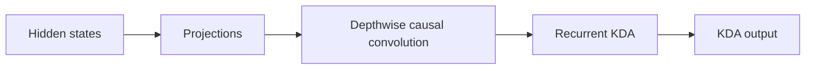
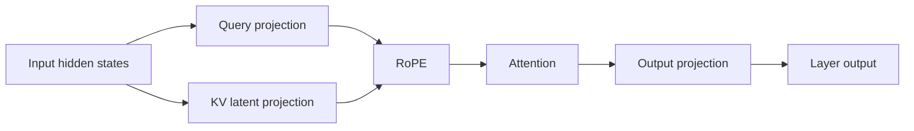
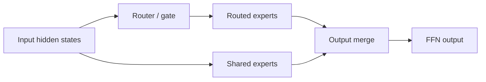
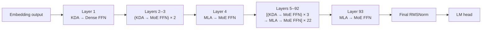

# Understanding Kimi K3: Model Structure and Performance Analysis

> Status: draft. This article first establishes K3's model-level structure.
> Prefill, decode, capacity, memory-access, and compute analysis will follow.

## Notation

| Symbol                                                                                                                  | Definition                         | K3 value or rule                                                   |
| ----------------------------------------------------------------------------------------------------------------------- | ---------------------------------- | ------------------------------------------------------------------ |
| $N_{\mathrm{L}}$                                                                                                      | Total number of decoder layers     | 93                                                                 |
| $N_{\mathrm{KDA}}$                                                                                                    | Number of KDA decoder layers       | 69                                                                 |
| $N_{\mathrm{MLA}}$                                                                                                    | Number of MLA decoder layers       | 24                                                                 |
| $N_{\mathrm{Dense}}$                                                                                                  | Number of dense-FFN decoder layers | 1                                                                  |
| $N_{\mathrm{MoE}}$                                                                                                    | Number of MoE decoder layers       | 92                                                                 |
| $\mathcal{L}_{\mathrm{KDA}}$                                                                                                    | Set of KDA layer indices           | All indices outside $\mathcal{L}_{\mathrm{MLA}}$                         |
| $\mathcal{L}_{\mathrm{MLA}}$                                                                                          | Set of MLA layer indices           | 4, 8, 12, ..., 92, 93 (one-based)                                  |
| $P_{\mathrm{attn}}$                                                                                                   | Attention-layer placement pattern  | Three KDA layers followed by one MLA layer, plus a final MLA layer |
| $P_{\mathrm{ffn}}$                                                                                                    | FFN placement pattern              | Layer 1 is dense; layers 2--93 are MoE                             |
| $W_{\mathrm{total}}$                                                                                                  | Total checkpoint tensor payload    | 1,560.860 GB                                                       |
| $W_c$                                                                                                                 | Weight footprint of component $c$ | Component-dependent                                                |
| $F_{\mathrm{store}}$                                                                                                  | Logical weight storage format      | MXFP4, BF16, or FP32                                               |
| $D_{\mathrm{backing}}$                                                                                                | Safetensors backing tensor dtype   | U8, BF16, or FP32                                                  |

Values are derived from the published [Kimi-K3 configuration](https://huggingface.co/moonshotai/Kimi-K3/blob/main/config.json).

The following identities hold:

$$
\begin{aligned}
N_{\mathrm{KDA}} + N_{\mathrm{MLA}} &= N_{\mathrm{L}}, \\
N_{\mathrm{Dense}} + N_{\mathrm{MoE}} &= N_{\mathrm{L}}.
\end{aligned}
$$

Symbols for batch size, sequence length, cache capacity, state size, and data type will be introduced with the capacity model.

## 1. What Is K3 Made Of?

K3 has three major compute components: Kimi Delta Attention (KDA), Multi-head
Latent Attention (MLA), and the feed-forward network (FFN). KDA and MLA are two
attention mechanisms; every decoder layer also contains a dense or
Mixture-of-Experts (MoE) FFN.

### 1.1 Kimi Delta Attention

KDA is K3's linear-attention component:



At this level, **Projections** covers the input-side projections, gates, and
output projection. Reshaping, normalization, and state-management details are
left to the implementation analysis.

- Each live sequence owns a fixed-size recurrent state.
- State capacity grows with resident sequence count, not historical length.
- Prefill uses chunked recurrence.
- Decode reads, updates, and writes the state at every step.

### 1.2 Multi-head Latent Attention

MLA is K3's full-attention component:



- It stores a per-token KV or latent cache.
- Cache capacity grows with retained context length.
- Prefill exposes substantial token parallelism.
- Decode reads historical cache entries.

### 1.3 Feed-Forward Network

The FFN is either a dense MLP or an MoE block:



- FFN and expert weights account for a large part of model capacity.
- MoE activates only a subset of routed experts per token.
- Compute scales with current tokens and activated experts.
- Expert parallelism adds dispatch, all-to-all, and combine communication.

## 2. How Are KDA, MLA, and FFN Composed?

They are not one fixed `KDA → MLA → FFN` pipeline. KDA and MLA are alternative
attention types in different decoder layers. Each layer connects its selected
attention mechanism to a dense or MoE FFN.



At model level, execution resembles:

```text
Embedding
→ Layer 1: KDA → Dense FFN
→ Layers 2--3: (KDA → MoE FFN) × 2
→ Layer 4: MLA → MoE FFN
→ Layers 5--92: [(KDA → MoE FFN) × 3 → MLA → MoE FFN] × 22
→ Layer 93: MLA → MoE FFN
→ Final RMSNorm → LM head
```

## 3. Weight Footprint Analysis

Weight footprint is the static memory baseline for the later runtime-capacity analysis. The measurements in this section are derived from the safetensors headers under `/mnt/public/Kimi-K3`; no weight tensors need to be loaded. The checkpoint contains 1,560.860 GB (1.419 TiB) of tensor payload.

### 3.1 Overall Weight Composition

Use a horizontal stacked bar to show the fraction of the complete checkpoint assigned to each model component.

<iframe
  src="../../assets/k3-weight-footprint.html"
  title="Interactive K3 weight-footprint analysis"
  width="100%"
  height="720"
  loading="lazy"
  style="border: 0; border-radius: 12px;">
</iframe>

!!! important "Routed experts dominate total weight capacity"

    Routed experts account for **92.67%**, or **1.446 TB**, of the stored
    checkpoint tensor payload. Expert parallelism is therefore the primary
    mechanism for making the model weights fit across devices.

!!! warning "KDA and MLA weights are still a substantial replicated floor"

    KDA and MLA together occupy **72.403 GB**: **61.258 GB** for KDA and
    **11.145 GB** for MLA. EP partitions routed experts, but it does not by
    itself partition these attention weights. With DP+EP and no attention TP,
    approximately **72.4 GB** of attention weights remains replicated per
    rank, before embeddings, dense/shared FFNs, caches, and runtime workspaces
    are included.

### 3.2 Weight Storage Format and Backing Dtype

Use a fourth horizontal stacked bar to show the checkpoint payload by logical weight format. The backing tensor dtype should be shown as a secondary annotation, not as the primary category.

| Logical format | Backing dtype | Footprint (GB) |   Share | Interpretation                                                          |
| -------------- | ------------- | -------------: | ------: | ----------------------------------------------------------------------- |
| MXFP4          | U8            |      1,446.456 | 92.670% | Packed routed-expert weights and associated quantization metadata       |
| BF16           | BF16          |        114.360 |  7.327% | Attention, shared/dense FFN, embeddings, and other uncompressed weights |
| FP32           | FP32          |          0.044 |  0.003% | Biases and selected numerical parameters                                |

The U8 tensors contain packed MXFP4 expert weights and quantization metadata; they are not INT8 weights, and the checkpoint contains no FP8 tensors. These values describe checkpoint storage, while per-rank runtime memory depends on sharding and backend weight preparation.

## 4. Cache Capacity: Latent Cache and SSM Slots

K3 has two persistent cache families with different capacity laws. Let $N_T$
denote the number of cached tokens and $N_S$ the number of allocated sequence
slots.

| Cache tensor | Logical shape | Storage dtype | Whole-model capacity |
| --- | --- | --- | ---: |
| MLA latent cache | $[N_T, 512+64]$ | Mixed FP8 and BF16 | 15.744 KB/token |
| KDA convolution state | $[N_S, 36864, 4]$ | BF16 | 20.349 MB/slot |
| KDA recurrent state | $[N_S, 96, 128, 128]$ | BF16 | 217.055 MB/slot |

The FP8 MLA layout stores 512 bytes of compressed latent, 16 bytes of FP32
scales, and 128 bytes of BF16 K-RoPE per token per layer. Across K3, total
persistent cache capacity is

$$
C_{\mathrm{cache}}
= 15.744\,\mathrm{KB} \times N_T
+ 237.404\,\mathrm{MB} \times N_S.
$$

## 5. Activation Capacity Analysis

Activations are transient tensors created while a batch moves through one
decoder layer. Unlike weights and persistent caches, most activation buffers
can be reused after the layer completes, so capacity is determined by peak
liveness rather than by summing all 93 layers. This chapter will separately
model Prefill activation peaks as a function of active token count and Decode
activation peaks as a function of batch size, then account for KDA/MLA
projection buffers, MoE routing and dispatch buffers, collective communication,
and backend workspaces.

## 6. Partitioning: Weights, Latent Cache, SSM Slots, and Activations

This chapter maps the capacity results onto a distributed deployment. It will
show how TP, EP, and DP affect routed and non-routed weights, whether the MLA
Latent Cache and KDA SSM Slots are sharded or replicated, and how much memory
remains per rank for active requests. The result will be a per-rank capacity
model that connects the static checkpoint footprint to feasible batch size and
context length before the Prefill and Decode performance analysis.

## 7. Prefill Analysis

To be written after the target checkpoint configuration is confirmed.

## 8. Decode Analysis

To be written after the target checkpoint configuration is confirmed.
