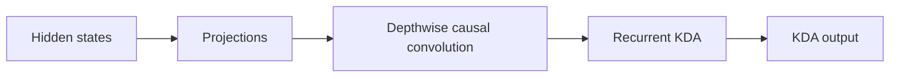
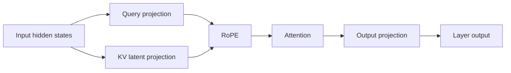
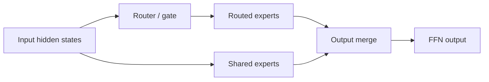
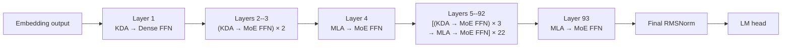

# Understanding Kimi K3: Model Structure and Performance Analysis

> Status: draft. This article first establishes K3's model-level structure.
> Prefill, decode, capacity, memory-access, and compute analysis will follow.

## Notation

| Symbol                                                                                                                  | Definition                         | K3 value or rule                                                   |
| ----------------------------------------------------------------------------------------------------------------------- | ---------------------------------- | ------------------------------------------------------------------ |
| $N_{\mathrm{L}}$                                                                                                      | Total number of decoder layers     | 93                                                                 |
| $N_{\mathrm{KDA}}$                                                                                                    | Number of KDA decoder layers       | 69                                                                 |
| $N_{\mathrm{MLA}}$                                                                                                    | Number of MLA decoder layers       | 24                                                                 |
| $N_{\mathrm{Dense}}$                                                                                                  | Number of dense-FFN decoder layers | 1                                                                  |
| $N_{\mathrm{MoE}}$                                                                                                    | Number of MoE decoder layers       | 92                                                                 |
| $\mathcal{L}_{\mathrm{KDA}}$                                                                                                    | Set of KDA layer indices           | All indices outside $\mathcal{L}_{\mathrm{MLA}}$                         |
| $\mathcal{L}_{\mathrm{MLA}}$                                                                                          | Set of MLA layer indices           | 4, 8, 12, ..., 92, 93 (one-based)                                  |
| $P_{\mathrm{attn}}$                                                                                                   | Attention-layer placement pattern  | Three KDA layers followed by one MLA layer, plus a final MLA layer |
| $P_{\mathrm{ffn}}$                                                                                                    | FFN placement pattern              | Layer 1 is dense; layers 2--93 are MoE                             |
| $W_{\mathrm{total}}$                                                                                                  | Total checkpoint tensor payload    | 1,560.860 GB                                                       |
| $W_c$                                                                                                                 | Weight footprint of component $c$ | Component-dependent                                                |
| $F_{\mathrm{store}}$                                                                                                  | Logical weight storage format      | MXFP4, BF16, or FP32                                               |
| $D_{\mathrm{backing}}$                                                                                                | Safetensors backing tensor dtype   | U8, BF16, or FP32                                                  |

Values are derived from the published [Kimi-K3 configuration](https://huggingface.co/moonshotai/Kimi-K3/blob/main/config.json).

The following identities hold:

$$
\begin{aligned}
N_{\mathrm{KDA}} + N_{\mathrm{MLA}} &= N_{\mathrm{L}}, \\
N_{\mathrm{Dense}} + N_{\mathrm{MoE}} &= N_{\mathrm{L}}.
\end{aligned}
$$

Symbols for batch size, sequence length, cache capacity, state size, and data type will be introduced with the capacity model.

## 1. What Is K3 Made Of?

K3 has three major compute components: Kimi Delta Attention (KDA), Multi-head
Latent Attention (MLA), and the feed-forward network (FFN). KDA and MLA are two
attention mechanisms; every decoder layer also contains a dense or
Mixture-of-Experts (MoE) FFN.

### 1.1 Kimi Delta Attention

KDA is K3's linear-attention component:



At this level, **Projections** covers the input-side projections, gates, and
output projection. Reshaping, normalization, and state-management details are
left to the implementation analysis.

- Each live sequence owns a fixed-size recurrent state.
- State capacity grows with resident sequence count, not historical length.
- Prefill uses chunked recurrence.
- Decode reads, updates, and writes the state at every step.

### 1.2 Multi-head Latent Attention

MLA is K3's full-attention component:



- It stores a per-token KV or latent cache.
- Cache capacity grows with retained context length.
- Prefill exposes substantial token parallelism.
- Decode reads historical cache entries.

### 1.3 Feed-Forward Network

The FFN is either a dense MLP or an MoE block:



- FFN and expert weights account for a large part of model capacity.
- MoE activates only a subset of routed experts per token.
- Compute scales with current tokens and activated experts.
- Expert parallelism adds dispatch, all-to-all, and combine communication.

## 2. How Are KDA, MLA, and FFN Composed?

They are not one fixed `KDA → MLA → FFN` pipeline. KDA and MLA are alternative
attention types in different decoder layers. Each layer connects its selected
attention mechanism to a dense or MoE FFN.



At model level, execution resembles:

```text
Embedding
→ Layer 1: KDA → Dense FFN
→ Layers 2--3: (KDA → MoE FFN) × 2
→ Layer 4: MLA → MoE FFN
→ Layers 5--92: [(KDA → MoE FFN) × 3 → MLA → MoE FFN] × 22
→ Layer 93: MLA → MoE FFN
→ Final RMSNorm → LM head
```

## 3. Weight Footprint Analysis

Weight footprint is the static memory baseline for the later runtime-capacity analysis. The measurements in this section are derived from the safetensors headers under `/mnt/public/Kimi-K3`; no weight tensors need to be loaded. The checkpoint contains 1,560.860 GB (1.419 TiB) of tensor payload.

### 3.1 Overall Weight Composition

Use a horizontal stacked bar to show the fraction of the complete checkpoint assigned to each model component.

<iframe
  src="../../assets/k3-weight-footprint.html"
  title="Interactive K3 weight-footprint analysis"
  width="100%"
  height="720"
  loading="lazy"
  style="border: 0; border-radius: 12px;">
</iframe>

!!! important "Routed experts dominate total weight capacity"

    Routed experts account for **92.67%**, or **1.446 TB**, of the stored
    checkpoint tensor payload. Expert parallelism is therefore the primary
    mechanism for making the model weights fit across devices.

!!! warning "KDA and MLA weights are still a substantial replicated floor"

    KDA and MLA together occupy **72.403 GB**: **61.258 GB** for KDA and
    **11.145 GB** for MLA. EP partitions routed experts, but it does not by
    itself partition these attention weights. With DP+EP and no attention TP,
    approximately **72.4 GB** of attention weights remains replicated per
    rank, before embeddings, dense/shared FFNs, caches, and runtime workspaces
    are included.

### 3.2 Weight Storage Format and Backing Dtype

Use a fourth horizontal stacked bar to show the checkpoint payload by logical weight format. The backing tensor dtype should be shown as a secondary annotation, not as the primary category.

| Logical format | Backing dtype | Footprint (GB) |   Share | Interpretation                                                          |
| -------------- | ------------- | -------------: | ------: | ----------------------------------------------------------------------- |
| MXFP4          | U8            |      1,446.456 | 92.670% | Packed routed-expert weights and associated quantization metadata       |
| BF16           | BF16          |        114.360 |  7.327% | Attention, shared/dense FFN, embeddings, and other uncompressed weights |
| FP32           | FP32          |          0.044 |  0.003% | Biases and selected numerical parameters                                |

The U8 tensors contain packed MXFP4 expert weights and quantization metadata; they are not INT8 weights, and the checkpoint contains no FP8 tensors. These values describe checkpoint storage, while per-rank runtime memory depends on sharding and backend weight preparation.

## 4. Cache Capacity: Latent Cache and SSM Slots

K3 has two persistent cache families with different capacity laws. Let $N_T$
denote the number of cached tokens and $N_S$ the number of allocated sequence
slots.

| Cache tensor | Logical shape | Storage dtype | Whole-model capacity |
| --- | --- | --- | ---: |
| MLA latent cache | $[N_T, 512+64]$ | Mixed FP8 and BF16 | 15.744 KB/token |
| KDA convolution state | $[N_S, 36864, 4]$ | BF16 | 20.349 MB/slot |
| KDA recurrent state | $[N_S, 96, 128, 128]$ | BF16 | 217.055 MB/slot |

The FP8 MLA layout stores 512 bytes of compressed latent, 16 bytes of FP32
scales, and 128 bytes of BF16 K-RoPE per token per layer. Across K3, total
persistent cache capacity is

$$
C_{\mathrm{cache}}
= 15.744\,\mathrm{KB} \times N_T
+ 237.404\,\mathrm{MB} \times N_S.
$$

## 5. Activation Capacity Analysis

Activations are transient tensors created while a batch moves through one
decoder layer. Unlike weights and persistent caches, most activation buffers
can be reused after the layer completes, so capacity is determined by peak
liveness rather than by summing all 93 layers. The primary experiment therefore
measures the incremental peak GPU memory of one component and one complete
decoder layer. Prefill is the main focus because many active tokens coexist in
one forward pass; Decode is retained as a smaller batch-size comparison.

### 5.1 Measurement Scope

Let $B$ be the number of sequences, $L$ the active length per sequence, and
$N_A=B\times L$ the number of active tokens in the measured forward pass. For
Decode, $L=1$ and therefore $N_A=B$.

The activation peak excludes weights, persistent caches, and input tensors that
already exist before the measured region. For each target, report

$$
C_{\mathrm{activation}}^{\mathrm{peak}}
=C_{\mathrm{peak\ allocated}}-C_{\mathrm{baseline}}.
$$

`allocated` memory is the primary metric. `reserved` memory is recorded
separately to expose allocator behavior but is not treated as tensor capacity.
All experiments use inference mode and exclude backward activations.

The first measurement uses one NVIDIA B300 SXM6 GPU with BF16 activations. A
synthetic **1,048,576-token resident context** is allocated before the baseline,
and the largest Prefill chunk contains **16,384 active tokens**. KDA receives a
synthetic BF16 convolution state and recurrent state. MLA receives a synthetic
mixed FP8/BF16 latent cache with the layout from Chapter 4. These persistent
tensors are deliberately excluded from the incremental activation peak.

The component sweep includes a fresh-only MLA control in which the 16K queries
attend the 16K fresh tokens. A separate cached-prefix experiment executes the
target scenario: 1,032,192 cached prefix tokens plus 16,384 fresh tokens, for a
total context of 1,048,576. The current MoE point uses the single-GPU BF16 reference
expert implementation with K3's 896 experts, Top-16 routing, latent width 3584,
and intermediate width 3072. It preserves the activation shapes but is not the
production MXFP4 MegaMoE kernel; distributed MegaMoE is deferred to the
partitioning analysis.

### 5.2 Component-Level Experiments

Measure the three dominant compute components independently before composing
them into decoder layers.

| Target | Measurement boundary | Main transient tensors to inspect |
| --- | --- | --- |
| KDA | KDA input to KDA output | Projections, causal-convolution intermediates, recurrence workspace, and output |
| MLA | MLA input to MLA output | Query/KV projections, attention output, and attention-kernel workspace |
| MoE | MoE input to merged output | Routing logits, Top-K metadata, token permutation, dispatched expert inputs, grouped-GEMM intermediates, and combine buffers |

The first plot compares incremental peak memory against active-token count for
KDA, MLA, and MoE. A second, normalized view reports bytes per active token to
show whether each component has a stable linear slope or develops additional
sequence-length-dependent workspace.


At the 16K-token maximum, the measured operator-core peaks are:

| Operator core | Incremental peak | Peak per active token |
| --- | ---: | ---: |
| KDA recurrence | 4.125 GiB | 264.00 KiB/token |
| MLA Prefill attention | 0.375 GiB | 24.00 KiB/token |
| Local BF16 routed experts | 15.176 GiB | 971.24 KiB/token |

All three curves are approximately linear over the measured range. At a fixed
16K active-token total, KDA and MLA produced the same peak for $1\times16384$,
$4\times4096$, $16\times1024$, and $32\times512$. For these two operator cores
on this backend, active-token count determined the observed allocation peak;
the tested batch/sequence decomposition did not.

!!! warning "These are operator-core peaks, not complete-component peaks"

    Projection layers, normalization, residual buffers, KDA convolution, MLA
    cache gathering, the MoE router and latent projections, and complete-layer
    buffer reuse are not yet included in the plotted values. The chart is an
    initial measurement of the dominant kernels, not yet the final decoder-layer
    capacity model.

#### 5.2.1 MLA With a 1M-Token Cached Prefix

The cached-prefix run follows the allocation path used by K3's non-absorbed MLA
Prefill implementation. It restores the packed mixed FP8/BF16 latent cache to
BF16, expands the latent representation into 96-head K/V tensors, joins the
cached and fresh tensors, and finally executes 16K queries against the complete
1M-token history.


| Completed stage | Live incremental memory | Peak so far |
| --- | ---: | ---: |
| Restore cached latent rows | 1.107 GiB | 3.938 GiB |
| Expand cached K/V | 83.803 GiB | 83.803 GiB |
| Join cached and fresh K/V | 145.115 GiB | 145.115 GiB |
| FlashAttention | 145.490 GiB | 145.490 GiB |

The decisive cost is not the FlashAttention workspace. FlashAttention adds an
output of approximately 0.375 GiB, while K/V expansion and concatenation create
the 145.49 GiB peak. The implementation simultaneously retains the restored
latent rows, expanded cached K/V, expanded fresh K/V, and joined attention
inputs. Consequently, cached-prefix MLA—not KDA recurrence—is the dominant
activation-capacity risk in this 1M-context, 16K-chunk setting.

Keeping the fresh chunk fixed at 16K and increasing total context gives the
following curve:


The unsplit implementation grows almost linearly with total context even though
the fresh-token count is fixed. This is a consequence of materializing expanded
K/V for the entire cached prefix, not of an attention-score matrix.

#### 5.2.2 How SGLang Bounds the Prefix-Expansion Peak

SGLang's relevant mechanism is **chunked prefix cache**, represented by fields
such as `prefix_chunk_len` and `prefix_chunk_idx`. It divides a long cached
prefix into bounded chunks. For every chunk, SGLang fetches only that chunk's
latent rows, expands its K/V, runs attention between the fixed query chunk and
the current prefix chunk, and then merges the partial output and log-sum-exp
state with an online-softmax merge. Temporary expanded K/V can therefore be
released before the next prefix chunk.

Conceptually, the unsplit peak scales as

$$
C_{\mathrm{unsplit}}=O(L_{\mathrm{context}}\,N_H(D_K+D_V)),
$$

whereas chunked-prefix expansion changes the transient term to

$$
C_{\mathrm{split}}=O(L_{\mathrm{prefix\ chunk}}\,N_H(D_K+D_V))
+O(L_{\mathrm{fresh}}N_HD_V).
$$

This does not reduce the persistent Latent Cache or the total attention work;
it bounds peak temporary memory by trading one large expansion for multiple
sequential attention calls and state merges.

This mechanism is distinct from FlashAttention/FlashMLA `num_splits`, which
partitions KV work among kernel work units and combines partial reductions for
occupancy and scheduling. `num_splits` alone does not remove a framework-level
full-context K/V expansion that has already happened before the attention call.

#### 5.2.3 Implemented Prefix-Chunk Trade-off

NanoDeploy now applies this path when the MLA cache uses the packed FP8 layout.
`DLENGINE_MLA_PREFIX_CHUNK_SIZE` controls the cached-prefix chunk and defaults
to **131,072 tokens**; setting it to `0` restores the previous unsplit path. The
setting is explicitly forwarded from the driver to Ray model workers. BF16 MLA
cache behavior is unchanged because it does not use this FP8 restore path.

The experiment below fixes total context at 1,048,576 tokens and the fresh
Prefill chunk at 16,384 tokens. It includes packed-cache restoration, K/V
expansion, attention, and online output/LSE merge. Each point performs one
unreported warm-up iteration, followed by one CUDA-event-timed steady forward.
The bars report incremental allocated-memory peak and the line reports latency.


At the 128K default, peak memory falls from **144.17 GiB to 17.39 GiB** (an
**87.9% reduction**) while measured latency is **687 ms versus 706 ms** for the
unsplit path. Smaller chunks reduce capacity further but increase launch and
merge overhead: 16K reaches 5.85 GiB at 834 ms. The 256K point is fastest in
this single run at 672 ms but needs 32.53 GiB. Therefore 128K is a capacity-first
default with near-unsplit throughput rather than the latency-minimum setting.

!!! note "Interpretation boundary"

    The cache contents and projection weights are synthetic, but tensor shapes,
    dtypes, restore routine, expansion operations, and FlashAttention call match
    the K3 code path. This is a single-layer allocation experiment; it excludes
    weights, persistent-cache payload, and surrounding decoder-layer buffers.

### 5.3 Complete-Layer Experiments

Component peaks cannot be added directly because their lifetimes do not fully
overlap and implementations may reuse buffers. Measure the three decoder-layer
forms that actually occur in K3:

| Decoder-layer form | K3 placement |
| --- | --- |
| KDA + Dense FFN | Layer 1 |
| KDA + MoE FFN | KDA layers after Layer 1 |
| MLA + MoE FFN | MLA layers |

The layer-level peak is the deployment-relevant result. Comparing it with the
component measurements reveals how much memory is saved through buffer reuse
and kernel fusion.

### 5.4 Prefill Experiment Matrix

Sweep active-token count over $128$, $256$, $512$, $1024$, $2048$, $4096$,
and $8192$. At representative totals, keep $N_A$ fixed while changing the
batch/sequence decomposition, for example $1\times4096$, $4\times1024$,
$16\times256$, and $32\times128$.

This distinction matters because equal token counts need not produce equal
peaks: MLA workspace can depend on sequence geometry, KDA uses chunked
recurrence, and MoE temporary storage depends on the distribution of token-to-
expert assignments. Report both $(B,L)$ and $N_A$ for every point.

### 5.5 Decode Comparison

Run the same component and complete-layer measurements with $L=1$ and sweep
$B$ over $1$, $8$, $16$, $32$, $64$, $128$, $256$, and $512$. This experiment
is a comparison rather than the center of the chapter: Decode activation grows
with the current batch, while its broader capacity limit also includes the
persistent caches analyzed in Chapter 4.

### 5.6 Remaining Figures and Conclusions

The operator-core figure above is the first result. The remaining work is:

1. **Complete-component peak:** include projections, normalization, routing,
   shared experts, and other materialized buffers around each measured core.
2. **Complete-layer peak:** KDA + Dense FFN, KDA + MoE FFN, and MLA + MoE FFN
   versus active tokens during Prefill.
3. **Prefill/Decode comparison:** normalized peak memory per active token, with
   sequence geometry shown explicitly.

The measurements should establish which component controls the transient-memory
ceiling, whether peak memory is approximately linear in active tokens, how much
sequence geometry changes that peak, and how accurately isolated component
measurements predict the peak of a complete decoder layer.

## 6. Parallel Partitioning: Per-Rank Capacity and Communication Volume

This chapter maps the model-level capacity results onto a concrete distributed
deployment. Partitioning changes both sides of the system budget: it reduces
the weights, caches, slots, and activations resident on each rank, while adding
communication at the boundaries between KDA, MLA, and MoE execution.

### 6.1 Parallel Configuration and Tensor Ownership

Define the DP, attention-TP, FFN-EP, FFN-TP, and PP dimensions before applying
any capacity formula. For each K3 component, identify which tensors are
sharded, which are replicated, and which rank owns the associated runtime
state. This establishes the placement model used by both the memory and
communication calculations.

### 6.2 Per-Rank Capacity

Apply the placement model to the four capacity families established in the
preceding chapters: weights, MLA Latent Cache, KDA SSM Slots, and transient
activations. Report each contribution separately and then derive the total
per-rank footprint, rather than dividing the whole-model footprint by a single
parallelism factor.

### 6.3 Communication at Component Boundaries

Trace one complete KDA + MoE layer and one MLA + MoE layer. At every transition,
record the collective operation, participating group, logical tensor shape,
communication dtype, and bytes transferred. The analysis should include the
attention-to-FFN transition, MoE token dispatch and combine, FFN-to-attention
transition, and any reductions required by row-parallel projections.

### 6.4 Prefill and Decode Communication Volume

Express communication volume as a function of active tokens and parallel group
size. Prefill uses $N_A=\sum_i L_i$, whereas Decode uses $N_A=B$. Separate
payload volume from collective latency: equal bytes can behave differently for
large Prefill tensors and many small Decode transfers.

### 6.5 Joint Capacity and Communication Constraints

Combine the per-rank capacity model with the communication model to evaluate a
parallel configuration. The final result should show how much memory remains
for active requests, which collective dominates each layer type, and where
additional partitioning saves capacity at the cost of more communication. This
provides the deployment setting used by the subsequent Prefill and Decode
performance analysis.

## 7. Prefill Analysis

To be written after the target checkpoint configuration is confirmed.

## 8. Decode Analysis

To be written after the target checkpoint configuration is confirmed.
