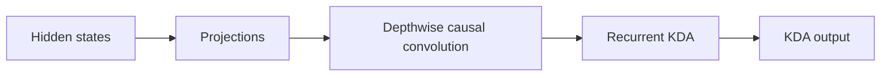
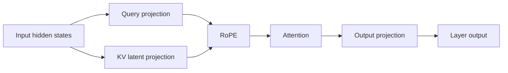
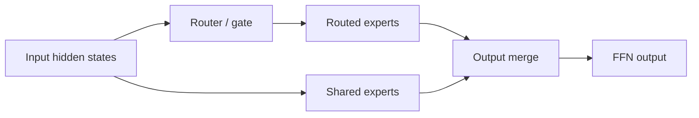
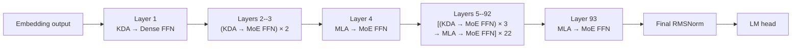

# Understanding Kimi K3: Model Structure and Performance Analysis

> Status: draft. This article first establishes K3's model-level structure.
> Prefill, decode, capacity, memory-access, and compute analysis will follow.

## Notation

| Symbol                                                                                                                  | Definition                         | K3 value or rule                                                   |
| ----------------------------------------------------------------------------------------------------------------------- | ---------------------------------- | ------------------------------------------------------------------ |
| $N_{\mathrm{L}}$                                                                                                      | Total number of decoder layers     | 93                                                                 |
| $N_{\mathrm{KDA}}$                                                                                                    | Number of KDA decoder layers       | 69                                                                 |
| $N_{\mathrm{MLA}}$                                                                                                    | Number of MLA decoder layers       | 24                                                                 |
| $N_{\mathrm{Dense}}$                                                                                                  | Number of dense-FFN decoder layers | 1                                                                  |
| $N_{\mathrm{MoE}}$                                                                                                    | Number of MoE decoder layers       | 92                                                                 |
| $\mathcal{L}_{\mathrm{KDA}}$                                                                                                    | Set of KDA layer indices           | All indices outside $\mathcal{L}_{\mathrm{MLA}}$                         |
| $\mathcal{L}_{\mathrm{MLA}}$                                                                                          | Set of MLA layer indices           | 4, 8, 12, ..., 92, 93 (one-based)                                  |
| $P_{\mathrm{attn}}$                                                                                                   | Attention-layer placement pattern  | Three KDA layers followed by one MLA layer, plus a final MLA layer |
| $P_{\mathrm{ffn}}$                                                                                                    | FFN placement pattern              | Layer 1 is dense; layers 2--93 are MoE                             |
| $W_{\mathrm{total}}$                                                                                                  | Total checkpoint tensor payload    | 1,560.860 GB                                                       |
| $W_c$                                                                                                                 | Weight footprint of component $c$ | Component-dependent                                                |
| $F_{\mathrm{store}}$                                                                                                  | Logical weight storage format      | MXFP4, BF16, or FP32                                               |
| $D_{\mathrm{backing}}$                                                                                                | Safetensors backing tensor dtype   | U8, BF16, or FP32                                                  |

Values are derived from the published [Kimi-K3 configuration](https://huggingface.co/moonshotai/Kimi-K3/blob/main/config.json).

The following identities hold:

$$
\begin{aligned}
N_{\mathrm{KDA}} + N_{\mathrm{MLA}} &= N_{\mathrm{L}}, \\
N_{\mathrm{Dense}} + N_{\mathrm{MoE}} &= N_{\mathrm{L}}.
\end{aligned}
$$

Symbols for batch size, sequence length, cache capacity, state size, and data type will be introduced with the capacity model.

## 1. What Is K3 Made Of?

K3 has three major compute components: Kimi Delta Attention (KDA), Multi-head
Latent Attention (MLA), and the feed-forward network (FFN). KDA and MLA are two
attention mechanisms; every decoder layer also contains a dense or
Mixture-of-Experts (MoE) FFN.

### 1.1 Kimi Delta Attention

KDA is K3's linear-attention component:



At this level, **Projections** covers the input-side projections, gates, and
output projection. Reshaping, normalization, and state-management details are
left to the implementation analysis.

- Each live sequence owns a fixed-size recurrent state.
- State capacity grows with resident sequence count, not historical length.
- Prefill uses chunked recurrence.
- Decode reads, updates, and writes the state at every step.

### 1.2 Multi-head Latent Attention

MLA is K3's full-attention component:



- It stores a per-token KV or latent cache.
- Cache capacity grows with retained context length.
- Prefill exposes substantial token parallelism.
- Decode reads historical cache entries.

### 1.3 Feed-Forward Network

The FFN is either a dense MLP or an MoE block:



- FFN and expert weights account for a large part of model capacity.
- MoE activates only a subset of routed experts per token.
- Compute scales with current tokens and activated experts.
- Expert parallelism adds dispatch, all-to-all, and combine communication.

## 2. How Are KDA, MLA, and FFN Composed?

They are not one fixed `KDA → MLA → FFN` pipeline. KDA and MLA are alternative
attention types in different decoder layers. Each layer connects its selected
attention mechanism to a dense or MoE FFN.



At model level, execution resembles:

```text
Embedding
→ Layer 1: KDA → Dense FFN
→ Layers 2--3: (KDA → MoE FFN) × 2
→ Layer 4: MLA → MoE FFN
→ Layers 5--92: [(KDA → MoE FFN) × 3 → MLA → MoE FFN] × 22
→ Layer 93: MLA → MoE FFN
→ Final RMSNorm → LM head
```

## 3. Weight Footprint Analysis

Weight footprint is the static memory baseline for the later runtime-capacity analysis. The measurements in this section are derived from the safetensors headers under `/mnt/public/Kimi-K3`; no weight tensors need to be loaded. The checkpoint contains 1,560.860 GB (1.419 TiB) of tensor payload.

### 3.1 Overall Weight Composition

Use a horizontal stacked bar to show the fraction of the complete checkpoint assigned to each model component.

<iframe
  src="../../assets/k3-weight-footprint.html"
  title="Interactive K3 weight-footprint analysis"
  width="100%"
  height="720"
  loading="lazy"
  style="border: 0; border-radius: 12px;">
</iframe>

!!! important "Routed experts dominate total weight capacity"

    Routed experts account for **92.67%**, or **1.446 TB**, of the stored
    checkpoint tensor payload. Expert parallelism is therefore the primary
    mechanism for making the model weights fit across devices.

!!! warning "KDA and MLA weights are still a substantial replicated floor"

    KDA and MLA together occupy **72.403 GB**: **61.258 GB** for KDA and
    **11.145 GB** for MLA. EP partitions routed experts, but it does not by
    itself partition these attention weights. With DP+EP and no attention TP,
    approximately **72.4 GB** of attention weights remains replicated per
    rank, before embeddings, dense/shared FFNs, caches, and runtime workspaces
    are included.

### 3.2 Weight Storage Format and Backing Dtype

Use a fourth horizontal stacked bar to show the checkpoint payload by logical weight format. The backing tensor dtype should be shown as a secondary annotation, not as the primary category.

| Logical format | Backing dtype | Footprint (GB) |   Share | Interpretation                                                          |
| -------------- | ------------- | -------------: | ------: | ----------------------------------------------------------------------- |
| MXFP4          | U8            |      1,446.456 | 92.670% | Packed routed-expert weights and associated quantization metadata       |
| BF16           | BF16          |        114.360 |  7.327% | Attention, shared/dense FFN, embeddings, and other uncompressed weights |
| FP32           | FP32          |          0.044 |  0.003% | Biases and selected numerical parameters                                |

The U8 tensors contain packed MXFP4 expert weights and quantization metadata; they are not INT8 weights, and the checkpoint contains no FP8 tensors. These values describe checkpoint storage, while per-rank runtime memory depends on sharding and backend weight preparation.

## 4. Cache Capacity: Latent Cache and SSM Slots

K3 has two persistent cache families with different capacity laws. Let $N_T$
denote the number of cached tokens and $N_S$ the number of allocated sequence
slots.

| Cache tensor | Logical shape | Storage dtype | Whole-model capacity |
| --- | --- | --- | ---: |
| MLA latent cache | $[N_T,512+64]$ | Mixed FP8/BF16 | 15.744 KB/token |
| KDA convolution state | $[N_S,36864,4]$ | BF16 | 20.349 MB/slot |
| KDA recurrent state | $[N_S,96,128,128]$ | BF16 | 217.055 MB/slot |

Each MLA layer uses 656 bytes per token: FP8 latent values and scales plus a
BF16 RoPE component. Across 24 MLA and 69 KDA layers,

$$
C_{\mathrm{cache}}
=15.744\,\mathrm{KB}\times N_T
+237.404\,\mathrm{MB}\times N_S.
$$

At one million resident tokens this is 15.375 GiB of MLA cache. The MLA latent is replicated across attention-TP ranks because all
query-head shards consume it; KDA states are head-sharded by attention TP.

## 5. Activation Capacity Analysis

Activations are transient tensors created while a batch moves through one
decoder layer. Unlike weights and persistent caches, most activation buffers
can be reused after the layer completes, so capacity is determined by peak
liveness rather than by summing all 93 layers. The primary experiment therefore
measures the incremental peak GPU memory of one component and one complete
decoder layer. Prefill is the main focus because many active tokens coexist in
one forward pass; Decode is retained as a smaller batch-size comparison.

### 5.1 Measurement Scope

Let $B$ be the number of sequences, $L$ the active length per sequence, and
$N_A=B\times L$ the number of active tokens in the measured forward pass. For
Decode, $L=1$ and therefore $N_A=B$.

The activation peak excludes weights, persistent caches, and input tensors that
already exist before the measured region. For each target, report

$$
C_{\mathrm{activation}}^{\mathrm{peak}}
=C_{\mathrm{peak\ allocated}}-C_{\mathrm{baseline}}.
$$

`allocated` memory is the primary metric. `reserved` memory is recorded
separately to expose allocator behavior but is not treated as tensor capacity.
All experiments use inference mode and exclude backward activations.

### 5.2 Component-Level Experiments

Measure the three dominant compute components independently before composing
them into decoder layers.

??? note "Experimental setup"

    Measurements use one NVIDIA B300 SXM6, BF16 activations, and a maximum 16K
    Prefill chunk. Persistent synthetic KDA state and MLA cache are allocated
    before the activation baseline. MLA includes fresh-only and 1008K cached +
    16K fresh cases. MoE includes the local BF16 reference and a NanoDeploy MegaMoE with a supported
    world-size-one EP group; distributed EP is deferred to the
    partitioning analysis.

| Target | Measurement boundary | Main transient tensors to inspect |
| --- | --- | --- |
| KDA | KDA input to KDA output | Projections, causal-convolution intermediates, recurrence workspace, and output |
| MLA | MLA input to MLA output | Query/KV projections, attention output, and attention-kernel workspace |
| MoE | MoE input to merged output | Routing logits, Top-K metadata, token permutation, dispatched expert inputs, grouped-GEMM intermediates, and combine buffers |

The first plot compares incremental peak memory against active-token count for
KDA, MLA, and MoE. A second, normalized view reports bytes per active token to
show whether each component has a stable linear slope or develops additional
sequence-length-dependent workspace.


At the 16K-token maximum, the measured operator-core peaks are:

| Operator core | Incremental peak | Peak per active token |
| --- | ---: | ---: |
| KDA recurrence | 4.125 GiB | 264.00 KiB/token |
| MLA Prefill attention | 0.375 GiB | 24.00 KiB/token |
| Local BF16 routed experts | 7.010 GiB | 448.65 KiB/token |

The local MoE reference explicitly materializes Top-16 token copies with shape
$[N_A,16,3584]$. One such BF16 buffer is 1.75 GiB at 16K tokens, and roughly
four buffers of that scale overlap at the measured peak. This is a property of
the portable reference implementation, not a production MegaMoE workspace
estimate. An earlier run accidentally retained autograd state and reported
15.176 GiB; the corrected measurement uses `torch.inference_mode()`.

#### World-Size-One MegaMoE

NanoDeploy now accepts `ffn_ep=1` in `MegaMoEExperts` and uses the initialized WORLD process group when no explicit EP group is supplied. The benchmark executes that production wrapper with K3's 896 experts, Top-16 routing, a 3584-to-3072 expert shape, packed MXFP4 weights, and SiTU activation.


MegaMoE allocates one persistent symmetric buffer on first use and reuses it across forwards and decoder layers. For configured capacity `T`, DeepGEMM first aligns the per-rank token capacity to `Ta = 384 ceil(T/384)`. With `R` ranks, `E` experts, and Top-K `K`, the shared expert-token pool is sized as `P = 384 ceil((R Ta min(K, E/R) + (E/R) 191)/384)`. The extra 191-token allowance per local expert covers the largest supported 192-row GEMM tile before final alignment.

The buffer then lays out persistent input, scale, Top-K metadata, expert-token pools, and kernel synchronization metadata. For K3 at `R=1`, `E=896`, `K=16`, `H=3584`, `I=3072`, and `T=16384`, alignment gives `Ta=16512` and `P=435456`. The principal views are `x [Ta,H]` FP8, `x_sf [Ta,H/128]` INT32, Top-K indices and weights `[Ta,K]`, `l1_acts [P,H]` FP8, `l1_acts_sf [16P,H/128]` INT32, `l2_acts [P,I]` FP8, and `l2_acts_sf [16P,I/128]` INT32. DeepGEMM's authoritative layout function sums these views plus barriers, counters, source metadata, and alignment padding. It reports **5.935 GiB logical bytes**; the measured CUDA free-memory delta is **5.939 GiB**. This allocation is outside PyTorch's CUDA allocator and is not multiplied by K3's 92 MoE layers. After allocation, both the
first and warmed forward add exactly 7,168 bytes per token—the BF16
$[N_A,3584]$ output—giving **0.109 GiB at 16K**. The combined workspace plus
forward increment is 6.048 GiB, versus 7.010 GiB dynamically allocated by the
BF16 reference.

The 16K steady kernel latency is 12.56 ms on one B300. With `ffn_ep=1`, this is a supported local MegaMoE path and has no inter-rank EP traffic. It isolates the kernel's capacity behavior from partitioning costs. The key distinction is that MegaMoE
moves most Top-16 temporary storage into a fixed, reusable workspace instead of
allocating several token-expanded tensors during every forward.

All three curves are approximately linear over the measured range. At a fixed
16K active-token total, KDA and MLA produced the same peak for $1\times16384$,
$4\times4096$, $16\times1024$, and $32\times512$. For these two operator cores
on this backend, active-token count determined the observed allocation peak;
the tested batch/sequence decomposition did not.

!!! warning "These are operator-core peaks, not complete-component peaks"

    Projection layers, normalization, residual buffers, KDA convolution, MLA
    cache gathering, the MoE router and latent projections, and complete-layer
    buffer reuse are not yet included in the plotted values. The chart is an
    initial measurement of the dominant kernels, not yet the final decoder-layer
    capacity model.

#### 5.2.1 MLA With a 1M-Token Cached Prefix

The cached-prefix run follows the allocation path used by K3's non-absorbed MLA
Prefill implementation. It restores the packed mixed FP8/BF16 latent cache to
BF16, expands the latent representation into 96-head K/V tensors, joins the
cached and fresh tensors, and finally executes 16K queries against the complete
1M-token history.


| Completed stage | Live incremental memory | Peak so far |
| --- | ---: | ---: |
| Restore cached latent rows | 1.107 GiB | 3.938 GiB |
| Expand cached K/V | 83.803 GiB | 83.803 GiB |
| Join cached and fresh K/V | 145.115 GiB | 145.115 GiB |
| FlashAttention | 145.490 GiB | 145.490 GiB |

The decisive cost is not the FlashAttention workspace. FlashAttention adds an
output of approximately 0.375 GiB, while K/V expansion and concatenation create
the 145.49 GiB peak. The implementation simultaneously retains the restored
latent rows, expanded cached K/V, expanded fresh K/V, and joined attention
inputs. Consequently, cached-prefix MLA—not KDA recurrence—is the dominant
activation-capacity risk in this 1M-context, 16K-chunk setting.

Keeping the fresh chunk fixed at 16K and increasing total context gives the
following curve:


The unsplit implementation grows almost linearly with total context even though
the fresh-token count is fixed. This is a consequence of materializing expanded
K/V for the entire cached prefix, not of an attention-score matrix.

#### 5.2.2 How SGLang Bounds the Prefix-Expansion Peak

SGLang's relevant mechanism is **chunked prefix cache**, represented by fields
such as `prefix_chunk_len` and `prefix_chunk_idx`. It divides a long cached
prefix into bounded chunks. For every chunk, SGLang fetches only that chunk's
latent rows, expands its K/V, runs attention between the fixed query chunk and
the current prefix chunk, and then merges the partial output and log-sum-exp
state with an online-softmax merge. Temporary expanded K/V can therefore be
released before the next prefix chunk.

Conceptually, the unsplit peak scales as

$$
C_{\mathrm{unsplit}}=O(L_{\mathrm{context}}\,N_H(D_K+D_V)),
$$

whereas chunked-prefix expansion changes the transient term to

$$
C_{\mathrm{split}}=O(L_{\mathrm{prefix\ chunk}}\,N_H(D_K+D_V))
+O(L_{\mathrm{fresh}}N_HD_V).
$$

This does not reduce the persistent Latent Cache or the total attention work;
it bounds peak temporary memory by trading one large expansion for multiple
sequential attention calls and state merges.

This mechanism is distinct from FlashAttention/FlashMLA `num_splits`, which
partitions KV work among kernel work units and combines partial reductions for
occupancy and scheduling. `num_splits` alone does not remove a framework-level
full-context K/V expansion that has already happened before the attention call.

#### 5.2.3 Synthetic Prefix-Chunk Trade-off

`DLENGINE_MLA_PREFIX_CHUNK_SIZE` controls the cached-prefix chunk and defaults
to **131,072 tokens** for the FP8 path; setting it to `0` restores the unsplit
path. The setting is forwarded from the driver to Ray model workers. BF16 MLA
cache behavior is unchanged.

The experiment fixes total context at 1,048,576 tokens and the fresh Prefill
chunk at 16,384 tokens. It uses a synthetic 656-byte mixed cache, then measures restore, K/V expansion,
attention, and online output/LSE merge. Each point performs one unreported
warm-up and one CUDA-event-timed forward.


In this shape experiment, the 128K point reduces peak memory from 144.17 GiB to
17.39 GiB. The trend is useful because expanded BF16 K/V has the same shape in
both layouts. The 687 ms versus 706 ms single-run latency difference is within
benchmark noise and **must not be interpreted as a production speedup or as
proof of zero overhead**. The production raw-FP8 paged-cache path still needs an
end-to-end repeated benchmark including cache write, block-table gather, Ray,
and the complete layer.

!!! warning "Evidence boundary"

    These points establish the expansion-memory scaling of a synthetic
    single-layer path. They do not validate current K3 FP8 numerical quality or
    production latency. Chapter 6 uses the mixed-cache capacity and treats
    these activation results only as shape evidence.

### 5.3 Complete-Layer Experiments

Component peaks cannot be added directly because their lifetimes do not fully
overlap and implementations may reuse buffers. Measure the three decoder-layer
forms that actually occur in K3:

| Decoder-layer form | K3 placement |
| --- | --- |
| KDA + Dense FFN | Layer 1 |
| KDA + MoE FFN | KDA layers after Layer 1 |
| MLA + MoE FFN | MLA layers |

The layer-level peak is the deployment-relevant result. Comparing it with the
component measurements reveals how much memory is saved through buffer reuse
and kernel fusion.

### 5.4 Prefill Experiment Matrix

Sweep active-token count over $128$, $256$, $512$, $1024$, $2048$, $4096$,
and $8192$. At representative totals, keep $N_A$ fixed while changing the
batch/sequence decomposition, for example $1\times4096$, $4\times1024$,
$16\times256$, and $32\times128$.

This distinction matters because equal token counts need not produce equal
peaks: MLA workspace can depend on sequence geometry, KDA uses chunked
recurrence, and MoE temporary storage depends on the distribution of token-to-
expert assignments. Report both $(B,L)$ and $N_A$ for every point.

### 5.5 Decode Comparison

Run the same component and complete-layer measurements with $L=1$ and sweep
$B$ over $1$, $8$, $16$, $32$, $64$, $128$, $256$, and $512$. This experiment
is a comparison rather than the center of the chapter: Decode activation grows
with the current batch, while its broader capacity limit also includes the
persistent caches analyzed in Chapter 4.

### 5.6 Remaining Figures and Conclusions

The operator-core figure above is the first result. The remaining work is:

1. **Complete-component peak:** include projections, normalization, routing,
   shared experts, and other materialized buffers around each measured core.
2. **Complete-layer peak:** KDA + Dense FFN, KDA + MoE FFN, and MLA + MoE FFN
   versus active tokens during Prefill.
3. **Prefill/Decode comparison:** normalized peak memory per active token, with
   sequence geometry shown explicitly.

The measurements should establish which component controls the transient-memory
ceiling, whether peak memory is approximately linear in active tokens, how much
sequence geometry changes that peak, and how accurately isolated component
measurements predict the peak of a complete decoder layer.

## 6. Joint Capacity, Compute, Memory Traffic, and Communication

The useful deployment question is not whether one isolated kernel is fast. It
is whether a parallel layout can hold K3's resident state and keep the GPUs fed
through both Prefill and Decode. This chapter therefore combines the four
quantities established above: weights, persistent cache, transient activation,
and bytes exchanged between the attention and FFN meshes.

### 6.1 Reference Topologies and Ownership

Let $D_A$ and $T_A$ denote attention data and tensor parallelism, and let $E$
and $T_F$ denote FFN expert and tensor parallelism. With no pipeline
parallelism, NanoDeploy requires

$$
D_A T_A = D_F E T_F = W,
$$

where $W$ is the worker count. Two layouts clarify the trade-off:

| Layout | Attention mesh | FFN mesh | Purpose |
| --- | --- | --- | --- |
| DP16/EP16 | $D_A=16,T_A=1$ | $E=16,T_F=1$ | Minimum attention communication, large replicated attention floor |
| DP2/TP8/EP16 | $D_A=2,T_A=8$ | $E=16,T_F=1$ | Target K3 validation layout; shards attention weights and KDA heads |

DP partitions requests, not tensors. Increasing DP therefore does not reduce the
weight footprint of a rank. EP divides the 896 routed experts, while the router,
routed latent projections, and shared experts remain replicated. Attention TP
shards query heads and most KDA/MLA projection matrices. The MLA latent cache is
still replicated inside an attention-TP group because every query-head shard
uses the same compressed latent. KDA convolution and recurrent states are
head-sharded by $T_A$.

| Resident object | Partitioning rule |
| --- | --- |
| Routed-expert weights | Approximately $1/E$ per FFN rank: $896/E$ experts |
| Router, routed latent projections, shared experts | Replicated across EP ranks |
| KDA/MLA projection weights | Predominantly $1/T_A$; small latent projections and norms may remain replicated |
| MLA Latent Cache | Requests split by $D_A$; complete latent rows replicated across $T_A$ |
| KDA SSM Slot | Requests split by $D_A$ and 96 heads split by $T_A$ |
| Activations | Local request rows in attention DP; redistributed at attention/FFN boundaries |

### 6.2 Per-Rank Capacity

Using decimal checkpoint payloads, a first-order weight model is

$$
M_{\mathrm{rank}}^{\mathrm{weight}}
\approx \frac{1446.456}{E}
+M_{\mathrm{MoE,repl}}
+\frac{72.403}{T_A}
+M_{\mathrm{other}}
\quad\mathrm{GB}.
$$

The 72.403 GB term is KDA plus MLA attention. The replicated MoE floor contains
24.310 GB of shared experts, 10.637 GB of router/latent infrastructure, and the
1.453 GB dense FFN when $T_F=1$. This is why EP alone is not a complete answer:
DP16/EP16 still retains roughly **204.8 GB/rank** of checkpoint payload. For
DP2/TP8/EP16, treating all 7.054 GB of miscellaneous weights conservatively as
replicated gives **142.9 GB/rank**; sharding its embedding/LM-head portion lowers
the estimate toward **136.7 GB/rank**. Backend repacking and first-use
workspaces must be added separately.

For a rank owning $N_T$ resident tokens and $N_S$ active sequence slots, the
mixed-cache estimate is

$$
M_{\mathrm{rank}}^{\mathrm{cache}}
=24\times656N_T
+\frac{237.404\,\mathrm{MB}}{T_A}N_S.
$$

Thus a one-million-token request costs 15.375 GiB of MLA cache on every rank in
its attention-TP group. One KDA slot costs 226.4 MiB at $T_A=1$, but only about
28.3 MiB at $T_A=8$. TP is therefore highly effective for KDA slots and
attention weights, but it does not divide the MLA latent cache. The final
capacity constraint is

$$
M_{\mathrm{weight}}+M_{\mathrm{cache}}+M_{\mathrm{activation}}+
M_{\mathrm{workspace}} < M_{\mathrm{usable\ HBM}}.
$$

The measured 16K Prefill activation peaks from Chapter 5 cannot simply be added:
KDA, MLA, and MoE execute sequentially and reuse allocator storage. They are
upper-bound candidates for a complete-layer peak, while MegaMoE's first-use
workspace remains a separate deployment reservation.

### 6.3 Compute Model

The following counts use two FLOPs per multiply-add and checkpoint matrix
shapes. They are algorithmic counts rather than achieved throughput.

| Component | Dense work per active token | Context-dependent work |
| --- | ---: | ---: |
| KDA attention | 0.887 GFLOP projections + approximately 0.006 GFLOP recurrence | Fixed per token; independent of history length |
| MLA attention | 0.464 GFLOP projections | $2N_H(D_Q+D_V)N_QN_K$ |
| MoE FFN | 1.437 GFLOP for Top-16 routed experts, two shared experts, latent projections, and router | Depends on active tokens and expert reuse, not history length |
| Dense FFN | 1.453 GFLOP | Active tokens only |

Across the full model, projections, KDA, and FFNs contribute approximately
206 GFLOP per active token before MLA attention. For a fresh causal 16K Prefill,
all 24 MLA layers add about 0.20 PFLOP, so the FFN/projection stack remains the
larger compute body. The balance reverses for a cache hit with 16K new queries
and a 1M visible history: MLA attention adds about **25.3 PFLOP** across 24
layers, while the rest of the model adds about **3.4 PFLOP**. For 1M-context
Decode, MLA contributes about 64.4 GFLOP per layer, or 1.55 TFLOP across the
model for every generated token.

Partitioning distributes this work but does not change the global count.
Attention TP divides heads approximately by $T_A$; EP sends tokens to the ranks
owning their selected experts. Actual MoE balance depends on the routing
histogram, so $1/E$ is a capacity rule, not a guarantee that every rank receives
exactly $1/E$ of the computation.

### 6.4 HBM Traffic and Arithmetic Intensity

Decode and Prefill stress different data paths. At batch-one Decode, weights
have little reuse. One KDA layer has about 0.888 GB of BF16 weights for roughly
0.893 GFLOP, close to one FLOP per weight byte before TP. One selected routed
expert occupies 17.547 MB; Top-16 therefore exposes as much as 280.8 MB of
expert payload per token per MoE layer before cache reuse. Adding shared
experts, router, and latent projections gives a roughly 0.66 GB/layer
weight-traffic ceiling for batch-one MoE. Larger Decode batches improve this by
reusing a resident expert tile for multiple routed tokens.

KDA's history-independent compute does not mean zero state traffic. Each layer
reads and writes roughly 3.44 MB of convolution and recurrent state per sequence
at $T_A=1$, or about 6.88 MB of state traffic per Decode step. TP divides this
term by $T_A$. MLA behaves oppositely: at 1M context its FP8 latent-cache lower
bound is 656 MiB per layer, and all 24 MLA layers expose 15.375 GiB of persistent
cache bytes per generated token before implementation-specific rereads.

For the 1M/16K cached-Prefill case, expanding one layer's latent cache produces
60 GiB of BF16 K/V. The old unsplit path writes the expanded tensors, reads and
copies them into joined tensors, and then reads the joined K/V in attention. A
lower-bound accounting is therefore about 240 GiB/layer, excluding GEMM input,
output, and tile rereads. Prefix chunking removes the full-context join and cuts
that lower bound toward 120 GiB/layer, while adding small output/LSE merges.
It bounds peak liveness and removes a complete copy, but it does not reduce the
$N_QN_K$ attention FLOPs.

This explains the phase behavior:

- Prefill GEMMs reuse weights across thousands of active tokens and can approach
  compute throughput; long cached-prefix MLA becomes attention-compute and
  expanded-K/V-traffic heavy.
- Decode repeatedly streams weights, KDA state, and MLA history for few active
  tokens, so weight/cache bandwidth and collective latency dominate much sooner.
- MoE moves from bandwidth-bound at small batches toward compute-bound only when
  routing supplies enough tokens per local expert to amortize its MXFP4 payload.

### 6.5 Communication Volume

A BF16 hidden row has

$$
7168\times2=14{,}336\ \mathrm{bytes}.
$$

The attention output projection can feed the FFN mesh through reduce-scatter,
and the FFN result returns through all-gather. For $N_A$ active tokens, each
logical boundary tensor is $14{,}336N_A$ bytes: 224 MiB at 16K Prefill, but only
14 KiB for batch-one Decode. The former is bandwidth dominated; the latter is
latency dominated.

MoE dispatch is wider because every token selects 16 experts. After the
$7168\rightarrow3584$ routed projection, the worst-case logical dispatch
payload is

$$
N_A\times16\times3584\times2,
$$

or 1.75 GiB for 16K tokens before accounting for locally owned experts. With
uniform routing, approximately $1-1/E$ crosses rank boundaries. Indices and
scores are small beside the dispatched activations. Combine traffic has the
same first-order dependence on active tokens, Top-K, and latent width.

### 6.6 Measured B300 Collectives

The local experiment used 2 and 4 NVLink-connected NVIDIA B300 SXM6 GPUs, BF16
`[N_A,7168]` tensors, five warm-up iterations, and twenty CUDA-event-timed
iterations. It measures raw NCCL collectives, not Ray scheduling or MegaMoE.
The reported payload rate uses the logical tensor size and is not NCCL's
topology-adjusted bus bandwidth.


At 16K tokens (224 MiB), the four-GPU measurements were 0.623 ms for all-reduce,
0.362 ms for reduce-scatter, 0.350 ms for all-gather, and 0.375 ms for
all-to-all. Replacing `all-reduce + local chunk` with reduce-scatter is therefore
material at Prefill sizes. At 16 tokens all four operations are only 224 KiB,
but take roughly 27--58 microseconds; Decode cannot infer its cost from GB/s
curves because launch and synchronization latency dominate.

These measurements do not extrapolate directly to DP2/TP8/EP16: this host has
four GPUs, while the target topology spans 16 workers and may cross nodes. They
do establish the local boundary cost and the payload scaling. A production run
must repeat the same benchmark on the final NVLink/IB topology and measure
MegaMoE dispatch/combine with the real routing distribution.

### 6.7 Deployment Conclusions

Three constraints dominate different operating points:

1. **Weight capacity:** EP16 reduces routed experts to about 90.4 GB/rank, but
   replicated shared/router/latent weights remain large. Attention TP is needed
   to avoid carrying the additional 72.4 GB KDA+MLA floor intact.
2. **Long-context capacity and traffic:** attention TP divides KDA slots but not
   MLA latent rows. At 1M context, the mixed MLA cache costs 15.375
   GiB per attention rank, and cached-prefix MLA dominates compute and K/V
   traffic unless its expansion is chunked.
3. **Boundary communication:** Prefill moves large tensors and benefits from
   reduce-scatter/all-gather bandwidth. Decode moves small tensors repeatedly
   and is sensitive to collective latency and EP synchronization, especially
   under imbalanced Top-16 routing.

DP+EP is therefore not "free" even though routed experts dominate the
checkpoint. DP increases request capacity and EP makes the 1.446 TB expert bank
feasible, but TP is what reduces the non-routed attention floor and KDA state.
The practical K3 layout must jointly budget replicated MoE weights, replicated
MLA cache, sharded KDA state, transient Prefill expansion, and the cost of
crossing between the attention and FFN meshes.
