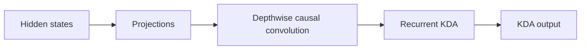
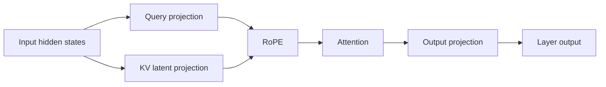
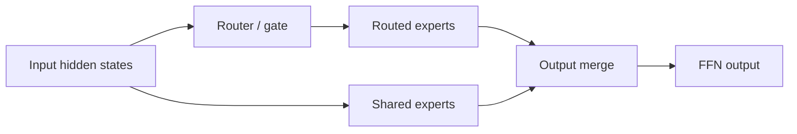
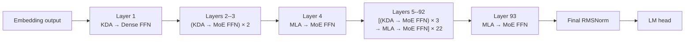
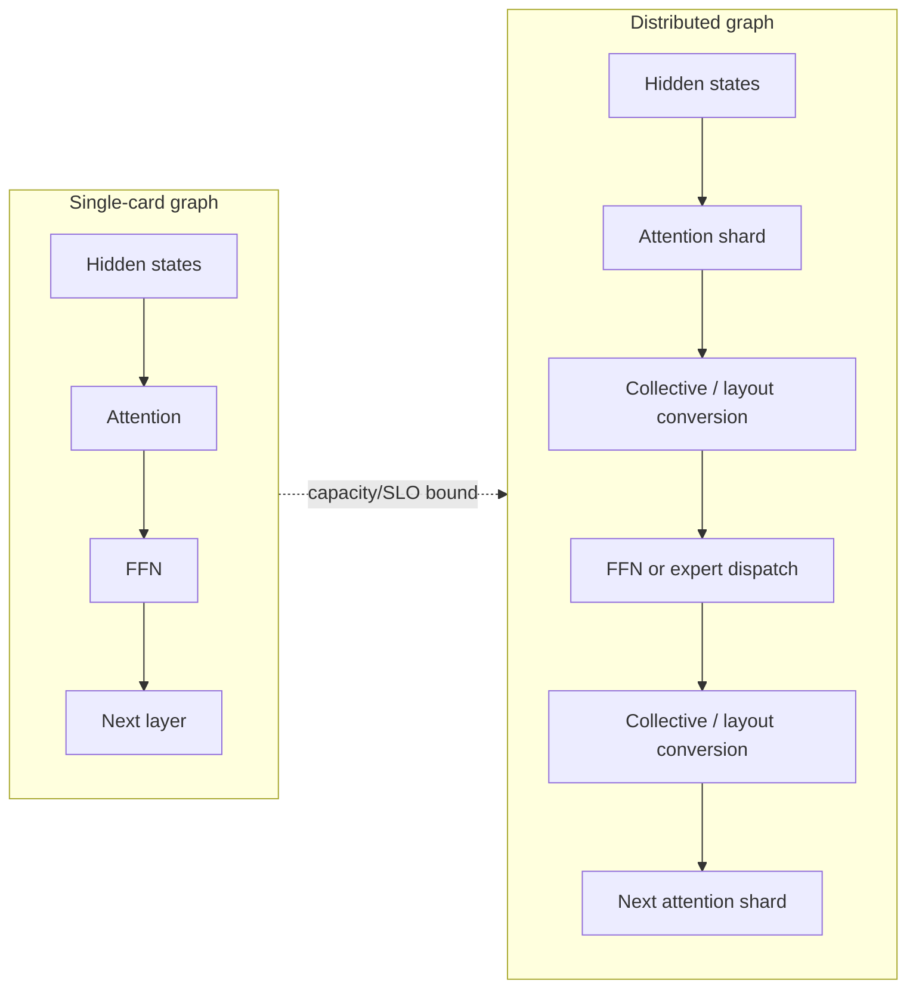
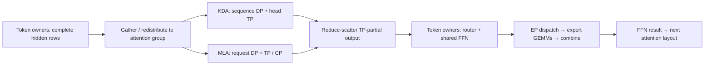

# Understanding Kimi K3: Model Structure and Performance Analysis

> Status: component evaluation and deployment-layout analysis. Chapters 9–10 include
> 16-GB200 experiments and a full-checkpoint context-capacity smoke test.
> Long-context output quality and production SLO validation remain outstanding.

## Notation

| Symbol                                                                                                                  | Definition                         | K3 value or rule                                                   |
| ----------------------------------------------------------------------------------------------------------------------- | ---------------------------------- | ------------------------------------------------------------------ |
| $N_{\mathrm{L}}$                                                                                                      | Total number of decoder layers     | 93                                                                 |
| $N_{\mathrm{KDA}}$                                                                                                    | Number of KDA decoder layers       | 69                                                                 |
| $N_{\mathrm{MLA}}$                                                                                                    | Number of MLA decoder layers       | 24                                                                 |
| $N_{\mathrm{Dense}}$                                                                                                  | Number of dense-FFN decoder layers | 1                                                                  |
| $N_{\mathrm{MoE}}$                                                                                                    | Number of MoE decoder layers       | 92                                                                 |
| $\mathcal{L}_{\mathrm{KDA}}$                                                                                                    | Set of KDA layer indices           | All indices outside $\mathcal{L}_{\mathrm{MLA}}$                         |
| $\mathcal{L}_{\mathrm{MLA}}$                                                                                          | Set of MLA layer indices           | 4, 8, 12, ..., 92, 93 (one-based)                                  |
| $P_{\mathrm{attn}}$                                                                                                   | Attention-layer placement pattern  | Three KDA layers followed by one MLA layer, plus a final MLA layer |
| $P_{\mathrm{ffn}}$                                                                                                    | FFN placement pattern              | Layer 1 is dense; layers 2--93 are MoE                             |
| $W_{\mathrm{total}}$                                                                                                  | Total checkpoint tensor payload    | 1,560.860 GB                                                       |
| $W_c$                                                                                                                 | Weight footprint of component $c$ | Component-dependent                                                |
| $F_{\mathrm{store}}$                                                                                                  | Logical weight storage format      | MXFP4, BF16, or FP32                                               |
| $D_{\mathrm{backing}}$                                                                                                | Safetensors backing tensor dtype   | U8, BF16, or FP32                                                  |

Values are derived from the published [Kimi-K3 configuration](https://huggingface.co/moonshotai/Kimi-K3/blob/main/config.json).

The following identities hold:

$$
\begin{aligned}
N_{\mathrm{KDA}} + N_{\mathrm{MLA}} &= N_{\mathrm{L}}, \\
N_{\mathrm{Dense}} + N_{\mathrm{MoE}} &= N_{\mathrm{L}}.
\end{aligned}
$$

## 1. What Is K3 Made Of?

K3 has three major compute components: Kimi Delta Attention (KDA), Multi-head
Latent Attention (MLA), and the feed-forward network (FFN). KDA and MLA are two
attention mechanisms; every decoder layer also contains a dense or
Mixture-of-Experts (MoE) FFN.

### 1.1 Kimi Delta Attention

KDA is K3's linear-attention component:



At this level, **Projections** covers the input-side projections, gates, and
output projection. Reshaping, normalization, and state-management details are
left to the implementation analysis.

- Each live sequence owns a fixed-size recurrent state.
- State capacity grows with resident sequence count, not historical length.
- Prefill uses chunked recurrence.
- Decode reads, updates, and writes the state at every step.

### 1.2 Multi-head Latent Attention

MLA is K3's full-attention component:



- It stores a per-token KV or latent cache.
- Cache capacity grows with retained context length.
- Prefill exposes substantial token parallelism.
- Decode reads historical cache entries.

### 1.3 Feed-Forward Network

The FFN is either a dense MLP or an MoE block:



- FFN and expert weights account for a large part of model capacity.
- MoE activates only a subset of routed experts per token.
- Compute scales with current tokens and activated experts.
- Expert parallelism adds dispatch, all-to-all, and combine communication.

## 2. How Are KDA, MLA, and FFN Composed?

They are not one fixed `KDA → MLA → FFN` pipeline. KDA and MLA are alternative
attention types in different decoder layers. Each layer connects its selected
attention mechanism to a dense or MoE FFN.



At model level, execution resembles:

```text
Embedding
→ Layer 1: KDA → Dense FFN
→ Layers 2--3: (KDA → MoE FFN) × 2
→ Layer 4: MLA → MoE FFN
→ Layers 5--92: [(KDA → MoE FFN) × 3 → MLA → MoE FFN] × 22
→ Layer 93: MLA → MoE FFN
→ Final RMSNorm → LM head
```

## 3. Weight Footprint Analysis

Weight footprint is the static memory baseline for the later runtime-capacity analysis. The measurements in this section are derived from the safetensors headers under `/mnt/public/Kimi-K3`; no weight tensors need to be loaded. The checkpoint contains 1,560.860 GB (1.419 TiB) of tensor payload.

### 3.1 Overall Weight Composition

Use a horizontal stacked bar to show the fraction of the complete checkpoint assigned to each model component.

<iframe
  src="../../assets/k3-weight-footprint.html"
  title="Interactive K3 weight-footprint analysis"
  width="100%"
  height="720"
  loading="lazy"
  style="border: 0; border-radius: 12px;">
</iframe>

!!! important "Routed experts dominate total weight capacity"

    Routed experts account for **92.67%**, or **1.446 TB**, of the stored
    checkpoint tensor payload. Expert parallelism is therefore the primary
    mechanism for making the model weights fit across devices.

!!! warning "KDA and MLA weights are still a substantial replicated floor"

    KDA and MLA together occupy **72.403 GB**: **61.258 GB** for KDA and
    **11.145 GB** for MLA. EP partitions routed experts, but it does not by
    itself partition these attention weights. With DP+EP and no attention TP,
    approximately **72.4 GB** of attention weights remains replicated per
    rank, before embeddings, dense/shared FFNs, caches, and runtime workspaces
    are included.

### 3.2 Weight Storage Format and Backing Dtype

Use a fourth horizontal stacked bar to show the checkpoint payload by logical weight format. The backing tensor dtype should be shown as a secondary annotation, not as the primary category.

| Logical format | Backing dtype | Footprint (GB) |   Share | Interpretation                                                          |
| -------------- | ------------- | -------------: | ------: | ----------------------------------------------------------------------- |
| MXFP4          | U8            |      1,446.456 | 92.670% | Packed routed-expert weights and associated quantization metadata       |
| BF16           | BF16          |        114.360 |  7.327% | Attention, shared/dense FFN, embeddings, and other uncompressed weights |
| FP32           | FP32          |          0.044 |  0.003% | Biases and selected numerical parameters                                |

The U8 tensors contain packed MXFP4 expert weights and quantization metadata; they are not INT8 weights, and the checkpoint contains no FP8 tensors. These values describe checkpoint storage, while per-rank runtime memory depends on sharding and backend weight preparation.

## 4. Cache Capacity: Latent Cache and SSM Slots

K3 has two persistent cache families with different capacity laws. Let $N_T$
denote the number of cached tokens and $N_S$ the number of allocated sequence
slots.

| Cache tensor | Logical shape | Storage dtype | Whole-model capacity |
| --- | --- | --- | ---: |
| MLA latent cache | $[N_T,512+64]$ | BF16 default / explicit raw FP8 on Blackwell | 27.648 / 13.824 KB/token |
| KDA convolution state | $[N_S,36864,4]$ | BF16 | 20.349 MB/slot |
| KDA recurrent state | $[N_S,96,128,128]$ | BF16 | 217.055 MB/slot |

The current K3 runtime defaults to BF16 MLA cache: 1,152 bytes/token/layer.
Explicit `kv_cache_dtype="fp8_e4m3"` on Blackwell uses raw 576-byte E4M3 rows,
including both latent and positional channels. Across the model,

$$
C_{\mathrm{cache}}=24s_{\mathrm{KV}}N_T
+237{,}404{,}160N_S\quad\mathrm{bytes},\qquad
s_{\mathrm{KV}}\in\{1152,576\}.
$$

At $2^{20}$ resident tokens, MLA cache is **27 GiB in BF16 or 13.5 GiB in
raw FP8**, before CP sharding. Pure attention TP replicates the latent cache;
KDA states are head-sharded. The mixed 656-byte FP8/scales/BF16 layout in the
historical B300 harness below is a separate format: its logical MLA payload
is 15.375 GiB at this length. It must not be used as the current Blackwell K3
cache-allocation formula; a packed backend may additionally pad physical pages.

## 5. Activation Memory

Activation capacity is determined by peak liveness, not by summing all 93
layers. KDA or MLA executes before its FFN, and the allocator can reuse storage
between decoder layers. The deployment question is therefore which component
creates the largest live allocation and which backend reserves persistent
workspace.

The measurements below use one B300 and a 16K active Prefill chunk. The MLA
point includes a 1M visible context with the production 128K prefix split. The
MegaMoE point uses NanoDeploy's world-size-one production wrapper with K3's 896
MXFP4 experts and Top-16 routing.

| Decoder layer form | Where activation memory is spent | Measured capacity to carry forward |
| --- | --- | ---: |
| KDA + Dense FFN | KDA chunk recurrence intermediates; Dense FFN intermediate for the 16K fresh rows | KDA core peak: 4.125 GiB |
| KDA + MoE FFN | KDA recurrence, followed by the reusable MegaMoE buffer and BF16 output | KDA core: 4.125 GiB; MegaMoE: 5.939 GiB persistent + 0.109 GiB dynamic |
| MLA + MoE FFN | Cached-latent restore, bounded K/V expansion, attention output, followed by MegaMoE | MLA core peak: 17.389 GiB; MegaMoE: 5.939 GiB persistent + 0.109 GiB dynamic |


The bars are component reservations, not values to add within a layer. The KDA,
MLA, and MoE stages execute sequentially. The complete-layer peak is controlled
by their maximum overlapping liveness and allocator reuse.

### 5.1 MegaMoE Persistent Buffer

MegaMoE reserves one symmetric buffer from its configured maximum token
capacity and reuses it across forwards and across all 92 MoE layers. At a 16K
capacity, the measured CUDA reservation is 5.939 GiB. A steady 16K forward adds
0.109 GiB for the BF16 output, giving 6.048 GiB of reserved buffer plus dynamic
activation. The persistent reservation must be counted once per process, not
once per layer.

### 5.2 DeepEP + DeepGEMM

DeepEP + DeepGEMM has the same high-level capacity pattern: a persistent buffer
is reserved for dispatch and combine, then each forward adds activation for
routed rows and grouped GEMMs. The ownership differs from MegaMoE. DeepEP owns
communication and permutation storage, while DeepGEMM consumes the dispatched
expert rows and produces expert outputs. When these buffers are shared across
sequential MoE layers, they are also counted once rather than multiplied by
layer count. Exact bytes are left unreported until an eight-GPU experiment is
available.

### 5.3 Capacity Conclusion

For the measured 1M-context, 16K-chunk path, bounded MLA prefix expansion is the
largest activation peak at 17.389 GiB. KDA recurrence peaks at 4.125 GiB.
MegaMoE contributes a material but predictable 5.939 GiB persistent reservation
and only 0.109 GiB of steady forward activation at 16K tokens.

## 6. Overview of Performance Analysis

The performance analysis separates Prefill from Decode because they expose
different independent variables. Prefill is studied as one request advancing
through a fixed-size fresh chunk. Decode is studied as a batch of active
sequences, each contributing one token while retaining a potentially long
visible context.

### 6.1 Prefill: One Request Is Sufficient

<iframe
  src="../../assets/k3-prefill-performance-overview.html"
  title="K3 Prefill performance variables"
  width="100%" height="400" loading="lazy"
  style="border: 0; border-radius: 12px;">
</iframe>

For Prefill, one request is sufficient to expose the component-level scaling.
Let $C$ be the fresh chunk size and $L$ the logical context visible after that
chunk. The cached prefix contains $L-C$ tokens, so its effective hit rate is

$$
r_{\mathrm{hit}}=\frac{L-C}{L}.
$$

With the reference chunk fixed at $C=8192$, the context sweep is:

| Logical context $L$ | Cached prefix $L-C$ | Fresh chunk $C$ | Effective hit rate |
| ---: | ---: | ---: | ---: |
| 8K | 0 | 8K | 0% |
| 32K | 24K | 8K | 75% |
| 128K | 120K | 8K | 93.75% |
| 256K | 248K | 8K | 96.875% |
| 512K | 504K | 8K | 98.4375% |
| 1M | 1016K | 8K | 99.21875% |

This construction separates the variables cleanly:

| Prefill component | Primary performance variables | Reason |
| --- | --- | --- |
| KDA | Chunk size $C$ | The cached prefix has already been summarized into recurrent state |
| MLA | Chunk size $C$ and visible context $L$ | The fresh queries still attend cached history |
| Dense FFN | Chunk size $C$ | Every fresh token executes the same dense matrices |
| MoE FFN | Chunk size $C$ and routing distribution | Only fresh tokens are routed; expert balance changes achieved utilization |

Using K3's 69 KDA layers, 24 MLA layers, one Dense FFN layer, and 92 MoE
layers, the one-request Prefill model is

$$
T_{\mathrm{prefill}}(C,L)
=69t_{\mathrm{KDA}}(C)
+24t_{\mathrm{MLA}}(C,L)
+t_{\mathrm{Dense}}(C)
+92t_{\mathrm{MoE}}(C).
$$

The first experiment therefore fixes $C=8\mathrm{K}$ and sweeps the six context
lengths above. A separate chunk-size sweep then fixes representative contexts
to determine whether 8K is the best serving point. Multi-request scheduling is
not needed for this component model; it belongs to the system-level serving
analysis after the single-request costs are understood.

### 6.2 Decode: Context Length and Batch Size Separate the Components

<iframe
  src="../../assets/k3-decode-performance-overview.html"
  title="K3 Decode performance variables"
  width="100%" height="400" loading="lazy"
  style="border: 0; border-radius: 12px;">
</iframe>

During Decode, each active sequence contributes one new token. Let $B$ be the
Decode batch size and $L$ the resident context length. MLA reads historical
cache, while KDA consumes a fixed-size recurrent state. Dense and MoE FFNs do
not inspect history.

| Decode component | Primary performance variables | Expected regime |
| --- | --- | --- |
| MLA | Context length $L$, with $B$ reported | Historical-cache traffic grows with visible context |
| KDA | Batch size $B$ | State size per sequence is independent of history length |
| Dense FFN | Batch size $B$ | Weight reuse improves as more current tokens share a forward |
| MoE FFN | Batch size $B$ and routing distribution | Tokens per selected expert determine grouped-GEMM utilization |

The Decode model is

$$
T_{\mathrm{decode}}(B,L)
=69t_{\mathrm{KDA}}(B)
+24t_{\mathrm{MLA}}(B,L)
+t_{\mathrm{Dense}}(B)
+92t_{\mathrm{MoE}}(B).
$$

Although context length is MLA's distinguishing variable, every MLA result must
also report $B$: its actual work scales with the number of active queries as
well as the history visible to each query. KDA and the FFNs use batch size as
their main sweep because they have no history-length term.

### 6.3 Reference Evaluation Matrix

The following values define the axes used by the detailed performance chapters.
The highlighted reference point is an 8K Prefill chunk and a 1M maximum serving
context; Decode batch sizes cover latency-oriented through throughput-oriented
operation.

| Parameter | Reference values |
| --- | --- |
| Prefill chunk size $C$ | 1K, 2K, 4K, **8K**, 16K |
| Decode batch size $B$ | 1, 8, 16, 32, 64, 128, 256 |
| Context length $L$ | 8K, 32K, 128K, 256K, 512K, **1M** |
| Prefix hit rate at $C=8$K | 0%, 75%, 93.75%, 96.875%, 98.4375%, 99.21875% |

The detailed analysis should first report isolated KDA, MLA, Dense, and MoE
curves over these variables, and then compose them using the actual K3 layer
counts. End-to-end TTFT and TPOT are validation of that model rather than the
starting point.

## 7. Performance Analysis

This chapter follows the two serving phases introduced in Chapter 6. Prefill is organized by fresh chunk size and visible context length; Decode is organized by batch size and visible context length. Within each phase, KDA, MLA, and MegaMoE are analyzed separately before their costs are composed at model level.

Dense FFN has one layer in K3, so it is not multiplied by a layer count like KDA, MLA, or MoE. It is nevertheless measured because its wide 33,792-channel gated MLP is a useful reference for token-parallel GEMM scaling and for the model-level latency sum.

The current results are a first mapping of the available component benchmarks. They do not yet represent complete operator breakdowns:

| Component | Current measured boundary | Complete boundary to add |
| --- | --- | --- |
| KDA | Complete production Prefill operator | Input projections, causal convolution, recurrence, gated normalization, and output projection measured separately |
| MLA | Cache restore, KV expansion, and attention core | Q/KV/G projections, latent norms, RoPE/cache operations, attention, gate, and output projection |
| Dense FFN | Complete gated MLP | Gate/up projections, SiLU-and-multiply, and down projection |
| MegaMoE | Pre-dispatch and fused routed-expert operator | Router/latent-down, Top-K, routed path, routed norm/up, shared experts, and output merge |

### 7.1 Prefill

Prefill considers one request. Let $C$ be its fresh chunk size and $L$ the total visible context after the chunk. KDA and MegaMoE process $C$ rows, whereas MLA processes $C$ queries against $L$ visible tokens.


#### 7.1.1 KDA


The complete production KDA operator is measured at $C\in\{1\mathrm{K},2\mathrm{K},4\mathrm{K},8\mathrm{K},16\mathrm{K}\}$ under 32K, 128K, 512K, and 1M logical context. All four curves overlap because the cached prefix has already been summarized into the recurrent state. Complete-forward latency rises from approximately 2.28 ms at 1K tokens to 13.17 ms at 16K.


The breakdown follows the actual forward path: seven input projections (Q, K, V, output gate, beta, forget-A, and forget-B), ragged causal QKV convolution, chunk KDA recurrence, per-head gated normalization, and output projection. At the 8K reference chunk, their representative isolated times are 2.68, 0.59, 2.50, 0.47, and 0.77 ms respectively. Input projections and recurrence now dominate at approximately 38% and 36% of the isolated-stage sum; causal convolution contributes only 8.4%. The dashed complete-forward line is measured independently; the stacked stages are not used as a substitute for end-to-end latency.

!!! success "Predictable performance"

    KDA latency is highly linear after the small-chunk launch-dominated region: fitting all 20 complete-forward measurements gives $R^2=0.9936$, a slope of approximately $0.731\,\mu\mathrm{s/token}$, and a fixed intercept of approximately $1.00\,\mathrm{ms}$. Together with the stable stage composition, this makes Prefill cost directly predictable for scheduler capacity planning.

!!! important "Chunk-size driven, not context-length driven"

    For a fixed chunk, the complete-forward measurements across 32K, 128K, 512K, and 1M context differ by at most approximately 1.6%, with no growth trend. Once the prefix is represented by the recurrent state, KDA processes only the fresh chunk.

!!! success "SGLang-style ragged convolution removes the former bottleneck"

    NanoDeploy now applies the causal convolution directly to ragged Q, K, and V tensors and fuses persistent-state read and update into the Triton kernel. It no longer constructs a concatenated padded QKV workspace or performs a separate tail-state extraction. At the 8K reference point, convolution falls from approximately 7.98 ms to 0.59 ms (13.5x), while complete-layer latency falls from approximately 15.2 ms to 6.72 ms (2.27x).

    Throughput now rises from 449K tokens/s at 1K to 1.13M at 4K, 1.22M at 8K, and 1.24M at 16K. The remaining plateau begins only after the projection GEMMs and KDA recurrence become the dominant stages; latency scaling alone is still insufficient to label the complete layer compute-bound.


##### 7.1.1.1 16K-Chunk Accumulation

For comparison with MLA, the following GB200 KDA view repeats the measured
TP1, batch-one, 16K Prefill chunk cost across 64 chunks. KDA's recurrent state
already summarizes the prefix, so the marginal cost is effectively independent
of visible context. The green bars are the measured critical-rank chunk time;
the orange line is the discrete cumulative sum.


The cumulative line uses KDA's recurrent-state property: once the state is
updated, a later chunk does not revisit the full historical token sequence. It
is therefore a state-based accumulation rather than a separate 1M execution.
The flat marginal bars and near-linear cumulative line provide the contrast to
MLA's context-dependent growth. This is one representative KDA layer; the full
model uses its actual TP/DP layout and includes communication and the other layers.


#### 7.1.2 MLA

MLA is reported at three related views. The cached-prefix pipeline isolates the long-history attention work; the complete MLA layer adds projections, cache write, gating and output projection; the final GB200 trace accumulates a complete layer over all 16K chunks from an empty cache. The first two views use one B300, a mixed FP8/BF16 cache and a 128K prefix split. The accumulation trace uses one GB200, TP1 and raw FP8 KV, so its absolute time is kept separate from the B300 measurements.

##### 7.1.2.1 Cached-Prefix Kernel Pipeline


This figure is a **kernel-pipeline breakdown**, not a Decoder Layer. It fixes visible context at 1M and varies the fresh chunk. The stages start from projected Q and fresh compressed KV, then measure FP8 cache restoration, fresh causal attention, cached-prefix K/V expansion, prefix attention, and LSE-weighted result merging. The next figure presents the context sweep and complete-layer comparison.

In this chunk sweep, average achieved throughput for the complete kernel boundary rises from approximately 8.77 × 10^5 GFLOP/s at 1K to 1.57 × 10^6 GFLOP/s at 16K. The B300 BF16 Tensor Core peak is a hardware reference rather than an attainable bound for every restore, merge, or elementwise kernel. At the 1M-context, 16K-chunk point, the pipeline takes 683.6 ms: prefix attention contributes 597.0 ms, prefix K/V expansion 56.0 ms, LSE merge 21.5 ms, cache restore 4.8 ms, and fresh attention 4.3 ms.

##### 7.1.2.2 Complete MLA Attention Layer

The complete-layer view adds Q/KV/G projections, latent normalization and cache write, fresh K/V expansion, gating and output projection around the cached-prefix pipeline.


Both panels fix the fresh chunk at 16K and sweep visible context from 32K to 1M. The legends distinguish **Pipeline · …** in panel (a) from **Layer · …** in panel (b); the latter contains the complete layer and includes the pipeline as one stacked stage. At 1M context, the complete path takes 689.7 ms, only 6.1 ms above the 683.6 ms pipeline. Long-context MLA is therefore dominated by cached-prefix expansion, attention and merge; the added layer projections are comparatively small. The black dashed curve is an independent complete-forward timing.

#### 7.1.2.3 16K-Chunk Marginal Cost and Cumulative Context Cost

The previous context-scaling plot shows the cost of one selected final chunk. To
show how a cold Prefill reaches the maximum context, we ran the representative
MLA layer sequentially from an empty cache on one GB200: TP1, layer 3, raw FP8
KV cache, 16K fresh tokens per chunk, and 64 chunks up to $2^{20}$ tokens. The
bar for chunk $i$ is its measured marginal layer-forward time at visible context
$L_i=16K\,i$; the purple line is the direct cumulative sum:

$$
T_{\mathrm{cold}}(L_n)=\sum_{i=1}^{n}\Delta T_i.
$$


The red horizontal line is the GB200 TP1 KDA 16K-chunk baseline, and the
vertical marker identifies the crossover near 32K visible context. MLA becomes
more expensive from the next chunk onward. The first un-warmed trace contained
a JIT outlier; it is retained in the raw results but excluded from the plotted
curve. The reported trace warms every shape before measuring all 64 chunks.
MLA's attention and prefix expansion continue to read historical tokens, so the
marginal curve grows with $L_i$ and its cumulative sum grows much faster than
linearly.

!!! important "MLA context scaling: measured numbers"

    The marginal MLA layer time rises from **13.5 ms** at 16K visible context to **757.1 ms** at 1M, about **56×**. The cumulative representative-layer time reaches **3.63 s at 128K**, **6.34 s at 512K**, and **24.73 s at 1M**. The comparable KDA 16K chunk is **28.63 ms**, with a state-based 1M accumulation of **1.83 s**. MLA is therefore about **26× slower for the final chunk** and **13.5× slower cumulatively** under these TP1 measurements.

!!! abstract "MLA versus KDA: scheduling implication"

    Each bar is one additional 16K chunk and the curve is their direct sum. MLA's marginal cost is approximately linear in historical context, so its accumulated cold-Prefill cost grows much faster than linearly. KDA's recurrent state summarizes the prefix: a fixed-size chunk does not revisit the full historical token sequence, and its chunk cost is primarily a function of fresh $C$. MLA scheduling must include current historical context in every chunk estimate; KDA scheduling can primarily plan against fresh tokens.

!!! note "Scope of the comparison"

    These are representative single-layer GB200 measurements, not full-model TTFT. The MLA curve is a measured 64-chunk trace after shape warmup; the KDA cumulative value is a state-based accumulation of the measured TP1 16K chunk. They establish context-scaling behavior and admission-planning implications, not a universal end-to-end latency ratio.


#### 7.1.3 MegaMoE


The existing production MXFP4 MegaMoE benchmark uses 896 experts, Top-16 routing, latent width 3584, and intermediate width 3072. Its synthetic expert IDs are round-robin, so the routed-row counts differ by at most one and form the perfect-balance baseline. Latency is nearly flat from 1K to 4K (5.67--6.18 ms), then reaches 7.02 ms at 8K and 12.72 ms at 16K.

The next experiment will measure the complete MoE path and break it into router/latent-down, Top-K, pre-dispatch, fused routed experts, routed norm/up, shared experts, and output merge. Routing imbalance will be added only after its load-distribution metric and synthetic distributions are agreed upon.

#### 7.1.4 Dense FFN


The single dense FFN uses a gated SwiGLU path with hidden width $7168$ and intermediate width $33792$. For each active token, the gate and up projections produce two $33792$-wide tensors, SiLU-and-multiply forms the gated intermediate, and the down projection returns to $7168$. The benchmark measures the complete three-matrix path in BF16 on one B300; it is a component boundary, not a full Decoder Layer.

During Prefill, latency rises from 0.891 ms at 1K fresh tokens to 12.406 ms at 16K. Achieved throughput increases from $1.11\times10^6$ to $1.28\times10^6$ GFLOP/s and is nearly saturated by 8K tokens. The approximately linear latency is mainly a consequence of processing more rows, while the nearly flat throughput curve shows that the wide GEMMs have reached steady throughput.

Because K3 has only one Dense FFN layer, its Prefill cost is added once in the model equation. It does not require a context-length sweep: like MoE, it processes only the current chunk.

### 7.2 Decode

Decode emits one token per active sequence. Unlike Prefill, the useful workload
coordinates are local batch $B$ and visible context $L$. KDA reads and updates a
fixed recurrent state; MLA reads the latent cache for every query; routed MoE
adds batch-dependent expert reuse and load imbalance. All batch values below are
per attention-DP group unless stated otherwise, and timings use the slowest rank.

#### 7.2.1 KDA: fixed state, batch-driven scaling


The GB200 single-card graph sweep shows the KDA batch curve directly: latency rises from about **0.152 ms at B=1** to **0.639 ms at B=256**, while local throughput increases as the recurrent core reaches a useful GEMM size. Because the recurrent state has fixed size, increasing context alone does not create a new KDA attention axis. These are single-card measurements; multi-card TP/DP selection is deferred to §8.

#### 7.2.2 MLA: batch and context are both first-class axes

MLA Decode is evaluated with batch size $B$ as the independent variable at fixed total context $N=B\times L$; each curve holds the total tokens in the request group approximately constant. The single-card complete real-weight MLA layer includes Q/KV projections, paged absorbed attention, output gate/value projection and output; values use FP8 KV and contexts 1K–1M.


!!! success "Takeaway · fixed total context"

    At a fixed total context $N=B\times L$, changing batch size mainly redistributes the same tokens across sequences. MLA Decode latency therefore tracks the visible context term most strongly; batch adds projection and launch overhead but does not remove the long-context cost.


At fixed total context, changing batch mostly redistributes the same tokens across sequences; the measured attention time remains dominated by the visible context term, while larger batch adds projection and launch work. Multi-card TP/CP and cache ownership are deferred to §8.

!!! important "MLA Decode takeaway"

    Decode selection is a $(B,L)$ decision. A configuration that wins at batch one and 8K may lose at batch 32 and 1M; compare equal global batch, then apply the memory screen. Context length directly increases MLA cache reads, while KDA's recurrent state keeps its context dependence largely out of the per-token kernel.

#### 7.2.3 MegaMoE: reuse and routing determine the batch curve

The complete real-checkpoint FFN layer is shown as a single-card token-batch proxy with synthetic normal activations. It includes router, shared experts, latent projections and packed MXFP4 expert weights; the routing-load curve is carried as context for later multi-card analysis.


The proxy shows the expected batch amortization and why routing imbalance must remain visible. It is not a multi-card EP result; conversion and expert-owner costs are analyzed later.

!!! note "Decode selection order"

    First establish the single-card $(B,L)$ baseline shown here. Then, in §8, screen weights/cache capacity and add TP, DP, CP, EP and conversion costs. Report TPOT and concurrency separately; a single-layer graph is not an end-to-end Decode SLO.

#### 7.2.4 Dense FFN

The Dense FFN follows the same batch-size sweep shown above. Its Decode cost depends on active batch size, not resident context length. Latency stays near 0.25 ms through batch 32 and reaches 0.317 ms at batch 256; achieved throughput rises from $3.84\times10^3$ to $7.83\times10^5$ GFLOP/s. Small batches are launch- and weight-bandwidth dominated, while larger batches expose tensor-core throughput. The single dense layer is a small additive term in TPOT.

### 7.3 Model-Level Composition and Bottleneck Summary

After the complete operator curves are available, the Prefill and Decode models will be composed using K3's actual layer counts:

$$
T_{\mathrm{K3}}
=69T_{\mathrm{KDA}}+24T_{\mathrm{MLA}}+92T_{\mathrm{MoE}}+T_{\mathrm{Dense}}.
$$

The single Dense FFN term remains in this equation and is added once. Final memory-bound or compute-bound labels will require achieved FLOP/s, HBM bytes, SM utilization, tensor-core utilization, and kernel launch gaps rather than latency scaling alone.

The benchmark inputs, raw CSV/JSON results, and plotting scripts are kept under `bench/k3_layer_performance/`.

## 8. Intra-Layer Parallelism Overview

K3 needs parallel execution to meet capacity and latency targets. Its computation graph then includes layout conversions along the Attention → FFN → Attention path, in addition to the layer computations and their internal communication:

$$
T_{\mathrm{layer}} = T_{\mathrm{compute}} + T_{\mathrm{collective}} + T_{\mathrm{layout\ transition}}.
$$

Capacity legality comes first; latency and throughput are compared only among layouts that fit.



This chapter focuses on **intra-layer parallelism**: TP, CP and EP inside a decoder layer, together with DP for independent requests. Pipeline parallelism (PP), which partitions layers across stages, and Attention–FFN disaggregation (AFD), which separates execution domains, are outside the current comparison. They remain higher-level deployment dimensions and are not mixed into the capacity and latency analysis below.

### 8.1 MLA: TP, DP and CP

MLA distributes projection/head work with TP, independent requests with DP, and history with CP.

| Choice | Capacity effect | Compute and HBM effect | Communication and selection rule |
| --- | --- | --- | --- |
| More DP | Weights replicated; requests and their caches assigned to different groups | More independent requests run concurrently | Little attention-internal communication; does not accelerate one request |
| More TP | Most projections/head weights shrink; compressed latent cache stays replicated | Head work shrinks, but every head shard still consumes the same latent history | Projection reductions and attention/FFN transitions; useful for weight fit and long Prefill |
| More CP | Persistent history can shrink as $1/P$ | Work on one long history is distributed; query or head geometry changes | Exchange queries/KV and merge partial softmax outputs; worthwhile only after including these costs |

**Prefill CP and Decode CP address different bottlenecks.** Splitting fresh
query tokens during Prefill can distribute large $CL$ attention work, but
causal partitions need balanced assignments and access to the appropriate KV
history. Merely splitting queries while replicating the complete cache does
not yield a $1/P$ cache-capacity benefit. A history-sharded implementation must
stream/gather KV or broadcast queries and merge partial outputs.

For a long cached prefix, broadcasting the relatively small fresh-query block
to persistent KV owners is a useful alternative to moving the history every
layer. Decode uses the same principle with very few queries: keep historical
pages in place and communicate current-query/output data. This is the phase
distinction described in [vLLM's context-parallel deployment guide](https://docs.vllm.ai/en/latest/serving/context_parallel_deployment/).

For history shard $j$, let $o_j$ be its normalized attention output and $\ell_j$
its log-sum-exp. Correct composition is

$$
m=\max_j\ell_j,\qquad
 o=\frac{\sum_j e^{\ell_j-m}o_j}{\sum_j e^{\ell_j-m}}.
$$

An ordinary sum or average of $o_j$ is incorrect. Our experimental CP path
reuses FlashAttention's GB200 CuTe kernel and implements this merge with FP32
MAX/SUM collectives and fused Triton packing/normalization. It preallocates
merge buffers and supports CUDA Graph capture. That prototype begins with
projected queries and expanded cached K/V, so it measures **attention plus CP
merge**. The separate paged Decode prototype in §10.4.1 includes query exchange
and compressed-cache attention; complete MLA is measured in §9.5 and §10.4.

For nested CP at fixed $T_A$, the main attention FLOPs per rank remain roughly
constant: $hP/T_A$ heads times $L/P$ keys. Benefits can still come from less
replicated latent traffic, better kernel geometry, and greater resident-request
capacity. A claim of both $1/T_A$ and an additional $1/P$ compute reduction
would double-count the same workers.

There is a second, useful MLA convention: **CP nested inside an existing
projection-TP group**, as in decode context parallelism. Let $T_A$ be projection
TP and $P\mid T_A$. Then

$$
D_A T_A=G,\qquad T_{\mathrm{head}}=T_A/P.
$$

Weights remain projection-sharded by $T_A$; queries are exchanged within the CP
subgroup so each rank computes $P$ times as many heads against $1/P$ of the
history, then returns its output-head shard. **Do not multiply the worker count
by $P$ again.** Additional replicated expansion/projection weights, if used to
avoid exchanges, must be budgeted. This distinction is essential when comparing
“TP8 with CP2” with an independent “TP8×CP2” mesh. The nested interpretation is
the extension recommended below. [vLLM's DCP implementation discussion](https://github.com/vllm-project/vllm-project.github.io/blob/main/_posts/2026-08-07-decode-context-parallelism.md)
describes query exchange, LSE-weighted output composition, and the divisibility
constraint; [SGLang's server arguments](https://docs.sglang.io/docs/advanced_features/server_arguments)
also expose alternative DCP communication backends and query-projection
replication.

### 8.2 KDA: TP and DP

KDA has no historical-token axis to distribute after a prefix has been reduced
to state. Its legal independent units are heads and complete sequences.

| Choice | Capacity effect | Compute and bandwidth effect | Limitation |
| --- | --- | --- | --- |
| KDA DP | Replicates KDA weights; assigns different sequence states to ranks/groups | Raises throughput when independent sequences are available | One long request still follows its recurrence in order |
| KDA TP | Divides most projections, 96 heads, convolution state, and recurrent state | Reduces weight/state bytes and head work per rank | Smaller GEMMs and output communication can erase the gain at small batches |

Splitting the fresh tokens of one KDA sequence as if they were DP requests
would break the recurrence. A sequence-parallel scan would require explicit
state propagation or composition of recurrence transforms; it is a separate
algorithm, outside this chapter's KDA DP/TP choices.

The kernel supports $T_K\in\{1,2,4,8,16\}$ because all divide 96. Select the
smallest TP that meets capacity **and** the measured latency/throughput target,
rather than assuming either TP1 or the largest TP is optimal. The measurements
in §9.3–9.7 and §10.3–10.6 show why execution mode matters particularly for Decode.

### 8.3 Routed FFN: EP and TP

At fixed $D_F=1$, $E T_F=16$ gives the following theoretical routed-weight
placements, before kernel-specific padding:

| FFN layout | Experts/rank | Intermediate width/rank | Routed weights/rank | Main trade-off |
| --- | ---: | ---: | ---: | --- |
| EP16×TP1 | 56 | 3072 | 90.404 GB | Full expert GEMMs; widest expert-owner mesh |
| EP8×TP2 | 112 | 1536 | 90.404 GB | Fewer expert owners; extra expert-TP coordination |
| EP4×TP4 | 224 | 768 | 90.404 GB | More experts with thinner matrices |
| EP1×TP16 | 896 | 192 | 90.404 GB | No EP dispatch across owners; expert-TP communication and very narrow GEMMs |

Equal storage is not equal efficiency. EP favors whole, well-populated expert
GEMMs, but pays dispatch/combine and suffers when expert owners are unevenly
loaded. Expert TP can recruit multiple GPUs for a hot expert, but introduces
input replication and partial-output reduction, often on routed-token tensors.
Quantization alignment and available kernel shapes also constrain $T_F$.

**The current K3 MegaMoE backend requires $T_F=1$.** EP8×TP2 and EP4×TP4 are
not working launch configurations of the serving backend. The added
benchmark prototype instead shards each expert's intermediate weights and
composes native MegaMoE calls with input all-gather and output reduce-scatter;
its results and the required physical padding are reported in §9.3–9.7 and §10.3–10.6. Also, K3's shared experts are explicitly replicated in
`KimiMoE`; enabling expert TP would not automatically divide their 24.310 GB.
The router and routed down/up projections contribute another 10.637 GB of
replicated weights.

### 8.4 Dense FFN: TP and Token Ownership

The one Dense FFN has no expert axis. Its intermediate matrices can use FFN TP,
but its 1.453 GB and single-layer computation do not justify choosing the mesh
for the other 92 FFNs.

Token partitions apply the same FFN weights to different rows; tensor partitions split the matrices and require composition of partial outputs.

### 8.5 Parallel-Layout Constraints and Transitions

Let $G$ be the GPU count, $D$ the request/replica degree, $T$ the tensor degree, $P_M$ the MLA context degree and $E$ the expert degree. With pipeline parallelism fixed at one, independent component meshes satisfy

$$
D_M P_M T_M=D_K T_K=D_F E T_F=G.
$$

These are **alternative views of the same GPUs**, not three GPU pools to add.
For example, attention DP2×TP8 and FFN EP16 both use all 16 workers.
Request DP does not split the tokens of one request: one 8K Prefill chunk still
lands on one attention group. A throughput comparison must keep global request
count fixed, or explicitly report the different number of simultaneous
requests served by each layout.



KDA and MLA are alternatives at each layer. There is no direct KDA→MLA kernel
boundary: an FFN lies between attention layers. If their DP/TP groups differ,
the FFN-to-next-attention mapping must bridge those groups.

Let $n$ be the active rows **in one attention group**, and let

$$
\widehat n=T_A\lceil n/T_A\rceil,\qquad
X=2H\widehat n=14{,}336\widehat n\ \mathrm{bytes}.
$$

Padding matters: batch-one TP16 processes a 16-row boundary tensor unless the
implementation supports uneven/empty shards. These extra rows can also create
FFN work. At 8K Prefill, $X=112$ MiB; at 16K it is 224 MiB.

| Boundary | Required action | First-order communication accounting |
| --- | --- | --- |
| TP-partial attention output → unique FFN rows | Reduce-scatter (RS) | Ring reference: $(p-1)X/p$ bytes sent/rank |
| Already all-reduced attention output → FFN rows | Local slice | No new network traffic, but the earlier all-reduce already cost $2(p-1)X/p$ |
| Unique FFN rows → next TP-replicated attention input | All-gather (AG) | $(p-1)X/p$ bytes sent/rank |
| Different token-owner assignments or unequal DP groups | Permutation, often all-to-all / all-to-all-v | Must follow the actual source/destination mapping; matching shapes alone do not make it free |
| MLA history shards → composed attention output | Query exchange plus LSE-aware merge | Size follows current queries, heads and output width, not the whole history |
| Expert-TP partial outputs → final routed result | TP reduction or fused reduction/scatter | Depends on whether per-expert outputs are locally combined first |

The ring byte formulas describe a reference volume, not the NCCL algorithm
actually selected. Send+receive accounting would double them. The measured
latency of the complete RS→AG pair is more useful than adding independent
peak-bandwidth estimates.

In K3's attention-residual path, the output projection defers reduction and
`AttnToFfnTransition.reduce_scatter()` consumes its partial output. Count that
RS **instead of** the output all-reduce, then count the return AG. Charging
all-reduce, RS and AG for the same optimized boundary overstates its cost.
Residual prefixes and the attention-residual bank must follow the same row
mapping; they cannot be silently left on the old owners.

MoE dispatch is a separate operation. A BF16 per-expert assignment model gives

$$
V_{\mathrm{dispatch}}^{\mathrm{logical}}=n_g kR\times2,
\qquad k=16,
$$

where $n_g$ is the total input rows in the EP group. At $n_g=8192$, this is
0.875 GiB per direction, before locality. With uniform routing, a fraction
$1-1/E$ of expert assignments is remote. **This is not the actual wire-byte
count:** MegaMoE dispatches FP8 activations and scales; multiple selected experts
on one destination can share a delivered row, and combine can aggregate local
expert contributions. Under an approximate independent uniform routing model,
expected remote destinations per token are

$$
(E-1)\left[1-(1-1/E)^{16}\right].
$$

Thus report assignment bytes, destination fan-out and measured fused-operator
time separately. Raw all-to-all on one $[n,H]$ tensor does not measure Top-16
expert dispatch.

Finally, changing a **live request's** layout between Prefill and Decode can
require moving persistent cache and KDA state. One maximum-length request owns 13.5 GiB of raw-FP8 MLA cache
(or 27 GiB of BF16 cache) and 226.4 MiB of KDA state before sharding. This is a one-time migration
cost, distinct from per-layer activation exchange. Prefer fixed ownership or
an explicit, amortized migration policy over switching meshes every step.

$$
T_{\mathcal P}=T_{\mathrm{shell}}
+\sum_{l=1}^{93}\left[
 t_{A_l}^{\mathrm{local}}+t_{A_l}^{\mathrm{internal\ comm}}
 +t_{A_l\to F_l}+t_{F_l}
 +t_{F_l\to A_{l+1}}\right],
$$

with the final edge interpreted as the output/shell transition. The attention
sequence has 69 KDA and 24 MLA layers; FFN has 92 MoE and one Dense layer.
For a homogeneous, synchronized workload, the sum becomes the corresponding
weighted component costs, but each distributed stage must use the critical
rank/group. Different request populations and routing distributions need
separate points in the matrix.

Inside MoE, shared and routed paths can overlap. Its critical path is roughly
router/front preparation, followed by the longer of shared FFN and the
routed dispatch/GEMM/combine/up path, followed by merge. Summing independently
timed shared and routed kernels ignores that overlap; using routed-kernel time
alone omits real work.

For a measured KDA forward that already includes all-reduce, the NCCL reference
replacement for a token-sharded FFN boundary is

$$
\widetilde t_K=t_K^{\mathrm{measured}}-t_{\mathrm{AR}}(n,T_A)
 +t_{\mathrm{RS\to AG}}(n,T_A).
$$

This is a **model substitution**, not a measurement of the fused layer. It
requires matching dtype, group, execution mode and row count. When a complete
layer already includes transitions, add neither term again.

## 9. Prefill

Prefill parallelism is evaluated by fresh chunk size, cached history and time to first token. First screen weight, cache and activation capacity; then compare complete component times and the transitions defined in §8.5. Cold Prefill must include all chunks, while continuation Prefill processes only the new suffix.

### 9.1 Capacity and Legal Sharding

The measured CUDA-visible capacity is **197,897,748,480 bytes = 184.306 GiB per
GPU**. The 16-card total does not make every rank's replicated weights fit.

Separate shardable and replicated attention weights:

$$
\begin{aligned}
M_W \approx{}& \frac{1446.456}{E T_F}+24.310+10.637+\frac{1.453}{T_F}\\
 &+W_{K,r}+\frac{61.258-W_{K,r}}{T_K}
  +W_{M,r}+\frac{11.145-W_{M,r}}{T_M}
  +W_{\mathrm{shell,rank}}\quad\mathrm{GB},
\end{aligned}
$$

where $W_{K,r}\simeq0.127$ GB and $W_{M,r}\simeq0.727$ GB include KDA forget-A
and MLA Q-A/KV-A projections and associated norms. For nested CP, $T_M$ here is
projection TP $T_A$, not the effective head degree $T_A/P$.

The shell is approximately 5.601 GB, including 4.698 GB of embedding/LM-head
weights that the current runtime shards by attention TP. The rest is retained
conservatively, including checkpoint payload not used by text-only inference.
The earlier “other” bucket of 7.054 GB already included the Dense FFN;
**adding 1.453 GB to that bucket again double-counts it.** These are checkpoint
storage estimates; backend repacking and any CP-specific replicated matrices
remain additional allocations.

For $n_T$ cached tokens and $n_S$ sequence slots **assigned to one request-DP
group**, balanced cache ownership gives

$$
M_{\mathrm{cache,rank}}
=\frac{24s_{\mathrm{KV}}n_T}{P}
 +\frac{237{,}404{,}160n_S}{T_K}\quad\mathrm{bytes}.
$$

At fixed global resident population with balanced DP and no CP,
$n_S=N_S/D_K$, so KDA state per rank is $237{,}404{,}160N_S/G$: exchanging DP
for TP does not change this balanced cluster-wide state cost. In contrast,
MLA cache at fixed $G=D_A T_A$ grows with $T_A$ because more TP ranks replicate
each request. This is why “TP shrinks the state” alone is not a concurrency
argument.

The actual peak condition is

$$
\max_r\left[
 M_{W,r}+M_{\mathrm{cache},r}+M_{\mathrm{persistent},r}
 +\max_{\mathrm{stage}}M_{\mathrm{live\ transient},r}
 +M_{\mathrm{reserve},r}\right]\le M_{\mathrm{HBM},r}.
$$

Persistent MoE/communication buffers remain live during attention. Count them
**once per process, in addition to** the largest overlapping transient stage.
Do not sum all 93 layer activations; do not take a maximum that incorrectly
allows a persistent buffer to disappear during MLA. This qualifies the
allocator-reuse discussion in Chapter 5.


The peak must be checked at the largest live Prefill stage for the chosen chunk and history. Resident-request planning is evaluated separately in §10.1 using the same weight and persistent-buffer accounting.

### 9.2 Compute, HBM and Chunk Size

For each stage and rank, a useful first-order model is

$$
t_{r}\gtrsim\max\left(\frac{F_r}{\Pi_{\mathrm{eff}}},
                         \frac{Q_{\mathrm{HBM},r}}{B_{\mathrm{HBM,eff}}}\right)
 +t_{\mathrm{launch}}+t_{\mathrm{communication,exposed}}.
$$

$\Pi_{\mathrm{eff}}$ must match the dtype and local GEMM shape. An MXFP4
checkpoint-byte count does not permit using a BF16 compute peak for its expert
kernel, or an FP4 peak for all attention operations. HBM bytes and network bytes
are separate budgets. Communication overlap reduces the **exposed** term only
when the implementation and measurements establish that overlap.


| Component | Prefill work |
| --- | --- |
| KDA | Projection and chunked recurrence over fresh rows |
| MLA | Causal attention plus cached-prefix restoration and expansion |
| MoE | Routed and shared FFN work over fresh rows |
| Dense | Three dense projections over fresh rows |

The chunked-Prefill KDA recurrence requires its own work estimate; a Decode
state-update count does not cover its intermediates. MLA's 0.464 GFLOP/token projection/expansion
baseline also needs **cached-prefix KV expansion** added during Prefill:
$2(L-C)h(128+128)512$ FLOPs per MLA layer.

At the reference $C=8192,L=2^{20}$, all 24 MLA layers contribute about **12.617
PFLOP of attention** and **0.628 PFLOP of cached KV expansion**. The remaining
fixed-per-token model work is about **1.691 PFLOP**. The causal fresh triangle
is included; treating all fresh queries as attending the final length slightly
overcounts it. At 16K fresh tokens the corresponding terms are 25.135, 0.623 and
3.382 PFLOP.

For current Blackwell MLA, maximum-length cache storage is 576 MiB/layer
(raw FP8) or 1,152 MiB/layer (BF16), totaling 13.5 or 27 GiB per request. This is a **one-pass byte baseline**, not a promise that the
kernel reads each byte once. Expanded BF16 K/V is 60 GiB/layer before head
sharding. Writing and reading it once is already 120 GiB. A fixed-size prefix
split bounds live expansion, but CP does not automatically divide that bound:
with fixed split size $S$, it is proportional to
$\min(S,L/P)\,h/T_{\mathrm{head}}$. In nested CP the effective head count per
rank increases, so split size and merge workspace need to be retuned together.

For cold chunked Prefill with $J=L/C$, attention visits $L(L+1)/2$ causal pairs.
The current expanded-MLA implementation re-expands historical latent rows on
each chunk, so the total prefix rows expanded are
$C J(J-1)/2$. The 128K workspace split bounds liveness within a chunk; it does
not persist expanded KV between chunks. For an 8K serving chunk:

<!-- BEGIN PHASE_WORK_TABLE -->
| Context cap/endpoint | 8K cold chunks | Cold work (PFLOP) | Final 8K chunk (PFLOP) | Decode work/token (TFLOP) | FP8 cache/request (GiB) |
| --- | --- | --- | --- | --- | --- |
| 8K | 1 | 1.74 | 1.74 | 0.248 | 0.105 |
| 32K | 4 | 7.59 | 2.05 | 0.371 | 0.422 |
| 128K | 16 | 40.32 | 3.30 | 0.864 | 1.688 |
| 512K | 64 | 320.87 | 8.29 | 2.835 | 6.750 |
| 1024K | 128 | 1067.33 | 14.94 | 5.463 | 13.500 |
<!-- END PHASE_WORK_TABLE -->

Cold Prefill includes fixed per-token work, causal MLA attention and repeated
prefix expansion. Decode adds fixed work and absorbed MLA arithmetic. These
are algorithmic estimates across the model, not hardware latency estimates;
the KDA Prefill recurrence term remains an approximation. At the maximum
endpoint, cold work is about **1,067 PFLOP**, compared with **14.94 PFLOP** for
only the final 8K chunk. The large difference is why a 99%-cached benchmark
cannot establish cold maximum-context TTFT.

### 9.3 Experimental Setup and Boundary Costs

The distributed measurements used four nodes and 16 NVIDIA GB200 GPUs.
One worker was pinned to each GPU; groups of 2/4 remained within a node, while
8/16 spanned nodes. Local topology reports NV18 peer links. Multi-node NCCL and
MegaMoE with NCCL symmetric memory both completed. Thus a node boundary alone
is not evidence that this job uses an ordinary slow inter-node link; GB200 can
span a multi-node NVLink domain. [NVIDIA's GB200 topology guide](https://docs.nvidia.com/multi-node-nvlink-systems/multi-node-tuning-guide/overview.html)
explains that hardware capability; the tables below use the actual measured
job topology instead of advertised link bandwidth.

Measurements use PyTorch 2.11.0+cu130 and CUDA 13.0. For repeated microbenchmarks, Ray launch, allocations and
weight preparation are outside latency timing; warmups precede measurement.
The single-pass cold and full-model sweeps explicitly retain first-shape/JIT
effects and are labeled separately. Component tables report the **maximum rank latency** at a point, since the slowest participating
rank controls completion; raw per-rank results remain available.


A 256 MiB device copy, counting reads and writes, achieved **6.52–6.54
TB/s/rank**, median 6.54 TB/s. This is an empirical streaming-copy reference,
not guaranteed effective bandwidth for irregular cache access. The accompanying
BF16 GEMM sweep uses actual KDA projection dimensions and TP-sharded widths.

The graph experiment captures eight consecutive operations and amortizes replay
over them; each point has five warmups and three trials of thirty replays.
The eager reference is retained separately. The following are directly timed
**RS→AG pairs** on BF16 hidden states:

| TP group | Batch 1, with TP padding (µs) | 128 rows (µs) | 8K rows / 112 MiB (ms) | 16K rows / 224 MiB (ms) |
| ---: | ---: | ---: | ---: | ---: |
| 2 | 35.9 | 45.1 | 0.330 | 0.596 |
| 4 | 42.0 | 49.1 | 0.373 | 0.686 |
| 8 | 53.9 | 56.9 | 0.394 | 0.719 |
| 16 | 77.9 | 76.1 | 0.477 | 0.746 |

These measurements establish both a size-dependent bandwidth term and a small
message floor. At TP8, 93 such boundaries amount to about **36.7 ms per 8K
forward**, or **5.0 ms for batch-one Decode**, before overlap. They are NCCL
reference costs; NanoDeploy's specialized K3 communicator can differ. Graph
capture lowers launch overhead but barely changes large-message bandwidth.

### 9.4 KDA Prefill

| TP | DP | 8K Prefill, eager (ms) |
| --- | --- | --- |
| 1 | 16 | 14.462 |
| 2 | 8 | 8.090 |
| 4 | 4 | 4.883 |
| 8 | 2 | 3.714 |
| 16 | 1 | 3.372 |

Each point processes one 8K request per DP group and includes output all-reduce. These are per-group eager latencies, not equal-global-load throughput. The current ragged convolution path prevents unchanged Prefill CUDA Graph capture.

| Actual world size = TP | 8K Prefill (ms) |
| --- | --- |
| 1 | 14.469 |
| 2 | 8.040 |
| 4 | 4.594 |
| 8 | 3.654 |
| 16 | 3.372 |

The second sweep uses actual NCCL worlds of 1/2/4/8 ranks; world 16 comes from the original job. Concurrent jobs used other GPU allocations. These isolated layers do not establish full-checkpoint capacity on the smaller worlds.

### 9.5 MLA Prefill

The complete layer includes projections, cache write, restore/expansion, attention and output all-reduce. The first table fixes an 8K fresh suffix ending at 1M visible tokens.

| TP | 1M/8K Prefill (ms) | BF16 Prefill transient (GiB) |
| --- | --- | --- |
| 1 | 441.18 | 17.79 |
| 2 | 242.49 | 9.53 |
| 4 | 124.29 | 5.40 |
| 8 | 63.54 | 3.33 |
| 16 | 42.23 | 2.30 |

Prefill uses three trials of three eager forwards after warmup, reporting the maximum per-rank median. Transient memory excludes resident weights/cache and initialized Decode workspace.

Two failures found during this sweep were fixed in the runtime. The installed
TRTLLM-GEN kernels reject 24 local Q heads and a 96-head large-batch point. We
pad 24→32 and 96→128 inside the graph, then discard only the padded output
heads. Heads attend independently, so this preserves the actual heads while
retaining the optimized kernel. The extra padded work is included in these
measurements. The unpadded support probe and failed-run metadata are retained.

The original BF16 Prefill branch expanded the complete cached history, whereas
FP8 used a 128K prefix split. Extending that bounded path to BF16 reduces the
TP8, maximum-length/8K transient peak from **19.32 to 3.33 GiB**; its complete
forward falls from **78.07 to 62.41 ms** in these runs. TP16's peak falls from
10.28 to 2.30 GiB. The full latent gather remains proportional to context;
only expanded K/V workspace is bounded. CP does not automatically reduce the
remaining gather or the expansion peak.

Real-weight checks cover all 24 MLA layers at TP1, and layer 3 at every tested
TP. They compare chunked Prefill and Decode against causal BF16 attention,
including nontrivial physical page ordering and graph replay. Across the
24-layer short-sequence check, maximum relative L2 errors were **0.00039
for BF16 Prefill, 0.005995 for BF16 Decode, 0.0204 for FP8 Prefill and 0.0562
for FP8 Decode**. Raw-FP8 Decode quantizes Q as well as storing FP8 KV. These
local numerical checks are not a long-context accuracy or generation-quality
acceptance criterion.

#### 9.5.1 Context-Parallel Attention Core

<!-- BEGIN CP_MEASUREMENT_TABLE -->
| Effective head TP | CP | 32K cached tokens (ms) | 128K cached tokens (ms) | 1M cached tokens (ms) |
| --- | --- | --- | --- | --- |
| 16 | 1 | 0.908 | 3.571 | 32.885 |
| 8 | 2 | 0.900 | 3.004 | 26.991 |
| 4 | 4 | 1.073 | 3.256 | 24.998 |
| 2 | 8 | 1.365 | 3.409 | 24.588 |
| 1 | 16 | 2.070 | 3.855 | 24.826 |
<!-- END CP_MEASUREMENT_TABLE -->

The table fixes one request and 16 cooperating GPUs, so
$T_{\mathrm{head}}P=16$. Queries and expanded cached K/V are prepared before
timing. CUDA Graph includes FlashAttention plus the preallocated Triton/FP32
CP merge. Nonzero inputs were checked against independent FP32 dense attention
for every layout on all ranks; maximum absolute error was below 0.005 in the
small reference cases. An additional 576 per-rank checks covered noncontiguous
LSE, irregular sizes, large logits and fully masked rows against FP64
composition. These validate the merge, not full K3 output quality.

CP has a context-dependent break-even: shorter histories expose exchange and
merge costs; longer histories can benefit from the changed head/history kernel
geometry. **The experiment excludes query exchange and KV restoration/
expansion**, which must be added before selecting a production MLA layout.
The one-query rows in the raw matrix use expanded cached attention and must
not be presented as paged, absorbed Decode performance.

#### 9.5.2 Cold Prefill from an Empty Cache

We also populated a real-weight MLA layer **from an empty cache**, appending
every 8K chunk sequentially up to the target length. Its cache contains latents
actually produced by that layer's KV projection. The input activations are a
repeated finite random tile. The following values are one complete cold sweep
per point, taking the slowest rank; they include eager host/metadata gaps and
are less statistically robust than the repeated steady-state timings above.

<!-- BEGIN COLD_TABLE -->
| TP | Cold 8K (s) | Cold 128K (s) | Cold 1M (s) |
| --- | --- | --- | --- |
| 4 | 0.004 | 0.167 | 8.632 |
| 8 | 0.003 | 0.106 | 4.491 |
| 16 | 0.003 | 0.087 | 2.941 |
<!-- END COLD_TABLE -->

This is one MLA layer, not whole-model TTFT. At the maximum endpoint, recomputing
the final chunk with split versus unsplit historical attention gave relative
L2 error below 0.00685 for all tested TP/dtype/chunk combinations. The cold
experiment includes both cache formats, TP4/8/16, and an extra TP16 comparison
of 4K/8K/16K chunks: the FP8 maximum-length cold layer took **3.945/2.941/2.017
seconds**, respectively. Larger chunks amortize repeated expansion and launches,
but need larger activation and FFN buffers; this is not yet a whole-model
16K-chunk result. A cached suffix timing cannot substitute for this cold
traversal, and setting `max_model_len=1048576` alone does not execute it.

### 9.6 FFN and Source-Layout Conversion

FFNs process current rows in both phases. The shared row-count sweeps below include small batches as well as Prefill-sized chunks; here the selection question is the complete cost at the chunk size and source ownership produced by attention.

The measured boundary is pre-dispatch plus the fused MXFP4 routed-expert kernel,
including its dispatch/combine. It excludes router, latent down/up, shared
experts and residual merge. Synthetic zero-valued weights exercise the real
kernel shapes; this is a performance experiment, not a checkpoint-quality test.
All groups contain 896 experts with Top-16 routing.

<!-- BEGIN MOE_MEASUREMENT_TABLE -->
| EP16 total input rows | Balanced graph (ms) | Hot graph (ms) |
| --- | --- | --- |
| 16 | 0.185 | 0.087 |
| 128 | 0.205 | 0.359 |
| 2048 | 0.287 | 1.350 |
| 8192 | 0.455 | 4.670 |
| 32768 | 1.426 | 17.768 |
<!-- END MOE_MEASUREMENT_TABLE -->

“Balanced” assigns consecutive token/expert pairs round-robin over all 896
experts. At small batches some experts must remain inactive. “Hot” routes every
token to the same 16 experts on rank zero, giving a max/mean expert load of 56.
It is an extreme sensitivity case, not a measured production routing
distribution. The tiny-batch hot case can run faster because fewer expert
weights participate; large batches expose the overloaded owner.

<!-- BEGIN SOURCE_MEASUREMENT_TABLE -->
| Source ranks | Rows/active source | Routed path, graph (ms) |
| --- | --- | --- |
| 4 | 2048 | 1.503 |
| 8 | 1024 | 1.404 |
| 16 | 512 | 0.455 |
<!-- END SOURCE_MEASUREMENT_TABLE -->

The last table holds **8K real tokens and the expert-load histogram fixed**.
The only change is how many source ranks own them. This matches a critical
transition effect: a single TP8 Prefill request feeds 8 ranks with 1024 rows each,
whereas a uniformly spread EP16 benchmark feeds 16 ranks with 512 rows each.
Using the latter latency for the former underestimates routed-FFN time.
We also implemented and measured that conversion: redistribute the BF16
routed latent, expert IDs and routing weights to all 16 ranks, execute the same
MegaMoE kernel, then send its output back to the original owners. Three forward
all-to-all-v exchanges and one inverse exchange are inside graph timing. The
hidden/shared-FFN owners can stay unchanged because the conversion is confined
to the routed branch. Nonzero row markers, expert IDs and scores were checked
for exact round-trip ownership before timing.

<!-- BEGIN TRANSITION_MEASUREMENT_TABLE -->
| Total rows | Original sources | Original routed path (ms) | Redistribution + routed path + inverse (ms) | Redistribution round trip alone (ms) |
| --- | --- | --- | --- | --- |
| 2048 | 4 | 0.471 | 0.387 | 0.091 |
| 2048 | 8 | 0.458 | 0.387 | 0.098 |
| 8192 | 4 | 1.502 | 0.637 | 0.173 |
| 8192 | 8 | 1.406 | 0.679 | 0.209 |
<!-- END TRANSITION_MEASUREMENT_TABLE -->

At 8K rows from 8 source ranks, the complete routed branch falls from about
**1.406 ms to 0.679 ms, including both conversions**. The conversion-only round
trip is about 0.209 ms. Across 92 MoE layers, this is a modelled saving of about
67 ms per forward at that synthetic routing point. For 16 already balanced
sources, applying the same conversion adds overhead (about 0.456 → 0.568 ms);
it should be bypassed. This is a measured example of a layout change paying for
itself, not a reason to redistribute every batch. Integrating it into serving
still requires live routing inputs, correct empty-rank handling, buffer
ownership and graph-cache selection.

At a configured maximum of 2048 input rows/rank, the measured persistent buffer
increments are **6.50 GiB for EP16, 3.88 GiB for EP8 and 2.88 GiB for EP4**.
These are separate group configurations, not values to add for one deployment.
EP4/EP8 isolated-layer timings do not prove full K3 fits with FFN TP1: those
placements replicate the routed bank across FFN DP groups.

The installed default CUDA symmetric allocator failed across nodes with an
“overlapping devices” error. Selecting the installed **NCCL symmetric-memory
backend** before allocation allowed all three EP experiments to complete. This
selection is explicit in the harness; it has not been silently applied to the
serving runtime.

A second MoE matrix loads checkpoint layer 1, including the actual router,
896 packed expert weights, shared experts, latent down/up and normalization.
It measures the **complete FFN**, including shared/routed overlap and
communication, at EP4/8/16 and different source counts. Inputs are synthetic
normal activations. Thus this is a real-checkpoint router response, not a
production request routing histogram. Each table row evenly distributes
input ownership across its EP group; EP4/8 simultaneously run 4/2 FFN replicas.

<!-- BEGIN REAL_MOE_TABLE -->
| EP | 16 inputs (ms) | 128 inputs (ms) | 2K inputs (ms) | 8K inputs (ms) | 8K expert max/mean |
| --- | --- | --- | --- | --- | --- |
| 4 | 0.267 | 0.436 | 0.870 | 2.205 | 12.87 |
| 8 | 0.172 | 0.252 | 0.429 | 1.099 | 12.53 |
| 16 | 0.146 | 0.210 | 0.291 | 0.596 | 12.52 |
<!-- END REAL_MOE_TABLE -->

The roughly 12–13× expert max/mean load at 8K inputs demonstrates why the
round-robin synthetic route is not sufficient to predict real-weight FFN cost.
EP16's complete 8K FFN takes about 0.596 ms here, versus 0.455 ms for the earlier
balanced routed-only boundary. Different activation distributions and source
ownership can change both values. EP8×FFN-DP2 still duplicates the entire routed
bank; it must not be confused with EP8×expert-TP2.

We implemented a separate **native MXFP4 expert-TP prototype** using the real
routed weights: EP16×TP1, EP8×TP2 and EP4×TP4 all span the same 16 GPUs and
process the same global input rows. Expert TP shards the intermediate weights;
it all-gathers input latents, expert IDs and scores within each TP group,
then reduce-scatters locally combined partial outputs back to the original
owners. These conversions are included in three-trial graph timing. Router,
shared FFN and latent down/up are excluded from this routed-branch comparison.

<!-- BEGIN EXPERT_TP_TABLE -->
| Routing | EP × expert TP | 16 inputs (ms) | 128 inputs (ms) | 2K inputs (ms) | 8K inputs (ms) | Max relative L2 |
| --- | --- | --- | --- | --- | --- | --- |
| balanced | 16 × 1 | 0.186 | 0.205 | 0.265 | 0.422 | 0.00000 |
| balanced | 8 × 2 | 0.248 | 0.263 | 0.355 | 0.557 | 0.00336 |
| balanced | 4 × 4 | 0.364 | 0.374 | 0.489 | 0.907 | 0.00381 |
| hot | 16 × 1 | 0.087 | 0.358 | 1.166 | 4.359 | 0.00000 |
| hot | 8 × 2 | 0.124 | 0.268 | 0.826 | 2.761 | 0.00342 |
| hot | 4 × 4 | 0.147 | 0.274 | 0.815 | 2.739 | 0.00385 |
<!-- END EXPERT_TP_TABLE -->

“Hot” uses the same extreme 16-expert route as §9.6; “balanced” spreads routes
across the full bank. Both use nonzero checkpoint weights and preserve identical
input/routing ownership across layouts. Expert-TP outputs are checked against
the EP16 native result, including the final ownership restoration.

The route-dependent crossover is visible at 8K inputs: **EP16 is fastest for
balanced routing** (0.422 ms versus 0.557 ms for EP8×TP2), but **EP8×TP2 wins
under the hot route** (2.761 ms versus 4.359 ms), about 1.58× faster including
conversion. TP4 brings little additional hot-route improvement at that point,
while costing more on balanced routing and requiring extra weight storage.
The maximum relative L2 error of all expert-TP checks is below 0.00386. This
makes EP8×TP2 a credible hotspot candidate, not a universal EP16 replacement.

The ideal EP4×TP4 intermediate width is 768, but that native kernel failed a
TMA alignment requirement. Padding each shard to 1024 made it executable; zero
packed weights and neutral scales preserve the logical computation. The extra
physical intermediate capacity is **33.3% of the routed bank**, about **28.1
GiB/rank across 92 layers**, beyond the ideal table in §8.3. Its execution
cost is included in the table. EP8×TP2 uses width 1536 without that padding. Therefore
constant $E T_F$ preserves *logical* routed storage, while kernel alignment can
change the actual fit and efficiency substantially. These are working component
prototypes, not accepted `ffn_tp>1` serving configurations.

### 9.7 Complete Prefill and TTFT

Consider a final 8K Prefill chunk ending at visible length $2^{20}$, with
EP16 and one active attention-DP group. Use the complete KDA and MLA boundaries,
plus complete FFN at the original 4/8/16-source ownership. The communication
column substitutes 93 eager RS→AG pairs for the 93 output all-reduces already
included in the attention timings; it is a model correction, not another
independently added full all-reduce.

<!-- BEGIN COMPLETE_PREFILL_BUDGET -->
| TP / EP16 | 69 KDA (s) | 24 complete MLA (s) | 92 complete FFN (s) | Boundary correction (s) | Component estimate (s) |
| --- | --- | --- | --- | --- | --- |
| 4 | 0.337 | 2.983 | 0.222 | 0.005 | 3.546 |
| 8 | 0.256 | 1.525 | 0.173 | 0.002 | 1.957 |
| 16 | 0.233 | 1.013 | 0.083 | 0.005 | 1.335 |
<!-- END COMPLETE_PREFILL_BUDGET -->

This estimate includes considerably more work than the preprojected attention
cores: MLA projections, fresh causal attention, cache restoration/expansion,
FFN router/shared experts and latent projections are now included. It still
omits Dense-layer timing, attention-residual work, shell/scheduler overhead and
interactions between consecutive real layers. KDA uses synthetic weights and
the MLA/FFN representatives are layers 3/1, not all individual layer timings.
It is **not TTFT**, a strict lower bound, or a replacement for the full-model
results in §9.7.1. Those results include the full cold traversal and show why
a measured reserve matters in addition to the component capacity model. The
TP8/TP16 final Prefill steps took about **2.386/2.015 seconds** in the full-model
trace, exceeding the corresponding **1.957/1.335-second** component sums. Actual
activations/routing, residual work, padding and execution overhead remain material;
we do not attribute the entire gap to any one of them without a profiler trace.

For a nested-CP proposal, replace only the affected MLA terms and add query
exchange, correct output reshaping, any changed KV expansion and transition
costs. Accept the proposal when

$$
\Delta t_{\mathrm{attention\ saved}}
>
\Delta t_{\mathrm{query/merge/transition}}+
\Delta t_{\mathrm{other\ stages}},
$$

or when its extra cache capacity improves throughput enough to meet the chosen
latency target. A faster CP kernel alone does not settle that decision.

#### 9.7.1 Full-Checkpoint Execution

The TP8×DP2/EP16 full-model run loaded the mounted checkpoint, initialized all
93 layers and captured Decode graphs. It used an 8K Prefill chunk, at most
four sequences, explicit FP8 KV, no PP/offload and `max_model_len=1048576`.
After lowering `gpu_memory_utilization` to **0.88**, the effective context cap
remained 1M; the allocator reported **21,448 pages × 64 = 1,372,672 cached tokens
per request-DP group**. This cache setting admits one maximum-length request
per group (two across DP2), not the four requests in the simplified
20-GiB-allowance table. That difference is a practical warning against treating
an analytical resident-token estimate as the runtime's admission limit.

<!-- BEGIN FULL_SERVING_TABLE -->
| Input tokens | Output tokens | TTFT (s) | Mean TPOT (ms) | Request wall time (s) |
| --- | --- | --- | --- | --- |
| 5 | 8 | 0.811 | 29.30 | 1.017 |
| 1024 | 8 | 8.805 | 62.26 | 9.241 |
| 8192 | 8 | 6.444 | 48.00 | 6.780 |
| 32768 | 8 | 9.960 | 29.21 | 10.164 |
| 131072 | 8 | 19.467 | 31.42 | 19.687 |
| 524288 | 8 | 66.235 | 34.30 | 66.475 |
| 1048560 | 8 | 182.276 | 41.37 | 182.566 |
<!-- END FULL_SERVING_TABLE -->

These are **actual full-model wall-clock measurements**, one request at a time,
with eight output tokens. Loading took about 154 seconds and is excluded from
TTFT. Each length was executed once in sequence; first use of new shapes/DP
groups can include JIT and warmup, explaining nonmonotonic short-context times.
Mean TPOT uses seven post-first-token intervals; there is no p99/SLO claim.
The maximum test used **1,048,560 input + 8 output tokens**, leaving eight tokens
under the configured cap. The isolated cold MLA test also reached exactly
$2^{20}$ cached tokens. The prompts repeat a short token pattern, so these
results establish capacity/execution on this checkpoint and do not validate
long-document reasoning or retrieval quality.

The current offline generator also exposes temporary output emissions from
intermediate Prefill chunks. The benchmark records that count but measures
completion only after its single prompt has been fully consumed. For the
near-cap request, it filters 127 intermediate emissions and checks exactly
eight continuation tokens. Treating all 135 raw emissions as generated output
would produce an incorrect throughput calculation.

Two startup/capacity failures are retained with their outcomes. The first
attempt completed weight loading but crashed in `ncclCommWindowRegister` when
MegaMoE registered a symmetric buffer on a lazily initialized mixed Gloo/NCCL
group. A one-time CUDA all-reduce before first buffer registration fixes that
startup path; it is outside steady-state timing. The next 0.95-utilization run
completed through 128K but OOMed while processing the 512K request. At failure
only about 538 MiB remained for a 540-MiB allocation. Lowering KV preallocation
to 0.88 allowed the context sweep through the near-cap request to complete.
**A cache-size calculation that fills nearly all free HBM is insufficient
without persistent communication buffers and Prefill workspace.**

<!-- BEGIN FULL_SERVING_LAYOUT_TABLE -->
| Attention TP / EP16 | KV utilization setting | Effective context cap | 128K TTFT (s) | Near-cap TTFT (s) | Near-cap mean TPOT (ms) |
| --- | --- | --- | --- | --- | --- |
| 4 | 0.91 | 1048576 | 27.63 | 292.29 | 43.25 |
| 8 | 0.88 | 1048576 | 19.47 | 182.28 | 41.37 |
| 16 | 0.88 | 1048576 | 19.71 | 136.72 | 47.83 |
<!-- END FULL_SERVING_LAYOUT_TABLE -->

TP4, TP8 and TP16 all retained the configured 1M cap and completed the near-cap
request. TP4 used 0.91 utilization to leave enough preallocated KV; TP8/16 used
0.88. These differing reserves are disclosed because an identical fraction
need not admit the same context under different weight replication. The observed
TP16 near-cap TTFT is about **1.33× faster than TP8 and 2.14× faster than TP4**;
TP8 has the lowest mean near-cap TPOT of the three single runs. This supports
separate Prefill/Decode choices, subject to request-owner migration cost.
The allocator budgets imply one maximum-length request per DP group at these
settings; simultaneous saturation of all DP groups was not executed.

### 9.8 Hardware Capacity Candidates

**Only GB200 was available for this new distributed matrix.** The earlier B300
single-card results use a different harness/cache path; there is no new
multi-card B300 measurement and no B200 measurement. NVIDIA's reference
architecture lists B200 with 180 GB and B300 with 288 GB, both up to 8 TB/s HBM
bandwidth. The DGX B300 guide also specifies 8×288 GB. NVIDIA's separate current
benchmark configuration lists B300 270 GB, so deployed SKU and CUDA-visible
capacity must be checked rather than inferred from the name.
Sources: [NVIDIA HGX reference architecture](https://docs.nvidia.com/enterprise-reference-architectures/hgx-ai-factory/latest/components.html),
[DGX B300 system guide](https://docs.nvidia.com/dgx/dgxb300-user-guide/introduction-to-dgxb300.html),
[NVIDIA benchmark system configurations](https://github.com/NVIDIA/exemplar-performance/blob/main/README.md).

The following sensitivity calculation treats 180/270/288 **decimal GB as
planning budgets**, not as observed allocator capacity. They correspond to
167.64/251.46/268.22 GiB. Replace them with `total_memory` and a measured reserve
on the target machine. The GB200 column uses actual bytes. All rows have
EP equal to GPU count, FFN TP1, raw FP8 KV and a 20 GiB total allowance. Counts
are memory-only balanced estimates; high short-context counts may exceed
scheduler/graph/state-slot limits and have no latency guarantee.

<!-- BEGIN HW_CAPACITY_TABLE -->
| HBM planning profile | GPUs = EP | Attention TP | Weights (GiB/rank) | 8K requests | 128K requests | Maximum-length requests |
| --- | --- | --- | --- | --- | --- | --- |
| B200 180GB | 16 | 8 | 128.6 | 284 | 22 | 2 |
| B300 270GB | 8 | 8 | 212.8 | 140 | 10 | 1 |
| B300 288GB | 8 | 4 | 221.7 | 330 | 30 | 2 |
| B300 288GB | 8 | 8 | 212.8 | 266 | 20 | 2 |
| B300 270GB | 16 | 1 | 190.7 | 1984 | 336 | 32 |
| B300 288GB | 16 | 1 | 190.7 | 2816 | 480 | 64 |
| GB200 measured | 16 | 4 | 137.5 | 664 | 60 | 4 |
| GB200 measured | 16 | 8 | 128.6 | 536 | 40 | 4 |
<!-- END HW_CAPACITY_TABLE -->

Several choices follow before performance tuning:

- **1/2/4 GPUs:** the all-resident checkpoint exceeds these B200/B300 aggregate
  budgets. Microbenchmarks at these world sizes remain useful, but full K3
  needs a different weight format, offload or additional GPUs.
- **8 B200 or 8 measured GB200:** reject the current all-resident placement.
  At EP8/TP8, replicated components raise weights to about 212.8 GiB/rank,
  before cache or workspace. Dividing the checkpoint by eight is insufficient.
- **8 B300:** a plausible single-baseboard deployment. TP8/EP8 needs about
  **246.3 GiB/rank** for one maximum-length FP8 request plus the allowance,
  versus **259.8 GiB** with BF16 KV. Whether TP4 or a second long request fits
  depends on actual available HBM; the 270 and 288 budgets lead to different
  decisions. This is a capacity candidate, not an observed B300 serving result.
- **16 B200:** start the capacity screen at TP8/EP16. One maximum-length
  request per DP group needs about **162.1 GiB/rank with FP8**, or **175.6 GiB
  with BF16**. These byte requirements are more useful than treating “180 GB”
  as 180 GiB. TP4's corresponding FP8 requirement is about 171.0 GiB.
- **16 B300:** lower attention TP becomes capacity-feasible. DP8×TP2 or even
  DP16×TP1 may serve more independent requests, despite slower single-layer
  latency. Test them at equal global load and the actual length distribution;
  the larger HBM does not imply proportional per-request speedup.

B300's larger HBM changes capacity more directly than cache-read bandwidth.
NVIDIA's HGX specification distinguishes dense and sparse FP4 peaks and lists
1.8 TB/s GPU-to-GPU NVLink for both B200 and B300. Do not apply an FP4 peak
ratio to BF16 KDA, cache-bound Decode, or a mixed FP8×MXFP4 expert kernel.
[NVIDIA HGX specifications](https://www.nvidia.com/en-us/data-center/hgx/).

Topology is a second independent choice. Eight B300 can keep EP/TP inside one
NVLink baseboard; sixteen HGX B200/B300 ordinarily require cross-baseboard
communication whose path and bandwidth must be measured. Our four-node GB200
fabric supports multi-node NVLink, so its cross-node timings are not predictions
for ordinary InfiniBand/Ethernet deployments. Compare **8 B300 versus 16 B200**
using achievable throughput at the same latency and maximum-context admission
constraint, then compare GPU-hour cost. No price/performance winner can be
established here without target-system measurements and prices.

### 9.9 Prefill Selection

Reject layouts that fail §9.1 before comparing TTFT. For a long cold request, the measured TP16/EP16 run is faster than TP8/EP16; larger chunks also reduce repeated expansion and launch overhead in the isolated MLA trace. Neither observation establishes an optimal chunk size for sustained whole-model serving.

Evaluate continuation Prefill with its actual prefix and fresh chunk, include the original FFN source ownership or the full redistribution round trip, and compare independent-request throughput at equal global load. A phase-specific mesh also needs the cache/state handoff cost discussed in §10.7.

The full-checkpoint record in §9.7.1 includes a short Decode continuation to verify capacity after Prefill. Those TPOT samples are evaluated separately in §10.6; they are not evidence of sustained Decode SLO compliance.

## 10. Decode

Decode parallelism is evaluated at fixed global batch and context distribution. Each active sequence emits one token per step. The goals are resident-request capacity and throughput subject to TPOT; the Prefill TTFT ranking does not determine the Decode ranking.

### 10.1 Resident Capacity and Admission

Use the per-rank weight, cache/state and peak-memory equations from §9.1. Reserve Prefill workspace as well when the service interleaves phases.

The following sensitivity table reserves **20 GiB/rank in total** for persistent
buffers, transient peaks, graph pools, residual banks, repacking and margin.
The reserve includes the measured EP16 6.50 GiB buffer; it is an explicit planning
assumption, not a measured whole-model peak. Embedding/LM head are TP-sharded.
All rows use EP16 and FFN TP1.

| Attention layout | Weights (GiB/rank) | FP8 cache + state/request/rank (GiB) | Total FP8 requests at maximum length | Total BF16 requests at maximum length |
| --- | ---: | ---: | ---: | ---: |
| DP16×TP1 | 190.74 | 13.721 | 0 | 0 |
| DP8×TP2 | 155.24 | 13.611 | 0 | 0 |
| DP4×TP4 | 137.48 | 13.555 | 4 | 0 |
| DP2×TP8 | 128.61 | 13.528 | 4 | 2 |
| DP1×TP16 | 124.17 | 13.514 | 2 | 1 |
| DP2×TP8, nested CP2* | 128.61 | 6.778 | 10 | 4 |
| DP2×TP8, nested CP4* | 128.61 | 3.403 | 20 | 10 |

The FP8 column requires explicit cache selection; `auto` uses the BF16 column.
The CP rows (*) assume balanced pages and unchanged KDA request ownership;
extra projections consume the allowance. These are **memory-only planning
estimates**, not demonstrated admission limits. The BF16 column assumes the
bounded-prefix fix measured in §9.3–9.7 and §10.3–10.6; the original full-history expansion can
exceed this allowance. Sequence slots, scheduler limits, graph pools and the
actual live request-length distribution must be checked separately.

“Supports up to 1M” means $L_{\mathrm{prompt}}+L_{\mathrm{generated}}\le2^{20}$,
not that every request contains a million tokens. Paged cache charges actual
resident tokens, while recurrent-state pools may charge configured sequence
slots. Admission must reserve room for the continuation, not fill HBM with
prompts and discover that Decode cannot append. Keep a short/medium-context
capacity table alongside the maximum-length feasibility check (§9.8).

### 10.2 Compute, HBM and Small-Message Costs

**Absorbed MLA Decode is a different arithmetic path.** It uses a 576-wide query
against the latent cache and produces a 512-wide latent output before the value
projection. At 1M this is approximately **219.0 GFLOP per MLA layer per generated
token**, or 5.257 TFLOP across 24 layers. The 64.4 GFLOP obtained with dimensions
192 and 128 describes expanded attention, not the production absorbed Decode
path. Absorption trades additional arithmetic for avoiding expanded historical
K/V storage and traffic.

At batch-one Decode, one BF16 KDA layer's approximately 0.888 GB weights have
little reuse. Its 3.44 MB state is read and written, adding about 6.88 MB/sequence
before head sharding. MoE reads only selected experts: with uniform independent
Top-16 routing over $n$ tokens, expected distinct experts are approximately

$$
896\left[1-(1-16/896)^n\right],
$$

rather than $16n$ indefinitely. Each expert's packed payload is about 17.55 MB.
This distinguishes weight capacity (all experts resident) from HBM traffic
(unique active experts, subject to cache/tile reuse). A hot expert can be
beneficial at tiny batch because it improves reuse, yet become the critical
rank at large batch.


For a mixed service, admission obeys
$24s_{\mathrm{KV}}\sum_i L_i/P+S_KN_{\mathrm{slots}}/T_K$;
Decode compute depends on $\sum_iL_i$, while Prefill depends on both fresh
chunk sizes and their historical lengths. Report prompt and output length
quantiles, cache-reuse eligibility, global batch, and arrival rate. The
current K3 recurrent-state cache plan disables generic KV prefix reuse, so a
cached-MLA microbenchmark does not prove whole-model prefix-cache hits.

The RS→AG measurements in §9.3 establish the small-message floor as well as the large-chunk bandwidth term. For TP8, 93 batch-one reference boundaries contribute about 5.0 ms before overlap. Kernel timing and boundary substitutions must follow §8.5 to avoid counting output reductions twice.

### 10.3 KDA Decode

| TP | DP | Decode B=1, graph (µs) | Decode B=128, graph (µs) | Decode B=256, graph (µs) |
| --- | --- | --- | --- | --- |
| 1 | 16 | 152.0 | 353.3 | 639.3 |
| 2 | 8 | 108.1 | 220.9 | 393.8 |
| 4 | 4 | 79.4 | 147.7 | 227.5 |
| 8 | 2 | 74.0 | 110.3 | 176.0 |
| 16 | 1 | 82.8 | 113.6 | 142.5 |

Batches are local to each request-DP group. Complete KDA CUDA Graph measurements include output all-reduce; the eager TP8 batch-one measurement exceeds 1 ms because of launch gaps. Compare equal global population before ranking throughput.

| Actual world size = TP | Decode B1 (ms) | Decode B8 (ms) | Decode B128 (ms) |
| --- | --- | --- | --- |
| 1 | 0.153 | 0.163 | 0.355 |
| 2 | 0.106 | 0.112 | 0.219 |
| 4 | 0.079 | 0.080 | 0.147 |
| 8 | 0.072 | 0.076 | 0.110 |
| 16 | 0.083 | 0.073 | 0.114 |

Independent process worlds corroborate the small-batch TP8 latency floor. All 16 GPUs need not cooperate in one request, but the full checkpoint must still pass the capacity screen.

### 10.4 MLA Decode

We loaded checkpoint MLA layer 3 (zero-based) and timed its complete production
forward: Q/KV projections, normalization, cache write, Prefill restore/expansion
or absorbed paged Decode, output-value projection, gate and output all-reduce.
The matrix covers TP1/2/4/8/16, contexts 1K/8K/32K/128K/512K/1M, both cache
formats, Decode local batches 1/8/32, and legal Prefill chunks 128/1K/8K.
There are **350 points and 5,600 per-rank rows**. Additional local Decode batches
2/4/16 allow equal-global-load comparisons. Histories use distinct physical
pages populated with synthetic finite latents; they are not text-generated
hidden states. Prefill times use three trials of three eager forwards after
warmup; Decode uses three trials of 20 graph replays. Reported values take the
maximum rank of each rank's median.


| TP | 8K Decode (ms) | 128K Decode (ms) | 1M Decode (ms) |
| --- | --- | --- | --- |
| 1 | 0.138 | 0.162 | 0.253 |
| 2 | 0.112 | 0.138 | 0.269 |
| 4 | 0.111 | 0.135 | 0.293 |
| 8 | 0.097 | 0.129 | 0.223 |
| 16 | 0.114 | 0.151 | 0.245 |

These columns use local batch one, explicit FP8 KV and maximum-rank graph medians. The Prefill columns and workspace fix are reported in §9.5. The local head-padding and short-sequence numerical checks described there apply to this shared implementation as well.

#### 10.4.1 Paged CP and Layout Conversion

The CP experiment uses paged compressed MLA with $d_q=576,d_v=512$ through
the installed TRTLLM-GEN kernel. At a fixed projection TP $T_A$, each CP rank
first owns $96/T_A$ query heads. Q all-gather supplies the $P$ head slices to
each context shard; local attention processes $L/P$ cached tokens. A stable
FP32 LSE merge combines outputs, and each rank keeps its original head slice.
**Q exchange, packing, attention, LSE collectives and output-head restoration
are all inside CUDA Graph timing.** The implementation uses all-reduce merge;
an optimized gather/reduce-scatter backend could have a different crossover.
It excludes projections, cache append, output-value/gate projections and the
final TP output reduction, which are included in the full-MLA table instead.

<!-- BEGIN PAGED_CP_TABLE -->
| Projection TP | Local batch | Context | CP1 (ms) | Best measured CP | Best (ms) | Ratio |
| --- | --- | --- | --- | --- | --- | --- |
| 8 | 1 | 8K | 0.015 | 1 | 0.015 | 1.00× |
| 8 | 1 | 128K | 0.033 | 1 | 0.033 | 1.00× |
| 8 | 1 | 1024K | 0.128 | 1 | 0.128 | 1.00× |
| 8 | 8 | 8K | 0.017 | 1 | 0.017 | 1.00× |
| 8 | 8 | 128K | 0.102 | 1 | 0.102 | 1.00× |
| 8 | 8 | 1024K | 0.682 | 8 | 0.260 | 2.62× |
| 8 | 32 | 8K | 0.037 | 1 | 0.037 | 1.00× |
| 8 | 32 | 128K | 0.365 | 4 | 0.228 | 1.60× |
| 8 | 32 | 1024K | 2.896 | 8 | 0.711 | 4.07× |
| 16 | 1 | 1024K | 0.128 | 8 | 0.128 | 1.00× |
| 16 | 8 | 1024K | 0.681 | 8 | 0.228 | 2.98× |
| 16 | 32 | 1024K | 2.865 | 16 | 0.493 | 5.81× |
<!-- END PAGED_CP_TABLE -->

These are FP8, maximum-rank medians; batch is per request-DP group. TP4/8/16,
all nested CP divisors, both BF16 and FP8, local batches 1/8/32 and contexts
1K–1M were swept, skipping cases below the kernel's local scheduling extent.
Small nonzero cases were compared with independent dense FP32 attention after
reconstructing each request's pages. This checks natural-log LSE, Q ownership
and context composition, not just finite zero outputs.

The result changes the selection advice: **maximum context alone is not enough
to justify CP**. At TP8, batch one, CP1 remains fastest even at 1M in this
prototype. At batch eight and 1M, CP8 reduces this conversion-inclusive core
from about 0.682 to 0.261 ms. At 8K, its communication latency loses at every
measured batch. At TP16, batch 32 and 1M, CP16 helps this core strongly, but
32 maximum-length requests also need a whole-model capacity check. Do not
recommend that operating point merely because a single-layer allocation fits.

A rough break-even condition is

$$
\frac{s_{\mathrm{KV}}BL}{B_{\mathrm{HBM,eff}}}(1-1/P)
> t_{Q\,\mathrm{exchange}}+t_{\mathrm{merge}}
 +\Delta t_{\mathrm{kernel}}+\Delta t_{\mathrm{other\ boundaries}}.
$$

Nested CP keeps attention FLOPs per rank approximately fixed: it exchanges
fewer historical tokens for more local query heads. It reduces replicated HBM
reads and changes kernel geometry; it does not provide a free $P$-fold compute
speedup. This explains why larger $B L$ favors CP and small batches often do not.
Persistent page ownership and scheduler support remain unimplemented in K3
serving; the measured prototype is under `bench/k3_partition/paged_cp.py`.

### 10.5 FFN Decode

The complete FFN row sweep in §9.6 uses the same current-token operator for both phases. The small-batch columns are the relevant Decode points; source distribution and routing must match the attention output.

| EP | 16 inputs (ms) | 128 inputs (ms) |
| --- | --- | --- |
| 4 | 0.267 | 0.436 |
| 8 | 0.172 | 0.252 |
| 16 | 0.146 | 0.210 |

Inputs are synthetic normal activations passed through checkpoint layer 1. EP4/8/16 use different replica counts on 16 GPUs, so equal local input rows do not imply equal global throughput. Routed-only EP×TP results in §9.6 include their conversions but exclude router/shared/latent work.

Dense FFN has no history scan or expert routing. Its single-layer time is included once in a complete decoder estimate; the earlier B300 measurement is not substituted as a GB200 distributed latency.

### 10.6 Complete Decode and Equal Global Load

Comparing the same local batch at TP4 and TP16 changes the global workload by
4×. Hold global Decode population fixed and set $B_{\mathrm{local}}=B/D$.
The following sum covers the 69 complete KDA and 24 complete MLA layer
measurements, including their output all-reduces. It deliberately stops before
FFN and decoder transitions. It is an attention budget, **not TPOT**, and should
not have another output all-reduce added to it.

<!-- BEGIN EQUAL_LOAD_TABLE -->
| Global B | Context | TP | Local B | 69 KDA (ms) | 24 MLA (ms) | Attention sum (ms) | Pass memory screen |
| --- | --- | --- | --- | --- | --- | --- | --- |
| 8 | 8K | 4 | 2 | 5.50 | 2.73 | 8.22 | yes |
| 8 | 8K | 8 | 4 | 5.37 | 2.54 | 7.92 | yes |
| 8 | 8K | 16 | 8 | 5.06 | 2.83 | 7.89 | yes |
| 8 | 128K | 4 | 2 | 5.50 | 3.51 | 9.01 | yes |
| 8 | 128K | 8 | 4 | 5.37 | 3.78 | 9.16 | yes |
| 8 | 128K | 16 | 8 | 5.06 | 5.31 | 10.37 | yes |
| 32 | 8K | 4 | 8 | 5.62 | 2.86 | 8.47 | yes |
| 32 | 8K | 8 | 16 | 5.35 | 2.99 | 8.34 | yes |
| 32 | 8K | 16 | 32 | 5.41 | 3.82 | 9.23 | yes |
| 32 | 128K | 4 | 8 | 5.62 | 5.79 | 11.40 | yes |
| 32 | 128K | 8 | 16 | 5.35 | 6.78 | 12.13 | yes |
| 32 | 128K | 16 | 32 | 5.41 | 11.76 | 17.17 | no |
<!-- END EQUAL_LOAD_TABLE -->

To obtain a decoder estimate, replace each measured output all-reduce with
its actual reduce-scatter boundary, add the complete FFN at the matching
source ownership (including padded/idle rows), and then add its all-gather.
Use directly measured boundary pairs where possible; subtracting independently
timed collectives is a model approximation. KDA and MLA can prefer different
TP degrees, but independently changing them also changes request/state layout,
residual ownership and conversions at their boundaries.

#### 10.6.1 Full-Checkpoint TPOT Samples

The full-model execution record and allocator settings are in §9.7.1. The following extracts its seven post-first-token intervals per request.

| Input tokens | Output tokens | Mean TPOT (ms) |
| --- | --- | --- |
| 5 | 8 | 29.30 |
| 1024 | 8 | 62.26 |
| 8192 | 8 | 48.00 |
| 32768 | 8 | 29.21 |
| 131072 | 8 | 31.42 |
| 524288 | 8 | 34.30 |
| 1048560 | 8 | 41.37 |

| Attention TP / EP16 | KV utilization setting | Effective context cap | Near-cap mean TPOT (ms) |
| --- | --- | --- | --- |
| 4 | 0.91 | 1048576 | 43.25 |
| 8 | 0.88 | 1048576 | 41.37 |
| 16 | 0.88 | 1048576 | 47.83 |

TP8 has the lowest near-cap mean TPOT among these single runs, while TP16 has the fastest near-cap TTFT. Eight output tokens per request and no concurrent-load sweep are insufficient to establish sustained throughput or a tail-latency SLO.

### 10.7 Decode Selection and Prefill Handoff

Filter by resident capacity, then compare equal-global-load TP/DP candidates. Enable nested MLA CP only when its capacity benefit or cache-read savings justify query exchange, merge and changed boundaries at the target batch and context. Keep EP16 as the current 16-GB200 FFN baseline until an alternative is validated with complete FFN work and source ownership.

Switching meshes after Prefill requires cache/state migration. Prefer stable ownership unless the remaining Decode steps can amortize migration and synchronization; this transition is distinct from the per-layer activation exchange in §8.5.

### 10.8 Joint Selection Evidence and Remaining Work

The completed coverage is deliberately finite; the Cartesian product of every
world, phase and independent mesh has not been executed:

| Question | Completed evidence | Remaining boundary |
| --- | --- | --- |
| World size 1/2/4/8/16 | Actual independent worlds for KDA/collectives; MLA TP1/2/4/8/16 groups in the 16-rank job | Full checkpoint on fewer than 16 GB200 rejected by the all-resident capacity model |
| Ordinary lengths and maximum context | MLA 1K–1M, Prefill/Decode and batch sweeps; full TP8 from 5 tokens through the near-cap request; full TP4/16 at 5, 8K, 128K and near-cap | Sustained mixed-length load, concurrent long-request saturation and p99 |
| MLA CP | Expanded-Prefill core and paged absorbed Decode; latter includes Q exchange and output restoration | Full-model persistent CP cache/scheduler integration and cold-Prefill CP |
| KDA DP/TP and MLA DP/TP | Complete components, equal global Decode populations, full model with a shared attention mesh | Independent KDA/MLA meshes and their measured inter-layer remapping |
| FFN EP/TP | Complete real FFN EP4/8/16; native expert-TP1/2/4 routed branch, balanced/hot routes, conversions and nonzero checks | Expert-TP serving integration and real-traffic routing distributions |
| B200/B300 and long-text quality | Primary hardware specifications and byte-budget sensitivity; GB200 repeated-pattern capacity execution | New B200/B300 runs and long-document retrieval/reasoning accuracy |

Select a layout by filtering for correctness and maximum-context admission
first, then optimizing measured serving throughput under latency constraints:

$$
\max_{\mathcal P}\frac{B_{\mathrm{global}}}{T_{\mathrm{step}}(\mathcal P)}
\quad\text{subject to}\quad
M_{\mathrm{peak}}\le M_{\mathrm{HBM}},\quad
T_{\mathrm{TTFT},p99}\le\tau_P,\quad T_{\mathrm{POT},p99}\le\tau_D.
$$

No numerical SLO was supplied, so this report provides candidates and crossover
evidence rather than declaring one universal winner. Use the following policy:

1. Check the actual HBM byte budget, checkpoint representation, cache dtype and
   transient path. Require a request to reach the context cap and still append
   its reserved output tokens. Reject impossible worlds before benchmarking.
2. For ordinary short/medium contexts, compare DP4×TP4 and DP2×TP8 on these
   16 GB200; use the same global batch and realistic routing/source ownership.
   The measured attention sum favors TP4 at global B32/context128K, while
   TP8 is a stronger single-request Decode starting point.
3. For cold long Prefill latency, include TP16 and larger fresh chunks if they
   fit the FFN buffer and activation peak. Do not infer its Decode ranking from
   its Prefill ranking.
4. Add nested MLA CP when capacity needs it, or when the measured reduction
   in cache-read time exceeds Q/merge/conversion cost at the target $BL$.
   The TP8 batch-one results do not justify enabling CP solely for a 1M cap.
5. Keep EP16×TP1 as the implemented FFN baseline on 16 GB200. Use the measured
   expert-TP prototype to evaluate routing and topology sensitivity; at fixed $E T_F$, it does not further shrink
   the first-order routed-bank capacity. Compare source redistribution using
   the complete round trip and actual live routing.
6. Keep a live request's cache/state owners stable unless an amortization
   calculation justifies migration: remaining steps times per-step saving
   must exceed cache/state transfer plus conversion and synchronization costs.
   Stage-specific meshes are worthwhile only after those edges are measured.

| Serving objective | Recommended starting point | Why and what must still be verified |
| --- | --- | --- |
| Balanced deployment with long-context requests | **Attention DP2×TP8, FFN EP16×TP1** | Strong reduction of attention weights, two request groups, full checkpoint reached the near-cap request at 0.88 utilization; validate concurrent admission, sustained TPOT and output quality |
| More independent requests at shorter contexts | Compare **DP4×TP4** with **DP2×TP8**, both EP16 | TP4 keeps attention within each four-GPU node and supplies more DP groups; use equal global load, not equal per-group batch |
| Lowest latency for one long Prefill request | Include **DP1×TP16/EP16** in the comparison | More attention GPUs and wider FFN source distribution; fewer DP groups and more replicated latent-cache copies per request |
| More resident long-context requests | Extend TP8 with **nested MLA CP2**, then CP4 if needed; leave KDA ownership fixed | Targets MLA's replicated cache directly; integrate paged-cache ownership, query exchange and output reshaping before claiming a serving benefit |
| Prefill rows are concentrated on 4/8 attention ranks | Experiment with routed-branch redistribution to all 16 EP sources | Measured conversion-inclusive benefit at 8K; retain original ownership for shared FFN and return outputs before latent-up |
| Expert-owner communication or hot experts dominate | Investigate **EP8×expert-TP2** after the EP16 baseline | Native MXFP4 prototype measured including conversions; compare live routing and topology before integrating it into serving |
| Pure DP16 attention with EP16 | Reject for this checkpoint/storage format | About 190.74 GiB weights/rank already exceed the observed 184.31 GiB HBM |

The current runtime has one shared `attention_tp`/`attention_dp` mesh for KDA and
MLA. A configurable `attention_sp` dimension in the generic context object is
not evidence of a complete K3 CP path. Independently selecting $T_K$ and $T_M$
requires layer-specific groups, matching cache/state ownership, token metadata,
residual-bank mapping and graph captures. The experimental CP implementation
added here is intentionally contained under `bench/k3_partition/` until those
integration requirements are satisfied.

The corrected checkpoint path is **`/hgpfs/Kimi-K3`**. All 96 indexed shards
are present and cover the payload lengths declared by their headers. The prior
partial-directory observation concerned `/mnt/mnt/public/Kimi-K3` and was not
evidence that the supplied model was unavailable. The new experiments load all
24 MLA layers for component validation, representative MLA/FFN layers for
timing, and all 93 layers for full-model generation at TP4/8/16.
A header/file-size audit is not a payload checksum, and component validation
is not full-model generation-quality validation.

Reproducible inputs, per-rank CSVs, environment metadata, checkpoint-completeness
evidence and the capacity model are in
`bench/k3_partition/` (see its `README.md`). The initial eager
sweeps and later graph experiments are retained separately. The decisions made
for this evaluation are: no pipeline parallelism or offload; contexts from
1K to a maximum of 1M, with 8K as the main Prefill chunk; FP8/BF16 MLA cache, BF16 KDA state, MXFP4 routed
weights; a 20 GiB planning allowance; and CP/expert-TP treated as measured component
extensions rather than already working serving configurations. Full-model
capacity tests use the separately reported 0.88/0.91 utilization settings.
B200/B300 results in §9.8 are analytical hardware-budget comparisons.
