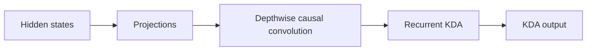
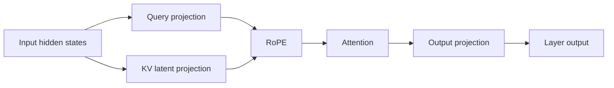
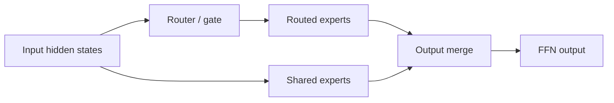

# Understanding Kimi K3: Model Structure and Performance Analysis

> Status: draft. This article first establishes K3's model-level structure.
> Prefill, decode, capacity, memory-access, and compute analysis will follow.

## Notation

| Symbol                                                                                                                  | Definition                         | K3 value or rule                                                   |
| ----------------------------------------------------------------------------------------------------------------------- | ---------------------------------- | ------------------------------------------------------------------ |
| $N_{\mathrm{L}}$                                                                                                      | Total number of decoder layers     | 93                                                                 |
| $N_{\mathrm{KDA}}$                                                                                                    | Number of KDA decoder layers       | 69                                                                 |
| $N_{\mathrm{MLA}}$                                                                                                    | Number of MLA decoder layers       | 24                                                                 |
| $N_{\mathrm{Dense}}$                                                                                                  | Number of dense-FFN decoder layers | 1                                                                  |
| $N_{\mathrm{MoE}}$                                                                                                    | Number of MoE decoder layers       | 92                                                                 |
| $\mathcal{L}_{\mathrm{KDA}}$                                                                                                    | Set of KDA layer indices           | All indices outside $\mathcal{L}_{\mathrm{MLA}}$                         |
| $\mathcal{L}_{\mathrm{MLA}}$                                                                                          | Set of MLA layer indices           | 4, 8, 12, ..., 92, 93 (one-based)                                  |
| $P_{\mathrm{attn}}$                                                                                                   | Attention-layer placement pattern  | Three KDA layers followed by one MLA layer, plus a final MLA layer |
| $P_{\mathrm{ffn}}$                                                                                                    | FFN placement pattern              | Layer 1 is dense; layers 2--93 are MoE                             |
| $W_{\mathrm{total}}$                                                                                                  | Total checkpoint tensor payload    | 1,560.860 GB                                                       |
| $W_c$                                                                                                                 | Weight footprint of component $c$ | Component-dependent                                                |
| $F_{\mathrm{store}}$                                                                                                  | Logical weight storage format      | MXFP4, BF16, or FP32                                               |
| $D_{\mathrm{backing}}$                                                                                                | Safetensors backing tensor dtype   | U8, BF16, or FP32                                                  |

Values are derived from the published [Kimi-K3 configuration](https://huggingface.co/moonshotai/Kimi-K3/blob/main/config.json).

The following identities hold:

$$
\begin{aligned}
N_{\mathrm{KDA}} + N_{\mathrm{MLA}} &= N_{\mathrm{L}}, \\
N_{\mathrm{Dense}} + N_{\mathrm{MoE}} &= N_{\mathrm{L}}.
\end{aligned}
$$

Symbols for batch size, sequence length, cache capacity, state size, and data type will be introduced with the capacity model.

## 1. What Is K3 Made Of?

K3 has three major compute components: Kimi Delta Attention (KDA), Multi-head
Latent Attention (MLA), and the feed-forward network (FFN). KDA and MLA are two
attention mechanisms; every decoder layer also contains a dense or
Mixture-of-Experts (MoE) FFN.

### 1.1 Kimi Delta Attention

KDA is K3's linear-attention component:



At this level, **Projections** covers the input-side projections, gates, and
output projection. Reshaping, normalization, and state-management details are
left to the implementation analysis.

- Each live sequence owns a fixed-size recurrent state.
- State capacity grows with resident sequence count, not historical length.
- Prefill uses chunked recurrence.
- Decode reads, updates, and writes the state at every step.

### 1.2 Multi-head Latent Attention

MLA is K3's full-attention component:



- It stores a per-token KV or latent cache.
- Cache capacity grows with retained context length.
- Prefill exposes substantial token parallelism.
- Decode reads historical cache entries.

### 1.3 Feed-Forward Network

The FFN is either a dense MLP or an MoE block:



- FFN and expert weights account for a large part of model capacity.
- MoE activates only a subset of routed experts per token.
- Compute scales with current tokens and activated experts.
- Expert parallelism adds dispatch, all-to-all, and combine communication.

## 2. How Are KDA, MLA, and FFN Composed?

They are not one fixed `KDA → MLA → FFN` pipeline. KDA and MLA are alternative
attention types in different decoder layers. Each layer connects its selected
attention mechanism to a dense or MoE FFN.

```mermaid
flowchart LR
    X["Embedding output"]
    X --> L1["Decoder Layer 1<br/>KDA → Dense FFN"]
    L1 --> L2["Decoder Layer 2<br/>KDA → MoE FFN"]
    L2 --> L3["Decoder Layer 3<br/>KDA → MoE FFN"]
    L3 --> L4["Decoder Layer 4<br/>MLA → MoE FFN"]

    subgraph HB["Layers 5--92 · repeated 22 times"]
        direction LR
        K1["KDA → MoE FFN"]
        K2["KDA → MoE FFN"]
        K3["KDA → MoE FFN"]
        M1["MLA → MoE FFN"]
        K1 --> K2 --> K3 --> M1
    end

    L4 --> K1
    M1 --> L93["Decoder Layer 93<br/>MLA → MoE FFN"]
    L93 --> N["Final RMSNorm"]
    N --> HEAD["LM head"]
```



At model level, execution resembles:

```text
Embedding
→ [(KDA/Linear Attention → FFN) × 3
   → (MLA/Full Attention → FFN)] × 23
→ Final MLA/Full Attention → MoE FFN
→ Final normalization
→ LM head
```

## 3. Weight Footprint Analysis

Weight footprint is the static memory baseline for the later runtime-capacity analysis. The measurements in this section are derived from the safetensors headers under `/mnt/public/Kimi-K3`; no weight tensors need to be loaded. The checkpoint contains 1,560.860 GB (1.419 TiB) of tensor payload.

### 3.1 Overall Weight Composition

Use a horizontal stacked bar to show the fraction of the complete checkpoint assigned to each model component.

| Component                          | Footprint (GB) |   Share |
| ---------------------------------- | -------------: | ------: |
| MoE routed experts                 |      1,446.456 | 92.670% |
| KDA attention                      |         61.258 |  3.925% |
| MoE shared experts                 |         24.310 |  1.557% |
| MLA attention                      |         11.145 |  0.714% |
| MoE router and latent projections  |         10.637 |  0.681% |
| Embedding, LM head, and final norm |          4.698 |  0.301% |
| Dense FFN                          |          1.453 |  0.093% |
| Vision tower                       |          0.802 |  0.051% |
| Multimodal projector               |          0.092 |  0.006% |
| Norm and residual parameters       |          0.008 |  0.001% |

<iframe
  src="./assets/k3-weight-footprint.html"
  title="Interactive K3 weight-footprint analysis"
  width="100%"
  height="720"
  loading="lazy"
  style="border: 0; border-radius: 12px;">
</iframe>

[Open the interactive weight-footprint view in a separate page](./assets/k3-weight-footprint.html)

Each routed expert contains exactly one W1, W2, and W3 matrix. Each matrix occupies 5.505 MB of packed payload plus 0.344 MB of scale data, or 5.849 MB in total. Therefore one routed expert occupies 17.547 MB. This is a derived summary, not an additional branch in the footprint tree.

The first-order result is that K3 weight capacity is dominated by routed experts. They account for 92.67% of the stored tensor payload.

### 3.2 Non-routed Weight Composition

The routed experts should be removed in a second chart so that the remaining 114.404 GB is visible. Use a horizontal bar or treemap for KDA, MLA, shared experts, router and latent projections, the dense FFN, embeddings, and the vision components. This view exposes the attention footprint that is hidden in the overall chart.

Within the non-routed footprint, KDA is the largest component at approximately 53.55%, followed by shared experts at 21.25%, MLA at 9.74%, and MoE router and latent projections at 9.30%.

### 3.3 Average Footprint per Layer

Normalize each repeated component by its layer count. This separates total model composition from the cost of one layer instance.

| Component                         | Total (GB) | Layer count | Average (GB/layer) |
| --------------------------------- | ---------: | ----------: | -----------------: |
| KDA attention                     |     61.258 |          69 |              0.888 |
| MLA attention                     |     11.145 |          24 |              0.464 |
| MoE routed experts                |  1,446.456 |          92 |             15.722 |
| MoE shared experts                |     24.310 |          92 |              0.264 |
| MoE router and latent projections |     10.637 |          92 |              0.116 |
| Dense FFN                         |      1.453 |           1 |              1.453 |

A KDA attention layer stores about 1.91 times as many weight bytes as an MLA attention layer. Nevertheless, one MoE layer stores far more weight than either attention type because it contains 896 routed experts.

### 3.4 Weight Storage Format and Backing Dtype

Use a fourth horizontal stacked bar to show the checkpoint payload by logical weight format. The backing tensor dtype should be shown as a secondary annotation, not as the primary category.

| Logical format | Backing dtype | Footprint (GB) |   Share | Interpretation                                                          |
| -------------- | ------------- | -------------: | ------: | ----------------------------------------------------------------------- |
| MXFP4          | U8            |      1,446.456 | 92.670% | Packed routed-expert weights and associated quantization metadata       |
| BF16           | BF16          |        114.360 |  7.327% | Attention, shared/dense FFN, embeddings, and other uncompressed weights |
| FP32           | FP32          |          0.044 |  0.003% | Biases and selected numerical parameters                                |

The routed-expert format is MXFP4. Safetensors represents its packed payload and associated metadata with U8 backing tensors; U8 describes the byte container, not an INT8 numerical format. No FP8 tensors are stored in this checkpoint. Storage format is also distinct from compute dtype: runtime kernels interpret the MXFP4 payload according to its quantization metadata, may accumulate in BF16 or FP32, and may create backend-specific packed buffers. Consequently, this chart describes checkpoint footprint; runtime resident memory must be measured separately after TP/EP sharding and weight preparation.

## 4. Cache Capacity: Latent Cache and SSM Slots

This chapter separates K3's persistent runtime cache into two families. The MLA
Latent Cache is allocated per cached token and therefore grows linearly with
resident context length, whereas the KDA SSM Slot is allocated per resident
sequence and remains fixed with respect to history length. The analysis will
derive their per-layer and whole-model footprints, include cache dtype and
allocation granularity, and identify the context-length crossover at which one
family becomes the dominant cache-capacity cost.

## 5. Partitioning: Weights, Latent Cache, and SSM Slots

This chapter maps the capacity results onto a distributed deployment. It will
show how TP, EP, and DP affect routed and non-routed weights, whether the MLA
Latent Cache and KDA SSM Slots are sharded or replicated, and how much memory
remains per rank for active requests. The result will be a per-rank capacity
model that connects the static checkpoint footprint to feasible batch size and
context length before the Prefill and Decode performance analysis.

## 6. Prefill Analysis

To be written after the target checkpoint configuration is confirmed.

## 7. Decode Analysis

To be written after the target checkpoint configuration is confirmed.
