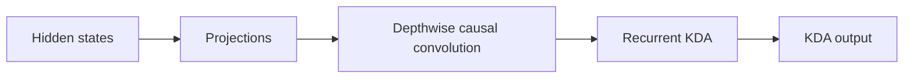
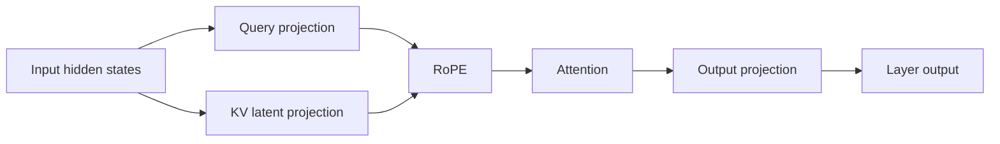
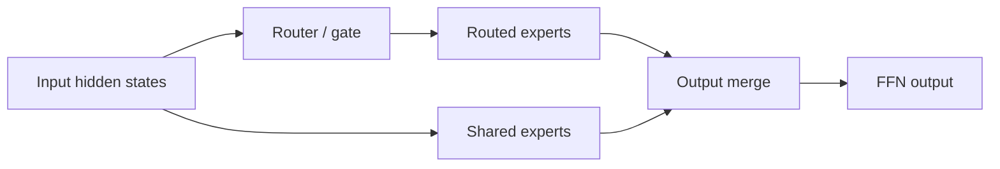
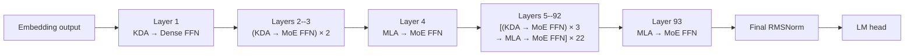

# Understanding Kimi K3: Model Structure and Performance Analysis

> Status: draft. This article first establishes K3's model-level structure.
> Prefill, decode, capacity, memory-access, and compute analysis will follow.

## Notation

| Symbol                                                                                                                  | Definition                         | K3 value or rule                                                   |
| ----------------------------------------------------------------------------------------------------------------------- | ---------------------------------- | ------------------------------------------------------------------ |
| $N_{\mathrm{L}}$                                                                                                      | Total number of decoder layers     | 93                                                                 |
| $N_{\mathrm{KDA}}$                                                                                                    | Number of KDA decoder layers       | 69                                                                 |
| $N_{\mathrm{MLA}}$                                                                                                    | Number of MLA decoder layers       | 24                                                                 |
| $N_{\mathrm{Dense}}$                                                                                                  | Number of dense-FFN decoder layers | 1                                                                  |
| $N_{\mathrm{MoE}}$                                                                                                    | Number of MoE decoder layers       | 92                                                                 |
| $\mathcal{L}_{\mathrm{KDA}}$                                                                                                    | Set of KDA layer indices           | All indices outside $\mathcal{L}_{\mathrm{MLA}}$                         |
| $\mathcal{L}_{\mathrm{MLA}}$                                                                                          | Set of MLA layer indices           | 4, 8, 12, ..., 92, 93 (one-based)                                  |
| $P_{\mathrm{attn}}$                                                                                                   | Attention-layer placement pattern  | Three KDA layers followed by one MLA layer, plus a final MLA layer |
| $P_{\mathrm{ffn}}$                                                                                                    | FFN placement pattern              | Layer 1 is dense; layers 2--93 are MoE                             |
| $W_{\mathrm{total}}$                                                                                                  | Total checkpoint tensor payload    | 1,560.860 GB                                                       |
| $W_c$                                                                                                                 | Weight footprint of component $c$ | Component-dependent                                                |
| $F_{\mathrm{store}}$                                                                                                  | Logical weight storage format      | MXFP4, BF16, or FP32                                               |
| $D_{\mathrm{backing}}$                                                                                                | Safetensors backing tensor dtype   | U8, BF16, or FP32                                                  |

Values are derived from the published [Kimi-K3 configuration](https://huggingface.co/moonshotai/Kimi-K3/blob/main/config.json).

The following identities hold:

$$
\begin{aligned}
N_{\mathrm{KDA}} + N_{\mathrm{MLA}} &= N_{\mathrm{L}}, \\
N_{\mathrm{Dense}} + N_{\mathrm{MoE}} &= N_{\mathrm{L}}.
\end{aligned}
$$

Symbols for batch size, sequence length, cache capacity, state size, and data type will be introduced with the capacity model.

## 1. What Is K3 Made Of?

K3 has three major compute components: Kimi Delta Attention (KDA), Multi-head
Latent Attention (MLA), and the feed-forward network (FFN). KDA and MLA are two
attention mechanisms; every decoder layer also contains a dense or
Mixture-of-Experts (MoE) FFN.

### 1.1 Kimi Delta Attention

KDA is K3's linear-attention component:



At this level, **Projections** covers the input-side projections, gates, and
output projection. Reshaping, normalization, and state-management details are
left to the implementation analysis.

- Each live sequence owns a fixed-size recurrent state.
- State capacity grows with resident sequence count, not historical length.
- Prefill uses chunked recurrence.
- Decode reads, updates, and writes the state at every step.

### 1.2 Multi-head Latent Attention

MLA is K3's full-attention component:



- It stores a per-token KV or latent cache.
- Cache capacity grows with retained context length.
- Prefill exposes substantial token parallelism.
- Decode reads historical cache entries.

### 1.3 Feed-Forward Network

The FFN is either a dense MLP or an MoE block:



- FFN and expert weights account for a large part of model capacity.
- MoE activates only a subset of routed experts per token.
- Compute scales with current tokens and activated experts.
- Expert parallelism adds dispatch, all-to-all, and combine communication.

## 2. How Are KDA, MLA, and FFN Composed?

They are not one fixed `KDA → MLA → FFN` pipeline. KDA and MLA are alternative
attention types in different decoder layers. Each layer connects its selected
attention mechanism to a dense or MoE FFN.



At model level, execution resembles:

```text
Embedding
→ Layer 1: KDA → Dense FFN
→ Layers 2--3: (KDA → MoE FFN) × 2
→ Layer 4: MLA → MoE FFN
→ Layers 5--92: [(KDA → MoE FFN) × 3 → MLA → MoE FFN] × 22
→ Layer 93: MLA → MoE FFN
→ Final RMSNorm → LM head
```

## 3. Weight Footprint Analysis

Weight footprint is the static memory baseline for the later runtime-capacity analysis. The measurements in this section are derived from the safetensors headers under `/mnt/public/Kimi-K3`; no weight tensors need to be loaded. The checkpoint contains 1,560.860 GB (1.419 TiB) of tensor payload.

### 3.1 Overall Weight Composition

Use a horizontal stacked bar to show the fraction of the complete checkpoint assigned to each model component.

<iframe
  src="../../assets/k3-weight-footprint.html"
  title="Interactive K3 weight-footprint analysis"
  width="100%"
  height="720"
  loading="lazy"
  style="border: 0; border-radius: 12px;">
</iframe>

!!! important "Routed experts dominate total weight capacity"

    Routed experts account for **92.67%**, or **1.446 TB**, of the stored
    checkpoint tensor payload. Expert parallelism is therefore the primary
    mechanism for making the model weights fit across devices.

!!! warning "KDA and MLA weights are still a substantial replicated floor"

    KDA and MLA together occupy **72.403 GB**: **61.258 GB** for KDA and
    **11.145 GB** for MLA. EP partitions routed experts, but it does not by
    itself partition these attention weights. With DP+EP and no attention TP,
    approximately **72.4 GB** of attention weights remains replicated per
    rank, before embeddings, dense/shared FFNs, caches, and runtime workspaces
    are included.

### 3.2 Weight Storage Format and Backing Dtype

Use a fourth horizontal stacked bar to show the checkpoint payload by logical weight format. The backing tensor dtype should be shown as a secondary annotation, not as the primary category.

| Logical format | Backing dtype | Footprint (GB) |   Share | Interpretation                                                          |
| -------------- | ------------- | -------------: | ------: | ----------------------------------------------------------------------- |
| MXFP4          | U8            |      1,446.456 | 92.670% | Packed routed-expert weights and associated quantization metadata       |
| BF16           | BF16          |        114.360 |  7.327% | Attention, shared/dense FFN, embeddings, and other uncompressed weights |
| FP32           | FP32          |          0.044 |  0.003% | Biases and selected numerical parameters                                |

The U8 tensors contain packed MXFP4 expert weights and quantization metadata; they are not INT8 weights, and the checkpoint contains no FP8 tensors. These values describe checkpoint storage, while per-rank runtime memory depends on sharding and backend weight preparation.

## 4. Cache Capacity: Latent Cache and SSM Slots

K3 has two persistent cache families with different capacity laws. Let $N_T$
denote the number of cached tokens and $N_S$ the number of allocated sequence
slots.

| Cache tensor | Logical shape | Storage dtype | Whole-model capacity |
| --- | --- | --- | ---: |
| MLA latent cache | $[N_T,512+64]$ | Mixed FP8/BF16 | 15.744 KB/token |
| KDA convolution state | $[N_S,36864,4]$ | BF16 | 20.349 MB/slot |
| KDA recurrent state | $[N_S,96,128,128]$ | BF16 | 217.055 MB/slot |

Each MLA layer uses 656 bytes per token: FP8 latent values and scales plus a
BF16 RoPE component. Across 24 MLA and 69 KDA layers,

$$
C_{\mathrm{cache}}
=15.744\,\mathrm{KB}\times N_T
+237.404\,\mathrm{MB}\times N_S.
$$

At one million resident tokens this is 15.375 GiB of MLA cache. The MLA latent is replicated across attention-TP ranks because all
query-head shards consume it; KDA states are head-sharded by attention TP.

## 5. Activation Memory

Activation capacity is determined by peak liveness, not by summing all 93
layers. KDA or MLA executes before its FFN, and the allocator can reuse storage
between decoder layers. The deployment question is therefore which component
creates the largest live allocation and which backend reserves persistent
workspace.

The measurements below use one B300 and a 16K active Prefill chunk. The MLA
point includes a 1M visible context with the production 128K prefix split. The
MegaMoE point uses NanoDeploy's world-size-one production wrapper with K3's 896
MXFP4 experts and Top-16 routing.

| Decoder layer form | Where activation memory is spent | Measured capacity to carry forward |
| --- | --- | ---: |
| KDA + Dense FFN | KDA chunk recurrence intermediates; Dense FFN intermediate for the 16K fresh rows | KDA core peak: 4.125 GiB |
| KDA + MoE FFN | KDA recurrence, followed by the reusable MegaMoE buffer and BF16 output | KDA core: 4.125 GiB; MegaMoE: 5.939 GiB persistent + 0.109 GiB dynamic |
| MLA + MoE FFN | Cached-latent restore, bounded K/V expansion, attention output, followed by MegaMoE | MLA core peak: 17.389 GiB; MegaMoE: 5.939 GiB persistent + 0.109 GiB dynamic |


The bars are component reservations, not values to add within a layer. The KDA,
MLA, and MoE stages execute sequentially. The complete-layer peak is controlled
by their maximum overlapping liveness and allocator reuse.

### 5.1 MegaMoE Persistent Buffer

MegaMoE reserves one symmetric buffer from its configured maximum token
capacity and reuses it across forwards and across all 92 MoE layers. At a 16K
capacity, the measured CUDA reservation is 5.939 GiB. A steady 16K forward adds
0.109 GiB for the BF16 output, giving 6.048 GiB of reserved buffer plus dynamic
activation. The persistent reservation must be counted once per process, not
once per layer.

### 5.2 DeepEP + DeepGEMM

DeepEP + DeepGEMM has the same high-level capacity pattern: a persistent buffer
is reserved for dispatch and combine, then each forward adds activation for
routed rows and grouped GEMMs. The ownership differs from MegaMoE. DeepEP owns
communication and permutation storage, while DeepGEMM consumes the dispatched
expert rows and produces expert outputs. When these buffers are shared across
sequential MoE layers, they are also counted once rather than multiplied by
layer count. Exact bytes are left unreported until an eight-GPU experiment is
available.

### 5.3 Capacity Conclusion

For the measured 1M-context, 16K-chunk path, bounded MLA prefix expansion is the
largest activation peak at 17.389 GiB. KDA recurrence peaks at 4.125 GiB.
MegaMoE contributes a material but predictable 5.939 GiB persistent reservation
and only 0.109 GiB of steady forward activation at 16K tokens.

## 6. Overview of Performance Analysis

The performance analysis separates Prefill from Decode because they expose
different independent variables. Prefill is studied as one request advancing
through a fixed-size fresh chunk. Decode is studied as a batch of active
sequences, each contributing one token while retaining a potentially long
visible context.

### 6.1 Prefill: One Request Is Sufficient

<iframe
  src="../../assets/k3-prefill-performance-overview.html"
  title="K3 Prefill performance variables"
  width="100%" height="400" loading="lazy"
  style="border: 0; border-radius: 12px;">
</iframe>

For Prefill, one request is sufficient to expose the component-level scaling.
Let $C$ be the fresh chunk size and $L$ the logical context visible after that
chunk. The cached prefix contains $L-C$ tokens, so its effective hit rate is

$$
r_{\mathrm{hit}}=\frac{L-C}{L}.
$$

With the reference chunk fixed at $C=8192$, the context sweep is:

| Logical context $L$ | Cached prefix $L-C$ | Fresh chunk $C$ | Effective hit rate |
| ---: | ---: | ---: | ---: |
| 8K | 0 | 8K | 0% |
| 32K | 24K | 8K | 75% |
| 128K | 120K | 8K | 93.75% |
| 256K | 248K | 8K | 96.875% |
| 512K | 504K | 8K | 98.4375% |
| 1M | 1016K | 8K | 99.21875% |

This construction separates the variables cleanly:

| Prefill component | Primary performance variables | Reason |
| --- | --- | --- |
| KDA | Chunk size $C$ | The cached prefix has already been summarized into recurrent state |
| MLA | Chunk size $C$ and visible context $L$ | The fresh queries still attend cached history |
| Dense FFN | Chunk size $C$ | Every fresh token executes the same dense matrices |
| MoE FFN | Chunk size $C$ and routing distribution | Only fresh tokens are routed; expert balance changes achieved utilization |

Using K3's 69 KDA layers, 24 MLA layers, one Dense FFN layer, and 92 MoE
layers, the one-request Prefill model is

$$
T_{\mathrm{prefill}}(C,L)
=69t_{\mathrm{KDA}}(C)
+24t_{\mathrm{MLA}}(C,L)
+t_{\mathrm{Dense}}(C)
+92t_{\mathrm{MoE}}(C).
$$

The first experiment therefore fixes $C=8\mathrm{K}$ and sweeps the six context
lengths above. A separate chunk-size sweep then fixes representative contexts
to determine whether 8K is the best serving point. Multi-request scheduling is
not needed for this component model; it belongs to the system-level serving
analysis after the single-request costs are understood.

### 6.2 Decode: Context Length and Batch Size Separate the Components

<iframe
  src="../../assets/k3-decode-performance-overview.html"
  title="K3 Decode performance variables"
  width="100%" height="400" loading="lazy"
  style="border: 0; border-radius: 12px;">
</iframe>

During Decode, each active sequence contributes one new token. Let $B$ be the
Decode batch size and $L$ the resident context length. MLA reads historical
cache, while KDA consumes a fixed-size recurrent state. Dense and MoE FFNs do
not inspect history.

| Decode component | Primary performance variables | Expected regime |
| --- | --- | --- |
| MLA | Context length $L$, with $B$ reported | Historical-cache traffic grows with visible context |
| KDA | Batch size $B$ | State size per sequence is independent of history length |
| Dense FFN | Batch size $B$ | Weight reuse improves as more current tokens share a forward |
| MoE FFN | Batch size $B$ and routing distribution | Tokens per selected expert determine grouped-GEMM utilization |

The Decode model is

$$
T_{\mathrm{decode}}(B,L)
=69t_{\mathrm{KDA}}(B)
+24t_{\mathrm{MLA}}(B,L)
+t_{\mathrm{Dense}}(B)
+92t_{\mathrm{MoE}}(B).
$$

Although context length is MLA's distinguishing variable, every MLA result must
also report $B$: its actual work scales with the number of active queries as
well as the history visible to each query. KDA and the FFNs use batch size as
their main sweep because they have no history-length term.

### 6.3 Reference Evaluation Matrix

The following values define the axes used by the detailed performance chapters.
The highlighted reference point is an 8K Prefill chunk and a 1M maximum serving
context; Decode batch sizes cover latency-oriented through throughput-oriented
operation.

| Parameter | Reference values |
| --- | --- |
| Prefill chunk size $C$ | 1K, 2K, 4K, **8K**, 16K |
| Decode batch size $B$ | 1, 8, 16, 32, 64, 128, 256 |
| Context length $L$ | 8K, 32K, 128K, 256K, 512K, **1M** |
| Prefix hit rate at $C=8$K | 0%, 75%, 93.75%, 96.875%, 98.4375%, 99.21875% |

The detailed analysis should first report isolated KDA, MLA, Dense, and MoE
curves over these variables, and then compose them using the actual K3 layer
counts. End-to-end TTFT and TPOT are validation of that model rather than the
starting point.

## 7. Performance Analysis

This chapter follows the two serving phases introduced in Chapter 6. Prefill is organized by fresh chunk size and visible context length; Decode is organized by batch size and visible context length. Within each phase, KDA, MLA, and MegaMoE are analyzed separately before their costs are composed at model level.

Dense FFN is omitted as a dedicated performance section because K3 contains only one Dense FFN layer, compared with 92 MoE layers. Its cost will be retained in the final model-level composition, but it is not part of the primary parameter sweep.

The current results are a first mapping of the available component benchmarks. They do not yet represent complete operator breakdowns:

| Component | Current measured boundary | Complete boundary to add |
| --- | --- | --- |
| KDA | Complete production Prefill operator | Input projections, causal convolution, recurrence, gated normalization, and output projection measured separately |
| MLA | Cache restore, KV expansion, and attention core | Q/KV/G projections, latent norms, RoPE/cache operations, attention, gate, and output projection |
| MegaMoE | Pre-dispatch and fused routed-expert operator | Router/latent-down, Top-K, routed path, routed norm/up, shared experts, and output merge |

### 7.1 Prefill

Prefill considers one request. Let $C$ be its fresh chunk size and $L$ the total visible context after the chunk. KDA and MegaMoE process $C$ rows, whereas MLA processes $C$ queries against $L$ visible tokens.


#### 7.1.1 KDA


The complete production KDA operator is measured at $C\in\{1\mathrm{K},2\mathrm{K},4\mathrm{K},8\mathrm{K},16\mathrm{K}\}$ under 32K, 128K, 512K, and 1M logical context. All four curves overlap because the cached prefix has already been summarized into the recurrent state. Complete-forward latency rises from approximately 2.28 ms at 1K tokens to 13.17 ms at 16K.


The breakdown follows the actual forward path: seven input projections (Q, K, V, output gate, beta, forget-A, and forget-B), ragged causal QKV convolution, chunk KDA recurrence, per-head gated normalization, and output projection. At the 8K reference chunk, their representative isolated times are 2.68, 0.59, 2.50, 0.47, and 0.77 ms respectively. Input projections and recurrence now dominate at approximately 38% and 36% of the isolated-stage sum; causal convolution contributes only 8.4%. The dashed complete-forward line is measured independently; the stacked stages are not used as a substitute for end-to-end latency.

!!! success "Predictable performance"

    KDA latency is highly linear after the small-chunk launch-dominated region: fitting all 20 complete-forward measurements gives $R^2=0.9936$, a slope of approximately $0.731\,\mu\mathrm{s/token}$, and a fixed intercept of approximately $1.00\,\mathrm{ms}$. Together with the stable stage composition, this makes Prefill cost directly predictable for scheduler capacity planning.

!!! important "Chunk-size driven, not context-length driven"

    For a fixed chunk, the complete-forward measurements across 32K, 128K, 512K, and 1M context differ by at most approximately 1.6%, with no growth trend. Once the prefix is represented by the recurrent state, KDA processes only the fresh chunk.

!!! success "SGLang-style ragged convolution removes the former bottleneck"

    NanoDeploy now applies the causal convolution directly to ragged Q, K, and V tensors and fuses persistent-state read and update into the Triton kernel. It no longer constructs a concatenated padded QKV workspace or performs a separate tail-state extraction. At the 8K reference point, convolution falls from approximately 7.98 ms to 0.59 ms (13.5x), while complete-layer latency falls from approximately 15.2 ms to 6.72 ms (2.27x).

    Throughput now rises from 449K tokens/s at 1K to 1.13M at 4K, 1.22M at 8K, and 1.24M at 16K. The remaining plateau begins only after the projection GEMMs and KDA recurrence become the dominant stages; latency scaling alone is still insufficient to label the complete layer compute-bound.

#### 7.1.2 MLA

MLA is reported at two explicit boundaries. The first is the cached-prefix kernel pipeline. The second is the complete K3 MLA attention computation path, which adds all projections, latent normalization and cache write, fresh K/V expansion, gating, and output projection. All experiments use one B300, a mixed FP8/BF16 cache, and the production 128K prefix split. The chunk sweep fixes context at 1M; the complementary context sweep fixes the fresh chunk at 16K.

##### 7.1.2.1 Cached-Prefix Kernel Pipeline


This figure is a **kernel-pipeline breakdown**, not a Decoder Layer. Panel (a) fixes visible context at 1M and varies the fresh chunk; panel (b) fixes the fresh chunk at 16K and varies visible context from 32K to 1M. Both start from projected Q and fresh compressed KV, then measure FP8 cache restoration, fresh causal attention, cached-prefix K/V expansion, prefix attention, and LSE-weighted result merging.

In panel (a), average achieved throughput for the complete kernel boundary rises from approximately 8.77 × 10^5 GFLOP/s at 1K to 1.57 × 10^6 GFLOP/s at 16K. The B300 BF16 Tensor Core peak is a hardware reference rather than an attainable bound for every restore, merge, or elementwise kernel. At the 1M-context, 16K-chunk point, the pipeline takes 683.6 ms: prefix attention contributes 597.0 ms, prefix K/V expansion 56.0 ms, LSE merge 21.5 ms, cache restore 4.8 ms, and fresh attention 4.3 ms.


Both cumulative panels fix the fresh chunk at 16K and sweep visible context from 32K to 1M. Panel (a) expands the cached-prefix kernel pipeline: prefix K/V expansion grows from 1.46 ms to 56.01 ms, while prefix attention grows from 8.84 ms to 596.69 ms. Panel (b) places that pipeline inside the complete MLA attention layer, adding projections, latent normalization and cache write, fresh K/V expansion, gating, and output projection. The shared axes make the comparatively small layer overhead directly visible.

##### 7.1.2.2 Complete MLA Attention Layer

Panel (b) is the complete K3 MLA attention computation path. The stacked bars are stage measurements, while the black dashed curve is an independently timed complete forward. At 1M context, the complete path takes 689.7 ms, only 6.1 ms above the 683.6 ms kernel pipeline. Therefore long-context MLA is dominated by cached-prefix expansion, attention, and merge rather than its layer projections.

The complete-layer average throughput grows from approximately 8.71 × 10^5 GFLOP/s at 1K to 1.57 × 10^6 GFLOP/s at 16K. This is the appropriate cumulative Layer view; the preceding figure remains the place to diagnose individual cache/attention kernels.

#### 7.1.3 MegaMoE


The existing production MXFP4 MegaMoE benchmark uses 896 experts, Top-16 routing, latent width 3584, and intermediate width 3072. Its synthetic expert IDs are round-robin, so the routed-row counts differ by at most one and form the perfect-balance baseline. Latency is nearly flat from 1K to 4K (5.67--6.18 ms), then reaches 7.02 ms at 8K and 12.72 ms at 16K.

The next experiment will measure the complete MoE path and break it into router/latent-down, Top-K, pre-dispatch, fused routed experts, routed norm/up, shared experts, and output merge. Routing imbalance will be added only after its load-distribution metric and synthetic distributions are agreed upon.

### 7.2 Decode

During Decode, each active sequence contributes one token. KDA and MegaMoE primarily sweep batch size $B$; MLA must sweep both $B$ and visible context length $L$.

#### 7.2.1 KDA


The recurrent-core latency stays near 0.09 ms through batch 8, then reaches 0.535 ms at batch 256. Throughput rises from 11.3K to 478K tokens/s and begins to flatten after batch 128. As in Prefill, the complete KDA projections, convolution, gated normalization, and output projection remain to be added to the breakdown.

#### 7.2.2 MLA

The required evaluation matrix is $B\times L$: batch size controls the number of current queries, while context length controls the latent-cache history read by each query. The current Prefill cached-prefix measurements cannot substitute for the production paged-cache Decode path, so no Decode MLA result is claimed yet.

The breakdown will include query/KV preparation, paged latent-cache attention, output gate, and output projection, with cache traffic reported separately from projection traffic.

#### 7.2.3 MegaMoE

The required Decode sweep is batch size crossed with routing balance. The perfect-balance case will be measured first, followed by controlled imbalance after defining max-to-mean expert load, coefficient of variation, and active-expert ratio. The same complete MoE breakdown used for Prefill will be retained so the small-batch dispatch floor is visible.

### 7.3 Model-Level Composition and Bottleneck Summary

After the complete operator curves are available, the Prefill and Decode models will be composed using K3's actual layer counts:

$$
T_{mathrm{K3}}
=69T_{mathrm{KDA}}+24T_{mathrm{MLA}}+92T_{mathrm{MoE}}+T_{mathrm{Dense}}.
$$

The single Dense FFN term remains in this equation even though it is omitted from the detailed sweep. Final memory-bound or compute-bound labels will require achieved FLOP/s, HBM bytes, SM utilization, tensor-core utilization, and kernel launch gaps rather than latency scaling alone.

The benchmark inputs, raw CSV/JSON results, and plotting scripts are kept under `bench/k3_layer_performance/`.

## 8. Joint Capacity, Compute, Memory Traffic, and Communication

The useful deployment question is not whether one isolated kernel is fast. It
is whether a parallel layout can hold K3's resident state and keep the GPUs fed
through both Prefill and Decode. This chapter therefore combines the four
quantities established above: weights, persistent cache, transient activation,
and bytes exchanged between the attention and FFN meshes.

### 8.1 Reference Topologies and Ownership

Let $D_A$ and $T_A$ denote attention data and tensor parallelism, and let $E$
and $T_F$ denote FFN expert and tensor parallelism. With no pipeline
parallelism, NanoDeploy requires

$$
D_A T_A = D_F E T_F = W,
$$

where $W$ is the worker count. Two layouts clarify the trade-off:

| Layout | Attention mesh | FFN mesh | Purpose |
| --- | --- | --- | --- |
| DP16/EP16 | $D_A=16,T_A=1$ | $E=16,T_F=1$ | Minimum attention communication, large replicated attention floor |
| DP2/TP8/EP16 | $D_A=2,T_A=8$ | $E=16,T_F=1$ | Target K3 validation layout; shards attention weights and KDA heads |

DP partitions requests, not tensors. Increasing DP therefore does not reduce the
weight footprint of a rank. EP divides the 896 routed experts, while the router,
routed latent projections, and shared experts remain replicated. Attention TP
shards query heads and most KDA/MLA projection matrices. The MLA latent cache is
still replicated inside an attention-TP group because every query-head shard
uses the same compressed latent. KDA convolution and recurrent states are
head-sharded by $T_A$.

| Resident object | Partitioning rule |
| --- | --- |
| Routed-expert weights | Approximately $1/E$ per FFN rank: $896/E$ experts |
| Router, routed latent projections, shared experts | Replicated across EP ranks |
| KDA/MLA projection weights | Predominantly $1/T_A$; small latent projections and norms may remain replicated |
| MLA Latent Cache | Requests split by $D_A$; complete latent rows replicated across $T_A$ |
| KDA SSM Slot | Requests split by $D_A$ and 96 heads split by $T_A$ |
| Activations | Local request rows in attention DP; redistributed at attention/FFN boundaries |

### 8.2 Per-Rank Capacity

Using decimal checkpoint payloads, a first-order weight model is

$$
M_{\mathrm{rank}}^{\mathrm{weight}}
\approx \frac{1446.456}{E}
+M_{\mathrm{MoE,repl}}
+\frac{72.403}{T_A}
+M_{\mathrm{other}}
\quad\mathrm{GB}.
$$

The 72.403 GB term is KDA plus MLA attention. The replicated MoE floor contains
24.310 GB of shared experts, 10.637 GB of router/latent infrastructure, and the
1.453 GB dense FFN when $T_F=1$. This is why EP alone is not a complete answer:
DP16/EP16 still retains roughly **204.8 GB/rank** of checkpoint payload. For
DP2/TP8/EP16, treating all 7.054 GB of miscellaneous weights conservatively as
replicated gives **142.9 GB/rank**; sharding its embedding/LM-head portion lowers
the estimate toward **136.7 GB/rank**. Backend repacking and first-use
workspaces must be added separately.

For a rank owning $N_T$ resident tokens and $N_S$ active sequence slots, the
mixed-cache estimate is

$$
M_{\mathrm{rank}}^{\mathrm{cache}}
=24\times656N_T
+\frac{237.404\,\mathrm{MB}}{T_A}N_S.
$$

Thus a one-million-token request costs 15.375 GiB of MLA cache on every rank in
its attention-TP group. One KDA slot costs 226.4 MiB at $T_A=1$, but only about
28.3 MiB at $T_A=8$. TP is therefore highly effective for KDA slots and
attention weights, but it does not divide the MLA latent cache. The final
capacity constraint is

$$
M_{\mathrm{weight}}+M_{\mathrm{cache}}+M_{\mathrm{activation}}+
M_{\mathrm{workspace}} < M_{\mathrm{usable\ HBM}}.
$$

The measured 16K Prefill activation peaks from Chapter 5 cannot simply be added:
KDA, MLA, and MoE execute sequentially and reuse allocator storage. They are
upper-bound candidates for a complete-layer peak, while MegaMoE's first-use
workspace remains a separate deployment reservation.

### 8.3 Compute Model

The following counts use two FLOPs per multiply-add and checkpoint matrix
shapes. They are algorithmic counts rather than achieved throughput.

| Component | Dense work per active token | Context-dependent work |
| --- | ---: | ---: |
| KDA attention | 0.887 GFLOP projections + approximately 0.006 GFLOP recurrence | Fixed per token; independent of history length |
| MLA attention | 0.464 GFLOP projections | $2N_H(D_Q+D_V)N_QN_K$ |
| MoE FFN | 1.437 GFLOP for Top-16 routed experts, two shared experts, latent projections, and router | Depends on active tokens and expert reuse, not history length |
| Dense FFN | 1.453 GFLOP | Active tokens only |

Across the full model, projections, KDA, and FFNs contribute approximately
206 GFLOP per active token before MLA attention. For a fresh causal 16K Prefill,
all 24 MLA layers add about 0.20 PFLOP, so the FFN/projection stack remains the
larger compute body. The balance reverses for a cache hit with 16K new queries
and a 1M visible history: MLA attention adds about **25.3 PFLOP** across 24
layers, while the rest of the model adds about **3.4 PFLOP**. For 1M-context
Decode, MLA contributes about 64.4 GFLOP per layer, or 1.55 TFLOP across the
model for every generated token.

Partitioning distributes this work but does not change the global count.
Attention TP divides heads approximately by $T_A$; EP sends tokens to the ranks
owning their selected experts. Actual MoE balance depends on the routing
histogram, so $1/E$ is a capacity rule, not a guarantee that every rank receives
exactly $1/E$ of the computation.

### 8.4 HBM Traffic and Arithmetic Intensity

Decode and Prefill stress different data paths. At batch-one Decode, weights
have little reuse. One KDA layer has about 0.888 GB of BF16 weights for roughly
0.893 GFLOP, close to one FLOP per weight byte before TP. One selected routed
expert occupies 17.547 MB; Top-16 therefore exposes as much as 280.8 MB of
expert payload per token per MoE layer before cache reuse. Adding shared
experts, router, and latent projections gives a roughly 0.66 GB/layer
weight-traffic ceiling for batch-one MoE. Larger Decode batches improve this by
reusing a resident expert tile for multiple routed tokens.

KDA's history-independent compute does not mean zero state traffic. Each layer
reads and writes roughly 3.44 MB of convolution and recurrent state per sequence
at $T_A=1$, or about 6.88 MB of state traffic per Decode step. TP divides this
term by $T_A$. MLA behaves oppositely: at 1M context its FP8 latent-cache lower
bound is 656 MiB per layer, and all 24 MLA layers expose 15.375 GiB of persistent
cache bytes per generated token before implementation-specific rereads.

For the 1M/16K cached-Prefill case, expanding one layer's latent cache produces
60 GiB of BF16 K/V. The old unsplit path writes the expanded tensors, reads and
copies them into joined tensors, and then reads the joined K/V in attention. A
lower-bound accounting is therefore about 240 GiB/layer, excluding GEMM input,
output, and tile rereads. Prefix chunking removes the full-context join and cuts
that lower bound toward 120 GiB/layer, while adding small output/LSE merges.
It bounds peak liveness and removes a complete copy, but it does not reduce the
$N_QN_K$ attention FLOPs.

This explains the phase behavior:

- Prefill GEMMs reuse weights across thousands of active tokens and can approach
  compute throughput; long cached-prefix MLA becomes attention-compute and
  expanded-K/V-traffic heavy.
- Decode repeatedly streams weights, KDA state, and MLA history for few active
  tokens, so weight/cache bandwidth and collective latency dominate much sooner.
- MoE moves from bandwidth-bound at small batches toward compute-bound only when
  routing supplies enough tokens per local expert to amortize its MXFP4 payload.

### 8.5 Communication Volume

A BF16 hidden row has

$$
7168\times2=14{,}336\ \mathrm{bytes}.
$$

The attention output projection can feed the FFN mesh through reduce-scatter,
and the FFN result returns through all-gather. For $N_A$ active tokens, each
logical boundary tensor is $14{,}336N_A$ bytes: 224 MiB at 16K Prefill, but only
14 KiB for batch-one Decode. The former is bandwidth dominated; the latter is
latency dominated.

MoE dispatch is wider because every token selects 16 experts. After the
$7168\rightarrow3584$ routed projection, the worst-case logical dispatch
payload is

$$
N_A\times16\times3584\times2,
$$

or 1.75 GiB for 16K tokens before accounting for locally owned experts. With
uniform routing, approximately $1-1/E$ crosses rank boundaries. Indices and
scores are small beside the dispatched activations. Combine traffic has the
same first-order dependence on active tokens, Top-K, and latent width.

### 8.6 Measured B300 Collectives

The local experiment used 2 and 4 NVLink-connected NVIDIA B300 SXM6 GPUs, BF16
`[N_A,7168]` tensors, five warm-up iterations, and twenty CUDA-event-timed
iterations. It measures raw NCCL collectives, not Ray scheduling or MegaMoE.
The reported payload rate uses the logical tensor size and is not NCCL's
topology-adjusted bus bandwidth.


At 16K tokens (224 MiB), the four-GPU measurements were 0.623 ms for all-reduce,
0.362 ms for reduce-scatter, 0.350 ms for all-gather, and 0.375 ms for
all-to-all. Replacing `all-reduce + local chunk` with reduce-scatter is therefore
material at Prefill sizes. At 16 tokens all four operations are only 224 KiB,
but take roughly 27--58 microseconds; Decode cannot infer its cost from GB/s
curves because launch and synchronization latency dominate.

These measurements do not extrapolate directly to DP2/TP8/EP16: this host has
four GPUs, while the target topology spans 16 workers and may cross nodes. They
do establish the local boundary cost and the payload scaling. A production run
must repeat the same benchmark on the final NVLink/IB topology and measure
MegaMoE dispatch/combine with the real routing distribution.

### 8.7 Deployment Conclusions

Three constraints dominate different operating points:

1. **Weight capacity:** EP16 reduces routed experts to about 90.4 GB/rank, but
   replicated shared/router/latent weights remain large. Attention TP is needed
   to avoid carrying the additional 72.4 GB KDA+MLA floor intact.
2. **Long-context capacity and traffic:** attention TP divides KDA slots but not
   MLA latent rows. At 1M context, the mixed MLA cache costs 15.375
   GiB per attention rank, and cached-prefix MLA dominates compute and K/V
   traffic unless its expansion is chunked.
3. **Boundary communication:** Prefill moves large tensors and benefits from
   reduce-scatter/all-gather bandwidth. Decode moves small tensors repeatedly
   and is sensitive to collective latency and EP synchronization, especially
   under imbalanced Top-16 routing.

DP+EP is therefore not "free" even though routed experts dominate the
checkpoint. DP increases request capacity and EP makes the 1.446 TB expert bank
feasible, but TP is what reduces the non-routed attention floor and KDA state.
The practical K3 layout must jointly budget replicated MoE weights, replicated
MLA cache, sharded KDA state, transient Prefill expansion, and the cost of
crossing between the attention and FFN meshes.
