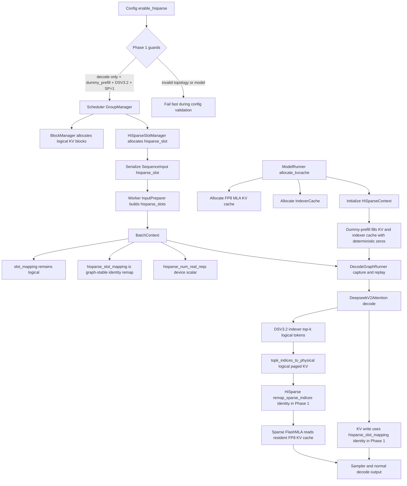

# HiSparse Design for DLEngine

## Goal and scope

This document describes the first DLEngine HiSparse implementation.  The first
target is intentionally narrow:

- decode-only engine mode;
- dummy-prefill, so the decode engine can run the full scheduling, cache
  allocation, input preparation, CUDA graph capture, and model forward flow
  without requiring a real prefill worker;
- DeepSeek-V3.2 / DSA sparse MLA first;
- preserve the existing CUDA graph behavior.

Real prefill, PD transfer, DSv4 compressed-cache HiSparse, and generalized
HiSparse policies are out of scope for the first patch.  They are still called
out below so that the first version does not paint us into a corner.

The design follows SGLang's current code more than the NSA documentation.  In
particular, the authoritative references are:

- `python/sglang/srt/mem_cache/allocator/hisparse.py`
- `python/sglang/srt/mem_cache/hisparse_memory_pool.py`
- `python/sglang/srt/managers/hisparse_coordinator.py`
- `python/sglang/srt/model_executor/model_runner.py`
- `python/sglang/srt/model_executor/runner/decode_cuda_graph_runner.py`
- `sgl-kernel/python/sgl_kernel/top_k.py`
- `sgl-kernel/csrc/common_extension.cc`

## Phase 1 Flow



## Current DLEngine baseline

DLEngine already has a working DeepSeek-V3.2 NSA path:

- `Config.disable_nsa` controls whether DSA is active.
- `CacheContext` can allocate FP8 MLA KV cache and an `IndexerCache`.
- `DeepseekV2Attention` stores FP8 MLA KV and indexer keys during prefill.
- Decode runs the model indexer, converts top-k logical token indices to
  physical paged KV indices, and calls `flash_mla_with_kvcache(..., indices=...)`.
- `DecodeGraphRunner` captures separate FlashMLA metadata for sparse decode.
- `BatchContext` carries `slot_mapping`, `context_lens`, and `block_tables`.

The missing piece is tiering.  Today the sparse top-k result is assumed to be
present in the GPU KV/indexer cache.  HiSparse splits this into:

1. a full logical token namespace used by the scheduler and request metadata;
2. a smaller GPU device-buffer namespace used by sparse attention;
3. a host namespace that holds the cold logical tokens.

For first implementation, dummy-prefill lets us build and validate (1) and (2)
without implementing real host backup/load from a prefill worker.

## Key invariants

HiSparse must keep these invariants:

- The scheduler owns logical KV blocks exactly as it does today.
- The model forward path sees CUDA-stable tensors only.  No Python object lookup
  or dynamic allocation may be required inside a captured graph.
- `slot_mapping` remains the logical output location.  HiSparse remaps it to a
  device-buffer slot before the KV store when needed.
- Sparse attention receives physical device-buffer locations, not logical
  locations.
- Padded CUDA graph batch entries must be valid and cheap.  They use dummy
  slots and early-return guards, not branches that change the captured graph.
- The first version does not rely on the prose NSA docs when behavior conflicts
  with code; SGLang kernels and DLEngine's existing NSA implementation win.

## Architecture

### Scheduler and slots

The C++ scheduler continues to allocate logical KV blocks through
`BlockManager`.  For HiSparse decode we add a second per-sequence slot concept:

- `state_slot`: existing model-state slot used by GDN and DSv4 compressor state.
- `hisparse_slot`: a stable row into HiSparse per-request tensors.

For the first implementation, `hisparse_slot` must be an explicit scheduler slot,
not an alias of `state_slot`.  Different cache families will eventually need
different allocators and block managers; keeping HiSparse on its own slot from
Phase 1 makes ownership and lifetime clear.  Add `hisparse_slot` to
`BlockContext` and the C++ -> Python auxiliary metadata immediately.

The scheduler must reserve one dummy row.  DLEngine already uses the convention
`max_num_seqs` as the dummy state row for DSv4; use the same convention for
HiSparse tensors:

- real slots: `[0, max_num_seqs)`
- dummy slot: `max_num_seqs`

### Runtime context

Add a HiSparse runtime context under `context`, parallel to the existing
cache contexts:

- `context/cache/hisparse.py`
- `HiSparseContext`
- `get_hisparse_context()`
- `reset_hisparse_context()`

The context owns long-lived tensors:

- `full_to_device`: logical token location -> HiSparse device location
- `req_to_device_buffer`: `[max_num_seqs + 1, padded_device_buffer_size]`
- `req_device_buffer_size_cpu`: CPU tensor/list for allocator-side capacity
- `req_device_buffer_tokens`: `[num_layers, max_num_seqs + 1, device_buffer_size]`
- `req_device_buffer_token_locs`: same shape, maps LRU/token slots to device locs
- `topk_device_locs_buffer`: `[max_num_seqs + 1, index_topk]`
- `raw_indices_buffer`: `[max_num_seqs + 1, index_topk]`
- `num_real_reqs`: scalar CUDA tensor used by CUDA graph replay
- dummy locations for padded graph entries

The first version can omit pinned host KV storage and asynchronous backup/load.
It should still create the same tensor shapes so that the CUDA graph and model
call sites are already shaped like the real implementation.

### Cache allocator

Add a DSV3.2 allocator equivalent to SGLang's
`HiSparseTokenToKVPoolAllocator`, adapted to DLEngine's `BlockManager` /
`CacheContext` split.

The allocator exposes two namespaces:

- logical allocation: existing block ids from `BlockManager`;
- device-buffer allocation: a smaller pool of physical KV slots that sparse
  decode can address.

For dummy-prefill:

- logical blocks are allocated normally;
- device-buffer pages are allocated for every scheduled sequence up to
  `hisparse_device_buffer_size`;
- `full_to_device[logical_loc] = device_loc` is filled for the logical locations
  that are resident in the device buffer;
- non-resident logical locations map to `0` or `-1` and must never be selected
  by the first dummy path.

The real host tier later replaces the last bullet with "load selected missing
pages into the device buffer before attention."

### Coordinator Surface

Phase 1 keeps the coordinator surface lightweight inside `HiSparseContext` rather
than adding a full Python coordinator object.  The first patch exposes
graph-stable runtime tensors and remap hooks:

- `hisparse_slots`: stable per-request rows allocated by the scheduler;
- `hisparse_slot_mapping`: logical output slots remapped for KV/indexer writes;
- `hisparse_num_real_reqs`: a CUDA scalar used by future graph-safe kernels;
- `remap_sparse_indices(...)` and `remap_slot_mapping(...)` hooks.

For decode-only dummy-prefill these hooks are identity mappings:

1. all prompt/device slots are considered resident;
2. no host transfer is issued;
3. metadata tensors are still present in eager and CUDA graph paths;
4. the sparse FlashMLA input shape stays `[bs * ntps, index_topk]`.

Phase 2 should replace these hooks with a real `HiSparseCoordinator` that owns
host backup, swap-in, device-buffer allocation, LRU metadata, and request
cleanup.

### Model forward

`DeepseekV2Attention` currently computes:

```text
topk logical token indices -> topk physical paged KV indices -> sparse FlashMLA
```

Under HiSparse it becomes:

```text
topk logical token indices -> HiSparse coordinator -> topk device-buffer indices
```

The model should not know whether the device-buffer mapping came from a dummy
prefill, a hot resident page, or a host swap-in.  It only receives
`sparse_indices` that are valid for the KV cache tensor wired into attention.

The KV store path must also use the coordinator.  For each decode step:

- `slot_mapping` from C++ remains the logical output location;
- coordinator reserves or grows the per-request device buffer;
- context carries a HiSparse remapped `slot_mapping` or the attention layer asks
  coordinator to map before store;
- `store_kcache_fp8` writes the new token into the device-buffer location.

Prefer adding `hisparse_slot_mapping` to `BatchContext` over mutating the
existing `slot_mapping`, because the logical mapping is still needed for
scheduler and future host backup.

### CUDA graph contract

HiSparse must be captured explicitly.  During graph capture:

- `DecodeGraphRunner` constructs persistent HiSparse buffers up to captured
  `master_bs`;
- `BatchContext` includes `hisparse_slots`, `hisparse_slot_mapping`, and a
  coordinator reference or context object;
- `num_real_reqs` is filled with the capture batch size;
- dummy rows are valid for padded entries;
- sparse decode runs even when indices are dummy/all-invalid, just like the
  current FP8 NSA capture path synthesizes invalid indices.

During replay:

- copy live `hisparse_slots` into the persistent graph buffer;
- fill padded entries with the dummy slot;
- update `num_real_reqs` with the real batch size;
- copy/remap `hisparse_slot_mapping`;
- replay the same graph.

No allocation, Python-side condition on batch contents, or creation of new
FlashMLA metadata may occur inside the captured graph.  Existing
`FlashMLASchedMeta` reset-before-capture behavior must remain unchanged.

This is why `hisparse.cuh` or equivalent CUDA/JIT kernels are necessary: the
selection remap, padded-request guard, and future swap-in bookkeeping must be
device-side and graph-safe.

## Dummy-prefill flow

The first patch should make this flow work:

1. Start a decode engine with `dummy_prefill=True` and `enable_hisparse=True`.
2. Scheduler accepts sequences directly into decode mode.
3. C++ scheduler allocates logical KV blocks and state slots as today.
4. Input preparation builds decode tensors plus `hisparse_slots`.
5. HiSparse coordinator pre-populates a bounded device-buffer mapping for the
   prompt tokens.  In dummy mode the actual KV contents may be dummy/zero, but
   all locations must be valid.
6. Decode graph capture sees the HiSparse branch and captures sparse decode.
7. Decode replay computes DSV3.2 indexer top-k, remaps through HiSparse, writes
   the new token to a device-buffer slot, and samples normally.

Correctness target for dummy-prefill is "the serving flow runs and graph replay
is stable", not model-quality parity.  Real token correctness requires real
prefill KV contents and host backup, which are later phases.

## Configuration

Add these config fields:

- `enable_hisparse: bool = False`
- `hisparse_device_buffer_size: int = 4096` (hot token slots per sequence;
  total device capacity is `max_num_seqs * hisparse_device_buffer_size`)
- `hisparse_swap_in_block_size: int = 960`

Enable validation:

- `enable_hisparse` requires `mode == "decode"` for first patch.
- `enable_hisparse` reuses the existing `dummy_prefill` guard: it requires
  `dummy_prefill == True` until real prefill lands.
- `enable_hisparse` requires DSV3.2 NSA config:
  `index_head_dim > 0`, `index_topk > 0`, and `disable_nsa == False`.
- `enable_hisparse` requires FP8 MLA KV cache.
- `enable_hisparse` requires `attention_sp == 1` in Phase 1; reject SP > 1 until per-rank block-table and slot semantics are verified.
- reject MTP/lazy-verify initially unless explicitly implemented with
  `num_tokens_per_seq > 1` remapping.

## Proto and C++ changes

The first patch should add an explicit HiSparse slot to the protocol and C++
metadata.  Do not reuse `state_slot`: it belongs to model-state caches such as
GDN and DSv4 compressor state, while HiSparse owns a separate cache namespace.
Add:

- `hisparse_slot: int = -1` to `BlockContext`;
- `hisparse_slots` to the C++ -> Python auxiliary metadata;
- serialization/deserialization updates in `csrc/sequence/serialization.*`;
- pybind updates if the aux struct is bound separately.

Do not overload `block_tables`: logical block tables must remain logical.
HiSparse device-buffer tables are runtime tensors owned by the coordinator.

## Kernel work

Required first kernel surface:

- `translate_topk_to_hisparse_device`
  - input: top-k logical token indices, logical block tables, block size,
    `full_to_device`, `num_real_reqs`;
  - output: top-k device-buffer physical locations;
  - invalid or padded entries become `-1`.
- optional `remap_slot_mapping_to_hisparse_device`
  - input: logical output slots and `full_to_device`;
  - output: device-buffer output slots.

Future kernels:

- load selected missing host pages into the device buffer;
- update LRU/token metadata;
- backup newly produced decode tokens to host;
- DSv4 c4/c128 compressed-cache variants.

The CUDA header should live under the JIT/kernel tree as `hisparse.cuh` and be
called through a small Python wrapper, matching the style of the imported SGLang
JIT kernels already under `dlengine/runtime/kernel/jit/sgl`.

## File-level integration points

The implementation should keep ownership aligned with the current DLEngine
layout:

- `dlengine/csrc/scheduler/`
  - allocate or expose a stable HiSparse request slot;
  - keep logical KV block accounting unchanged;
  - optionally reserve HiSparse device-buffer capacity when scheduling decode;
  - do not embed host/device sparse-cache policy in C++.
- `dlengine/engine/`
  - thread new config fields through `LLMEngine`, Ray, and DLSLime workers;
  - initialize HiSparse only on decode workers in Phase 1;
  - keep lifecycle hooks for `destroy()` once host memory registration lands.
- `dlengine/runtime/runner/`
  - initialize `HiSparseContext` in `ModelRunner`;
  - wire cache allocation after `CacheContext` exists and before CUDA graph
    capture;
  - call coordinator refresh before eager decode and before graph replay;
  - keep `InputPreparer` responsible for converting C++ aux data into CUDA
    tensors.
- `dlengine/runtime/context/`
  - add runtime tensors to `BatchContext`;
  - add persistent HiSparse cache/coordinator tensors under `context/cache`;
  - reset HiSparse runtime state from the existing context reset path.
- `dlengine/runtime/kernel/`
  - add `hisparse.cuh` and a Python wrapper for graph-safe top-k remapping;
  - keep the first kernel small and deterministic before adding host swap-in.
- `dlengine-proto/`
  - add `hisparse_slot` in Phase 1; do not reuse `state_slot`;
  - keep future PD direct host-pool metadata separate from this request slot.
- `dlengine/runtime/models/deepseek_v2/`
  - gate only the DSV3.2 attention path first;
  - route `Indexer` top-k output through HiSparse before sparse FlashMLA;
  - use HiSparse-remapped output slots for FP8 KV/indexer writes.

The decode-only path should not modify DSv4 code except for shared utility
names or config validation.  DSv4 HiSparse has different compressed-page
semantics and should remain a later phase.

## Implementation plan

### Phase 1: graph-safe dummy path

01. Add config flags and validation.
02. Add HiSparse as a separate cache-plan component, for example `deepseek_mla_cache_plan(use_hisparse=True)`, instead of treating it as a runtime overlay on the existing MLA/indexer plan.
03. Add `HiSparseContext` with dummy/no-op remap hooks; defer the full `HiSparseCoordinator` host tier to Phase 2.
04. Add persistent HiSparse tensors to `DecodeGraphRunner`.
05. Extend `BatchContext` with `hisparse_slots`, `hisparse_slot_mapping`, and
    `hisparse_num_real_reqs`.
06. Extend `InputPreparer.prepare_decode_bytes` to build `hisparse_slots` from
    explicit C++ aux metadata.
07. In `DeepseekV2Attention` decode, route top-k through coordinator when
    `enable_hisparse`.
08. Use remapped device-buffer slots for FP8 KV store.
09. Fill dummy-prefill KV/indexer cache with deterministic zeros for reproducibility.
10. Add an example based on `examples/dummy_prefill.py` for DSV3.2.

### Phase 2: real host tier

1. Add pinned host KV/indexer storage for DSV3.2 MLA layout.
2. Backup dummy-prefill or real-prefill tokens from device to host.
3. Implement selected-page swap-in before sparse attention.
4. Add miss/hit counters and capacity logs.
5. Validate long-context decode with device buffer smaller than context length.

### Phase 3: PD integration

1. Decide whether prefill sends KV directly to decode host pool or decode stages
   through device then backs up.
2. Extend proto with host-pool metadata if direct-to-host is used.
3. Make scheduler distinguish staging, ready, and running HiSparse requests.
4. Add TP synchronization for staging readiness, following SGLang's
   `collect_ready_reqs` pattern.

### Phase 4: advanced modes

1. Lazy verify / MTP (`num_tokens_per_seq > 1`).
2. Prefix cache and L3 interaction.
3. DSv4 HiSparse over compressed c4/c128 pages.
4. Metrics and operational controls.

## Tests and validation

Minimum first-patch tests:

- unit test for logical top-k -> block table -> HiSparse device mapping;
- unit test for padded batch rows returning `-1`;
- decode-only dummy-prefill smoke test with `enable_hisparse=True`;
- CUDA graph capture/replay smoke test for at least batch sizes 1, 2, and 16;
- assertion that `enable_hisparse=True` without `dummy_prefill=True` fails until
  Phase 2 lands;
- assertion that non-DSV3.2 models reject `enable_hisparse=True`.

Useful debug logs:

- configured logical KV capacity and HiSparse device-buffer capacity;
- per-step `num_real_reqs`;
- number of top-k entries remapped to valid device slots vs invalid;
- first decode step after admission, to catch missing dummy-prefill setup.

## Decisions

- Dummy-prefill KV/indexer cache is filled with deterministic zeros.
- HiSparse is a separate cache-plan component, e.g. `deepseek_mla_cache_plan(use_hisparse=True)`, not a runtime overlay on the existing MLA/indexer cache plan.
- Phase 1 rejects `attention_sp > 1`; enable it only after per-rank block-table and slot semantics are verified.
