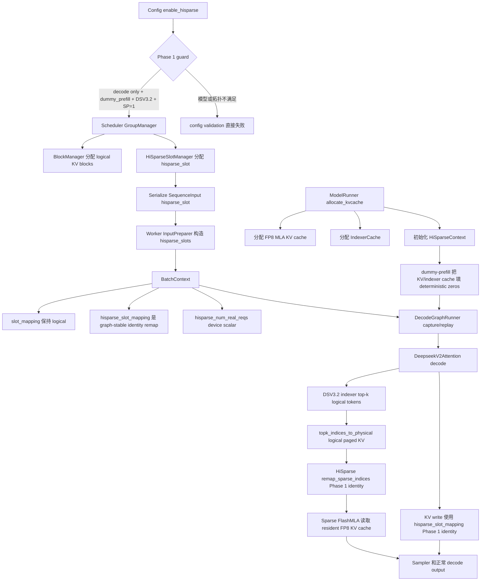

# DLEngine HiSparse 设计

> 状态：本文保留 HiSparse 从第一版到完整数据面的分阶段设计记录。当前 GLM recurrent MTP 组合语义和部署边界以 [GLM Recurrent MTP](./site/glm-recurrent-mtp.md) 为准。

## 目标和范围

这份文档描述 DLEngine 第一版 HiSparse 的实现设计。第一版目标刻意收窄：

- 只支持 decode-only engine mode；
- 先支持 dummy-prefill，让 decode engine 可以把调度、cache 分配、输入准备、CUDA graph capture、模型 forward 的整条链路跑通，不依赖真实 prefill worker；
- 先支持 DeepSeek-V3.2 / DSA sparse MLA；
- 不能破坏现有 CUDA graph 行为。

真实 prefill、PD transfer、DSv4 compressed-cache HiSparse、以及通用 HiSparse policy 都不放进第一版 patch。但这些扩展点会在文档里先留清楚，避免第一版实现把后续路堵死。

设计约束以当前 runtime、kernel 行为和测试为准。实现调研覆盖 allocator、host memory pool、coordinator、model runner、CUDA Graph runner 与 TopK kernel，但不在公开设计中绑定外部仓库结构。

## Phase 1 流程



## DLEngine 现状

DLEngine 现在已经有 DeepSeek-V3.2 NSA 基础路径：

- `Config.disable_nsa` 控制是否启用 DSA；
- `CacheContext` 可以分配 FP8 MLA KV cache 和 `IndexerCache`；
- `DeepseekV2Attention` 在 prefill 时写入 FP8 MLA KV 和 indexer keys；
- decode 时运行模型 indexer，把 top-k logical token indices 转成 physical paged KV indices，然后调用 `flash_mla_with_kvcache(..., indices=...)`；
- `DecodeGraphRunner` 为 sparse decode 捕获独立的 FlashMLA metadata；
- `BatchContext` 携带 `slot_mapping`、`context_lens`、`block_tables`。

缺的部分是分层缓存。当前 sparse top-k 的结果默认都在 GPU KV/indexer cache 里。HiSparse 要把它拆成三层：

1. scheduler 和 request metadata 使用的完整 logical token namespace；
2. sparse attention 实际访问的小 GPU device-buffer namespace；
3. 保存 cold logical tokens 的 host namespace。

第一版用 dummy-prefill，可以先搭好并验证前两层，不需要真实 prefill worker 的 host backup/load。

## 核心不变量

HiSparse 必须保持这些不变量：

- scheduler 仍然拥有 logical KV blocks，语义和现在一致；
- model forward 只能看到 CUDA-stable tensors。captured graph 内不能依赖 Python object lookup 或动态 allocation；
- `slot_mapping` 仍然表示 logical output location。需要写 KV 时，HiSparse 再把它 remap 到 device-buffer slot；
- sparse attention 接收的是 physical device-buffer locations，不是 logical locations；
- CUDA graph 的 padded batch entries 必须合法且便宜：使用 dummy slots 和 kernel 内 early-return guard，而不是改变 captured graph 的 Python 分支；
- 当设计描述和代码行为冲突时，以当前 DLEngine kernel、runtime 校验和测试为准。

## 架构

### Scheduler 和 slots

C++ scheduler 继续通过 `BlockManager` 分配 logical KV blocks。HiSparse decode 需要增加第二类 per-sequence slot：

- `state_slot`：已有模型状态 slot，用于 GDN 和 DSv4 compressor state；
- `hisparse_slot`：HiSparse per-request tensors 的稳定行号。

第一版就显式新增 `hisparse_slot`，不要复用 `state_slot`。后续不同 cache family 会需要不同 allocator 和 block manager；HiSparse 从 Phase 1 开始拥有独立 slot，ownership 和 lifetime 会更清楚。因此需要立刻把 `hisparse_slot` 加到 `BlockContext` 以及 C++ -> Python auxiliary metadata。

scheduler 需要保留一个 dummy row。DLEngine 现在 DSv4 已经用 `max_num_seqs` 作为 dummy state row，HiSparse 也沿用这个约定：

- real slots: `[0, max_num_seqs)`
- dummy slot: `max_num_seqs`

### Runtime context

在 `context` 下增加 HiSparse runtime context，和现有 cache contexts 并列：

- `context/cache/hisparse.py`
- `HiSparseContext`
- `get_hisparse_context()`
- `reset_hisparse_context()`

context 持有长期存活的 tensors：

- `full_to_device`：logical token location -> HiSparse device location；
- `req_to_device_buffer`：`[max_num_seqs + 1, padded_device_buffer_size]`；
- `req_device_buffer_size_cpu`：allocator 侧使用的 CPU tensor/list；
- `req_device_buffer_tokens`：`[num_layers, max_num_seqs + 1, device_buffer_size]`；
- `req_device_buffer_token_locs`：同形状，把 LRU/token slots 映射到 device locs；
- `topk_device_locs_buffer`：`[max_num_seqs + 1, index_topk]`；
- `raw_indices_buffer`：`[max_num_seqs + 1, index_topk]`；
- `num_real_reqs`：CUDA scalar tensor，用于 CUDA graph replay；
- padded graph entries 使用的 dummy locations。

第一版可以不实现 pinned host KV storage 和异步 backup/load，但 tensor 形状和调用方式要先和真实实现对齐，这样 CUDA graph 和 model call sites 不需要后面大改。

### Cache allocator

新增适配 DLEngine `BlockManager` / `CacheContext` 边界的 DSV3.2 allocator。

allocator 暴露两个 namespace：

- logical allocation：来自现有 `BlockManager` 的 block ids；
- device-buffer allocation：sparse decode 可以访问的一小段 physical KV slots。

dummy-prefill 阶段：

- logical blocks 正常分配；
- 每个 scheduled sequence 分配最多 `hisparse_device_buffer_size` 的 device-buffer pages；
- 对 resident logical locations 填充 `full_to_device[logical_loc] = device_loc`；
- 非 resident logical locations 映射到 `0` 或 `-1`，第一版 dummy path 不能选择这些位置。

真实 host tier 后续会把最后一点替换为：attention 前把 selected missing pages 从 host load 到 device buffer。

### Coordinator Surface

Phase 1 先把 coordinator surface 收在 `HiSparseContext` 里，不新增完整 Python coordinator 对象。第一版暴露 graph-stable runtime tensors 和 remap hooks：

- `hisparse_slots`：scheduler 分配的稳定 per-request 行号；
- `hisparse_slot_mapping`：KV/indexer 写入前使用的 slot mapping；
- `hisparse_num_real_reqs`：CUDA scalar，后续 graph-safe kernel 会用它区分真实请求数；
- `remap_sparse_indices(...)` 和 `remap_slot_mapping(...)` hooks。

decode-only dummy-prefill 下，这些 hook 先是 identity mapping：

1. prompt/device slots 都视为 resident；
2. 不发起 host transfer；
3. eager 和 CUDA graph 路径都能看到同样的 metadata tensors；
4. sparse FlashMLA 输入形状保持 `[bs * ntps, index_topk]`。

Phase 2 再把这些 hook 替换成真正的 `HiSparseCoordinator`，由它负责 host backup、swap-in、device-buffer allocation、LRU metadata 和 request cleanup。

### Model forward

`DeepseekV2Attention` 当前 decode 流程是：

```text
topk logical token indices -> topk physical paged KV indices -> sparse FlashMLA
```

启用 HiSparse 后变成：

```text
topk logical token indices -> HiSparse coordinator -> topk device-buffer indices
```

模型不应该关心 device-buffer mapping 是 dummy-prefill、hot resident page，还是 host swap-in 得来的。模型只接收对 KV cache tensor 有效的 `sparse_indices`。

KV store 路径也要经过 coordinator。每个 decode step：

- C++ 给出的 `slot_mapping` 仍然是 logical output location；
- coordinator 为 request 保留或扩展 device buffer；
- context 携带 HiSparse remapped `slot_mapping`，或者 attention layer 在写入前调用 coordinator 做映射；
- `store_kcache_fp8` 写入 device-buffer location。

建议给 `BatchContext` 增加 `hisparse_slot_mapping`，而不是直接修改现有 `slot_mapping`。logical mapping 后续 scheduler 和 host backup 仍然需要。

### CUDA graph 约束

HiSparse 必须显式进入 capture。capture 阶段：

- `DecodeGraphRunner` 创建覆盖 captured `master_bs` 的 persistent HiSparse buffers；
- `BatchContext` 包含 `hisparse_slots`、`hisparse_slot_mapping`、以及 coordinator reference 或 context object；
- `num_real_reqs` 填 capture batch size；
- dummy rows 对 padded entries 合法；
- 即使 indices 是 dummy/all-invalid，也要走 sparse decode，和当前 FP8 NSA capture path 合成 invalid indices 的方式一致。

replay 阶段：

- 把 live `hisparse_slots` copy 到 persistent graph buffer；
- padded entries 填 dummy slot；
- 用 real batch size 更新 `num_real_reqs`；
- copy/remap `hisparse_slot_mapping`；
- replay 同一个 graph。

captured graph 内不能 allocation，不能基于 batch 内容做 Python 分支，也不能创建新的 FlashMLA metadata。现有 `FlashMLASchedMeta` capture 前重置的行为必须保持不变。

这就是为什么需要 `hisparse.cuh` 或等价 CUDA/JIT kernel：selection remap、padded-request guard、以及未来 swap-in bookkeeping 都必须是 device-side 且 graph-safe。

## Dummy-prefill 流程

第一版 patch 应该跑通这个流程：

1. 用 `dummy_prefill=True` 和 `enable_hisparse=True` 启动 decode engine；
2. scheduler 直接把 sequences 接进 decode mode；
3. C++ scheduler 按现有方式分配 logical KV blocks 和 state slots；
4. Input preparation 构造 decode tensors 和 `hisparse_slots`；
5. HiSparse coordinator 为 prompt tokens 预填 bounded device-buffer mapping。dummy 模式下真实 KV 内容可以是 dummy/zero，但 locations 必须合法；
6. Decode graph capture 能看到 HiSparse 分支，并 capture sparse decode；
7. Decode replay 计算 DSV3.2 indexer top-k，经 HiSparse remap，写新 token 到 device-buffer slot，然后正常 sample。

dummy-prefill 的正确性目标是“服务链路能跑通并且 graph replay 稳定”，不是模型质量 parity。真实 token 正确性需要真实 prefill KV 内容和 host backup，这是后续阶段。

## 配置

新增配置：

- `enable_hisparse: bool = False`
- `hisparse_device_buffer_size: int = 4096`（每个 sequence 的 hot token-slot
  数；总 device buffer 为 `max_num_seqs * hisparse_device_buffer_size`）
- `hisparse_swap_in_block_size: int = 960`

配置校验：

- 第一版 `enable_hisparse` 要求 `mode == "decode"`；
- `enable_hisparse` 复用现有 `dummy_prefill` 保护：真实 prefill 落地前要求
  `dummy_prefill == True`；
- `enable_hisparse` 要求 DSV3.2 NSA config：`index_head_dim > 0`、`index_topk > 0`、且 `disable_nsa == False`；
- `enable_hisparse` 要求 FP8 MLA KV cache；
- Phase 1 `enable_hisparse` 要求 `attention_sp == 1`；SP > 1 先拒绝，等 per-rank block-table 和 slot 语义验证后再打开；
- MTP/lazy-verify 先拒绝，除非显式实现了 `num_tokens_per_seq > 1` 的 remap。

## Proto 和 C++ 改动

第一版就应该给 HiSparse 增加显式 slot，并同步协议和 C++ metadata。不要复用 `state_slot`：它属于 GDN、DSv4 compressor state 这类模型状态 cache；HiSparse 拥有独立的 cache namespace。需要加：

- `BlockContext` 增加 `hisparse_slot: int = -1`；
- C++ -> Python auxiliary metadata 增加 `hisparse_slots`；
- 更新 `csrc/sequence/serialization.*`；
- 如果 aux struct 单独绑定，更新 pybind。

不要复用或覆盖 `block_tables`：logical block tables 必须保持 logical。HiSparse device-buffer tables 是 coordinator 持有的 runtime tensors。

## Kernel 工作

第一版需要的 kernel surface：

- `translate_topk_to_hisparse_device`
  - 输入：top-k logical token indices、logical block tables、block size、`full_to_device`、`num_real_reqs`；
  - 输出：top-k device-buffer physical locations；
  - invalid 或 padded entries 输出 `-1`。
- 可选 `remap_slot_mapping_to_hisparse_device`
  - 输入：logical output slots 和 `full_to_device`；
  - 输出：device-buffer output slots。

后续 kernels：

- 把 selected missing host pages load 到 device buffer；
- 更新 LRU/token metadata；
- backup 新产生的 decode tokens 到 host；
- DSv4 c4/c128 compressed-cache variants。

CUDA header 放在 JIT/kernel tree 下，命名为 `hisparse.cuh`，再加一个小的 Python wrapper 调用，并遵循现有 JIT kernel 封装边界。

## 文件级集成点

实现时按现有 DLEngine 目录边界放置职责：

- `dlengine/csrc/scheduler/`
  - 分配或暴露稳定 HiSparse request slot；
  - logical KV block accounting 保持不变；
  - decode 调度时可选择性预留 HiSparse device-buffer capacity；
  - 不把 host/device sparse-cache policy 写进 C++。
- `dlengine/engine/`
  - 把新配置串到 `LLMEngine`、Ray、DLSLime workers；
  - Phase 1 只在 decode workers 初始化 HiSparse；
  - 为后续 host memory registration 保留 `destroy()` 生命周期钩子。
- `dlengine/runtime/runner/`
  - 在 `ModelRunner` 初始化 `HiSparseContext`；
  - `CacheContext` 存在后、CUDA graph capture 前完成 cache wiring；
  - eager decode 和 graph replay 前调用 coordinator refresh；
  - `InputPreparer` 继续负责把 C++ aux data 转为 CUDA tensors。
- `dlengine/runtime/context/`
  - 给 `BatchContext` 增加 runtime tensors；
  - 在 `context/cache` 下增加 persistent HiSparse cache/coordinator tensors；
  - 接入现有 context reset 路径。
- `dlengine/runtime/kernel/`
  - 增加 `hisparse.cuh` 和 graph-safe top-k remap Python wrapper；
  - 第一版 kernel 保持小而确定，先不加入 host swap-in。
- `dlengine-proto/`
  - Phase 1 就增加 `hisparse_slot`，不要复用 `state_slot`；
  - 后续 PD direct host-pool metadata 和这个 request slot 分开设计。
- `dlengine/runtime/models/deepseek_v2/`
  - 第一版只 gate DSV3.2 attention path；
  - 把 `Indexer` top-k 输出在 sparse FlashMLA 前接入 HiSparse；
  - FP8 KV/indexer writes 使用 HiSparse-remapped output slots。

decode-only 路径不应该改 DSv4 代码，除非是共享 utility 命名或配置校验。DSv4 HiSparse 有不同的 compressed-page 语义，应放到后续阶段。

## 实现计划

### Phase 1：graph-safe dummy path

01. 增加 config flags 和 validation；
02. 把 HiSparse 做成独立 cache-plan component，例如 `deepseek_mla_cache_plan(use_hisparse=True)`，而不是现有 MLA/indexer cache plan 的 runtime overlay；
03. 增加 `HiSparseContext` 和 dummy/no-op remap hooks；完整 `HiSparseCoordinator` host tier 延后到 Phase 2；
04. 给 `DecodeGraphRunner` 增加 persistent HiSparse tensors；
05. 扩展 `BatchContext`，增加 `hisparse_slots`、`hisparse_slot_mapping`、`hisparse_num_real_reqs`；
06. 扩展 `InputPreparer.prepare_decode_bytes`，从显式 C++ aux metadata 构建 `hisparse_slots`；
07. `DeepseekV2Attention` decode 中，`enable_hisparse` 时把 top-k 交给 coordinator；
08. FP8 KV store 使用 remapped device-buffer slots；
09. dummy-prefill 下 KV/indexer cache 填 deterministic zeros，保证可复现；
10. 基于 `examples/dummy_prefill.py` 增加 DSV3.2 示例。

### Phase 2：真实 host tier

1. 为 DSV3.2 MLA layout 增加 pinned host KV/indexer storage；
2. 从 device backup dummy-prefill 或 real-prefill tokens 到 host；
3. attention 前实现 selected-page swap-in；
4. 增加 miss/hit counters 和 capacity logs；
5. 用小于 context length 的 device buffer 验证 long-context decode。

### Phase 3：PD 集成

1. 决定 prefill 是直接把 KV 发送到 decode host pool，还是 decode 端先经 device staging 再 backup；
2. 如果使用 direct-to-host，扩展 proto 增加 host-pool metadata；
3. scheduler 区分 staging、ready、running HiSparse requests；
4. 增加 TP readiness synchronization，保证各 rank 以一致顺序推进请求。

### Phase 4：高级模式

1. GLM 线性 Lazy verify / MTP（`num_tokens_per_seq > 1`）已支持；tree 和其他模型仍待实现；
2. Prefix cache 和 L3 interaction；
3. DSv4 compressed c4/c128 pages 上的 HiSparse；
4. Metrics 和运行时控制。

### GLM 线性 MTP 组合语义

GLM checkpoint 只有一个物理 predictor layer。运行时连续调用它 5 次，
保留 5 个 draft，并让 target 一次 verify 6 个 token；不是加载 5 或 6 个
predictor layer。predictor 因而也只占一份 MLA KV cache。

- 第一次 predictor 调用计算 DSA TopK；后续 recurrent 调用共享同一个
  `_IndexerTopKState`，不会重复运行 indexer；
- 第一次复用时仍 stage 一次，把可能指向上一轮临时 output page 的 TopK
  搬到稳定 hot slot；剩余调用只映射新的 output slot；
- target verify 把 6 行 TopK 在 request 内合并去重，同时给 6 个新 KV 保留
  独立 output slot。所需 hot capacity 下限是
  `(num_speculative_tokens + 1) * index_topk`；
- CUDA graph padding 行显式写 `-1`，`phase_id` 区分同一物理 layer 的 recurrent
  调用；每个新 KV 在 attention 后写回 cold host tier；
- sampling/rejection sampling 位于 verify 之后，所以 greedy 和
  `temperature > 0` 使用同一套 HiSparse cache 语义。

## 测试和验收

第一版最小测试：

- logical top-k -> block table -> HiSparse device mapping 的 unit test；
- padded batch rows 返回 `-1` 的 unit test；
- `enable_hisparse=True` 的 decode-only dummy-prefill smoke test；
- batch sizes 1、2、16 至少覆盖一次 CUDA graph capture/replay smoke test；
- `enable_hisparse=True` 但 `dummy_prefill=False` 时，在 Phase 2 前必须失败；
- 非 DSV3.2 模型启用 `enable_hisparse=True` 必须失败。

建议 debug logs：

- logical KV capacity 和 HiSparse device-buffer capacity；
- 每步 `num_real_reqs`；
- top-k entries 中成功 remap 到 valid device slots 的数量，以及 invalid 数量；
- admission 后第一步 decode，用来定位 dummy-prefill setup 缺失。

## 已定决策

- dummy-prefill 下 KV/indexer cache 填 deterministic zeros。
- HiSparse 作为独立 cache-plan component，例如 `deepseek_mla_cache_plan(use_hisparse=True)`，不是现有 MLA/indexer cache plan 的 runtime overlay。
- Phase 1 拒绝 `attention_sp > 1`；等 per-rank block-table 和 slot 语义验证后再打开。
