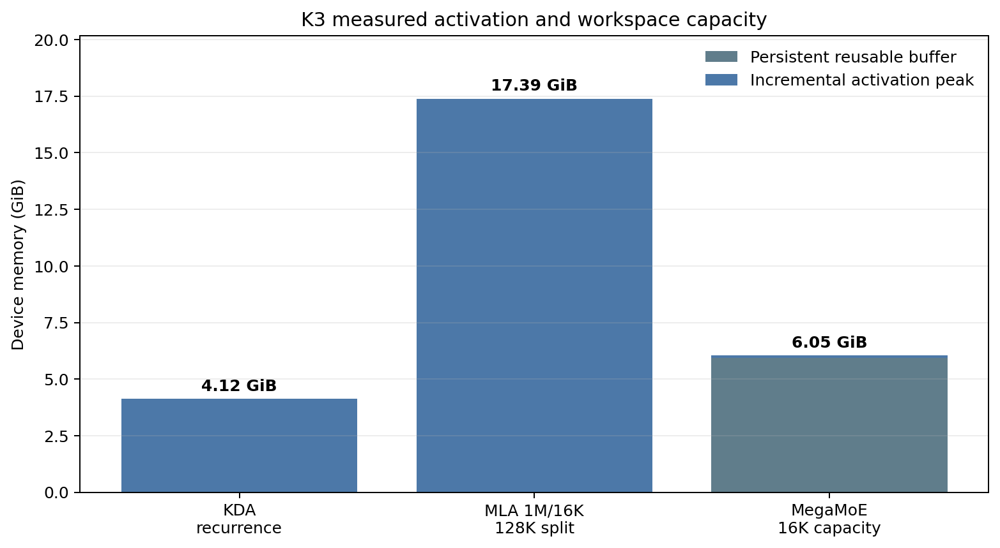
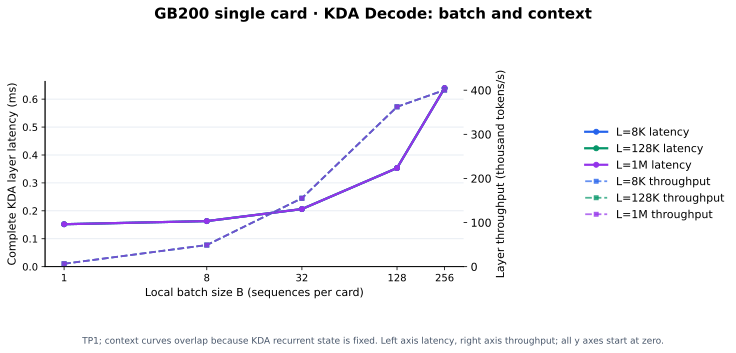
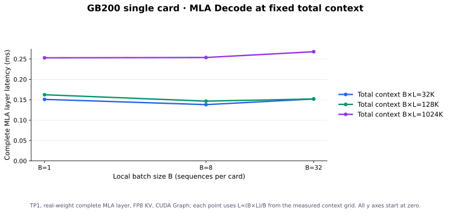
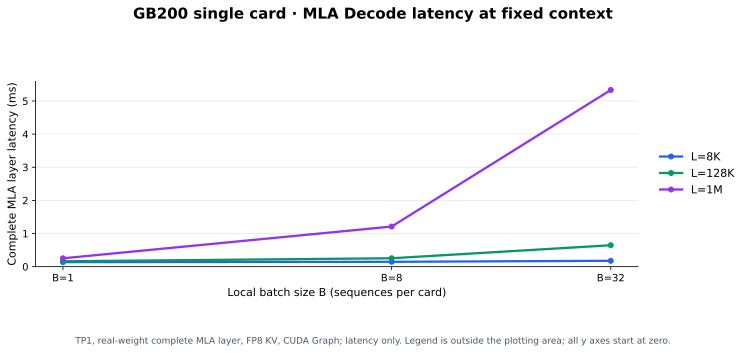
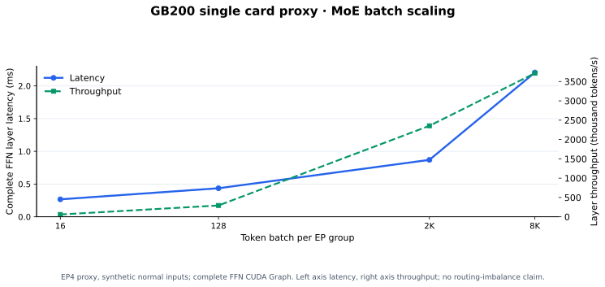
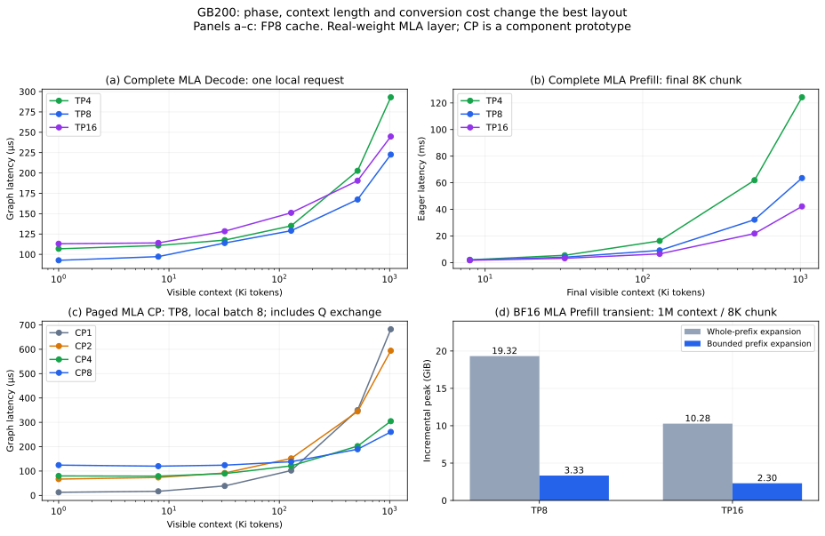

# Kimi K3 Decode: Cache, Parallelism and Serving Selection

This companion focuses on Decode, resident cache capacity, batch/context scaling and the handoff from Prefill. It assumes the model structure and parallelism definitions from the overview article.

## 10. Decode

The objective of this article is to choose the fastest legal Decode parallel layout for each batch and context regime. Each active sequence emits one token per step, so the selected layout must fit weights, resident KV/KDA state and transient buffers, satisfy the TPOT and capacity constraints, and minimize the complete per-token layer cost: attention, state reads, FFN execution, collectives, and layout transitions. We compare candidates at fixed global batch and context distribution, filter capacity failures first, and then optimize throughput and tail latency. The Prefill TTFT ranking does not determine the Decode ranking; changing the mesh can also require a Prefill-to-Decode state migration.

### 10.1 Resident Capacity and Admission

Use the per-rank weight, cache/state and peak-memory equations from §9.1. Reserve Prefill workspace as well when the service interleaves phases.

The following sensitivity table reserves **20 GiB/rank in total** for persistent
buffers, transient peaks, graph pools, residual banks, repacking and margin.
The reserve includes the measured EP16 6.50 GiB buffer; it is an explicit planning
assumption, not a measured whole-model peak. Embedding/LM head are TP-sharded.
All rows use EP16 and FFN TP1.

The plotted measurements preserve the benchmark data while making the scaling trend and the selection boundary visible.

The FP8 column requires explicit cache selection; `auto` uses the BF16 column.
The CP rows (*) assume balanced pages and unchanged KDA request ownership;
extra projections consume the allowance. These are **memory-only planning
estimates**, not demonstrated admission limits. The BF16 column assumes the
bounded-prefix fix measured in §9.3–9.7 and §10.3–10.6; the original full-history expansion can
exceed this allowance. Sequence slots, scheduler limits, graph pools and the
actual live request-length distribution must be checked separately.

“Supports up to 1M” means $L_{\mathrm{prompt}}+L_{\mathrm{generated}}\le2^{20}$,
not that every request contains a million tokens. Paged cache charges actual
resident tokens, while recurrent-state pools may charge configured sequence
slots. Admission must reserve room for the continuation, not fill HBM with
prompts and discover that Decode cannot append. Keep a short/medium-context
capacity table alongside the maximum-length feasibility check (§9.8).

### 10.2 Compute, HBM and Small-Message Costs

**Absorbed MLA Decode is a different arithmetic path.** It uses a 576-wide query
against the latent cache and produces a 512-wide latent output before the value
projection. At 1M this is approximately **219.0 GFLOP per MLA layer per generated
token**, or 5.257 TFLOP across 24 layers. The 64.4 GFLOP obtained with dimensions
192 and 128 describes expanded attention, not the production absorbed Decode
path. Absorption trades additional arithmetic for avoiding expanded historical
K/V storage and traffic.

At batch-one Decode, one BF16 KDA layer's approximately 0.888 GB weights have
little reuse. Its 3.44 MB state is read and written, adding about 6.88 MB/sequence
before head sharding. MoE reads only selected experts: with uniform independent
Top-16 routing over $n$ tokens, expected distinct experts are approximately

$$
896\left[1-(1-16/896)^n\right],
$$

rather than $16n$ indefinitely. Each expert's packed payload is about 17.55 MB.
This distinguishes weight capacity (all experts resident) from HBM traffic
(unique active experts, subject to cache/tile reuse). A hot expert can be
beneficial at tiny batch because it improves reuse, yet become the critical
rank at large batch.

For a mixed service, admission obeys
$24s_{\mathrm{KV}}\sum_i L_i/P+S_KN_{\mathrm{slots}}/T_K$;
Decode compute depends on $\sum_iL_i$, while Prefill depends on both fresh
chunk sizes and their historical lengths. Report prompt and output length
quantiles, cache-reuse eligibility, global batch, and arrival rate. The
current K3 recurrent-state cache plan disables generic KV prefix reuse, so a
cached-MLA microbenchmark does not prove whole-model prefix-cache hits.

The RS→AG measurements in §9.3 establish the small-message floor as well as the large-chunk bandwidth term. For TP8, 93 batch-one reference boundaries contribute about 5.0 ms before overlap. Kernel timing and boundary substitutions must follow §8.5 to avoid counting output reductions twice.

### 10.3 KDA Decode

The plotted measurements preserve the benchmark data while making the scaling trend and the selection boundary visible.

Batches are local to each request-DP group. Complete KDA CUDA Graph measurements include output all-reduce; the eager TP8 batch-one measurement exceeds 1 ms because of launch gaps. Compare equal global population before ranking throughput.

The plotted measurements preserve the benchmark data while making the scaling trend and the selection boundary visible.

Independent process worlds corroborate the small-batch TP8 latency floor. All 16 GPUs need not cooperate in one request, but the full checkpoint must still pass the capacity screen.

### 10.4 MLA Decode

We loaded checkpoint MLA layer 3 (zero-based) and timed its complete production
forward: Q/KV projections, normalization, cache write, Prefill restore/expansion
or absorbed paged Decode, output-value projection, gate and output all-reduce.
The matrix covers TP1/2/4/8/16, contexts 1K/8K/32K/128K/512K/1M, both cache
formats, Decode local batches 1/8/32, and legal Prefill chunks 128/1K/8K.
There are **350 points and 5,600 per-rank rows**. Additional local Decode batches
2/4/16 allow equal-global-load comparisons. Histories use distinct physical
pages populated with synthetic finite latents; they are not text-generated
hidden states. Prefill times use three trials of three eager forwards after
warmup; Decode uses three trials of 20 graph replays. Reported values take the
maximum rank of each rank's median.

The plotted measurements preserve the benchmark data while making the scaling trend and the selection boundary visible.

These columns use local batch one, explicit FP8 KV and maximum-rank graph medians. The Prefill columns and workspace fix are reported in §9.5. The local head-padding and short-sequence numerical checks described there apply to this shared implementation as well.

#### 10.4.1 Paged CP and Layout Conversion

The CP experiment uses paged compressed MLA with $d_q=576,d_v=512$ through
the installed TRTLLM-GEN kernel. At a fixed projection TP $T_A$, each CP rank
first owns $96/T_A$ query heads. Q all-gather supplies the $P$ head slices to
each context shard; local attention processes $L/P$ cached tokens. A stable
FP32 LSE merge combines outputs, and each rank keeps its original head slice.
**Q exchange, packing, attention, LSE collectives and output-head restoration
are all inside CUDA Graph timing.** The implementation uses all-reduce merge;
an optimized gather/reduce-scatter backend could have a different crossover.
It excludes projections, cache append, output-value/gate projections and the
final TP output reduction, which are included in the full-MLA table instead.

<!-- BEGIN PAGED_CP_TABLE -->

The plotted measurements preserve the benchmark data while making the scaling trend and the selection boundary visible.

<!-- END PAGED_CP_TABLE -->

These are FP8, maximum-rank medians; batch is per request-DP group. TP4/8/16,
all nested CP divisors, both BF16 and FP8, local batches 1/8/32 and contexts
1K–1M were swept, skipping cases below the kernel's local scheduling extent.
Small nonzero cases were compared with independent dense FP32 attention after
reconstructing each request's pages. This checks natural-log LSE, Q ownership
and context composition, not just finite zero outputs.

The result changes the selection advice: **maximum context alone is not enough
to justify CP**. At TP8, batch one, CP1 remains fastest even at 1M in this
prototype. At batch eight and 1M, CP8 reduces this conversion-inclusive core
from about 0.682 to 0.261 ms. At 8K, its communication latency loses at every
measured batch. At TP16, batch 32 and 1M, CP16 helps this core strongly, but
32 maximum-length requests also need a whole-model capacity check. Do not
recommend that operating point merely because a single-layer allocation fits.

A rough break-even condition is

$$
\frac{s_{\mathrm{KV}}BL}{B_{\mathrm{HBM,eff}}}(1-1/P)
> t_{Q\,\mathrm{exchange}}+t_{\mathrm{merge}}
 +\Delta t_{\mathrm{kernel}}+\Delta t_{\mathrm{other\ boundaries}}.
$$

Nested CP keeps attention FLOPs per rank approximately fixed: it exchanges
fewer historical tokens for more local query heads. It reduces replicated HBM
reads and changes kernel geometry; it does not provide a free $P$-fold compute
speedup. This explains why larger $B L$ favors CP and small batches often do not.
Persistent page ownership and scheduler support remain unimplemented in K3
serving; the measured prototype is under `bench/k3_partition/paged_cp.py`.

### 10.5 FFN Decode

The complete FFN row sweep in §9.6 uses the same current-token operator for both phases. The small-batch columns are the relevant Decode points; source distribution and routing must match the attention output.

The plotted measurements preserve the benchmark data while making the scaling trend and the selection boundary visible.

Inputs are synthetic normal activations passed through checkpoint layer 1. EP4/8/16 use different replica counts on 16 GPUs, so equal local input rows do not imply equal global throughput. Routed-only EP×TP results in §9.6 include their conversions but exclude router/shared/latent work.

Dense FFN has no history scan or expert routing. Its single-layer time is included once in a complete decoder estimate; the earlier B300 measurement is not substituted as a GB200 distributed latency.

### 10.6 Complete Decode and Equal Global Load

Comparing the same local batch at TP4 and TP16 changes the global workload by
4×. Hold global Decode population fixed and set $B_{\mathrm{local}}=B/D$.
The following sum covers the 69 complete KDA and 24 complete MLA layer
measurements, including their output all-reduces. It deliberately stops before
FFN and decoder transitions. It is an attention budget, **not TPOT**, and should
not have another output all-reduce added to it.

<!-- BEGIN EQUAL_LOAD_TABLE -->

The plotted measurements preserve the benchmark data while making the scaling trend and the selection boundary visible.

<!-- END EQUAL_LOAD_TABLE -->

To obtain a decoder estimate, replace each measured output all-reduce with
its actual reduce-scatter boundary, add the complete FFN at the matching
source ownership (including padded/idle rows), and then add its all-gather.
Use directly measured boundary pairs where possible; subtracting independently
timed collectives is a model approximation. KDA and MLA can prefer different
TP degrees, but independently changing them also changes request/state layout,
residual ownership and conversions at their boundaries.

#### 10.6.1 Full-Checkpoint TPOT Samples

The full-model execution record and allocator settings are in §9.7.1. The following extracts its seven post-first-token intervals per request.

The plotted measurements preserve the benchmark data while making the scaling trend and the selection boundary visible.

TP8 has the lowest near-cap mean TPOT among these single runs, while TP16 has the fastest near-cap TTFT. Eight output tokens per request and no concurrent-load sweep are insufficient to establish sustained throughput or a tail-latency SLO.

### 10.7 Decode Parallel-Strategy Selection and Prefill Handoff

Filter by resident capacity, then compare equal-global-load TP/DP candidates. Enable nested MLA CP only when its capacity benefit or cache-read savings justify query exchange, merge and changed boundaries at the target batch and context. Keep EP16 as the current 16-GB200 FFN baseline until an alternative is validated with complete FFN work and source ownership.

Switching meshes after Prefill requires cache/state migration. Prefer stable ownership unless the remaining Decode steps can amortize migration and synchronization; this transition is distinct from the per-layer activation exchange in §8.5.

### 10.8 Joint Selection Evidence and Remaining Work

The completed coverage is deliberately finite; the Cartesian product of every
world, phase and independent mesh has not been executed:

The plotted measurements preserve the benchmark data while making the scaling trend and the selection boundary visible.

Select a layout by filtering for correctness and maximum-context admission
first, then optimizing measured serving throughput under latency constraints:

$$
\max_{\mathcal P}\frac{B_{\mathrm{global}}}{T_{\mathrm{step}}(\mathcal P)}
\quad\text{subject to}\quad
M_{\mathrm{peak}}\le M_{\mathrm{HBM}},\quad
T_{\mathrm{TTFT},p99}\le\tau_P,\quad T_{\mathrm{POT},p99}\le\tau_D.
$$

No numerical SLO was supplied, so this report provides candidates and crossover
evidence rather than declaring one universal winner. Use the following policy:

1. Check the actual HBM byte budget, checkpoint representation, cache dtype and
   transient path. Require a request to reach the context cap and still append
   its reserved output tokens. Reject impossible worlds before benchmarking.
2. For ordinary short/medium contexts, compare DP4×TP4 and DP2×TP8 on these
   16 GB200; use the same global batch and realistic routing/source ownership.
   The measured attention sum favors TP4 at global B32/context128K, while
   TP8 is a stronger single-request Decode starting point.
3. For cold long Prefill latency, include TP16 and larger fresh chunks if they
   fit the FFN buffer and activation peak. Do not infer its Decode ranking from
   its Prefill ranking.
4. Add nested MLA CP when capacity needs it, or when the measured reduction
   in cache-read time exceeds Q/merge/conversion cost at the target $BL$.
   The TP8 batch-one results do not justify enabling CP solely for a 1M cap.
5. Keep EP16×TP1 as the implemented FFN baseline on 16 GB200. Use the measured
   expert-TP prototype to evaluate routing and topology sensitivity; at fixed $E T_F$, it does not further shrink
   the first-order routed-bank capacity. Compare source redistribution using
   the complete round trip and actual live routing.
6. Keep a live request's cache/state owners stable unless an amortization
   calculation justifies migration: remaining steps times per-step saving
   must exceed cache/state transfer plus conversion and synchronization costs.
   Stage-specific meshes are worthwhile only after those edges are measured.

The plotted measurements preserve the benchmark data while making the scaling trend and the selection boundary visible.

The current runtime has one shared `attention_tp`/`attention_dp` mesh for KDA and
MLA. A configurable `attention_sp` dimension in the generic context object is
not evidence of a complete K3 CP path. Independently selecting $T_K$ and $T_M$
requires layer-specific groups, matching cache/state ownership, token metadata,
residual-bank mapping and graph captures. The experimental CP implementation
added here is intentionally contained under `bench/k3_partition/` until those
integration requirements are satisfied.

The corrected checkpoint path is **`/hgpfs/Kimi-K3`**. All 96 indexed shards
are present and cover the payload lengths declared by their headers. The prior
partial-directory observation concerned `/mnt/mnt/public/Kimi-K3` and was not
evidence that the supplied model was unavailable. The new experiments load all
24 MLA layers for component validation, representative MLA/FFN layers for
timing, and all 93 layers for full-model generation at TP4/8/16.
A header/file-size audit is not a payload checksum, and component validation
is not full-model generation-quality validation.

Reproducible inputs, per-rank CSVs, environment metadata, checkpoint-completeness
evidence and the capacity model are in
`bench/k3_partition/` (see its `README.md`). The initial eager
sweeps and later graph experiments are retained separately. The decisions made
for this evaluation are: no pipeline parallelism or offload; contexts from
1K to a maximum of 1M, with 8K as the main Prefill chunk; FP8/BF16 MLA cache, BF16 KDA state, MXFP4 routed
weights; a 20 GiB planning allowance; and CP/expert-TP treated as measured component
extensions rather than already working serving configurations. Full-model
capacity tests use the separately reported 0.88/0.91 utilization settings.
B200/B300 results in §9.8 are analytical hardware-budget comparisons.

