# Understanding Kimi K3: Structure, Capacity and Parallelism Overview

> Status: component evaluation and deployment-layout analysis. Chapters 9–10 include
> 16-GB200 experiments and a full-checkpoint context-capacity smoke test.
> Long-context output quality and production SLO validation remain outstanding.

The phase-specific analyses are split into [Prefill](dlengine-kda-prefill.md) and [Decode](dlengine-kda-decode.md).

## Notation

| Symbol                                                                                                                  | Definition                         | K3 value or rule                                                   |
| ----------------------------------------------------------------------------------------------------------------------- | ---------------------------------- | ------------------------------------------------------------------ |
| $N_{\mathrm{L}}$                                                                                                      | Total number of decoder layers     | 93                                                                 |
| $N_{\mathrm{KDA}}$                                                                                                    | Number of KDA decoder layers       | 69                                                                 |
| $N_{\mathrm{MLA}}$                                                                                                    | Number of MLA decoder layers       | 24                                                                 |
| $N_{\mathrm{Dense}}$                                                                                                  | Number of dense-FFN decoder layers | 1                                                                  |
| $N_{\mathrm{MoE}}$                                                                                                    | Number of MoE decoder layers       | 92                                                                 |
| $\mathcal{L}_{\mathrm{KDA}}$                                                                                                    | Set of KDA layer indices           | All indices outside $\mathcal{L}_{\mathrm{MLA}}$                         |
| $\mathcal{L}_{\mathrm{MLA}}$                                                                                          | Set of MLA layer indices           | 4, 8, 12, ..., 92, 93 (one-based)                                  |
| $P_{\mathrm{attn}}$                                                                                                   | Attention-layer placement pattern  | Three KDA layers followed by one MLA layer, plus a final MLA layer |
| $P_{\mathrm{ffn}}$                                                                                                    | FFN placement pattern              | Layer 1 is dense; layers 2--93 are MoE                             |
| $W_{\mathrm{total}}$                                                                                                  | Total checkpoint tensor payload    | 1,560.860 GB                                                       |
| $W_c$                                                                                                                 | Weight footprint of component $c$ | Component-dependent                                                |
| $F_{\mathrm{store}}$                                                                                                  | Logical weight storage format      | MXFP4, BF16, or FP32                                               |
| $D_{\mathrm{backing}}$                                                                                                | Safetensors backing tensor dtype   | U8, BF16, or FP32                                                  |

Values are derived from the published [Kimi-K3 configuration](https://huggingface.co/moonshotai/Kimi-K3/blob/main/config.json).

The following identities hold:

$$
\begin{aligned}
N_{\mathrm{KDA}} + N_{\mathrm{MLA}} &= N_{\mathrm{L}}, \\
N_{\mathrm{Dense}} + N_{\mathrm{MoE}} &= N_{\mathrm{L}}.
\end{aligned}
$$

## 1. What Is K3 Made Of?

K3 has three major compute components: Kimi Delta Attention (KDA), Multi-head
Latent Attention (MLA), and the feed-forward network (FFN). KDA and MLA are two
attention mechanisms; every decoder layer also contains a dense or
Mixture-of-Experts (MoE) FFN.

### 1.1 Kimi Delta Attention

KDA is K3's linear-attention component:

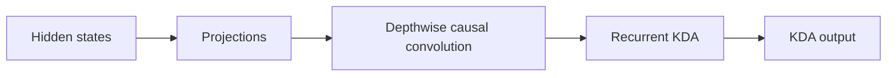

At this level, **Projections** covers the input-side projections, gates, and
output projection. Reshaping, normalization, and state-management details are
left to the implementation analysis.

- Each live sequence owns a fixed-size recurrent state.
- State capacity grows with resident sequence count, not historical length.
- Prefill uses chunked recurrence.
- Decode reads, updates, and writes the state at every step.

### 1.2 Multi-head Latent Attention

MLA is K3's full-attention component:

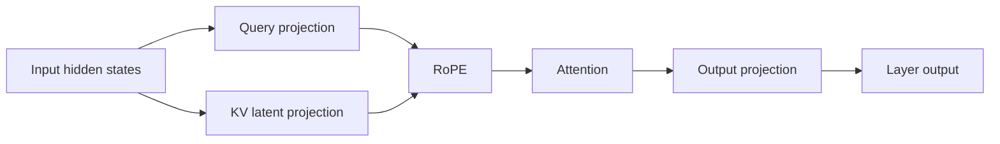

- It stores a per-token KV or latent cache.
- Cache capacity grows with retained context length.
- Prefill exposes substantial token parallelism.
- Decode reads historical cache entries.

### 1.3 Feed-Forward Network

The FFN is either a dense MLP or an MoE block:

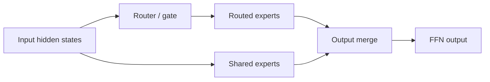

- FFN and expert weights account for a large part of model capacity.
- MoE activates only a subset of routed experts per token.
- Compute scales with current tokens and activated experts.
- Expert parallelism adds dispatch, all-to-all, and combine communication.

## 2. How Are KDA, MLA, and FFN Composed?

They are not one fixed `KDA → MLA → FFN` pipeline. KDA and MLA are alternative
attention types in different decoder layers. Each layer connects its selected
attention mechanism to a dense or MoE FFN.

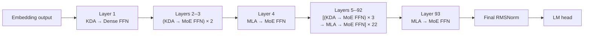

At model level, execution resembles:

```text
Embedding
→ Layer 1: KDA → Dense FFN
→ Layers 2--3: (KDA → MoE FFN) × 2
→ Layer 4: MLA → MoE FFN
→ Layers 5--92: [(KDA → MoE FFN) × 3 → MLA → MoE FFN] × 22
→ Layer 93: MLA → MoE FFN
→ Final RMSNorm → LM head
```

## 3. Weight Footprint Analysis

Weight footprint is the static memory baseline for the later runtime-capacity analysis. The measurements in this section are derived from the safetensors headers under `/mnt/public/Kimi-K3`; no weight tensors need to be loaded. The checkpoint contains 1,560.860 GB (1.419 TiB) of tensor payload.

### 3.1 Overall Weight Composition

Use a horizontal stacked bar to show the fraction of the complete checkpoint assigned to each model component.

<iframe
  src="../../assets/k3-weight-footprint.html"
  title="Interactive K3 weight-footprint analysis"
  width="100%"
  height="720"
  loading="lazy"
  style="border: 0; border-radius: 12px;">
</iframe>

!!! important "Routed experts dominate total weight capacity"

    Routed experts account for **92.67%**, or **1.446 TB**, of the stored
    checkpoint tensor payload. Expert parallelism is therefore the primary
    mechanism for making the model weights fit across devices.

!!! warning "KDA and MLA weights are still a substantial replicated floor"

    KDA and MLA together occupy **72.403 GB**: **61.258 GB** for KDA and
    **11.145 GB** for MLA. EP partitions routed experts, but it does not by
    itself partition these attention weights. With DP+EP and no attention TP,
    approximately **72.4 GB** of attention weights remains replicated per
    rank, before embeddings, dense/shared FFNs, caches, and runtime workspaces
    are included.

### 3.2 Weight Storage Format and Backing Dtype

Use a fourth horizontal stacked bar to show the checkpoint payload by logical weight format. The backing tensor dtype should be shown as a secondary annotation, not as the primary category.

| Logical format | Backing dtype | Footprint (GB) |   Share | Interpretation                                                          |
| -------------- | ------------- | -------------: | ------: | ----------------------------------------------------------------------- |
| MXFP4          | U8            |      1,446.456 | 92.670% | Packed routed-expert weights and associated quantization metadata       |
| BF16           | BF16          |        114.360 |  7.327% | Attention, shared/dense FFN, embeddings, and other uncompressed weights |
| FP32           | FP32          |          0.044 |  0.003% | Biases and selected numerical parameters                                |

The U8 tensors contain packed MXFP4 expert weights and quantization metadata; they are not INT8 weights, and the checkpoint contains no FP8 tensors. These values describe checkpoint storage, while per-rank runtime memory depends on sharding and backend weight preparation.

## 4. Cache Capacity: Latent Cache and SSM Slots

K3 has two persistent cache families with different capacity laws. Let $N_T$
denote the number of cached tokens and $N_S$ the number of allocated sequence
slots.

| Cache tensor | Logical shape | Storage dtype | Whole-model capacity |
| --- | --- | --- | ---: |
| MLA latent cache | $[N_T,512+64]$ | BF16 default / explicit raw FP8 on Blackwell | 27.648 / 13.824 KB/token |
| KDA convolution state | $[N_S,36864,4]$ | BF16 | 20.349 MB/slot |
| KDA recurrent state | $[N_S,96,128,128]$ | BF16 | 217.055 MB/slot |

The current K3 runtime defaults to BF16 MLA cache: 1,152 bytes/token/layer.
Explicit `kv_cache_dtype="fp8_e4m3"` on Blackwell uses raw 576-byte E4M3 rows,
including both latent and positional channels. Across the model,

$$
C_{\mathrm{cache}}=24s_{\mathrm{KV}}N_T
+237{,}404{,}160N_S\quad\mathrm{bytes},\qquad
s_{\mathrm{KV}}\in\{1152,576\}.
$$

At $2^{20}$ resident tokens, MLA cache is **27 GiB in BF16 or 13.5 GiB in
raw FP8**, before CP sharding. Pure attention TP replicates the latent cache;
KDA states are head-sharded. The mixed 656-byte FP8/scales/BF16 layout in the
historical B300 harness below is a separate format: its logical MLA payload
is 15.375 GiB at this length. It must not be used as the current Blackwell K3
cache-allocation formula; a packed backend may additionally pad physical pages.

## 5. Activation Memory

Activation capacity is determined by peak liveness, not by summing all 93
layers. KDA or MLA executes before its FFN, and the allocator can reuse storage
between decoder layers. The deployment question is therefore which component
creates the largest live allocation and which backend reserves persistent
workspace.

The measurements below use one B300 and a 16K active Prefill chunk. The MLA
point includes a 1M visible context with the production 128K prefix split. The
MegaMoE point uses NanoDeploy's world-size-one production wrapper with K3's 896
MXFP4 experts and Top-16 routing.

| Decoder layer form | Where activation memory is spent | Measured capacity to carry forward |
| --- | --- | ---: |
| KDA + Dense FFN | KDA chunk recurrence intermediates; Dense FFN intermediate for the 16K fresh rows | KDA core peak: 4.125 GiB |
| KDA + MoE FFN | KDA recurrence, followed by the reusable MegaMoE buffer and BF16 output | KDA core: 4.125 GiB; MegaMoE: 5.939 GiB persistent + 0.109 GiB dynamic |
| MLA + MoE FFN | Cached-latent restore, bounded K/V expansion, attention output, followed by MegaMoE | MLA core peak: 17.389 GiB; MegaMoE: 5.939 GiB persistent + 0.109 GiB dynamic |


The bars are component reservations, not values to add within a layer. The KDA,
MLA, and MoE stages execute sequentially. The complete-layer peak is controlled
by their maximum overlapping liveness and allocator reuse.

### 5.1 MegaMoE Persistent Buffer

MegaMoE reserves one symmetric buffer from its configured maximum token
capacity and reuses it across forwards and across all 92 MoE layers. At a 16K
capacity, the measured CUDA reservation is 5.939 GiB. A steady 16K forward adds
0.109 GiB for the BF16 output, giving 6.048 GiB of reserved buffer plus dynamic
activation. The persistent reservation must be counted once per process, not
once per layer.

### 5.2 DeepEP + DeepGEMM

DeepEP + DeepGEMM has the same high-level capacity pattern: a persistent buffer
is reserved for dispatch and combine, then each forward adds activation for
routed rows and grouped GEMMs. The ownership differs from MegaMoE. DeepEP owns
communication and permutation storage, while DeepGEMM consumes the dispatched
expert rows and produces expert outputs. When these buffers are shared across
sequential MoE layers, they are also counted once rather than multiplied by
layer count. Exact bytes are left unreported until an eight-GPU experiment is
available.

### 5.3 Capacity Conclusion

For the measured 1M-context, 16K-chunk path, bounded MLA prefix expansion is the
largest activation peak at 17.389 GiB. KDA recurrence peaks at 4.125 GiB.
MegaMoE contributes a material but predictable 5.939 GiB persistent reservation
and only 0.109 GiB of steady forward activation at 16K tokens.

## 6. Overview of Performance Analysis

The performance analysis separates Prefill from Decode because they expose
different independent variables. Prefill is studied as one request advancing
through a fixed-size fresh chunk. Decode is studied as a batch of active
sequences, each contributing one token while retaining a potentially long
visible context.

### 6.1 Prefill: One Request Is Sufficient

<iframe
  src="../../assets/k3-prefill-performance-overview.html"
  title="K3 Prefill performance variables"
  width="100%" height="400" loading="lazy"
  style="border: 0; border-radius: 12px;">
</iframe>

For Prefill, one request is sufficient to expose the component-level scaling.
Let $C$ be the fresh chunk size and $L$ the logical context visible after that
chunk. The cached prefix contains $L-C$ tokens, so its effective hit rate is

$$
r_{\mathrm{hit}}=\frac{L-C}{L}.
$$

With the reference chunk fixed at $C=8192$, the context sweep is:

| Logical context $L$ | Cached prefix $L-C$ | Fresh chunk $C$ | Effective hit rate |
| ---: | ---: | ---: | ---: |
| 8K | 0 | 8K | 0% |
| 32K | 24K | 8K | 75% |
| 128K | 120K | 8K | 93.75% |
| 256K | 248K | 8K | 96.875% |
| 512K | 504K | 8K | 98.4375% |
| 1M | 1016K | 8K | 99.21875% |

This construction separates the variables cleanly:

| Prefill component | Primary performance variables | Reason |
| --- | --- | --- |
| KDA | Chunk size $C$ | The cached prefix has already been summarized into recurrent state |
| MLA | Chunk size $C$ and visible context $L$ | The fresh queries still attend cached history |
| Dense FFN | Chunk size $C$ | Every fresh token executes the same dense matrices |
| MoE FFN | Chunk size $C$ and routing distribution | Only fresh tokens are routed; expert balance changes achieved utilization |

Using K3's 69 KDA layers, 24 MLA layers, one Dense FFN layer, and 92 MoE
layers, the one-request Prefill model is

$$
T_{\mathrm{prefill}}(C,L)
=69t_{\mathrm{KDA}}(C)
+24t_{\mathrm{MLA}}(C,L)
+t_{\mathrm{Dense}}(C)
+92t_{\mathrm{MoE}}(C).
$$

The first experiment therefore fixes $C=8\mathrm{K}$ and sweeps the six context
lengths above. A separate chunk-size sweep then fixes representative contexts
to determine whether 8K is the best serving point. Multi-request scheduling is
not needed for this component model; it belongs to the system-level serving
analysis after the single-request costs are understood.

### 6.2 Decode: Context Length and Batch Size Separate the Components

<iframe
  src="../../assets/k3-decode-performance-overview.html"
  title="K3 Decode performance variables"
  width="100%" height="400" loading="lazy"
  style="border: 0; border-radius: 12px;">
</iframe>

During Decode, each active sequence contributes one new token. Let $B$ be the
Decode batch size and $L$ the resident context length. MLA reads historical
cache, while KDA consumes a fixed-size recurrent state. Dense and MoE FFNs do
not inspect history.

| Decode component | Primary performance variables | Expected regime |
| --- | --- | --- |
| MLA | Context length $L$, with $B$ reported | Historical-cache traffic grows with visible context |
| KDA | Batch size $B$ | State size per sequence is independent of history length |
| Dense FFN | Batch size $B$ | Weight reuse improves as more current tokens share a forward |
| MoE FFN | Batch size $B$ and routing distribution | Tokens per selected expert determine grouped-GEMM utilization |

The Decode model is

$$
T_{\mathrm{decode}}(B,L)
=69t_{\mathrm{KDA}}(B)
+24t_{\mathrm{MLA}}(B,L)
+t_{\mathrm{Dense}}(B)
+92t_{\mathrm{MoE}}(B).
$$

Although context length is MLA's distinguishing variable, every MLA result must
also report $B$: its actual work scales with the number of active queries as
well as the history visible to each query. KDA and the FFNs use batch size as
their main sweep because they have no history-length term.

### 6.3 Reference Evaluation Matrix

The following values define the axes used by the detailed performance chapters.
The highlighted reference point is an 8K Prefill chunk and a 1M maximum serving
context; Decode batch sizes cover latency-oriented through throughput-oriented
operation.

| Parameter | Reference values |
| --- | --- |
| Prefill chunk size $C$ | 1K, 2K, 4K, **8K**, 16K |
| Decode batch size $B$ | 1, 8, 16, 32, 64, 128, 256 |
| Context length $L$ | 8K, 32K, 128K, 256K, 512K, **1M** |
| Prefix hit rate at $C=8$K | 0%, 75%, 93.75%, 96.875%, 98.4375%, 99.21875% |

The detailed analysis should first report isolated KDA, MLA, Dense, and MoE
curves over these variables, and then compose them using the actual K3 layer
counts. End-to-end TTFT and TPOT are validation of that model rather than the
starting point.

## 7. Performance Analysis

This chapter follows the two serving phases introduced in Chapter 6. Prefill is organized by fresh chunk size and visible context length; Decode is organized by batch size and visible context length. Within each phase, KDA, MLA, and MegaMoE are analyzed separately before their costs are composed at model level.

Dense FFN has one layer in K3, so it is not multiplied by a layer count like KDA, MLA, or MoE. It is nevertheless measured because its wide 33,792-channel gated MLP is a useful reference for token-parallel GEMM scaling and for the model-level latency sum.

The current results are a first mapping of the available component benchmarks. They do not yet represent complete operator breakdowns:

| Component | Current measured boundary | Complete boundary to add |
| --- | --- | --- |
| KDA | Complete production Prefill operator | Input projections, causal convolution, recurrence, gated normalization, and output projection measured separately |
| MLA | Cache restore, KV expansion, and attention core | Q/KV/G projections, latent norms, RoPE/cache operations, attention, gate, and output projection |
| Dense FFN | Complete gated MLP | Gate/up projections, SiLU-and-multiply, and down projection |
| MegaMoE | Pre-dispatch and fused routed-expert operator | Router/latent-down, Top-K, routed path, routed norm/up, shared experts, and output merge |

### 7.1 Prefill

Prefill considers one request. Let $C$ be its fresh chunk size and $L$ the total visible context after the chunk. KDA and MegaMoE process $C$ rows, whereas MLA processes $C$ queries against $L$ visible tokens.


#### 7.1.1 KDA

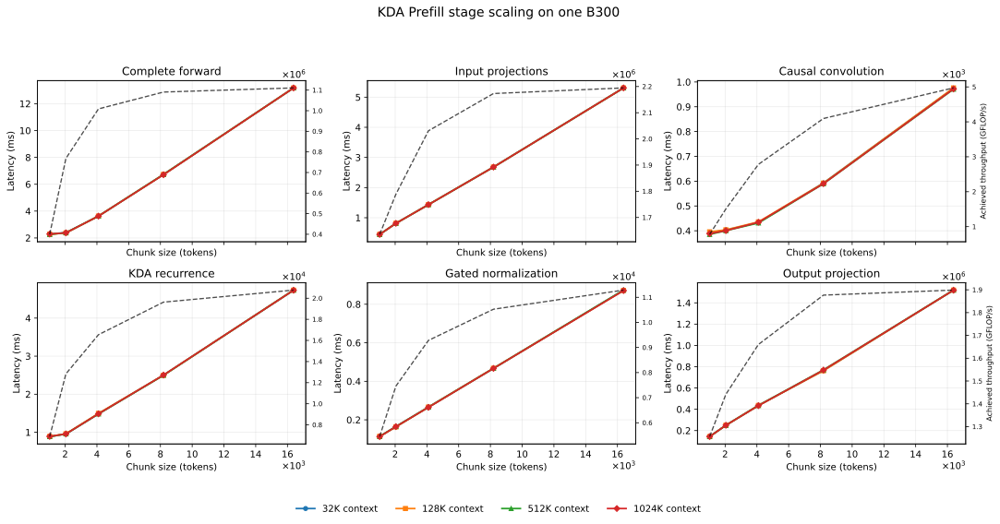

The complete production KDA operator is measured at $C\in\{1\mathrm{K},2\mathrm{K},4\mathrm{K},8\mathrm{K},16\mathrm{K}\}$ under 32K, 128K, 512K, and 1M logical context. All four curves overlap because the cached prefix has already been summarized into the recurrent state. Complete-forward latency rises from approximately 2.28 ms at 1K tokens to 13.17 ms at 16K.

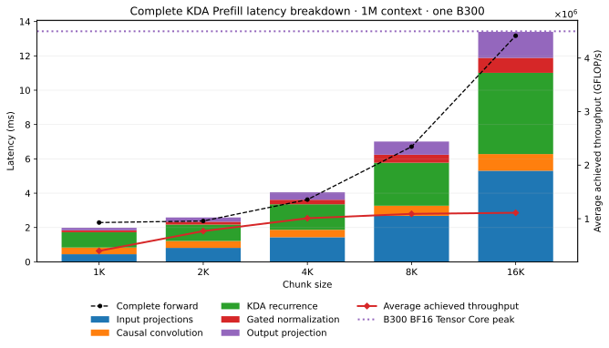

The breakdown follows the actual forward path: seven input projections (Q, K, V, output gate, beta, forget-A, and forget-B), ragged causal QKV convolution, chunk KDA recurrence, per-head gated normalization, and output projection. At the 8K reference chunk, their representative isolated times are 2.68, 0.59, 2.50, 0.47, and 0.77 ms respectively. Input projections and recurrence now dominate at approximately 38% and 36% of the isolated-stage sum; causal convolution contributes only 8.4%. The dashed complete-forward line is measured independently; the stacked stages are not used as a substitute for end-to-end latency.

!!! success "Predictable performance"

    KDA latency is highly linear after the small-chunk launch-dominated region: fitting all 20 complete-forward measurements gives $R^2=0.9936$, a slope of approximately $0.731\,\mu\mathrm{s/token}$, and a fixed intercept of approximately $1.00\,\mathrm{ms}$. Together with the stable stage composition, this makes Prefill cost directly predictable for scheduler capacity planning.

!!! important "Chunk-size driven, not context-length driven"

    For a fixed chunk, the complete-forward measurements across 32K, 128K, 512K, and 1M context differ by at most approximately 1.6%, with no growth trend. Once the prefix is represented by the recurrent state, KDA processes only the fresh chunk.

!!! success "SGLang-style ragged convolution removes the former bottleneck"

    NanoDeploy now applies the causal convolution directly to ragged Q, K, and V tensors and fuses persistent-state read and update into the Triton kernel. It no longer constructs a concatenated padded QKV workspace or performs a separate tail-state extraction. At the 8K reference point, convolution falls from approximately 7.98 ms to 0.59 ms (13.5x), while complete-layer latency falls from approximately 15.2 ms to 6.72 ms (2.27x).

    Throughput now rises from 449K tokens/s at 1K to 1.13M at 4K, 1.22M at 8K, and 1.24M at 16K. The remaining plateau begins only after the projection GEMMs and KDA recurrence become the dominant stages; latency scaling alone is still insufficient to label the complete layer compute-bound.


##### 7.1.1.1 16K-Chunk Accumulation

For comparison with MLA, the following GB200 KDA view repeats the measured
TP1, batch-one, 16K Prefill chunk cost across 64 chunks. KDA's recurrent state
already summarizes the prefix, so the marginal cost is effectively independent
of visible context. The green bars are the measured critical-rank chunk time;
the orange line is the discrete cumulative sum.

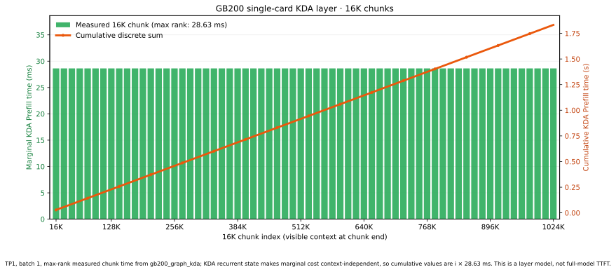

The cumulative line uses KDA's recurrent-state property: once the state is
updated, a later chunk does not revisit the full historical token sequence. It
is therefore a state-based accumulation rather than a separate 1M execution.
The flat marginal bars and near-linear cumulative line provide the contrast to
MLA's context-dependent growth. This is one representative KDA layer; the full
model uses its actual TP/DP layout and includes communication and the other layers.


#### 7.1.2 MLA

MLA is reported at three related views. The cached-prefix pipeline isolates the long-history attention work; the complete MLA layer adds projections, cache write, gating and output projection; the final GB200 trace accumulates a complete layer over all 16K chunks from an empty cache. The first two views use one B300, a mixed FP8/BF16 cache and a 128K prefix split. The accumulation trace uses one GB200, TP1 and raw FP8 KV, so its absolute time is kept separate from the B300 measurements.

##### 7.1.2.1 Cached-Prefix Kernel Pipeline

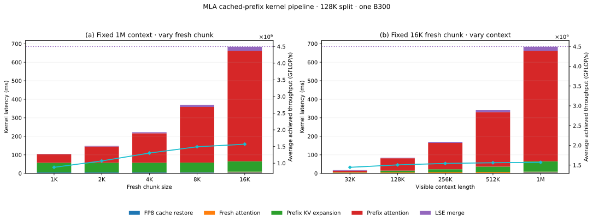

This figure is a **kernel-pipeline breakdown**, not a Decoder Layer. It fixes visible context at 1M and varies the fresh chunk. The stages start from projected Q and fresh compressed KV, then measure FP8 cache restoration, fresh causal attention, cached-prefix K/V expansion, prefix attention, and LSE-weighted result merging. The next figure presents the context sweep and complete-layer comparison.

In this chunk sweep, average achieved throughput for the complete kernel boundary rises from approximately 8.77 × 10^5 GFLOP/s at 1K to 1.57 × 10^6 GFLOP/s at 16K. The B300 BF16 Tensor Core peak is a hardware reference rather than an attainable bound for every restore, merge, or elementwise kernel. At the 1M-context, 16K-chunk point, the pipeline takes 683.6 ms: prefix attention contributes 597.0 ms, prefix K/V expansion 56.0 ms, LSE merge 21.5 ms, cache restore 4.8 ms, and fresh attention 4.3 ms.

##### 7.1.2.2 Complete MLA Attention Layer

The complete-layer view adds Q/KV/G projections, latent normalization and cache write, fresh K/V expansion, gating and output projection around the cached-prefix pipeline.


Both panels fix the fresh chunk at 16K and sweep visible context from 32K to 1M. The legends distinguish **Pipeline · …** in panel (a) from **Layer · …** in panel (b); the latter contains the complete layer and includes the pipeline as one stacked stage. At 1M context, the complete path takes 689.7 ms, only 6.1 ms above the 683.6 ms pipeline. Long-context MLA is therefore dominated by cached-prefix expansion, attention and merge; the added layer projections are comparatively small. The black dashed curve is an independent complete-forward timing.

#### 7.1.2.3 16K-Chunk Marginal Cost and Cumulative Context Cost

The previous context-scaling plot shows the cost of one selected final chunk. To
show how a cold Prefill reaches the maximum context, we ran the representative
MLA layer sequentially from an empty cache on one GB200: TP1, layer 3, raw FP8
KV cache, 16K fresh tokens per chunk, and 64 chunks up to $2^{20}$ tokens. The
bar for chunk $i$ is its measured marginal layer-forward time at visible context
$L_i=16K\,i$; the purple line is the direct cumulative sum:

$$
T_{\mathrm{cold}}(L_n)=\sum_{i=1}^{n}\Delta T_i.
$$


The red horizontal line is the GB200 TP1 KDA 16K-chunk baseline, and the
vertical marker identifies the crossover near 32K visible context. MLA becomes
more expensive from the next chunk onward. The first un-warmed trace contained
a JIT outlier; it is retained in the raw results but excluded from the plotted
curve. The reported trace warms every shape before measuring all 64 chunks.
MLA's attention and prefix expansion continue to read historical tokens, so the
marginal curve grows with $L_i$ and its cumulative sum grows much faster than
linearly.

!!! important "MLA context scaling: measured numbers"

    The marginal MLA layer time rises from **13.5 ms** at 16K visible context to **757.1 ms** at 1M, about **56×**. The cumulative representative-layer time reaches **3.63 s at 128K**, **6.34 s at 512K**, and **24.73 s at 1M**. The comparable KDA 16K chunk is **28.63 ms**, with a state-based 1M accumulation of **1.83 s**. MLA is therefore about **26× slower for the final chunk** and **13.5× slower cumulatively** under these TP1 measurements.

!!! abstract "MLA versus KDA: scheduling implication"

    Each bar is one additional 16K chunk and the curve is their direct sum. MLA's marginal cost is approximately linear in historical context, so its accumulated cold-Prefill cost grows much faster than linearly. KDA's recurrent state summarizes the prefix: a fixed-size chunk does not revisit the full historical token sequence, and its chunk cost is primarily a function of fresh $C$. MLA scheduling must include current historical context in every chunk estimate; KDA scheduling can primarily plan against fresh tokens.

!!! note "Scope of the comparison"

    These are representative single-layer GB200 measurements, not full-model TTFT. The MLA curve is a measured 64-chunk trace after shape warmup; the KDA cumulative value is a state-based accumulation of the measured TP1 16K chunk. They establish context-scaling behavior and admission-planning implications, not a universal end-to-end latency ratio.


#### 7.1.3 MegaMoE

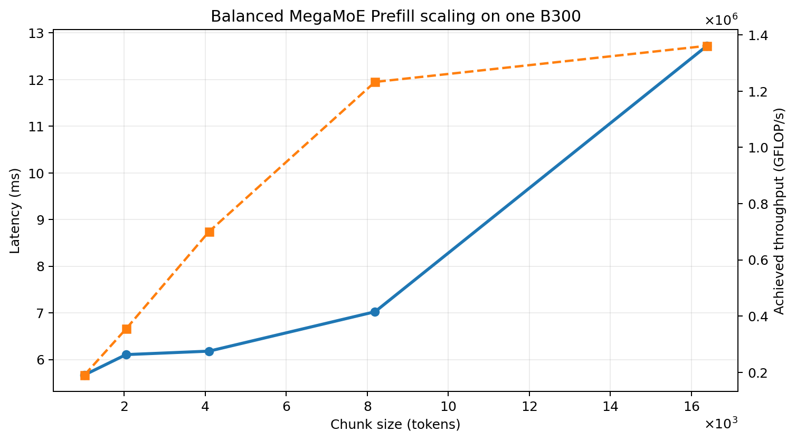

The existing production MXFP4 MegaMoE benchmark uses 896 experts, Top-16 routing, latent width 3584, and intermediate width 3072. Its synthetic expert IDs are round-robin, so the routed-row counts differ by at most one and form the perfect-balance baseline. Latency is nearly flat from 1K to 4K (5.67--6.18 ms), then reaches 7.02 ms at 8K and 12.72 ms at 16K.

The next experiment will measure the complete MoE path and break it into router/latent-down, Top-K, pre-dispatch, fused routed experts, routed norm/up, shared experts, and output merge. Routing imbalance will be added only after its load-distribution metric and synthetic distributions are agreed upon.

#### 7.1.4 Dense FFN

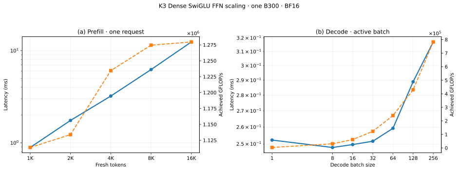

The single dense FFN uses a gated SwiGLU path with hidden width $7168$ and intermediate width $33792$. For each active token, the gate and up projections produce two $33792$-wide tensors, SiLU-and-multiply forms the gated intermediate, and the down projection returns to $7168$. The benchmark measures the complete three-matrix path in BF16 on one B300; it is a component boundary, not a full Decoder Layer.

During Prefill, latency rises from 0.891 ms at 1K fresh tokens to 12.406 ms at 16K. Achieved throughput increases from $1.11\times10^6$ to $1.28\times10^6$ GFLOP/s and is nearly saturated by 8K tokens. The approximately linear latency is mainly a consequence of processing more rows, while the nearly flat throughput curve shows that the wide GEMMs have reached steady throughput.

Because K3 has only one Dense FFN layer, its Prefill cost is added once in the model equation. It does not require a context-length sweep: like MoE, it processes only the current chunk.

### 7.2 Decode

Decode emits one token per active sequence. Unlike Prefill, the useful workload
coordinates are local batch $B$ and visible context $L$. KDA reads and updates a
fixed recurrent state; MLA reads the latent cache for every query; routed MoE
adds batch-dependent expert reuse and load imbalance. All batch values below are
per attention-DP group unless stated otherwise, and timings use the slowest rank.

#### 7.2.1 KDA: fixed state, batch-driven scaling


The GB200 single-card graph sweep shows the KDA batch curve directly: latency rises from about **0.152 ms at B=1** to **0.639 ms at B=256**, while local throughput increases as the recurrent core reaches a useful GEMM size. Because the recurrent state has fixed size, increasing context alone does not create a new KDA attention axis. These are single-card measurements; multi-card TP/DP selection is deferred to §8.

#### 7.2.2 MLA: batch and context are both first-class axes

MLA Decode is evaluated with batch size $B$ as the independent variable at fixed total context $N=B\times L$; each curve holds the total tokens in the request group approximately constant. The single-card complete real-weight MLA layer includes Q/KV projections, paged absorbed attention, output gate/value projection and output; values use FP8 KV and contexts 1K–1M.


!!! success "Takeaway · fixed total context"

    At a fixed total context $N=B\times L$, changing batch size mainly redistributes the same tokens across sequences. MLA Decode latency therefore tracks the visible context term most strongly; batch adds projection and launch overhead but does not remove the long-context cost.


At fixed total context, changing batch mostly redistributes the same tokens across sequences; the measured attention time remains dominated by the visible context term, while larger batch adds projection and launch work. Multi-card TP/CP and cache ownership are deferred to §8.

!!! important "MLA Decode takeaway"

    Decode selection is a $(B,L)$ decision. A configuration that wins at batch one and 8K may lose at batch 32 and 1M; compare equal global batch, then apply the memory screen. Context length directly increases MLA cache reads, while KDA's recurrent state keeps its context dependence largely out of the per-token kernel.

#### 7.2.3 MegaMoE: reuse and routing determine the batch curve

The complete real-checkpoint FFN layer is shown as a single-card token-batch proxy with synthetic normal activations. It includes router, shared experts, latent projections and packed MXFP4 expert weights; the routing-load curve is carried as context for later multi-card analysis.


The proxy shows the expected batch amortization and why routing imbalance must remain visible. It is not a multi-card EP result; conversion and expert-owner costs are analyzed later.

!!! note "Decode selection order"

    First establish the single-card $(B,L)$ baseline shown here. Then, in §8, screen weights/cache capacity and add TP, DP, CP, EP and conversion costs. Report TPOT and concurrency separately; a single-layer graph is not an end-to-end Decode SLO.

#### 7.2.4 Dense FFN

The Dense FFN follows the same batch-size sweep shown above. Its Decode cost depends on active batch size, not resident context length. Latency stays near 0.25 ms through batch 32 and reaches 0.317 ms at batch 256; achieved throughput rises from $3.84\times10^3$ to $7.83\times10^5$ GFLOP/s. Small batches are launch- and weight-bandwidth dominated, while larger batches expose tensor-core throughput. The single dense layer is a small additive term in TPOT.

### 7.3 Model-Level Composition and Bottleneck Summary

After the complete operator curves are available, the Prefill and Decode models will be composed using K3's actual layer counts:

$$
T_{\mathrm{K3}}
=69T_{\mathrm{KDA}}+24T_{\mathrm{MLA}}+92T_{\mathrm{MoE}}+T_{\mathrm{Dense}}.
$$

The single Dense FFN term remains in this equation and is added once. Final memory-bound or compute-bound labels will require achieved FLOP/s, HBM bytes, SM utilization, tensor-core utilization, and kernel launch gaps rather than latency scaling alone.

The benchmark inputs, raw CSV/JSON results, and plotting scripts are kept under `bench/k3_layer_performance/`.

## 8. Intra-Layer Parallelism Overview

K3 needs parallel execution to meet capacity and latency targets. Its computation graph then includes layout conversions along the Attention → FFN → Attention path, in addition to the layer computations and their internal communication:

$$
T_{\mathrm{layer}} = T_{\mathrm{compute}} + T_{\mathrm{collective}} + T_{\mathrm{layout\ transition}}.
$$

Capacity legality comes first; latency and throughput are compared only among layouts that fit.

<div style="display:flex;gap:1.25rem;align-items:stretch;flex-wrap:wrap;margin:1rem 0">
  <div style="flex:1 1 18rem;border:1px solid #94a3b8;border-radius:.5rem;padding:1rem;background:#f8fafc">
    <strong>Single-card graph</strong>
    <div style="display:flex;align-items:center;gap:.4rem;flex-wrap:wrap;margin-top:.8rem">
      <span style="padding:.45rem .65rem;border-radius:.35rem;background:#dbeafe">Hidden states</span><b>→</b>
      <span style="padding:.45rem .65rem;border-radius:.35rem;background:#bfdbfe">Attention</span><b>→</b>
      <span style="padding:.45rem .65rem;border-radius:.35rem;background:#bbf7d0">FFN</span><b>→</b>
      <span style="padding:.45rem .65rem;border-radius:.35rem;background:#e2e8f0">Next layer</span>
    </div>
  </div>
  <div style="flex:1 1 24rem;border:1px solid #7c3aed;border-radius:.5rem;padding:1rem;background:#faf5ff">
    <strong>Distributed graph</strong>
    <div style="display:flex;align-items:center;gap:.4rem;flex-wrap:wrap;margin-top:.8rem">
      <span style="padding:.45rem .65rem;border-radius:.35rem;background:#dbeafe">Hidden states</span><b>→</b>
      <span style="padding:.45rem .65rem;border-radius:.35rem;background:#bfdbfe">Attention shard</span><b>→</b>
      <span style="padding:.45rem .65rem;border-radius:.35rem;background:#fed7aa">Collective<br>/ layout conversion</span><b>→</b>
      <span style="padding:.45rem .65rem;border-radius:.35rem;background:#bbf7d0">FFN / expert dispatch</span><b>→</b>
      <span style="padding:.45rem .65rem;border-radius:.35rem;background:#fed7aa">Collective<br>/ layout conversion</span><b>→</b>
      <span style="padding:.45rem .65rem;border-radius:.35rem;background:#e2e8f0">Next attention shard</span>
    </div>
  </div>
</div>

This chapter focuses on **intra-layer parallelism**: TP, CP and EP inside a decoder layer, together with DP for independent requests. Pipeline parallelism (PP), which partitions layers across stages, and Attention–FFN disaggregation (AFD), which separates execution domains, are outside the current comparison. They remain higher-level deployment dimensions and are not mixed into the capacity and latency analysis below.

### 8.1 MLA: TP, DP and CP

MLA distributes projection/head work with TP, independent requests with DP, and history with CP.

| Choice | Weight sharding | Activation sharding | KV-cache / history sharding | Added communication and selection rule |
| --- | --- | --- | --- | --- |
| More DP | Replicates projection and attention weights in each request group | Each group owns independent request rows | Each group owns the cache for its requests | No attention-internal exchange; increases independent-request throughput but does not accelerate one request |
| More TP | Shards projection and head weights across ranks | Head/output shards require reductions or owner restoration | Compressed latent cache remains replicated across TP ranks | Projection reductions plus attention/FFN boundary conversions; useful when weight fit or single-request Prefill dominates |
| More CP (**KV all-gather + LSE merge**) | Keeps projection weights TP-sharded | Queries are exchanged or replicated to history owners | History pages are partitioned approximately as $1/P$ per rank | Query/KV exchange and numerically correct LSE merge; worthwhile only when cache capacity or long-history work repays these costs |

**Prefill CP and Decode CP address different bottlenecks.** Splitting fresh
query tokens during Prefill can distribute large $CL$ attention work, but
causal partitions need balanced assignments and access to the appropriate KV
history. Merely splitting queries while replicating the complete cache does
not yield a $1/P$ cache-capacity benefit. A history-sharded implementation must
stream/gather KV or broadcast queries and merge partial outputs.

For a long cached prefix, broadcasting the relatively small fresh-query block
to persistent KV owners is a useful alternative to moving the history every
layer. Decode uses the same principle with very few queries: keep historical
pages in place and communicate current-query/output data. This is the phase
distinction described in [vLLM's context-parallel deployment guide](https://docs.vllm.ai/en/latest/serving/context_parallel_deployment/).

For history shard $j$, let $o_j$ be its normalized attention output and $\ell_j$
its log-sum-exp. Correct composition is

$$
m=\max_j\ell_j,\qquad
 o=\frac{\sum_j e^{\ell_j-m}o_j}{\sum_j e^{\ell_j-m}}.
$$

An ordinary sum or average of $o_j$ is incorrect. Our experimental CP path
reuses FlashAttention's GB200 CuTe kernel and implements this merge with FP32
MAX/SUM collectives and fused Triton packing/normalization. It preallocates
merge buffers and supports CUDA Graph capture. That prototype begins with
projected queries and expanded cached K/V, so it measures **attention plus CP
merge**. The separate paged Decode prototype in §10.4.1 includes query exchange
and compressed-cache attention; complete MLA is measured in §9.5 and §10.4.

For nested CP at fixed $T_A$, the main attention FLOPs per rank remain roughly
constant: $hP/T_A$ heads times $L/P$ keys. Benefits can still come from less
replicated latent traffic, better kernel geometry, and greater resident-request
capacity. A claim of both $1/T_A$ and an additional $1/P$ compute reduction
would double-count the same workers.

There is a second, useful MLA convention: **CP nested inside an existing
projection-TP group**, as in decode context parallelism. Let $T_A$ be projection
TP and $P\mid T_A$. Then

$$
D_A T_A=G,\qquad T_{\mathrm{head}}=T_A/P.
$$

Weights remain projection-sharded by $T_A$; queries are exchanged within the CP
subgroup so each rank computes $P$ times as many heads against $1/P$ of the
history, then returns its output-head shard. **Do not multiply the worker count
by $P$ again.** Additional replicated expansion/projection weights, if used to
avoid exchanges, must be budgeted. This distinction is essential when comparing
“TP8 with CP2” with an independent “TP8×CP2” mesh. The nested interpretation is
the extension recommended below. [vLLM's DCP implementation discussion](https://github.com/vllm-project/vllm-project.github.io/blob/main/_posts/2026-08-07-decode-context-parallelism.md)
describes query exchange, LSE-weighted output composition, and the divisibility
constraint; [SGLang's server arguments](https://docs.sglang.io/docs/advanced_features/server_arguments)
also expose alternative DCP communication backends and query-projection
replication.

### 8.2 KDA: TP and DP

KDA has no historical-token axis to distribute after a prefix has been reduced
to state. Its legal independent units are heads and complete sequences.

| Choice | Capacity effect | Compute and bandwidth effect | Limitation |
| --- | --- | --- | --- |
| KDA DP | Replicates KDA weights; assigns different sequence states to ranks/groups | Raises throughput when independent sequences are available | One long request still follows its recurrence in order |
| KDA TP | Divides most projections, 96 heads, convolution state, and recurrent state | Reduces weight/state bytes and head work per rank | Smaller GEMMs and output communication can erase the gain at small batches |

Splitting the fresh tokens of one KDA sequence as if they were DP requests
would break the recurrence. A sequence-parallel scan would require explicit
state propagation or composition of recurrence transforms; it is a separate
algorithm, outside this chapter's KDA DP/TP choices.

The kernel supports $T_K\in\{1,2,4,8,16\}$ because all divide 96. Select the
smallest TP that meets capacity **and** the measured latency/throughput target,
rather than assuming either TP1 or the largest TP is optimal. The measurements
in §9.3–9.7 and §10.3–10.6 show why execution mode matters particularly for Decode.

### 8.3 Routed FFN: EP and TP

At fixed $D_F=1$, $E T_F=16$ gives the following theoretical routed-weight
placements, before kernel-specific padding:

| FFN layout | Experts/rank | Intermediate width/rank | Routed weights/rank | Main trade-off |
| --- | ---: | ---: | ---: | --- |
| EP16×TP1 | 56 | 3072 | 90.404 GB | Full expert GEMMs; widest expert-owner mesh |
| EP8×TP2 | 112 | 1536 | 90.404 GB | Fewer expert owners; extra expert-TP coordination |
| EP4×TP4 | 224 | 768 | 90.404 GB | More experts with thinner matrices |
| EP1×TP16 | 896 | 192 | 90.404 GB | No EP dispatch across owners; expert-TP communication and very narrow GEMMs |

Equal storage is not equal efficiency. EP favors whole, well-populated expert
GEMMs, but pays dispatch/combine and suffers when expert owners are unevenly
loaded. Expert TP can recruit multiple GPUs for a hot expert, but introduces
input replication and partial-output reduction, often on routed-token tensors.
Quantization alignment and available kernel shapes also constrain $T_F$.

**The current K3 MegaMoE backend requires $T_F=1$.** EP8×TP2 and EP4×TP4 are
not working launch configurations of the serving backend. The added
benchmark prototype instead shards each expert's intermediate weights and
composes native MegaMoE calls with input all-gather and output reduce-scatter;
its results and the required physical padding are reported in §9.3–9.7 and §10.3–10.6. Also, K3's shared experts are explicitly replicated in
`KimiMoE`; enabling expert TP would not automatically divide their 24.310 GB.
The router and routed down/up projections contribute another 10.637 GB of
replicated weights.

### 8.4 Dense FFN: TP and Token Ownership

The one Dense FFN has no expert axis. Its intermediate matrices can use FFN TP,
but its 1.453 GB and single-layer computation do not justify choosing the mesh
for the other 92 FFNs.

Token partitions apply the same FFN weights to different rows; tensor partitions split the matrices and require composition of partial outputs.

### 8.5 Parallel-Layout Constraints and Transitions

Let $G$ be the GPU count, $D$ the request/replica degree, $T$ the tensor degree, $P_M$ the MLA context degree and $E$ the expert degree. With pipeline parallelism fixed at one, independent component meshes satisfy

$$
D_M P_M T_M=D_K T_K=D_F E T_F=G.
$$

These are **alternative views of the same GPUs**, not three GPU pools to add.
For example, attention DP2×TP8 and FFN EP16 both use all 16 workers.
Request DP does not split the tokens of one request: one 8K Prefill chunk still
lands on one attention group. A throughput comparison must keep global request
count fixed, or explicitly report the different number of simultaneous
requests served by each layout.

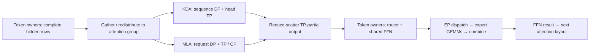

KDA and MLA are alternatives at each layer. There is no direct KDA→MLA kernel
boundary: an FFN lies between attention layers. If their DP/TP groups differ,
the FFN-to-next-attention mapping must bridge those groups.

Let $n$ be the active rows **in one attention group**, and let

$$
\widehat n=T_A\lceil n/T_A\rceil,\qquad
X=2H\widehat n=14{,}336\widehat n\ \mathrm{bytes}.
$$

Padding matters: batch-one TP16 processes a 16-row boundary tensor unless the
implementation supports uneven/empty shards. These extra rows can also create
FFN work. At 8K Prefill, $X=112$ MiB; at 16K it is 224 MiB.

| Boundary | Required action | First-order communication accounting |
| --- | --- | --- |
| TP-partial attention output → unique FFN rows | Reduce-scatter (RS) | Ring reference: $(p-1)X/p$ bytes sent/rank |
| Already all-reduced attention output → FFN rows | Local slice | No new network traffic, but the earlier all-reduce already cost $2(p-1)X/p$ |
| Unique FFN rows → next TP-replicated attention input | All-gather (AG) | $(p-1)X/p$ bytes sent/rank |
| Different token-owner assignments or unequal DP groups | Permutation, often all-to-all / all-to-all-v | Must follow the actual source/destination mapping; matching shapes alone do not make it free |
| MLA history shards → composed attention output | Query exchange plus LSE-aware merge | Size follows current queries, heads and output width, not the whole history |
| Expert-TP partial outputs → final routed result | TP reduction or fused reduction/scatter | Depends on whether per-expert outputs are locally combined first |

The ring byte formulas describe a reference volume, not the NCCL algorithm
actually selected. Send+receive accounting would double them. The measured
latency of the complete RS→AG pair is more useful than adding independent
peak-bandwidth estimates.

In K3's attention-residual path, the output projection defers reduction and
`AttnToFfnTransition.reduce_scatter()` consumes its partial output. Count that
RS **instead of** the output all-reduce, then count the return AG. Charging
all-reduce, RS and AG for the same optimized boundary overstates its cost.
Residual prefixes and the attention-residual bank must follow the same row
mapping; they cannot be silently left on the old owners.

MoE dispatch is a separate operation. A BF16 per-expert assignment model gives

$$
V_{\mathrm{dispatch}}^{\mathrm{logical}}=n_g kR\times2,
\qquad k=16,
$$

where $n_g$ is the total input rows in the EP group. At $n_g=8192$, this is
0.875 GiB per direction, before locality. With uniform routing, a fraction
$1-1/E$ of expert assignments is remote. **This is not the actual wire-byte
count:** MegaMoE dispatches FP8 activations and scales; multiple selected experts
on one destination can share a delivered row, and combine can aggregate local
expert contributions. Under an approximate independent uniform routing model,
expected remote destinations per token are

$$
(E-1)\left[1-(1-1/E)^{16}\right].
$$

Thus report assignment bytes, destination fan-out and measured fused-operator
time separately. Raw all-to-all on one $[n,H]$ tensor does not measure Top-16
expert dispatch.

Finally, changing a **live request's** layout between Prefill and Decode can
require moving persistent cache and KDA state. One maximum-length request owns 13.5 GiB of raw-FP8 MLA cache
(or 27 GiB of BF16 cache) and 226.4 MiB of KDA state before sharding. This is a one-time migration
cost, distinct from per-layer activation exchange. Prefer fixed ownership or
an explicit, amortized migration policy over switching meshes every step.

$$
T_{\mathcal P}=T_{\mathrm{shell}}
+\sum_{l=1}^{93}\left[
 t_{A_l}^{\mathrm{local}}+t_{A_l}^{\mathrm{internal\ comm}}
 +t_{A_l\to F_l}+t_{F_l}
 +t_{F_l\to A_{l+1}}\right],
$$

with the final edge interpreted as the output/shell transition. The attention
sequence has 69 KDA and 24 MLA layers; FFN has 92 MoE and one Dense layer.
For a homogeneous, synchronized workload, the sum becomes the corresponding
weighted component costs, but each distributed stage must use the critical
rank/group. Different request populations and routing distributions need
separate points in the matrix.

Inside MoE, shared and routed paths can overlap. Its critical path is roughly
router/front preparation, followed by the longer of shared FFN and the
routed dispatch/GEMM/combine/up path, followed by merge. Summing independently
timed shared and routed kernels ignores that overlap; using routed-kernel time
alone omits real work.

For a measured KDA forward that already includes all-reduce, the NCCL reference
replacement for a token-sharded FFN boundary is

$$
\widetilde t_K=t_K^{\mathrm{measured}}-t_{\mathrm{AR}}(n,T_A)
 +t_{\mathrm{RS\to AG}}(n,T_A).
$$

This is a **model substitution**, not a measurement of the fused layer. It
requires matching dtype, group, execution mode and row count. When a complete
layer already includes transitions, add neither term again.

