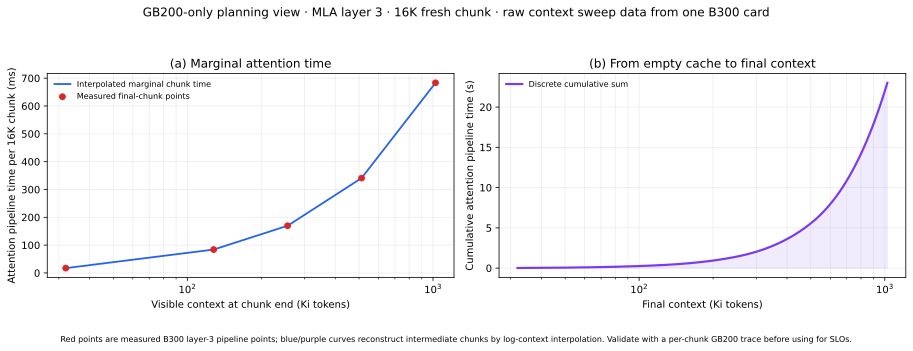
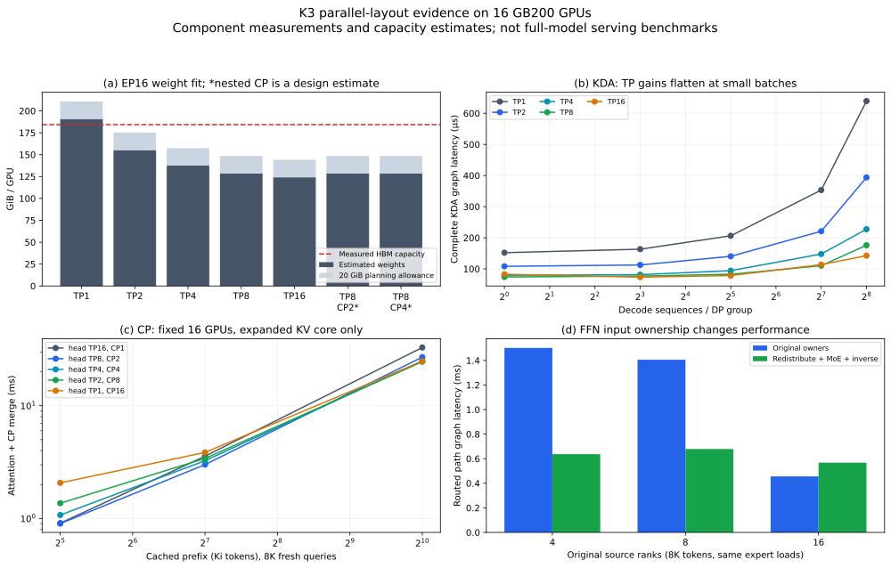
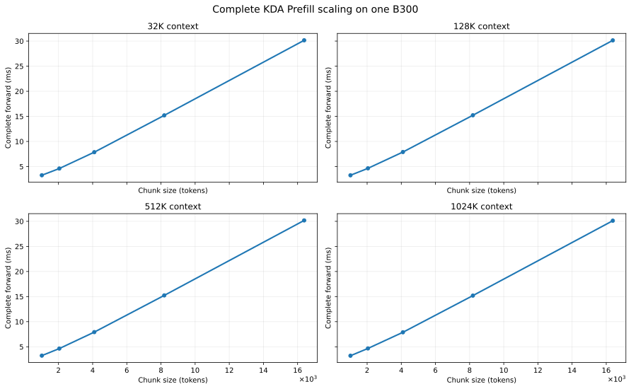
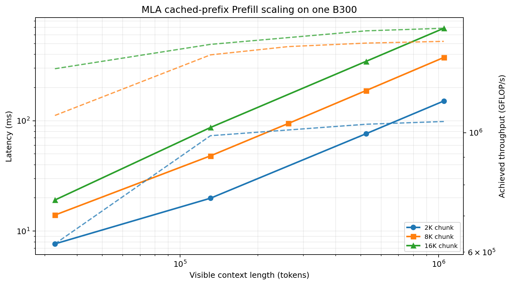
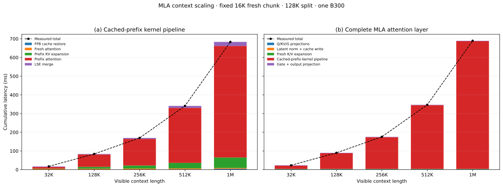
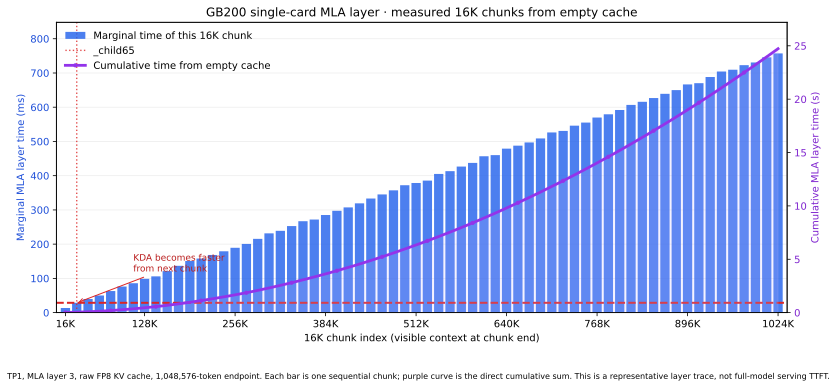
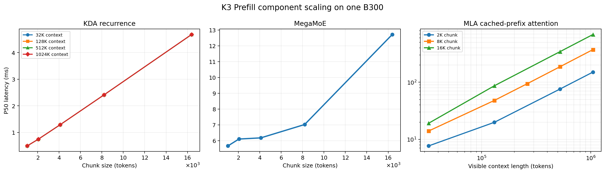

# Kimi K3 Prefill: Capacity, Sharding and Performance

This companion focuses on cold and continuation Prefill. It assumes the model structure, capacity model and intra-layer parallelism definitions from the overview article.

## 9. Prefill

Prefill parallelism is evaluated by fresh chunk size, cached history and time to first token. First screen weight, cache and activation capacity; then compare complete component times and the transitions defined in §8.5. Cold Prefill must include all chunks, while continuation Prefill processes only the new suffix.

### 9.1 Capacity and Legal Sharding

The measured CUDA-visible capacity is **197,897,748,480 bytes = 184.306 GiB per
GPU**. The 16-card total does not make every rank's replicated weights fit.

Separate shardable and replicated attention weights:

$$
\begin{aligned}
M_W \approx{}& \frac{1446.456}{E T_F}+24.310+10.637+\frac{1.453}{T_F}\\
 &+W_{K,r}+\frac{61.258-W_{K,r}}{T_K}
  +W_{M,r}+\frac{11.145-W_{M,r}}{T_M}
  +W_{\mathrm{shell,rank}}\quad\mathrm{GB},
\end{aligned}
$$

where $W_{K,r}\simeq0.127$ GB and $W_{M,r}\simeq0.727$ GB include KDA forget-A
and MLA Q-A/KV-A projections and associated norms. For nested CP, $T_M$ here is
projection TP $T_A$, not the effective head degree $T_A/P$.

The shell is approximately 5.601 GB, including 4.698 GB of embedding/LM-head
weights that the current runtime shards by attention TP. The rest is retained
conservatively, including checkpoint payload not used by text-only inference.
The earlier “other” bucket of 7.054 GB already included the Dense FFN;
**adding 1.453 GB to that bucket again double-counts it.** These are checkpoint
storage estimates; backend repacking and any CP-specific replicated matrices
remain additional allocations.

For $n_T$ cached tokens and $n_S$ sequence slots **assigned to one request-DP
group**, balanced cache ownership gives

$$
M_{\mathrm{cache,rank}}
=\frac{24s_{\mathrm{KV}}n_T}{P}
 +\frac{237{,}404{,}160n_S}{T_K}\quad\mathrm{bytes}.
$$

At fixed global resident population with balanced DP and no CP,
$n_S=N_S/D_K$, so KDA state per rank is $237{,}404{,}160N_S/G$: exchanging DP
for TP does not change this balanced cluster-wide state cost. In contrast,
MLA cache at fixed $G=D_A T_A$ grows with $T_A$ because more TP ranks replicate
each request. This is why “TP shrinks the state” alone is not a concurrency
argument.

The actual peak condition is

$$
\max_r\left[
 M_{W,r}+M_{\mathrm{cache},r}+M_{\mathrm{persistent},r}
 +\max_{\mathrm{stage}}M_{\mathrm{live\ transient},r}
 +M_{\mathrm{reserve},r}\right]\le M_{\mathrm{HBM},r}.
$$

Persistent MoE/communication buffers remain live during attention. Count them
**once per process, in addition to** the largest overlapping transient stage.
Do not sum all 93 layer activations; do not take a maximum that incorrectly
allows a persistent buffer to disappear during MLA. This qualifies the
allocator-reuse discussion in Chapter 5.

The peak must be checked at the largest live Prefill stage for the chosen chunk and history. Resident-request planning is evaluated separately in §10.1 using the same weight and persistent-buffer accounting.

### 9.2 Compute, HBM and Chunk Size

For each stage and rank, a useful first-order model is

$$
t_{r}\gtrsim\max\left(\frac{F_r}{\Pi_{\mathrm{eff}}},
                         \frac{Q_{\mathrm{HBM},r}}{B_{\mathrm{HBM,eff}}}\right)
 +t_{\mathrm{launch}}+t_{\mathrm{communication,exposed}}.
$$

$\Pi_{\mathrm{eff}}$ must match the dtype and local GEMM shape. An MXFP4
checkpoint-byte count does not permit using a BF16 compute peak for its expert
kernel, or an FP4 peak for all attention operations. HBM bytes and network bytes
are separate budgets. Communication overlap reduces the **exposed** term only
when the implementation and measurements establish that overlap.

The plotted measurements preserve the same rows as the benchmark output; the figure exposes the scaling trend without making the reader decode a numeric matrix.

The chunked-Prefill KDA recurrence requires its own work estimate; a Decode
state-update count does not cover its intermediates. MLA's 0.464 GFLOP/token projection/expansion
baseline also needs **cached-prefix KV expansion** added during Prefill:
$2(L-C)h(128+128)512$ FLOPs per MLA layer.

At the reference $C=8192,L=2^{20}$, all 24 MLA layers contribute about **12.617
PFLOP of attention** and **0.628 PFLOP of cached KV expansion**. The remaining
fixed-per-token model work is about **1.691 PFLOP**. The causal fresh triangle
is included; treating all fresh queries as attending the final length slightly
overcounts it. At 16K fresh tokens the corresponding terms are 25.135, 0.623 and
3.382 PFLOP.

For current Blackwell MLA, maximum-length cache storage is 576 MiB/layer
(raw FP8) or 1,152 MiB/layer (BF16), totaling 13.5 or 27 GiB per request. This is a **one-pass byte baseline**, not a promise that the
kernel reads each byte once. Expanded BF16 K/V is 60 GiB/layer before head
sharding. Writing and reading it once is already 120 GiB. A fixed-size prefix
split bounds live expansion, but CP does not automatically divide that bound:
with fixed split size $S$, it is proportional to
$\min(S,L/P)\,h/T_{\mathrm{head}}$. In nested CP the effective head count per
rank increases, so split size and merge workspace need to be retuned together.

For cold chunked Prefill with $J=L/C$, attention visits $L(L+1)/2$ causal pairs.
The current expanded-MLA implementation re-expands historical latent rows on
each chunk, so the total prefix rows expanded are
$C J(J-1)/2$. The 128K workspace split bounds liveness within a chunk; it does
not persist expanded KV between chunks. For an 8K serving chunk:

<!-- BEGIN PHASE_WORK_TABLE -->

The plotted measurements preserve the same rows as the benchmark output; the figure exposes the scaling trend without making the reader decode a numeric matrix.

<!-- END PHASE_WORK_TABLE -->

Cold Prefill includes fixed per-token work, causal MLA attention and repeated
prefix expansion. Decode adds fixed work and absorbed MLA arithmetic. These
are algorithmic estimates across the model, not hardware latency estimates;
the KDA Prefill recurrence term remains an approximation. At the maximum
endpoint, cold work is about **1,067 PFLOP**, compared with **14.94 PFLOP** for
only the final 8K chunk. The large difference is why a 99%-cached benchmark
cannot establish cold maximum-context TTFT.

### 9.3 Experimental Setup and Boundary Costs

The distributed measurements used four nodes and 16 NVIDIA GB200 GPUs.
One worker was pinned to each GPU; groups of 2/4 remained within a node, while
8/16 spanned nodes. Local topology reports NV18 peer links. Multi-node NCCL and
MegaMoE with NCCL symmetric memory both completed. Thus a node boundary alone
is not evidence that this job uses an ordinary slow inter-node link; GB200 can
span a multi-node NVLink domain. [NVIDIA's GB200 topology guide](https://docs.nvidia.com/multi-node-nvlink-systems/multi-node-tuning-guide/overview.html)
explains that hardware capability; the tables below use the actual measured
job topology instead of advertised link bandwidth.

Measurements use PyTorch 2.11.0+cu130 and CUDA 13.0. For repeated microbenchmarks, Ray launch, allocations and
weight preparation are outside latency timing; warmups precede measurement.
The single-pass cold and full-model sweeps explicitly retain first-shape/JIT
effects and are labeled separately. Component tables report the **maximum rank latency** at a point, since the slowest participating
rank controls completion; raw per-rank results remain available.

A 256 MiB device copy, counting reads and writes, achieved **6.52–6.54
TB/s/rank**, median 6.54 TB/s. This is an empirical streaming-copy reference,
not guaranteed effective bandwidth for irregular cache access. The accompanying
BF16 GEMM sweep uses actual KDA projection dimensions and TP-sharded widths.

The graph experiment captures eight consecutive operations and amortizes replay
over them; each point has five warmups and three trials of thirty replays.
The eager reference is retained separately. The following are directly timed
**RS→AG pairs** on BF16 hidden states:

The plotted measurements preserve the same rows as the benchmark output; the figure exposes the scaling trend without making the reader decode a numeric matrix.

These measurements establish both a size-dependent bandwidth term and a small
message floor. At TP8, 93 such boundaries amount to about **36.7 ms per 8K
forward**, or **5.0 ms for batch-one Decode**, before overlap. They are NCCL
reference costs; NanoDeploy's specialized K3 communicator can differ. Graph
capture lowers launch overhead but barely changes large-message bandwidth.

### 9.4 KDA Prefill

The plotted measurements preserve the same rows as the benchmark output; the figure exposes the scaling trend without making the reader decode a numeric matrix.

Each point processes one 8K request per DP group and includes output all-reduce. These are per-group eager latencies, not equal-global-load throughput. The current ragged convolution path prevents unchanged Prefill CUDA Graph capture.

The plotted measurements preserve the same rows as the benchmark output; the figure exposes the scaling trend without making the reader decode a numeric matrix.

The second sweep uses actual NCCL worlds of 1/2/4/8 ranks; world 16 comes from the original job. Concurrent jobs used other GPU allocations. These isolated layers do not establish full-checkpoint capacity on the smaller worlds.

### 9.5 MLA Prefill

The complete layer includes projections, cache write, restore/expansion, attention and output all-reduce. The first table fixes an 8K fresh suffix ending at 1M visible tokens.

The plotted measurements preserve the same rows as the benchmark output; the figure exposes the scaling trend without making the reader decode a numeric matrix.

Prefill uses three trials of three eager forwards after warmup, reporting the maximum per-rank median. Transient memory excludes resident weights/cache and initialized Decode workspace.

Two failures found during this sweep were fixed in the runtime. The installed
TRTLLM-GEN kernels reject 24 local Q heads and a 96-head large-batch point. We
pad 24→32 and 96→128 inside the graph, then discard only the padded output
heads. Heads attend independently, so this preserves the actual heads while
retaining the optimized kernel. The extra padded work is included in these
measurements. The unpadded support probe and failed-run metadata are retained.

The original BF16 Prefill branch expanded the complete cached history, whereas
FP8 used a 128K prefix split. Extending that bounded path to BF16 reduces the
TP8, maximum-length/8K transient peak from **19.32 to 3.33 GiB**; its complete
forward falls from **78.07 to 62.41 ms** in these runs. TP16's peak falls from
10.28 to 2.30 GiB. The full latent gather remains proportional to context;
only expanded K/V workspace is bounded. CP does not automatically reduce the
remaining gather or the expansion peak.

Real-weight checks cover all 24 MLA layers at TP1, and layer 3 at every tested
TP. They compare chunked Prefill and Decode against causal BF16 attention,
including nontrivial physical page ordering and graph replay. Across the
24-layer short-sequence check, maximum relative L2 errors were **0.00039
for BF16 Prefill, 0.005995 for BF16 Decode, 0.0204 for FP8 Prefill and 0.0562
for FP8 Decode**. Raw-FP8 Decode quantizes Q as well as storing FP8 KV. These
local numerical checks are not a long-context accuracy or generation-quality
acceptance criterion.

#### 9.5.1 Context-Parallel Attention Core

The plotted measurements preserve the same rows as the benchmark output; the figure exposes the scaling trend without making the reader decode a numeric matrix.

<!-- END CP_MEASUREMENT_TABLE -->

The table fixes one request and 16 cooperating GPUs, so
$T_{\mathrm{head}}P=16$. Queries and expanded cached K/V are prepared before
timing. CUDA Graph includes FlashAttention plus the preallocated Triton/FP32
CP merge. Nonzero inputs were checked against independent FP32 dense attention
for every layout on all ranks; maximum absolute error was below 0.005 in the
small reference cases. An additional 576 per-rank checks covered noncontiguous
LSE, irregular sizes, large logits and fully masked rows against FP64
composition. These validate the merge, not full K3 output quality.

CP has a context-dependent break-even: shorter histories expose exchange and
merge costs; longer histories can benefit from the changed head/history kernel
geometry. **The experiment excludes query exchange and KV restoration/
expansion**, which must be added before selecting a production MLA layout.
The one-query rows in the raw matrix use expanded cached attention and must
not be presented as paged, absorbed Decode performance.

#### 9.5.2 Cold Prefill from an Empty Cache

We also populated a real-weight MLA layer **from an empty cache**, appending
every 8K chunk sequentially up to the target length. Its cache contains latents
actually produced by that layer's KV projection. The input activations are a
repeated finite random tile. The following values are one complete cold sweep
per point, taking the slowest rank; they include eager host/metadata gaps and
are less statistically robust than the repeated steady-state timings above.

<!-- BEGIN COLD_TABLE -->

The plotted measurements preserve the same rows as the benchmark output; the figure exposes the scaling trend without making the reader decode a numeric matrix.

<!-- END COLD_TABLE -->

This is one MLA layer, not whole-model TTFT. At the maximum endpoint, recomputing
the final chunk with split versus unsplit historical attention gave relative
L2 error below 0.00685 for all tested TP/dtype/chunk combinations. The cold
experiment includes both cache formats, TP4/8/16, and an extra TP16 comparison
of 4K/8K/16K chunks: the FP8 maximum-length cold layer took **3.945/2.941/2.017
seconds**, respectively. Larger chunks amortize repeated expansion and launches,
but need larger activation and FFN buffers; this is not yet a whole-model
16K-chunk result. A cached suffix timing cannot substitute for this cold
traversal, and setting `max_model_len=1048576` alone does not execute it.

### 9.6 FFN and Source-Layout Conversion

FFNs process current rows in both phases. The shared row-count sweeps below include small batches as well as Prefill-sized chunks; here the selection question is the complete cost at the chunk size and source ownership produced by attention.

The measured boundary is pre-dispatch plus the fused MXFP4 routed-expert kernel,
including its dispatch/combine. It excludes router, latent down/up, shared
experts and residual merge. Synthetic zero-valued weights exercise the real
kernel shapes; this is a performance experiment, not a checkpoint-quality test.
All groups contain 896 experts with Top-16 routing.

<!-- BEGIN MOE_MEASUREMENT_TABLE -->

The plotted measurements preserve the same rows as the benchmark output; the figure exposes the scaling trend without making the reader decode a numeric matrix.

<!-- END MOE_MEASUREMENT_TABLE -->

“Balanced” assigns consecutive token/expert pairs round-robin over all 896
experts. At small batches some experts must remain inactive. “Hot” routes every
token to the same 16 experts on rank zero, giving a max/mean expert load of 56.
It is an extreme sensitivity case, not a measured production routing
distribution. The tiny-batch hot case can run faster because fewer expert
weights participate; large batches expose the overloaded owner.

<!-- BEGIN SOURCE_MEASUREMENT_TABLE -->

The plotted measurements preserve the same rows as the benchmark output; the figure exposes the scaling trend without making the reader decode a numeric matrix.

<!-- END SOURCE_MEASUREMENT_TABLE -->

The last table holds **8K real tokens and the expert-load histogram fixed**.
The only change is how many source ranks own them. This matches a critical
transition effect: a single TP8 Prefill request feeds 8 ranks with 1024 rows each,
whereas a uniformly spread EP16 benchmark feeds 16 ranks with 512 rows each.
Using the latter latency for the former underestimates routed-FFN time.
We also implemented and measured that conversion: redistribute the BF16
routed latent, expert IDs and routing weights to all 16 ranks, execute the same
MegaMoE kernel, then send its output back to the original owners. Three forward
all-to-all-v exchanges and one inverse exchange are inside graph timing. The
hidden/shared-FFN owners can stay unchanged because the conversion is confined
to the routed branch. Nonzero row markers, expert IDs and scores were checked
for exact round-trip ownership before timing.

<!-- BEGIN TRANSITION_MEASUREMENT_TABLE -->

The plotted measurements preserve the same rows as the benchmark output; the figure exposes the scaling trend without making the reader decode a numeric matrix.

<!-- END TRANSITION_MEASUREMENT_TABLE -->

At 8K rows from 8 source ranks, the complete routed branch falls from about
**1.406 ms to 0.679 ms, including both conversions**. The conversion-only round
trip is about 0.209 ms. Across 92 MoE layers, this is a modelled saving of about
67 ms per forward at that synthetic routing point. For 16 already balanced
sources, applying the same conversion adds overhead (about 0.456 → 0.568 ms);
it should be bypassed. This is a measured example of a layout change paying for
itself, not a reason to redistribute every batch. Integrating it into serving
still requires live routing inputs, correct empty-rank handling, buffer
ownership and graph-cache selection.

At a configured maximum of 2048 input rows/rank, the measured persistent buffer
increments are **6.50 GiB for EP16, 3.88 GiB for EP8 and 2.88 GiB for EP4**.
These are separate group configurations, not values to add for one deployment.
EP4/EP8 isolated-layer timings do not prove full K3 fits with FFN TP1: those
placements replicate the routed bank across FFN DP groups.

The installed default CUDA symmetric allocator failed across nodes with an
“overlapping devices” error. Selecting the installed **NCCL symmetric-memory
backend** before allocation allowed all three EP experiments to complete. This
selection is explicit in the harness; it has not been silently applied to the
serving runtime.

A second MoE matrix loads checkpoint layer 1, including the actual router,
896 packed expert weights, shared experts, latent down/up and normalization.
It measures the **complete FFN**, including shared/routed overlap and
communication, at EP4/8/16 and different source counts. Inputs are synthetic
normal activations. Thus this is a real-checkpoint router response, not a
production request routing histogram. Each table row evenly distributes
input ownership across its EP group; EP4/8 simultaneously run 4/2 FFN replicas.

<!-- BEGIN REAL_MOE_TABLE -->

The plotted measurements preserve the same rows as the benchmark output; the figure exposes the scaling trend without making the reader decode a numeric matrix.

<!-- END REAL_MOE_TABLE -->

The roughly 12–13× expert max/mean load at 8K inputs demonstrates why the
round-robin synthetic route is not sufficient to predict real-weight FFN cost.
EP16's complete 8K FFN takes about 0.596 ms here, versus 0.455 ms for the earlier
balanced routed-only boundary. Different activation distributions and source
ownership can change both values. EP8×FFN-DP2 still duplicates the entire routed
bank; it must not be confused with EP8×expert-TP2.

We implemented a separate **native MXFP4 expert-TP prototype** using the real
routed weights: EP16×TP1, EP8×TP2 and EP4×TP4 all span the same 16 GPUs and
process the same global input rows. Expert TP shards the intermediate weights;
it all-gathers input latents, expert IDs and scores within each TP group,
then reduce-scatters locally combined partial outputs back to the original
owners. These conversions are included in three-trial graph timing. Router,
shared FFN and latent down/up are excluded from this routed-branch comparison.

<!-- BEGIN EXPERT_TP_TABLE -->

The plotted measurements preserve the same rows as the benchmark output; the figure exposes the scaling trend without making the reader decode a numeric matrix.

<!-- END EXPERT_TP_TABLE -->

“Hot” uses the same extreme 16-expert route as §9.6; “balanced” spreads routes
across the full bank. Both use nonzero checkpoint weights and preserve identical
input/routing ownership across layouts. Expert-TP outputs are checked against
the EP16 native result, including the final ownership restoration.

The route-dependent crossover is visible at 8K inputs: **EP16 is fastest for
balanced routing** (0.422 ms versus 0.557 ms for EP8×TP2), but **EP8×TP2 wins
under the hot route** (2.761 ms versus 4.359 ms), about 1.58× faster including
conversion. TP4 brings little additional hot-route improvement at that point,
while costing more on balanced routing and requiring extra weight storage.
The maximum relative L2 error of all expert-TP checks is below 0.00386. This
makes EP8×TP2 a credible hotspot candidate, not a universal EP16 replacement.

The ideal EP4×TP4 intermediate width is 768, but that native kernel failed a
TMA alignment requirement. Padding each shard to 1024 made it executable; zero
packed weights and neutral scales preserve the logical computation. The extra
physical intermediate capacity is **33.3% of the routed bank**, about **28.1
GiB/rank across 92 layers**, beyond the ideal table in §8.3. Its execution
cost is included in the table. EP8×TP2 uses width 1536 without that padding. Therefore
constant $E T_F$ preserves *logical* routed storage, while kernel alignment can
change the actual fit and efficiency substantially. These are working component
prototypes, not accepted `ffn_tp>1` serving configurations.

### 9.7 Complete Prefill and TTFT

Consider a final 8K Prefill chunk ending at visible length $2^{20}$, with
EP16 and one active attention-DP group. Use the complete KDA and MLA boundaries,
plus complete FFN at the original 4/8/16-source ownership. The communication
column substitutes 93 eager RS→AG pairs for the 93 output all-reduces already
included in the attention timings; it is a model correction, not another
independently added full all-reduce.

<!-- BEGIN COMPLETE_PREFILL_BUDGET -->

The plotted measurements preserve the same rows as the benchmark output; the figure exposes the scaling trend without making the reader decode a numeric matrix.

<!-- END COMPLETE_PREFILL_BUDGET -->

This estimate includes considerably more work than the preprojected attention
cores: MLA projections, fresh causal attention, cache restoration/expansion,
FFN router/shared experts and latent projections are now included. It still
omits Dense-layer timing, attention-residual work, shell/scheduler overhead and
interactions between consecutive real layers. KDA uses synthetic weights and
the MLA/FFN representatives are layers 3/1, not all individual layer timings.
It is **not TTFT**, a strict lower bound, or a replacement for the full-model
results in §9.7.1. Those results include the full cold traversal and show why
a measured reserve matters in addition to the component capacity model. The
TP8/TP16 final Prefill steps took about **2.386/2.015 seconds** in the full-model
trace, exceeding the corresponding **1.957/1.335-second** component sums. Actual
activations/routing, residual work, padding and execution overhead remain material;
we do not attribute the entire gap to any one of them without a profiler trace.

For a nested-CP proposal, replace only the affected MLA terms and add query
exchange, correct output reshaping, any changed KV expansion and transition
costs. Accept the proposal when

$$
\Delta t_{\mathrm{attention\ saved}}
>
\Delta t_{\mathrm{query/merge/transition}}+
\Delta t_{\mathrm{other\ stages}},
$$

or when its extra cache capacity improves throughput enough to meet the chosen
latency target. A faster CP kernel alone does not settle that decision.

#### 9.7.1 Full-Checkpoint Execution

The TP8×DP2/EP16 full-model run loaded the mounted checkpoint, initialized all
93 layers and captured Decode graphs. It used an 8K Prefill chunk, at most
four sequences, explicit FP8 KV, no PP/offload and `max_model_len=1048576`.
After lowering `gpu_memory_utilization` to **0.88**, the effective context cap
remained 1M; the allocator reported **21,448 pages × 64 = 1,372,672 cached tokens
per request-DP group**. This cache setting admits one maximum-length request
per group (two across DP2), not the four requests in the simplified
20-GiB-allowance table. That difference is a practical warning against treating
an analytical resident-token estimate as the runtime's admission limit.

<!-- BEGIN FULL_SERVING_TABLE -->

The plotted measurements preserve the same rows as the benchmark output; the figure exposes the scaling trend without making the reader decode a numeric matrix.

<!-- END FULL_SERVING_TABLE -->

These are **actual full-model wall-clock measurements**, one request at a time,
with eight output tokens. Loading took about 154 seconds and is excluded from
TTFT. Each length was executed once in sequence; first use of new shapes/DP
groups can include JIT and warmup, explaining nonmonotonic short-context times.
Mean TPOT uses seven post-first-token intervals; there is no p99/SLO claim.
The maximum test used **1,048,560 input + 8 output tokens**, leaving eight tokens
under the configured cap. The isolated cold MLA test also reached exactly
$2^{20}$ cached tokens. The prompts repeat a short token pattern, so these
results establish capacity/execution on this checkpoint and do not validate
long-document reasoning or retrieval quality.

The current offline generator also exposes temporary output emissions from
intermediate Prefill chunks. The benchmark records that count but measures
completion only after its single prompt has been fully consumed. For the
near-cap request, it filters 127 intermediate emissions and checks exactly
eight continuation tokens. Treating all 135 raw emissions as generated output
would produce an incorrect throughput calculation.

Two startup/capacity failures are retained with their outcomes. The first
attempt completed weight loading but crashed in `ncclCommWindowRegister` when
MegaMoE registered a symmetric buffer on a lazily initialized mixed Gloo/NCCL
group. A one-time CUDA all-reduce before first buffer registration fixes that
startup path; it is outside steady-state timing. The next 0.95-utilization run
completed through 128K but OOMed while processing the 512K request. At failure
only about 538 MiB remained for a 540-MiB allocation. Lowering KV preallocation
to 0.88 allowed the context sweep through the near-cap request to complete.
**A cache-size calculation that fills nearly all free HBM is insufficient
without persistent communication buffers and Prefill workspace.**

<!-- BEGIN FULL_SERVING_LAYOUT_TABLE -->

The plotted measurements preserve the same rows as the benchmark output; the figure exposes the scaling trend without making the reader decode a numeric matrix.

<!-- END FULL_SERVING_LAYOUT_TABLE -->

TP4, TP8 and TP16 all retained the configured 1M cap and completed the near-cap
request. TP4 used 0.91 utilization to leave enough preallocated KV; TP8/16 used
0.88. These differing reserves are disclosed because an identical fraction
need not admit the same context under different weight replication. The observed
TP16 near-cap TTFT is about **1.33× faster than TP8 and 2.14× faster than TP4**;
TP8 has the lowest mean near-cap TPOT of the three single runs. This supports
separate Prefill/Decode choices, subject to request-owner migration cost.
The allocator budgets imply one maximum-length request per DP group at these
settings; simultaneous saturation of all DP groups was not executed.

### 9.8 Hardware Capacity Candidates

**Only GB200 was available for this new distributed matrix.** The earlier B300
single-card results use a different harness/cache path; there is no new
multi-card B300 measurement and no B200 measurement. NVIDIA's reference
architecture lists B200 with 180 GB and B300 with 288 GB, both up to 8 TB/s HBM
bandwidth. The DGX B300 guide also specifies 8×288 GB. NVIDIA's separate current
benchmark configuration lists B300 270 GB, so deployed SKU and CUDA-visible
capacity must be checked rather than inferred from the name.
Sources: [NVIDIA HGX reference architecture](https://docs.nvidia.com/enterprise-reference-architectures/hgx-ai-factory/latest/components.html),
[DGX B300 system guide](https://docs.nvidia.com/dgx/dgxb300-user-guide/introduction-to-dgxb300.html),
[NVIDIA benchmark system configurations](https://github.com/NVIDIA/exemplar-performance/blob/main/README.md).

The following sensitivity calculation treats 180/270/288 **decimal GB as
planning budgets**, not as observed allocator capacity. They correspond to
167.64/251.46/268.22 GiB. Replace them with `total_memory` and a measured reserve
on the target machine. The GB200 column uses actual bytes. All rows have
EP equal to GPU count, FFN TP1, raw FP8 KV and a 20 GiB total allowance. Counts
are memory-only balanced estimates; high short-context counts may exceed
scheduler/graph/state-slot limits and have no latency guarantee.

<!-- BEGIN HW_CAPACITY_TABLE -->

The plotted measurements preserve the same rows as the benchmark output; the figure exposes the scaling trend without making the reader decode a numeric matrix.

<!-- END HW_CAPACITY_TABLE -->

Several choices follow before performance tuning:

- **1/2/4 GPUs:** the all-resident checkpoint exceeds these B200/B300 aggregate
  budgets. Microbenchmarks at these world sizes remain useful, but full K3
  needs a different weight format, offload or additional GPUs.
- **8 B200 or 8 measured GB200:** reject the current all-resident placement.
  At EP8/TP8, replicated components raise weights to about 212.8 GiB/rank,
  before cache or workspace. Dividing the checkpoint by eight is insufficient.
- **8 B300:** a plausible single-baseboard deployment. TP8/EP8 needs about
  **246.3 GiB/rank** for one maximum-length FP8 request plus the allowance,
  versus **259.8 GiB** with BF16 KV. Whether TP4 or a second long request fits
  depends on actual available HBM; the 270 and 288 budgets lead to different
  decisions. This is a capacity candidate, not an observed B300 serving result.
- **16 B200:** start the capacity screen at TP8/EP16. One maximum-length
  request per DP group needs about **162.1 GiB/rank with FP8**, or **175.6 GiB
  with BF16**. These byte requirements are more useful than treating “180 GB”
  as 180 GiB. TP4's corresponding FP8 requirement is about 171.0 GiB.
- **16 B300:** lower attention TP becomes capacity-feasible. DP8×TP2 or even
  DP16×TP1 may serve more independent requests, despite slower single-layer
  latency. Test them at equal global load and the actual length distribution;
  the larger HBM does not imply proportional per-request speedup.

B300's larger HBM changes capacity more directly than cache-read bandwidth.
NVIDIA's HGX specification distinguishes dense and sparse FP4 peaks and lists
1.8 TB/s GPU-to-GPU NVLink for both B200 and B300. Do not apply an FP4 peak
ratio to BF16 KDA, cache-bound Decode, or a mixed FP8×MXFP4 expert kernel.
[NVIDIA HGX specifications](https://www.nvidia.com/en-us/data-center/hgx/).

Topology is a second independent choice. Eight B300 can keep EP/TP inside one
NVLink baseboard; sixteen HGX B200/B300 ordinarily require cross-baseboard
communication whose path and bandwidth must be measured. Our four-node GB200
fabric supports multi-node NVLink, so its cross-node timings are not predictions
for ordinary InfiniBand/Ethernet deployments. Compare **8 B300 versus 16 B200**
using achievable throughput at the same latency and maximum-context admission
constraint, then compare GPU-hour cost. No price/performance winner can be
established here without target-system measurements and prices.

### 9.9 Prefill Selection

Reject layouts that fail §9.1 before comparing TTFT. For a long cold request, the measured TP16/EP16 run is faster than TP8/EP16; larger chunks also reduce repeated expansion and launch overhead in the isolated MLA trace. Neither observation establishes an optimal chunk size for sustained whole-model serving.

Evaluate continuation Prefill with its actual prefix and fresh chunk, include the original FFN source ownership or the full redistribution round trip, and compare independent-request throughput at equal global load. A phase-specific mesh also needs the cache/state handoff cost discussed in §10.7.

The full-checkpoint record in §9.7.1 includes a short Decode continuation to verify capacity after Prefill. Those TPOT samples are evaluated separately in §10.6; they are not evidence of sustained Decode SLO compliance.

